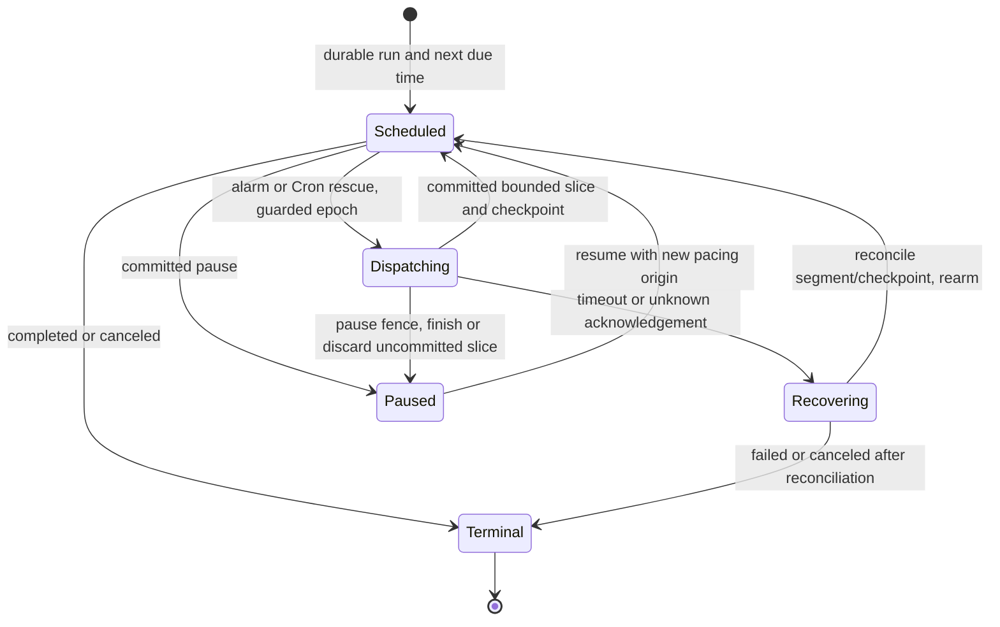

# ArcScope Cloud Simulator

> Status: **Authoritative** — Phase 2 (Detailed Specifications)
> Layer: Architecture
> Governing authority: **[P2-006](../decisions/phase-2-specification-decisions.md#rule-p2-006)**; `§17.1` of the ArcScope requirements ([SIM-01](../requirements/products/arcscope.md#rule-sim-01)–[SIM-20](../requirements/products/arcscope.md#rule-sim-20))
> Companions: [`05-cloud-architecture.md`](05-cloud-architecture.md) `§2`, [`data-model/01-cloud-data-model.md`](data-model/01-cloud-data-model.md) `§8.3`, [`contracts/01-public-api-operations.md`](contracts/01-public-api-operations.md) `§9.1`, [`12-native-interop-and-media.md`](12-native-interop-and-media.md)

[P2-006](../decisions/phase-2-specification-decisions.md#rule-p2-006) adds a capability that had no architecture at all: a **real deterministic Cloud simulator** for ArcScope. It is stated in the requirements as a delivery obligation where a scaffold, a dependency entry or a one-direction adapter is explicitly insufficient ([SIM-20](../requirements/products/arcscope.md#rule-sim-20)).

One property is worth stating up front: **it produces data that must never be confused with the real thing** — synthetic capture is not hardware evidence ([I-496](../requirements/01-normative-glossary-and-invariants.md#rule-i-496)).

---

## 1. The deterministic simulator

### 1.1 What determinism actually means here

[SIM-07](../requirements/products/arcscope.md#rule-sim-07) promises that identical effective input under the same supported execution profile yields identical canonical content and hashes. That is a narrower and more honest promise than "the simulator is deterministic", and the narrowing is the design.

| Inside the promise | Outside the promise |
|---|---|
| Sample values, logical timestamps, segment boundaries, canonical encoding, content hashes | Wall-clock timestamps, host and run identifiers, pacing, preview decimation |
| One pinned execution profile: numeric semantics, RNG, generator and encoding versions | Cross-version or cross-CPU floating-point equivalence — **never promised** ([SIM-07](../requirements/products/arcscope.md#rule-sim-07)) |

| # | Rule |
|---|---|
| <a id="rule-sd-01"></a>SD-01 | **The execution profile is part of the run's identity**, not an ambient property of the host. Two runs with the same seed and different profiles are not expected to match, and the profile is recorded on the run row. |
| <a id="rule-sd-02"></a>SD-02 | **Pacing never changes canonical data** ([SIM-06](../requirements/products/arcscope.md#rule-sim-06)). Real-time and bounded accelerated generation produce identical sample values, logical timestamps and hashes; only wall-clock metadata differs. |
| <a id="rule-sd-03"></a>SD-03 | **Every random stream is seeded independently per channel and per fault source** ([SIM-05](../requirements/products/arcscope.md#rule-sim-05)). A shared global RNG would make one channel's consumption perturb another's, which would break [SIM-07](../requirements/products/arcscope.md#rule-sim-07) in a way that is very hard to diagnose. |
| <a id="rule-sd-04"></a>SD-04 | **Logical ticks drive generation, never elapsed wall-clock time.** A host under load produces the same data more slowly, never different data ([SIM-06](../requirements/products/arcscope.md#rule-sim-06), [SIM-15](../requirements/products/arcscope.md#rule-sim-15)). |

### 1.2 Execution inside the single host

The simulator executes one bounded C# Container slice per private job request ([RT-03](05-cloud-architecture.md#rule-rt-03), [SIM-10](../requirements/products/arcscope.md#rule-sim-10)). SimulationPacer DO alarms coordinate wakeups; D1 owns run state, fencing, checkpoint and the durable next-due intent. No Container background loop owns continuation.

```text
wake:      DO alarm or Cron rescue requests the same run/generation
claim:     guarded D1 batch claims the due run and increments its fence
slice:     generate at most the configured batch, 100 items or 20 seconds
prepare:   write immutable R2 segment; verify its length and hash
publish:   ONE guarded D1Database.batch() checks state/lease/fence/generation,
           inserts the segment identity and advances checkpoint + next_due,
           and writes the command receipt, quota movement and outbox wake
schedule:  deliver the committed next-due wake to SimulationPacer; then return
rescue:    every-minute Cron scans due nonterminal checkpoints/outbox leases
```

External object writes and alarm calls are outside the D1 batch. Crash before publication leaves an unreferenced object for cleanup; crash after publication but before alarm scheduling is recovered from the committed next-due/outbox record. Duplicate alarms, lost replies and Cron races acquire the same guarded lease and cannot publish a logical segment twice. Replay the original receipt after an unknown batch outcome; a stale fence never advances the checkpoint. Stop/pause/cancel and eligibility are rechecked in the publication guard. At-least-once execution produces one committed segment identity, not a promise of exactly-once alarm delivery.

| # | Rule |
|---|---|
| <a id="rule-sx-01"></a>SX-01 | **The manifest row is the commit point** ([SIM-11](../requirements/products/arcscope.md#rule-sim-11)). An object exists before it is visible; visibility is the row. A committed manifest row never references an unverified partial object. |
| <a id="rule-sx-02"></a>SX-02 | **The checkpoint and manifest row commit atomically** ([SIM-12](../requirements/products/arcscope.md#rule-sim-12)), in one guarded D1 batch. No committed state can expose an advanced checkpoint without its verified segment. |
| <a id="rule-sx-03"></a>SX-03 | **A publish carrying a stale fence token is rejected** ([SIM-10](../requirements/products/arcscope.md#rule-sim-10)). This is what makes N replicas safe: a paused-then-resumed generator on an old host cannot publish over a new one. |
| <a id="rule-sx-04"></a>SX-04 | **Host loss and lease takeover produce the same remaining canonical data**, with no duplicate and no missing logical range ([SIM-12](../requirements/products/arcscope.md#rule-sim-12)). This is the simulator's central invariant, and [SIM-20](../requirements/products/arcscope.md#rule-sim-20) tests it by killing the host mid-run. |
| <a id="rule-sx-05"></a>SX-05 | **No unbounded generation loop or perpetual hosted generator exists** ([RT-05](05-cloud-architecture.md#rule-rt-05), [SIM-10](../requirements/products/arcscope.md#rule-sim-10)). Each bounded slice commits its continuation before returning; DO alarms and Cron drive later slices. |
| <a id="rule-sx-06"></a>SX-06 | **Incomplete objects are cleaned** by a sweeper keyed on the absence of a manifest row ([SIM-11](../requirements/products/arcscope.md#rule-sim-11)). |

### 1.3 Bounded evaluation

[SIM-04](../requirements/products/arcscope.md#rule-sim-04) permits a bounded expression AST and prohibits everything that would make it a scripting engine.

| Permitted | Prohibited |
|---|---|
| Constants, time and tick references, channel references, arithmetic, comparison, conditionals, an allowlisted numeric function set | Arbitrary scripts, dynamic compilation, reflection, file access, networking |

| # | Rule |
|---|---|
| <a id="rule-sb-01"></a>SB-01 | **Validation happens before admission** ([SIM-04](../requirements/products/arcscope.md#rule-sim-04), [SO-09](contracts/01-public-api-operations.md#rule-so-09)): acyclic channel dependencies, and bounds on depth, node count and operations per tick. An invalid AST fails **before any lease, object or quota debit**. |
| <a id="rule-sb-02"></a>SB-02 | **The allowlist is closed and versioned with the execution profile.** Adding a function is a profile version change, because it can alter [SIM-07](../requirements/products/arcscope.md#rule-sim-07) equality. |
| <a id="rule-sb-03"></a>SB-03 | **CSV replay reads an explicitly uploaded, workspace-owned resource identified by content hash** ([SIM-18](../requirements/products/arcscope.md#rule-sim-18)), with a bounded parse report. A scenario cannot fetch a URL, read a host file or cross a workspace boundary. |
| <a id="rule-sb-04"></a>SB-04 | **An exported scenario contains no deployment secret or policy value** ([SIM-18](../requirements/products/arcscope.md#rule-sim-18)). |

### 1.4 Faults, preview and back-pressure

| # | Rule |
|---|---|
| <a id="rule-sf-01"></a>SF-01 | **Injected faults carry provenance and counters** ([SIM-05](../requirements/products/arcscope.md#rule-sim-05)). An intentional drop is labelled as intentional, so it can never be mistaken for unexpected data loss — which would make the simulator useless as a verification source. |
| <a id="rule-sf-02"></a>SF-02 | **Faults apply at explicit logical boundaries**, not at arbitrary points, so their positions are reproducible under [SIM-07](../requirements/products/arcscope.md#rule-sim-07). |
| <a id="rule-sf-03"></a>SF-03 | **Preview may visibly decimate or throttle; canonical generation may not** ([SIM-15](../requirements/products/arcscope.md#rule-sim-15)). Under pressure, canonical generation slows, persists safely, or stops with an explicit partial outcome. **Preview overload never silently drops a canonical sample.** |
| <a id="rule-sf-04"></a>SF-04 | **Memory, queues and temporary storage are bounded** ([SIM-15](../requirements/products/arcscope.md#rule-sim-15)), and deployment policy bounds channels, rates, duration, AST work, concurrency, queue time, storage, egress and retention ([SIM-16](../requirements/products/arcscope.md#rule-sim-16)). |

### 1.5 Commercial and lifecycle position

| # | Rule |
|---|---|
| <a id="rule-sc-01"></a>SC-01 | **A `SimulationRun` is a product job, not an Agent Run** ([SIM-01](../requirements/products/arcscope.md#rule-sim-01), [CM-04](09-ai-and-agent-runtime-architecture.md#rule-cm-04) of the runtime architecture). It invokes no model and debits no AI capacity. |
| <a id="rule-sc-02"></a>SC-02 | **It consumes product-resource quota** — duration, samples, bytes, egress — and its output counts against storage quota ([SIM-17](../requirements/products/arcscope.md#rule-sim-17), [C-09](../requirements/00-product-scope-and-portfolio.md#rule-c-09)). |
| <a id="rule-sc-03"></a>SC-03 | **Official simulation requires the active Cloud service entitlement**, independently of AI credits ([SIM-17](../requirements/products/arcscope.md#rule-sim-17)). Self-hosting uses operator grants and the same safety limits. |
| <a id="rule-sc-04"></a>SC-04 | **Term expiry or suspension stops generation at a durable boundary** as `canceled` with the explicit eligibility reason ([SIM-17](../requirements/products/arcscope.md#rule-sim-17)). Committed output then follows retained-data access rules. |
| <a id="rule-sc-05"></a>SC-05 | **Cancel commits a partial outcome, never success for an incomplete range** ([SIM-08](../requirements/products/arcscope.md#rule-sim-08)). |
| <a id="rule-sc-06"></a>SC-06 | **Simulation output is labelled synthetic wherever it appears**, and seed and profile provenance survives export or copy ([SIM-14](../requirements/products/arcscope.md#rule-sim-14), [I-496](../requirements/01-normative-glossary-and-invariants.md#rule-i-496)). A synthetic capture must never be presented as hardware evidence. |
| <a id="rule-sc-07"></a>SC-07 | **Retention, deletion and exhausted storage expose their effect on historical runs and native availability** ([SIM-19](../requirements/products/arcscope.md#rule-sim-19)), and a stored output stays distinguishable from a regenerated one. |

Current and historical runs are discoverable on every ArcScope surface through the workspace-authorized, paginated `simulation.listRuns` operation; a known run ID or terminal notification is not required. Control commands carry `RequestMeta.expectedRev`; the owner atomically validates that revision and the legal predecessor state before changing the run.

### 1.6 Native consumption

| # | Rule |
|---|---|
| <a id="rule-sn-01"></a>SN-01 | **ArcScope exposes Cloud Simulation as a clearly synthetic `DataSource`** ([SIM-14](../requirements/products/arcscope.md#rule-sim-14)) that feeds the **normal** acquisition pipeline — session, capture, decoder, measurement and report workflows are unchanged. |
| <a id="rule-sn-02"></a>SN-02 | **Segments are fetched by manifest, resumable and hash-verified** ([SIM-13](../requirements/products/arcscope.md#rule-sim-13), [SO-03](contracts/01-public-api-operations.md#rule-so-03)). A hash mismatch is a rejected segment, not a warning. |
| <a id="rule-sn-03"></a>SN-03 | **Realtime is an optional wakeup or preview hint** ([SIM-13](../requirements/products/arcscope.md#rule-sim-13), [RE-07](contracts/03-realtime-and-bridge.md#rule-re-07)). With realtime disabled entirely, polling plus the manifest gives the same access to retained committed data. |
| <a id="rule-sn-04"></a>SN-04 | **Downloaded segments are a verified copy, not a second authority** (`§4` of the data-model overview). Deleting them is a cache operation; the Cloud manifest remains the record. |

---

### Real-time pacing and recovery

SimulationPacer Durable Object is keyed by realm/run/recoveryGeneration and owns only alarm coordination. D1 remains authority for SimulationRun, segment sequence, next_due_at, pace_revision, checkpoint hash and execution fence. Real-time mode defaults to 1-second segments, configured 0.25–10 seconds; accelerated mode reschedules immediately after a bounded committed slice. DO alarm reads current D1 run/fence and invokes the same bounded Container job; completion atomically commits one deterministic segment/checkpoint and next_due_at. Duplicate/late alarms use `(run_id,segment_sequence)` receipts; an already committed segment is never regenerated/published twice. Pause/cancel increments pace_revision and revokes the old fence before acknowledgment; late alarm cannot revive it.

DO alarms are at least once and automatic retries are bounded, not a hard-real-time clock. After failure schedule a bounded next alarm; a minutely Cron reconciler finds overdue active runs and repairs lost/exhausted alarms. Delayed work catches up in≤100 items/20s slices using the deterministic virtual sample timeline; wall-clock delay never changes measurements. A proposed [D-020](../decisions/phase-1-foundation-decisions.md#rule-d-020) healthy-path target is segment visibility within 5 seconds of due time, measured with cold starts and admitted concurrency; outages display late/degraded state and do not claim that deadline. WP51 owns duplicate/restart/cancel/overdue/accelerated soak vectors. [Alarm semantics](https://developers.cloudflare.com/durable-objects/api/alarms/) checked 2026-09-17.

---

## 4. Verification

| # | Obligation | Where |
|---|---|---|
| <a id="rule-sv-01"></a>SV-01 | Same seed and profile produce identical canonical hashes; a changed seed produces different data | [WP-51.01](../planning/work-packages/51-arcscope-cloud-simulator.md#rule-wp-51.01) |
| <a id="rule-sv-02"></a>SV-02 | Fault positions are exact and reproducible, and every injected fault is labelled as intentional | [WP-51.02](../planning/work-packages/51-arcscope-cloud-simulator.md#rule-wp-51.02) |
| <a id="rule-sv-03"></a>SV-03 | Pause and resume, and **a killed host with a fenced takeover**, produce the same remaining canonical data with no duplicate or missing range | [WP-51.03](../planning/work-packages/51-arcscope-cloud-simulator.md#rule-wp-51.03), [WP-21.05](../planning/work-packages/21-cloud-host-and-persistence.md#rule-wp-21.05) |
| <a id="rule-sv-04"></a>SV-04 | Duplicate start, stale and out-of-order commands create no second run and cannot resurrect a terminal run | [WP-51.03](../planning/work-packages/51-arcscope-cloud-simulator.md#rule-wp-51.03) |
| <a id="rule-sv-05"></a>SV-05 | Malformed AST and malformed CSV fail before any lease, object or quota debit | [WP-51.02](../planning/work-packages/51-arcscope-cloud-simulator.md#rule-wp-51.02) |
| <a id="rule-sv-06"></a>SV-06 | Quota exhaustion and cross-workspace access are denied; a term expiry cancels at a durable boundary with its reason | [WP-51.04](../planning/work-packages/51-arcscope-cloud-simulator.md#rule-wp-51.04), [WP-42.11](../planning/work-packages/42-commerce-entitlement-and-credits.md#rule-wp-42.11) |
| <a id="rule-sv-07"></a>SV-07 | Reconnect with realtime disabled preserves access to all retained committed data | [WP-51.05](../planning/work-packages/51-arcscope-cloud-simulator.md#rule-wp-51.05), [WP-24.05](../planning/work-packages/24-realtime-and-reliable-events.md#rule-wp-24.05) |
| <a id="rule-sv-08"></a>SV-08 | Partial cancellation reports partial, never success, and a 24-hour bounded-resource soak holds | [WP-51.05](../planning/work-packages/51-arcscope-cloud-simulator.md#rule-wp-51.05) |
| <a id="rule-sv-09"></a>SV-09 | Simulated data is labelled synthetic through session, export and copy, and never enters a hardware-evidence path | [WP-51.05](../planning/work-packages/51-arcscope-cloud-simulator.md#rule-wp-51.05), [WP-34.04](../planning/work-packages/34-arcscope-analysis-and-reporting.md#rule-wp-34.04) |

## 6. Initial simulator execution profile

The wire registry's ScenarioSpec/GeneratorSpec/FaultSpec/CsvReplaySchema and SimulationProfile are the selected initial input format. Profile af-sim.v1 is bound to the tested .NET10 Linux-x64 host build and numeric library identity; no cross-version/CPU floating-point promise. Validation limits:64 channels, AST depth 16/nodes 1024/4096 evaluations per tick, finite duration<=24 hours, batch default 4096/max 65536 samples, per-workspace concurrent runs 2/queue 10, canonical memory buffers 64 MiB; narrower deployment quotas win. Source and fault evaluation follow stable channel/fault UUID order. Unknown generator/function/profile refuses before storage or compute admission.

Let t be rational logical seconds from tick 0 and u=frequencyHz*t+phaseCycles, f=u-floor(u). Sine=offset+amplitude*sin(2*pi*u); square=offset+amplitude when f<dutyRatio and offset-amplitude otherwise; triangle=offset+amplitude*(1-4*abs(f-0.5)); sawtooth=offset+amplitude*(2*f-1). Constant=offset. Pulse and stepSequence use their ordered half-open/righthand definitions. Seeded noise is uniform on [-1,1), scaled by amplitude; randomWalk starts at offset and adds walkStep times successive uniform noise. Rates/frequencies must be positive for periodic sources, dutyRatio in(0,1), finite coefficients; overflow fails with partial outcome. CSV replay uses declared column/time mapping and ends explicitly at input exhaustion, with no wrap unless a separately accepted future profile adds it.

Use xoshiro256** 1.0 with SplitMix64 initialization and unchecked uint64 arithmetic, using the published [xoshiro256** reference](https://prng.di.unimi.it/xoshiro256starstar.c) and [SplitMix64 reference](https://prng.di.unimi.it/splitmix64.c). For each channel/fault, hash the canonical JSON object {executionProfile,scenarioHash,seed,channelId,faultId} (signed seed as exact int64 string, absent faultId as null). Interpret the first eight digest bytes as one big-endian uint64 SplitMix64 seed; its next four outputs initialize s[0..3]. Use next(), not the jump routines. Event ID is the first 16 bytes of SHA256 over canonical {scenarioHash,channelId,logicalOrdinal,eventKind}; set UUID version 8/variant bits, with run/host IDs excluded. Convert next uint64's top 53 bits to a double in[0,1) by division by 2^53. Store all RNG state in the existing checkpoint. AST allows constants,time,tick,channel references; unary negate/not; binary add/subtract/multiply/divide/min/max and comparisons; functions abs/sqrt/sin/cos/floor/ceil/clamp and conditional select. Evaluation is eager bounded in topological order; invalid division/domain or nonfinite output yields a typed failure. No JIT, scripts or external reads.

At each matching fault window/tick, everyTicks filters eligible ordinals, then probabilityPpm chooses occurrence using that fault's independent RNG. Apply in order latency,jitter,drop,duplicate,reorder,disconnect,malformed,outlier, stable ID within kind. Latency delays delivery by delayTicks; jitter chooses integer delay uniformly 0..delayTicks; drop records an intentional gap; duplicate preserves original sample/event identity; reorder buffers at most reorderWindow records and uses a seeded permutation, flushing at the logical end; disconnect records an explicit interval then resumes; malformed marks the encoded frame invalid for decoder testing; outlier adds finite amount. None changes nominal logical timestamps silently. Canonical segments include delivered records and fault/gap provenance; pending delay/reorder queues are checkpointed. Pacing affects wall delivery only, not canonical hashes.

af-segment.v1 encodes the selected SimulationDataSegment/Sample/Event/Gap canonical JSON profile from the wire registry, with logical timestamps, stable channel/event IDs and intentional fault markers, plus a separate immutable metadata manifest. IDs of run/host and wall times stay outside hashed reproducible payload. The native reader consumes this same published Contracts encoding; source stream units/timebase and hash remain in every manifest. WP51 implements and verifies these choices, including exact fault positions and seeded restart; it does not select new RNG/fault meanings during coding.


### Pacer lifecycle and acceptance



The DO coordinates wakeups only; D1 owns run state, epoch and committed sample position. Pause persists before disarming; an in-flight old epoch cannot publish after it. Resume sets the next wall-time origin from the committed logical tick, without replaying paused wall time as a sample burst. Cron scans overdue nonterminal D1 next_due_at every minute and idempotently rearms after exhausted alarm retries. Accelerated mode schedules bounded slices without wall pacing. WP51 measures a 24-hour fixture's actual alarms, Container uptime/cold starts, requests/storage and cost alongside latency; duplicate alarms and forced restarts must preserve segment hashes and exactly one committed sequence. Approval of the proposed latency/capacity target remains a launch gate, not evidence supplied by this diagram.

## Simulator parameter and decoder binding

Generator required fields: constant offset; sine/triangle/sawtooth offset/amplitude/frequencyHz/phaseCycles; square additionally dutyRatio; noise offset/amplitude; randomWalk offset/walkStep; pulse offset/pulses; stepSequence offset/steps; csv only its schema/source mapping. Unrelated optional parameters are absent; empty repeated lists do not count as a supplied parameter. The profile's UI defaults are offset 0, amplitude 1, frequencyHz 1, phaseCycles 0, dutyRatio 0.5 and walkStep 1, applied to those applicable fields before freezing a scenario version. Fault defaults are everyTicks 1/probabilityPpm 1000000; kind-specific delay/amount/reorder window must be supplied. Seeded integer choice is floor(U*n), with U from the specified independent RNG and n the declared bounded range; reorder uses descending Fisher-Yates on each full/final partial buffer. CSV uses double-quote escaped fields, LF/CRLF and the declared delimiter; empty/invalid values refuse according to their declared channel type, never locale inference.

A malformed fault remains a valid canonical segment marker. The native simulator source adapter emits the standard decoder invalid-frame diagnostic at that logical ordinal and suppresses the affected sample; it does not corrupt canonical JSON, substitute zero or make synthetic data hardware evidence. Event/sample/gap ordering and these exact adapter outcomes are tested by the simulator's shared fixture plus the actual Cloud/R2/native path.
