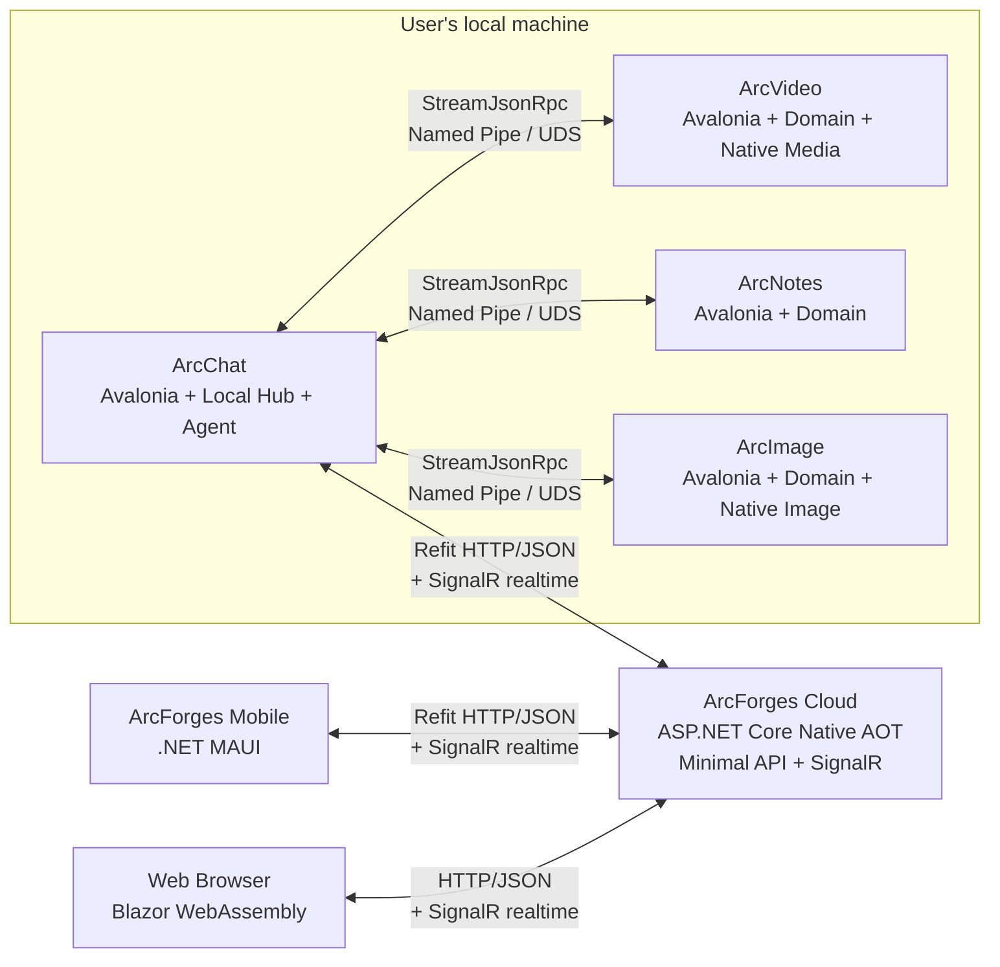
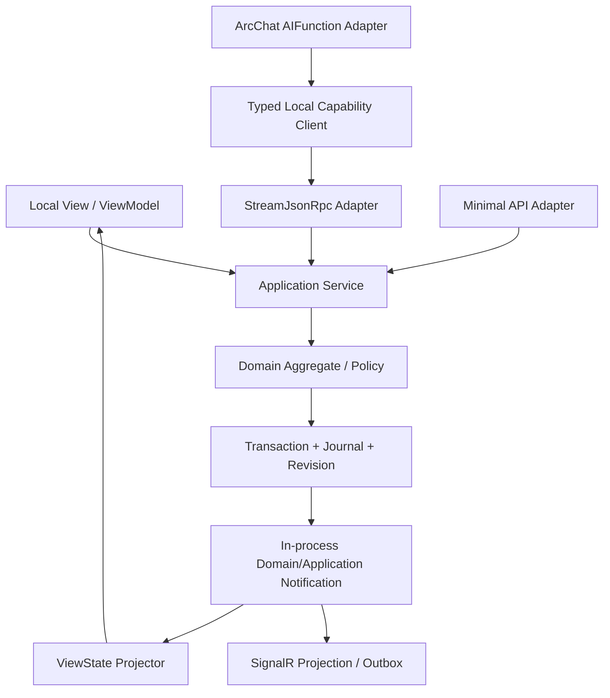
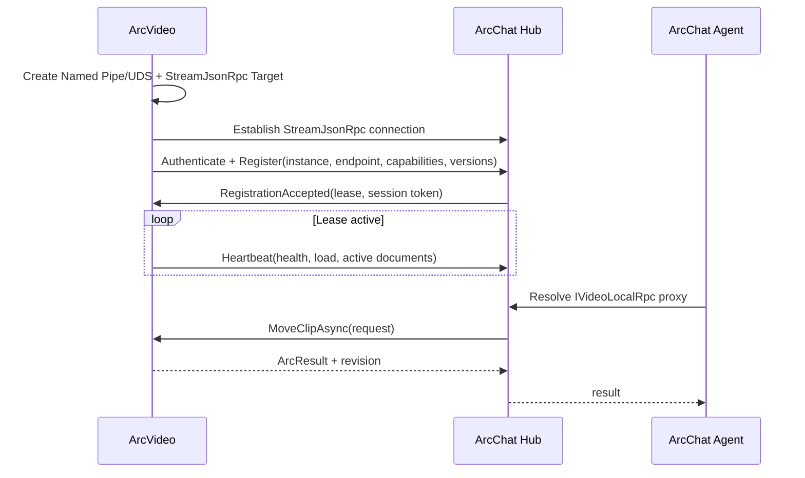
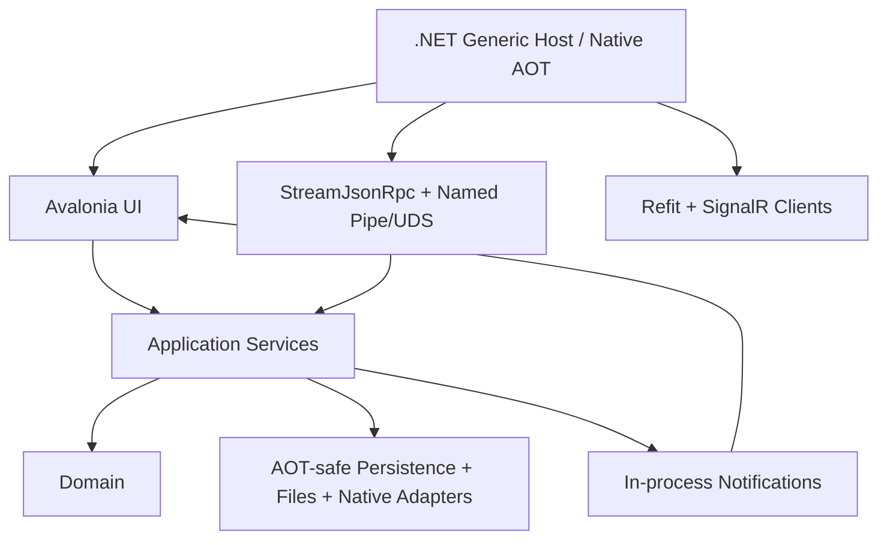

# ArcForges All-C# Future Architecture Master Outline

> Status: Target architecture / from-scratch rewrite  
> Technical baseline verification date: 2026-07-20  
> Applies to: ArcChat, ArcVideo, ArcNotes, ArcImage, ArcForges Cloud, mobile clients, and the web front end  
> Keywords: .NET 10 LTS, C# 14, Native AOT, Avalonia, .NET MAUI, Blazor WebAssembly, ASP.NET Core Minimal API, Refit, StreamJsonRpc, SignalR, System.Text.Json, Nerdbank.MessagePack, P/Invoke, Interface Code First RPC

---

## 0. Document conclusion

The future architecture of ArcForges is unified as **All C# / All .NET**, with communication explicitly split into three main paths that are never conflated:

- **Public-facing request/response API: ASP.NET Core Minimal API + Refit + standard HTTP/JSON**;
- **Local inter-process RPC: StreamJsonRpc + strongly typed .NET interfaces + Named Pipe/Unix Domain Socket**;
- **Public-facing real-time: ASP.NET Core SignalR**, carrying only real-time sessions such as presence, notifications, progress, chat deltas, and remote bridging;
- The cloud server uses ASP.NET Core and C#, with the Native AOT-compatible Minimal API/SignalR subset as the default baseline;
- Windows, macOS, and Linux desktops use Avalonia and C#, targeting Native AOT publication;
- Android and iOS mobile clients use .NET MAUI and C#; iOS uses Native AOT, while Android under .NET 10 must distinguish "Mono AOT" from the still-experimental "Native AOT";
- The web front end uses Blazor WebAssembly, enabling WASM AOT where needed; under a strict full-AOT goal, Blazor Server/Interactive Server is not a core execution mode;
- Public-facing DTOs use `System.Text.Json` source generation; Refit clients must take the generated-only path;
- The local StreamJsonRpc contract is true **Interface Code First RPC**: the client proxy and the server implementation work against the same interface contract;
- Under Native AOT, local StreamJsonRpc uses `NerdbankMessagePackFormatter` + generated TypeShape by default; `SystemTextJsonFormatter` + `JsonSerializerContext` is used only when UTF-8 JSON is required, accepting its stricter AOT limits;
- Native codecs, GPU, media, and system capabilities enter their owning application process directly via `[LibraryImport]`/P/Invoke;
- C++ workers are no longer designed, built, or deployed;
- Aeron.NET, MagicOnion, and gRPC/Protobuf are no longer used as the main ArcForges communication layer;
- There is no longer a central Service process holding the business state of every product.

The precise meaning of "single process" in this document is: **each product instance is a complete, autonomous C# OS process, and its native libraries run inside that same process**. It does not mean merging ArcChat, ArcVideo, ArcNotes, ArcImage, and the cloud server into one operating-system process.

ArcChat hosts the local Hub by default, but the Hub manages only platform-level catalogs, routing, permissions, approvals, coordination, and auditing. Each product still owns its own domain state, database, resources, UI, undo stack, and recovery log. Cross-application calls go through strongly typed StreamJsonRpc capability contracts; the Hub does not take over any product's internal state.

This is not a line-by-line translation of the JVM version into C#. It preserves that version's correct product boundaries, state ownership, and capability model, then reimplements them with modern .NET technology.

### 0.1 The definition of "full AOT" and its current real-world boundaries

This document splits "full AOT" into two levels so the terms are not conflated:

1. **Architectural goal**: every production main path must be statically analyzable, runtime code generation is prohibited, reliance on dynamic proxies/`Reflection.Emit` is prohibited, and the code must continuously pass trimming/AOT analyzers and real release builds;
2. **Strict Native AOT**: the host is ultimately produced as a native executable directly by CoreCLR Native AOT.

As of 2026-07-20, strict Native AOT still has two boundaries that must be confronted:

- Native AOT for .NET MAUI Android is still not a capability that should be adopted unconditionally as the production baseline on .NET 10; Android Release builds may use Mono AOT, but that is not equivalent to CoreCLR Native AOT;
- EF Core's Native AOT support is still unsuitable as a strict production baseline, so a strict full-AOT Cloud/desktop persistence path must not treat the EF Core runtime as an irreplaceable dependency.

Therefore the hard rule of this document is: **the communication layer itself must be AOT-safe; any infrastructure dependency that prevents the host from going Native AOT must be replaced, isolated as a build/migration tool, or explicitly listed as a temporary platform exception.**

## 1. Why rewrite this way

### 1.1 Retained product essentials

The following facts must be carried over from the existing ArcForges product design:

1. **Each product is a complete application, not a thin shell over a central service.**  
   ArcVideo can edit and save on its own, ArcNotes can edit and search on its own, ArcImage can process images on its own, and ArcChat can chat and run Agents on its own.

2. **The local experience does not depend on the Hub being online.**  
   When ArcChat or the Hub is unavailable, other applications can still open, edit, export, and recover local documents; they simply re-register their capabilities once the connection returns.

3. **State ownership is explicit.**  
   Whoever owns a document is responsible for its transactions, versions, undo, logs, snapshots, and resource lifecycle.

4. **Local UI and remote commands take the same application-service path.**  
   StreamJsonRpc and Refit are entry adapters only; they must not build a second set of business logic, and must never manipulate ViewModels or controls directly.

5. **Cross-application calls are semantic capabilities, not remote UI operations.**  
   The caller requests "move a clip", "insert an image", or "export a document" — not "click this button" or "change this control property".

6. **Large resources stay on the owner's side.**  
   Video frames, GPU textures, model files, and large attachments never pass through the Hub; only ResourceRefs, task handles, and controlled streams cross the boundary.

### 1.2 Discarded legacy approaches

The following designs no longer belong to the target architecture:

- A central C# Service holding the state of every product;
- The Avalonia client as a mere presentation layer;
- Aeron.NET as the main RPC;
- MagicOnion/gRPC/Protobuf as the main ArcForges RPC;
- Public clients using non-standard binary RPC in place of ordinary HTTP/JSON;
- Local IPC starting an extra Kestrel/HTTP/2 stack in the name of a "unified protocol";
- Each application spawning yet another C++ worker;
- Moving frames between C# and C++ workers through shared memory;
- Using `invoke(string capability, Dictionary<string, object>)` as the real call protocol;
- RPC services calling ViewModels, the Dispatcher, or controls directly;
- The Hub proxying all files, media frames, and large objects;
- Retaining runtime dynamic proxies, `Reflection.Emit`, contractless serialization, or unverified reflection fallbacks while claiming to pursue AOT.

### 1.3 Goals

- Unify language, toolchain, dependency injection, logging, testing, and engineering conventions;
- Preserve product autonomy while offering a consistent cross-application collaboration experience;
- Use standard HTTP/JSON on the public internet, easing debugging, proxying, caching, observability, version governance, and third-party integration;
- Use StreamJsonRpc strongly typed interface proxies locally, yielding real Interface Code First RPC rather than hand-written method strings;
- Use SignalR uniformly for public-facing real-time capabilities, without treating SignalR as a database, a reliable queue, or the sole source of state;
- Route every communication DTO, proxy, and serializer through source generation or explicit static metadata, eliminating AOT reflection fallbacks;
- Isolate the domain layer completely from UI, transport, database, and native libraries;
- Make failure boundaries, version compatibility, security boundaries, and recovery paths testable;
- Start from a modular monolith by default, avoiding premature microservices;
- Keep the seams for splitting services or adding isolated processes later, without paying that complexity up front.

### 1.4 Non-goals

- Not all UIs sharing one set of XAML;
- Not all platforms producing the same release package;
- Not replacing every HTTP API with SignalR;
- Not making Refit interfaces the server-side domain interfaces; Refit is the public-facing client contract layer;
- Not exposing StreamJsonRpc to the public internet;
- Not using JSON-RPC method strings as the primary call mechanism in business code; the business layer must use strongly typed proxies;
- Not one database serving every product;
- Not exposing local IPC as a public-facing API;
- Not admitting arbitrary third-party native plug-ins into the main process;
- Not coupling every product together through one giant `ArcForges.Contracts` assembly;
- Not claiming that every current MAUI Android production package is already CoreCLR Native AOT.

## 2. 2026 technology baseline and version strategy

As of 2026-07-20, the target baseline is as follows. The version numbers are stable baselines already verified when the architectural decisions were made; preview releases do not enter the stable main path.

| Layer | Technology | Verified baseline | Decision |
|---|---|---:|---|
| Language and runtime | C# / .NET | C# 14 / .NET 10 LTS | Unified baseline across all products |
| SDK | .NET SDK | 10.0.x stable feature band | `global.json` pins the version actually verified in the repository |
| Cloud service | ASP.NET Core | .NET 10 | Native AOT-compatible Minimal API + SignalR subset |
| Public HTTP client | Refit | 13.1.0 stable | `AddRefitGeneratedClient` / `ForGenerated`, standard HTTP/JSON |
| Local interface RPC | StreamJsonRpc | 2.25.29 stable | Named Pipe/UDS; source-generated proxy; only partly NativeAOT-safe, use within the limits set out in this document |
| Local default formatter | Nerdbank.MessagePack | 1.2.36 stable | The safest NativeAOT path officially recommended by StreamJsonRpc; used only as a local wire formatter |
| Public-facing JSON | System.Text.Json | .NET 10 inbox | `JsonSerializerContext` source generation; no reflection fallback |
| Public-facing real-time | ASP.NET Core SignalR | .NET 10 inbox | Native AOT-supported subset; only the JSON hub protocol under AOT |
| Desktop UI | Avalonia | 12.x stable line | Windows/macOS/Linux; Native AOT publication target |
| MVVM | CommunityToolkit.Mvvm | 8.4.x stable line | ViewModel, command, and notification infrastructure |
| Mobile UI | .NET MAUI Controls | 10.0.80 stable | Android/iOS; iOS Native AOT, Android's AOT mode assessed separately |
| Web UI | Blazor WebAssembly | ASP.NET Core 10 | Under strict full AOT, prefer WASM AOT + static hosting |
| Cloud database driver | Npgsql | 10.x stable line | The strict Native AOT path prefers direct ADO.NET/compiled SQL |
| ORM | EF Core | 10.x | Native AOT is still a high-risk/experimental path; not used as a strict full-AOT production baseline |
| Agent | Microsoft Agent Framework | Microsoft.Agents.AI 1.13.x | Enabled only on feature surfaces validated by AOT analysis/publish |
| AI abstractions | Microsoft.Extensions.AI | 10.x | Model, tool, and telemetry abstractions |
| Telemetry | OpenTelemetry | 1.x stable line | Trace, metric, and log correlation |
| Update and install | Velopack | 1.x | Desktop install, incremental update, and rollback candidate; requires per-platform AOT package verification |

Version strategy:

- The SDK is pinned by `global.json`, with no drift between CI and developer machines;
- NuGet is centrally managed by `Directory.Packages.props`;
- Commit `packages.lock.json`; CI uses locked mode;
- Only one major version of the Public Contracts, Local RPC Contracts, and SignalR Contracts is allowed within a single release train;
- Patch upgrades for Refit, StreamJsonRpc, and Nerdbank.MessagePack must run AOT publish + trimming + old contract compatibility matrix;
- Do not scatter package version numbers directly across business projects;
- Preview packages must not enter the core path of a stable branch;
- Hosts with `PublishAot=true` treat AOT/trimming warnings such as IL2026/IL3050 as blocking issues; masking unknown paths behind blanket `UnconditionalSuppressMessage` is prohibited.

### 2.1 The real boundaries of AOT

The goal is upgraded from "choose AOT per host" to: **apart from explicit platform exceptions, production hosts take Native AOT as the default design constraint**.

| Host | Target mode | Current constraints and strategy |
|---|---|---|
| ArcForges Cloud API | Native AOT | Minimal API + Refit over HTTP/JSON + SignalR JSON; no dependency on MVC/Razor runtime compilation; the database uses an AOT-safe driver path |
| ArcChat Desktop | Native AOT | Avalonia + StreamJsonRpc; Agent/plugin discovery must eliminate dynamic code paths or use static registration |
| ArcVideo Desktop | Native AOT | Avalonia + StreamJsonRpc + `[LibraryImport]`; the native media libraries themselves do not prevent the managed host from going AOT |
| ArcNotes Desktop | Native AOT | Avalonia + StreamJsonRpc + AOT-safe local persistence |
| ArcImage Desktop | Native AOT | Avalonia + StreamJsonRpc + `[LibraryImport]` |
| MAUI iOS | Native AOT | The official path; all Refit/SignalR DTOs must be source-generated |
| MAUI Android | Mono AOT is the production baseline; Native AOT is a separate experiment | Experimental Android Native AOT cannot be claimed as a stable baseline for all platforms under .NET 10 |
| Blazor WebAssembly | WASM AOT | Enabled for production hot paths/strict AOT builds; watch bundle size and build time |

#### 2.1.1 The Native AOT positioning of StreamJsonRpc

The current official wording for StreamJsonRpc is **"partially NativeAOT safe"**, not "add the package and you are 100% AOT-safe". ArcForges must meet the following hard conditions:

- Every project path that calls `JsonRpc.Attach` sets `<EnableStreamJsonRpcInterceptors>true</EnableStreamJsonRpcInterceptors>`;
- All RPC interfaces use `[JsonRpcContract]`;
- All RPC interfaces also use `[GenerateShape(IncludeMethods = MethodShapeFlags.PublicInstance)]`;
- Standalone Contracts assemblies use `[assembly: ExportRpcContractProxies]` so proxies can be activated directly;
- When several interfaces share one connection, declare the required combination up front via `JsonRpcProxyInterfaceGroupAttribute`; assembling unknown interfaces at runtime is prohibited;
- Local IPC defaults to `NerdbankMessagePackFormatter`; where UTF-8 JSON is unavoidable, `SystemTextJsonFormatter.JsonSerializerOptions.TypeInfoResolver` must be bound to a source-generated `JsonSerializerContext`;
- Register server-side targets through the `RpcTargetMetadata` generated path, not through convenience overloads that enumerate methods by runtime reflection;
- Create proxies with concrete generics or `typeof`; never construct them dynamically from an unknown runtime `Type` collection;
- It is forbidden to rely on RPC marshalable objects under AOT + `SystemTextJsonFormatter`; use the Nerdbank.MessagePack path when this capability is needed;
- Every platform runs a real `dotnet publish -p:PublishAot=true`; Debug/JIT testing does not count as AOT verification.

#### 2.1.2 The Native AOT positioning of Refit

The generated path in Refit 13.1.0 is sufficient as the AOT public-facing client baseline, but ArcForges permits only:

- `RestService.ForGenerated<T>` or `AddRefitGeneratedClient<T>`;
- `SystemTextJsonContentSerializer` + source-generated `JsonSerializerContext`;
- No Refit runtime reflection fallback of any kind; if a version offering the `Refit.Reflection` opt-in package is adopted, it must still not enter the production AOT main path;
- CI escalates any Refit analyzer diagnostic reporting that a reflection-based request builder is required into an error; where the version in use provides RF006, that is treated as an error as well;
- The method shapes of public API interfaces must stay within what generated request building supports;
- The public-facing server is still ASP.NET Core Minimal API; it does **not** "implement the Refit interface" to impersonate local RPC.

#### 2.1.3 The Native AOT positioning of SignalR

SignalR has supported client- and server-side Native AOT scenarios since .NET 9, but the AOT baseline must be narrowed:

- Use only the JSON hub protocol, and provide source-generated `System.Text.Json` metadata for every Hub DTO;
- Native AOT servers do not use the `Hub<T>` strongly typed hub; they use a plain `Hub` plus centralized method-name constants/generated wrappers;
- Do not rely on Hub parameter/return type combinations that AOT does not support;
- SignalR serves only as the real-time layer; state after a disconnect is recovered by querying revision/sequence over Refit HTTP;
- Every production client runs an AOT publish smoke test, rather than only validating an ordinary JIT connection.

#### 2.1.4 The impact of strict full AOT on the data layer

As of this verification, EF Core's Native AOT support should still not be treated as a strict production baseline. If ArcForges holds the main Cloud/desktop hosts to strict Native AOT:

- Cloud defaults to Npgsql ADO.NET + explicit/generated SQL; Dapper.AOT may serve as an enhancement layer once proven by PoC;
- Local SQLite defaults to the AOT-safe ADO.NET path with explicit SQL/generated mapping;
- Schema migration may be performed by build/deployment-stage tooling, but the production main host must not take on a dynamic ORM runtime as a result;
- If EF Core Native AOT reaches stable production quality in the future, it is re-evaluated through an ADR, rather than breaking the full-AOT goal now for "coding convenience".

## 3. Product topology

### 3.1 Overall topology



There are only three communication rules:

1. **Same-machine process boundary**: StreamJsonRpc;
2. **Public-facing commands/queries**: the standard HTTP/JSON client generated by Refit;
3. **Public-facing real-time events**: SignalR.

Routing local traffic over HTTP in the name of "uniformity" is forbidden, and so is letting business write commands exist only inside SignalR messages in the name of "real time".

### 3.2 ArcChat

ArcChat is:

- Complete chat product;
- The local Agent entry point;
- The default local Hub host;
- The coordinator of the capability catalog, instance catalog, permissions, and approvals;
- The initiator of cross-application sagas and auditing;
- The egress for cloud sync and optional remote bridging;
- The local StreamJsonRpc connection manager;
- The host for the public-facing Refit/SignalR clients.

ArcChat is not:

- The database for every product;
- A proxy for video frames and image content;
- The authoritative source of other applications' domain state;
- A hidden UI thread for other applications;
- A single point that every command must pass through.

Capabilities that ArcChat provides itself call the application service directly in-process; it does not "RPC itself". Capabilities belonging to other applications are invoked through the strongly typed StreamJsonRpc proxies held by the Hub.

### 3.3 ArcVideo

ArcVideo is a standalone desktop application that has:

- Domain models such as projects, timelines, tracks, clips, effects, and markers;
- Media indexes, proxy files, and rendering tasks;
- A local database, command log, snapshots, and an undo stack;
- Avalonia UI and in-process ViewModels;
- A P/Invoke adaptation layer for FFmpeg or other native media libraries;
- Outward-facing versioned StreamJsonRpc capability interfaces such as `IVideoLocalRpc`.

Other applications may ask ArcVideo to import assets, move clips, create markers, or export finished output, but they must not obtain raw GPU handles, arbitrary native pointers, or references to internal mutable entities.

### 3.4 ArcNotes

ArcNotes is a standalone knowledge and document application, owning:

- Notebooks, documents, blocks, links, tags, and indexes;
- Local search and optional vector indexing;
- Attachment ResourceRefs;
- A local database, logs, snapshots, and an undo stack;
- Avalonia UI;
- Semantic capabilities such as `INotesLocalRpc`.

### 3.5 ArcImage

ArcImage is a standalone image application, owning:

- Canvases, layers, masks, filters, history, and export configuration;
- Image caches and GPU/CPU resources;
- A P/Invoke adaptation layer for native codecs or GPU libraries;
- A local database, logs, snapshots, and an undo stack;
- Avalonia UI;
- Semantic capabilities such as `IImageLocalRpc`.

### 3.6 ArcForges Cloud

The cloud is responsible for:

- Accounts, organizations, devices, and authorization;
- Standard HTTP/JSON Public API;
- SignalR real-time connections, notifications, presence, and remote bridging;
- Cross-device sessions and messages;
- Sync metadata, conflict coordination, and cloud resource indexing;
- AI Provider integration, quotas, and auditing;
- Mobile and Web API;
- Server-side tasks and notifications.

The first phase uses a modular monolith. Public commands/queries enter the Minimal API/Application Service; real-time events are delivered to SignalR from the post-commit outbox/application notifications. Modules are split into services only when there is demonstrated need for independent scaling, isolation, security, or team ownership.

### 3.7 Mobile and Web

- MAUI is a cloud client; it does not directly discover or connect to a desktop Hub on the user's LAN;
- MAUI public-facing request/response goes over Refit generated-only HTTP/JSON; real time goes over SignalR;
- Web browsers only connect to ArcForges Cloud; Blazor WebAssembly uses plain HTTP/JSON and SignalR;
- If desktop remote control is implemented, the desktop ArcChat must actively establish an outbound public-facing SignalR connection, subject to user-visible device authorization, approval, and revocation;
- Durable commands/results for remote control still land in the HTTP API or in durable task state; SignalR is only a real-time delivery and wake-up channel;
- Mobile and Web share DTOs and application semantics, without forcing a shared UI implementation.

## 4. State ownership and consistency

### 4.1 Sole owner principle

| State | Authoritative owner | Forbidden copies |
|---|---|---|
| Video projects and timelines | ArcVideo instance | A writable mirror inside the Hub |
| Notes and knowledge graph | ArcNotes instance | A copy of the business database inside ArcChat |
| Image projects and layers | ArcImage instance | A writable cloud-side copy that bypasses the sync protocol |
| Chat sessions and local Agent sessions | ArcChat | Shadow sessions inside other desktop applications |
| Online instances and capability catalog | ArcChat Hub | Each application maintaining its own global catalog |
| Cloud accounts, organizations, devices | ArcForges Cloud | Authoritative account state self-declared by a local application |
| Local permission grants and approval records | ArcChat Hub | Providers granting themselves silent authorization |

Caching is allowed, but a cache must:

- Record its source and revision;
- Be discardable and re-fetchable;
- Never be treated as an authoritative write point;
- Not widen visibility beyond the security permissions.

### 4.2 Unified local and remote write paths



Constraints:

- The StreamJsonRpc Adapter handles only local identity, input validation, DTO mapping, cancellation propagation, and application service calls;
- The Minimal API Adapter handles only public-facing authentication and authorization, HTTP semantics, JSON DTOs, and application service calls;
- The SignalR Hub does not change domain state directly; when a write is needed it calls the same Application Service, and must preserve CommandId/revision semantics;
- ViewModels only consume ViewState and call local facades;
- Application Services do not reference Avalonia, MAUI, Blazor, Refit, StreamJsonRpc, SignalR, or control types;
- The domain layer does not reference database providers, transport libraries, the file system, or native handles;
- Local clicks, local RPC, and public-facing HTTP commands must all produce the same domain commands, revisions, logs, and notifications;
- UI updates are performed by the projector inside the owning process; a remote caller must not drive the other side's UI directly.

### 4.3 Consistency levels

- Commands within a single document: strongly consistent under a local transaction;
- Multiple documents in the same application: prefer per-document transactions, coordinated by an application-level Saga;
- Cross-application: eventually consistent, using Sagas, idempotent commands, compensation, and visible state;
- Public-facing HTTP: a success response means only that the server has completed/accepted the request as defined; long-running tasks return a TaskHandle;
- SignalR: provides real-time visibility only, never the sole source of reliable truth; after a disconnect, gaps must be backfilled via HTTP revision/sequence;
- Cross-device: based on the sync protocol and revision; using database files as the unit of synchronization is prohibited;
- Multi-step Agent operations: every step is an ordinary, controlled capability call, and failures are observable, recoverable, and subject to approval.

## 5. Solution and code boundaries

### 5.1 Suggested repository layout

```text
ArcForges/
├─ global.json
├─ Directory.Build.props
├─ Directory.Packages.props
├─ NuGet.config
├─ ArcForges.slnx
├─ eng/
│  ├─ build/
│  ├─ packaging/
│  └─ versioning/
├─ src/
│  ├─ BuildingBlocks/
│  │  ├─ ArcForges.Foundation/
│  │  ├─ ArcForges.Application.Abstractions/
│  │  ├─ ArcForges.Persistence/
│  │  ├─ ArcForges.Observability/
│  │  └─ ArcForges.NativeInterop/
│  ├─ Contracts/
│  │  ├─ ArcForges.Contracts.Foundation/
│  │  ├─ ArcForges.Contracts.LocalRpc/
│  │  ├─ ArcForges.Contracts.PublicApi/
│  │  └─ ArcForges.Contracts.Realtime/
│  ├─ ArcChat/
│  │  ├─ ArcChat.Domain/
│  │  ├─ ArcChat.Application/
│  │  ├─ ArcChat.Infrastructure/
│  │  ├─ ArcChat.LocalRpc/
│  │  ├─ ArcChat.CloudClient/
│  │  ├─ ArcChat.Desktop/
│  │  └─ ArcChat.Tests/
│  ├─ ArcVideo/
│  ├─ ArcNotes/
│  ├─ ArcImage/
│  ├─ Cloud/
│  │  ├─ ArcForges.Cloud.Host/
│  │  ├─ ArcForges.Cloud.PublicApi/
│  │  ├─ ArcForges.Cloud.Realtime/
│  │  ├─ ArcForges.Cloud.Modules.Identity/
│  │  ├─ ArcForges.Cloud.Modules.Chat/
│  │  ├─ ArcForges.Cloud.Modules.Sync/
│  │  └─ ArcForges.Cloud.Modules.Agent/
│  ├─ Mobile/
│  │  └─ ArcForges.Mobile/
│  └─ Web/
│     └─ ArcForges.Web.Client/
├─ native/
│  ├─ media-abi/
│  └─ image-abi/
├─ tests/
│  ├─ ArchitectureTests/
│  ├─ ContractCompatibilityTests/
│  ├─ PublicApiContractTests/
│  ├─ LocalRpcAotTests/
│  ├─ RealtimeReconnectTests/
│  ├─ EndToEndTests/
│  └─ NativeAbiTests/
└─ docs/
```

This is a logical layout; it does not require moving every existing directory at once. During migration, products may land in place gradually, one vertical slice at a time.

### 5.2 Reference direction

```text
Desktop / LocalRpc / Infrastructure ─┐
                                     ├─> Application ─> Domain
MinimalApi / MAUI / WASM Adapter    ─┘

Contracts.Foundation <- Contracts.LocalRpc
Contracts.Foundation <- Contracts.PublicApi
Contracts.Foundation <- Contracts.Realtime
```

Hard rules:

- Domain must not reference Application, Infrastructure, UI, or Contracts;
- Application may depend only on Domain and a small set of abstractions;
- Infrastructure implements the ports defined by Application;
- Local RPC DTOs and Public API DTOs must not become domain entities directly;
- UI models must not become transport DTOs directly;
- Refit interfaces may exist only within the PublicApi client contract boundary;
- StreamJsonRpc interfaces may exist only within the LocalRpc contract boundary;
- SignalR Hub DTOs must not be treated as the canonical persisted domain events;
- LocalRpc Contracts are not referenced by the browser or the Cloud Host;
- PublicApi Contracts do not expose local IPC, native handles, or desktop implementation details.

### 5.3 Why Contracts are split

`ArcForges.Contracts.Foundation` contains only:

- Stable IDs: AppId, InstanceId, DocumentId, ResourceId, CommandId, TaskId;
- revision/version base types;
- `ArcResult<T>`, `ArcError`;
- `ResourceRef`, TaskSnapshot, and other cross-domain stable values;
- Pagination, time, and base enums.

`ArcForges.Contracts.LocalRpc` contains:

- Hub registration, discovery, leases, approvals, and local routing;
- The strongly typed StreamJsonRpc interfaces for ArcVideo, ArcNotes, ArcImage, and ArcChat;
- The static contract metadata required by `[JsonRpcContract]` and `GenerateShape`;
- Local connection event and notification contracts.

`ArcForges.Contracts.PublicApi` contains:

- Account, device, chat, sync, cloud task, resource, and approval DTOs;
- Refit client interfaces and HTTP route/version definitions;
- `System.Text.Json` source-generation contexts;
- No server-side Application/Domain implementation.

`ArcForges.Contracts.Realtime` contains:

- SignalR method-name constants;
- Notification, presence, task progress, chat delta, and bridging envelope DTOs;
- sequence/revision recovery information;
- `System.Text.Json` source-generation contexts.

Every contract project treats AOT/trimming compatibility as a hard gate, and references no UI, ORM, database provider, native library, or specific host.

## 6. StreamJsonRpc Interface Code First RPC

### 6.1 Why StreamJsonRpc was chosen for local IPC

StreamJsonRpc is ArcForges' **only primary local RPC layer**. It was chosen not because "JSON looks nice", but because it directly matches a local multi-process C# architecture:

- The RPC API can be defined directly as a .NET interface;
- The client obtains a strongly typed proxy through `Attach<T>()`;
- Providers can implement that same interface directly, giving true Interface Code First;
- Both parties on the same full-duplex connection can initiate calls and notifications;
- Transport is decoupled from protocol, so it can run directly over `Stream`, Named Pipe, Unix Domain Socket, WebSocket, and other bidirectional channels;
- Local RPC needs no Kestrel, no HTTP/2, and no TCP port;
- A Source Generator/Analyzer exists, making it usable under Native AOT in a constrained form.

But this must be stated plainly: **StreamJsonRpc officially describes itself only as "partially NativeAOT safe"**. What makes it usable for ArcForges is strict adherence to the generated paths, not an assumption that every API is inherently AOT-safe.

### 6.2 Contract style: the interface is the local RPC source

```csharp
using PolyType;
using StreamJsonRpc;

[JsonRpcContract]
[GenerateShape(IncludeMethods = MethodShapeFlags.PublicInstance)]
public partial interface IVideoLocalRpc : IDisposable
{
    Task<ArcResult<MoveClipResponse>> MoveClipAsync(
        MoveClipRequest request,
        CancellationToken cancellationToken);

    Task<TaskHandle> StartRenderAsync(
        StartRenderRequest request,
        CancellationToken cancellationToken);

    event EventHandler<VideoRpcEvent> Changed;
}
```

The server implements the same interface:

```csharp
public sealed class VideoLocalRpcService(
    MoveClipHandler moveClipHandler,
    RenderHandler renderHandler,
    ILocalRpcIdentityAccessor identity)
    : IVideoLocalRpc
{
    public event EventHandler<VideoRpcEvent>? Changed;

    public async Task<ArcResult<MoveClipResponse>> MoveClipAsync(
        MoveClipRequest request,
        CancellationToken cancellationToken)
    {
        var actor = identity.RequireActor();
        return await moveClipHandler.HandleAsync(request, actor, cancellationToken);
    }

    public Task<TaskHandle> StartRenderAsync(
        StartRenderRequest request,
        CancellationToken cancellationToken)
        => renderHandler.StartAsync(request, identity.RequireActor(), cancellationToken);

    public void Dispose() { }
}
```

The client only sees the interface:

```csharp
IVideoLocalRpc video = rpc.Attach<IVideoLocalRpc>();
var result = await video.MoveClipAsync(request, cancellationToken);
```

This is what this document calls **Interface Code First RPC**:

- Interfaces are compile-time contract sources;
- Business calls never write method strings such as `"video.moveClip"`;
- Analyzers can flag unsupported interface shapes at compile time;
- The Source Generator produces proxies for AOT;
- The server side remains only an adapter, ultimately calling the Application Service.

### 6.3 StreamJsonRpc interface hard rules

Under the current strongly typed proxy constraints, ArcForges local RPC interfaces must:

- Be marked `[JsonRpcContract]`;
- Be marked `[GenerateShape(IncludeMethods = MethodShapeFlags.PublicInstance)]`;
- Be declared as a `partial interface`;
- Contain no properties;
- Contain no generic methods;
- Return `Task`, `Task<T>`, `ValueTask`, `ValueTask<T>`, or a validated `IAsyncEnumerable<T>`;
- Put `CancellationToken` last whenever it is present;
- Use only `EventHandler`/`EventHandler<T>` for events;
- Preferably inherit `IDisposable`, so that proxy lifetimes are explicit;
- Avoid overloads on outward-facing methods, so CLR renaming cannot produce wire contract changes that are hard to audit;
- Use a request DTO for every write method, carrying the necessary concurrency fields such as CommandId, DocumentId/ResourceId, and ExpectedRevision;
- Never pass `object`, `dynamic`, `Type`, arbitrary dictionary object graphs, a DbContext, an EF entity, a ViewModel, controls, native pointers, or a `SafeHandle`.

Interface method names are themselves part of the protocol compatibility surface. Where long-term stable wire names are required, use explicit JSON-RPC method naming attributes or a V2 interface strategy; public methods must not be renamed at will after release.

### 6.4 Native AOT: generated proxy interception must be enabled

Every project that creates StreamJsonRpc proxies, including projects that depend on them indirectly, must enable:

```xml
<PropertyGroup>
  <PublishAot>true</PublishAot>
  <IsAotCompatible>true</IsAotCompatible>
  <EnableStreamJsonRpcInterceptors>true</EnableStreamJsonRpcInterceptors>
</PropertyGroup>
```

`EnableStreamJsonRpcInterceptors=true` means:

- `JsonRpc.Attach<T>()` no longer silently falls back to an arbitrary dynamic proxy;
- Requests for interfaces without a source-generated proxy fail early;
- AOT builds turn "a missed contract generation" into a testable error.

Standalone Contracts assemblies should export their proxies directly:

```csharp
using StreamJsonRpc;

[assembly: ExportRpcContractProxies]
```

In ArcForges this is promoted to a **default hard rule**, so the AOT host can construct the generated proxy directly instead of locating/activating an invisible proxy through reflection.

### 6.5 Sharing one connection across multiple interfaces

A single local process connection typically needs all of:

- `IHubControlRpc`;
- Product interfaces such as `IVideoLocalRpc` / `INotesLocalRpc`;
- Any callback/event interfaces.

Rules:

- Create exactly one `JsonRpc` instance per transport;
- Calling the static `JsonRpc.Attach<T>(stream)` more than once on the same Stream is prohibited, because each call creates a separate `JsonRpc`;
- When several proxies are needed, create one `JsonRpc` first, then call the instance method `rpc.Attach<T>()`;
- Any multi-interface combination required under Native AOT must be pre-generated via `JsonRpcProxyInterfaceGroupAttribute`;
- `AcceptProxyWithExtraInterfaces=true` may be set after evaluation to curb combinatorial explosion, but it must be covered by contract tests;
- Scanning assemblies at runtime and "attaching dynamically once all interfaces are discovered" is prohibited.

This is also why the local Contracts should stay small and stable rather than growing into one ever-expanding giant assembly.

### 6.6 Formatter: Nerdbank.MessagePack as the AOT default

Although the library is named StreamJsonRpc, the JSON-RPC message model does not require the wire bytes to be JSON text.

To satisfy full AOT, the ArcForges local default is:

```csharp
static IJsonRpcMessageFormatter CreateLocalRpcFormatter()
    => new NerdbankMessagePackFormatter
    {
        TypeShapeProvider = LocalRpcTypeShapeWitness.GeneratedTypeShapeProvider,
    };

[GenerateShapeFor<MoveClipRequest>]
[GenerateShapeFor<MoveClipResponse>]
[GenerateShapeFor<ArcResult<MoveClipResponse>>]
internal partial class LocalRpcTypeShapeWitness;
```

Rationale: StreamJsonRpc explicitly describes `NerdbankMessagePackFormatter` as the "best and safest experience" under NativeAOT, and it can support RPC marshalable objects there.

MessagePack here is **only a local wire formatter**:

- It is not the ArcForges public-facing API;
- It is not a cross-language IDL;
- It does not replace HTTP/JSON;
- It does not require the business domain to be designed around MessagePack attributes.

### 6.7 If local IPC must use UTF-8 JSON

Used only for debugging interop or where there is an explicit requirement:

```csharp
[JsonSerializable(typeof(MoveClipRequest))]
[JsonSerializable(typeof(MoveClipResponse))]
[JsonSerializable(typeof(ArcResult<MoveClipResponse>))]
internal partial class LocalRpcJsonContext : JsonSerializerContext;

static IJsonRpcMessageFormatter CreateJsonFormatter()
    => new SystemTextJsonFormatter
    {
        JsonSerializerOptions =
        {
            TypeInfoResolver = LocalRpcJsonContext.Default,
        },
    };
```

The following must also be observed:

- Every RPC DTO goes into the `JsonSerializerContext`;
- The default `JsonMessageFormatter` is not used: it is based on Newtonsoft.Json and is not this document's AOT baseline;
- Do not rely on RPC marshalable objects, which are not NativeAOT-safe under `SystemTextJsonFormatter`;
- Do not scan for unknown types through a `JsonSerializerOptions` runtime resolver in production;
- Every new DTO has an AOT publish test.

The local default therefore remains Nerdbank.MessagePack; HTTP/JSON is the unified standard protocol only on the public-facing side.

### 6.8 Server target registration: reflection convenience paths are prohibited

Native AOT server targets use generated metadata:

```csharp
var metadata = RpcTargetMetadata.FromShape<IVideoLocalRpc>();
rpc.AddLocalRpcTarget(metadata, videoService, options: null);
rpc.StartListening();
```

Rules:

- Register all targets before `StartListening()`;
- Use the `RpcTargetMetadata`/TypeShape generated path;
- Do not use overloads that enumerate target methods by runtime reflection as the production main path;
- Target lifetimes are explicitly tied to the local connection/application lifetime;
- RPC adapters hold no UI objects.

### 6.9 Framing and transport

Local binary default:

```csharp
var handler = new LengthHeaderMessageHandler(
    sendingStream,
    receivingStream,
    CreateLocalRpcFormatter());

var rpc = new JsonRpc(handler);
```

UTF-8 JSON can be used with the appropriate header-delimited handler.

Transport selection:

- Windows: Named Pipe; the asynchronous option must be used when creating the pipe to avoid blocking/hanging in async RPC;
- Linux/macOS: Unix Domain Socket, wrapped as a full-duplex `Stream`;
- Tests: `FullDuplexStream` or in-process loopback;
- Fixed TCP ports are not used as the official local discovery mechanism.

### 6.10 Bidirectional calls, events, and callbacks

StreamJsonRpc is a peer full-duplex protocol: either side can initiate a call. ArcForges applies these principles:

- Commands/queries: strongly typed methods;
- Low-frequency connection-level notifications: interface events or an explicit callback contract;
- High-frequency state streams: prefer revision + delta; where necessary, use a validated `IAsyncEnumerable<T>`;
- Large files/video frames: never pushed continuously as ordinary RPC DTOs; use ResourceRef/controlled streams;
- Events are never durable truth; recovery after a disconnect still relies on revision/journal queries.

### 6.11 Concurrency, ordering, and deadlock

StreamJsonRpc must not be understood as a "naturally serial actor". It supports concurrent RPCs, and synchronization-context behaviour is no substitute for domain-level concurrency control.

Hard rules:

- Each DocumentSession/Timeline maintains write ordering with a mailbox, an AsyncLock, or a single-writer queue;
- Do not express business ordering through RPC arrival order;
- Never await a peer callback while holding a domain lock;
- Bidirectional callbacks must not form a cycle in which A waits on B while B synchronously waits on A;
- Channels/queues must have a capacity limit and an overflow policy;
- Write commands always rely on ExpectedRevision + CommandId, never on "another call happened to be sent first on this connection".

### 6.12 Disconnection, cancellation, and reconnection

StreamJsonRpc does not implement business retries.

- Calls still in flight when the connection drops may fail with `ConnectionLostException`;
- Remote exceptions surface as `RemoteInvocationException`; business failures still prefer `ArcResult<T>`;
- Normal cancellation surfaces as `OperationCanceledException`;
- Listen to `Completion`/`Disconnected` to update connection state;
- Cancelling locally executing RPCs on connection close may be enabled per scenario, but long-running business tasks must not derive cancellation from the connection lifetime alone;
- Reconnect using exponential backoff + jitter;
- Queries are safe to retry;
- Write commands may be retried only once they carry a CommandId and the Provider has implemented idempotency;
- After reconnecting, re-authenticate, re-register capabilities, and backfill state by revision/sequence.

### 6.13 Error model

Three categories of failure are kept separate:

1. **Connection/protocol failure**: `ConnectionLostException`, method not found, invalid params;
2. **Remote execution exception**: `RemoteInvocationException`; the server stack and sensitive paths are not leaked to the client;
3. **Business failure**: `ArcResult<T>` / `ArcError`, carrying a stable code, message key, optional details, and correlationId.

Callers branch only on the stable code; they never parse human-readable error text.

### 6.14 Security

StreamJsonRpc is not itself an authentication or authorization system.

- Named Pipe ACLs/UDS file permissions restrict the OS user first;
- The Hub session handshake completes as the first stage after connecting;
- Session tokens are never written into the public endpoint manifest;
- Tokens bind appId, instanceId, endpoint, buildId, contractSet, and an expiry time;
- Every write call continues to carry and resolve actor and scope;
- The Provider authorizes again at the final execution point;
- Even when an untrusted client can connect to the pipe/socket, being "local" must never automatically grant it every capability.

### 6.15 Version compatibility

After release:

- Do not rename public interfaces and methods at will within the same major version;
- New DTO fields must respect the formatter's forward/backward compatibility strategy;
- Breaking changes introduce a new interface such as `IVideoLocalRpcV2`, letting V1 and V2 coexist for one migration window;
- Hub registration carries `contractSet`, semanticVersion, buildId, features;
- Perform capability/version negotiation before calling;
- Contract compatibility tests retain the previous stable version's client assembly, serialization golden samples, and AOT publish artifacts;
- A failure in AOT proxy generation is a CI blocker; falling back to a dynamic proxy in production is not permitted.

### 6.16 StreamJsonRpc AOT final checklist

Before any Local RPC change is merged, the following must be answered:

- [ ] Is the interface `[JsonRpcContract]` + `GenerateShape(PublicInstance)` + `partial`?
- [ ] Does the Contracts assembly export generated proxies?
- [ ] Is `EnableStreamJsonRpcInterceptors` enabled on every Attach call chain?
- [ ] Is dynamic interface/type discovery absent?
- [ ] Are multi-interface combinations pre-generated?
- [ ] Is the formatter Nerdbank.MessagePack, or STJ + `JsonSerializerContext`?
- [ ] Is the target registered through the `RpcTargetMetadata` generated path?
- [ ] Has a real Native AOT publish been run, with at least one RPC round-trip?
- [ ] Have disconnection, reconnection, duplicate CommandId, revision conflict, and callback deadlock been tested?

## 7. Local IPC, discovery, and routing

### 7.1 Transport selection

Local StreamJsonRpc runs directly over the OS IPC full-duplex `Stream`, with no Kestrel/HTTP/2 started:

| Platform | Default IPC | Identity control | AOT notes |
|---|---|---|---|
| Windows | Named Pipe | Current-user ACL; restrict to a service SID/AppContainer where necessary | Create the pipe with asynchronous options; do not discover services by reflection |
| Linux | Unix Domain Socket | Private runtime directory + socket file permissions | Socket path length; clean up stale sockets |
| macOS | Unix Domain Socket | User directory permissions + socket file permissions | Verify container paths separately for sandbox/signing scenarios |
| Development diagnostics | `127.0.0.1` random port, only when explicitly enabled | Session token still required | Must not become the production default |

Reasons for choosing OS IPC:

- It occupies no fixed TCP port;
- It binds more easily to the current OS user's permissions;
- No same-machine TLS certificate is required;
- With no local Kestrel/gRPC host, the desktop Native AOT path is simpler;
- StreamJsonRpc can reuse the same `Stream` directly for bidirectional interface RPC.

### 7.2 Endpoint manifest

At startup, each application writes a minimal endpoint manifest into the current user's private runtime directory:

```json
{
  "appId": "arcvideo",
  "instanceId": "019f...",
  "processId": 18420,
  "transport": "named-pipe",
  "endpoint": "arcforges.arcvideo.019f...",
  "buildId": "2026.07.20.1",
  "contractSet": "local-rpc-v1",
  "startedAtUtc": "2026-07-20T10:00:00Z"
}
```

The manifest is not an authentication credential. Session tokens are not written into it in clear text; the process must also verify the peer user, the expected process, the build/contract, and the short-lived session credential issued by the Hub.

### 7.3 Registration lifecycle



Lifecycle rules:

- An application starts its own endpoint first, then connects to the Hub;
- Hub unavailability does not stop an application from reaching a locally usable state;
- The Hub evicts out-of-contact instances by lease;
- On reconnect, an application uses a new sessionId and idempotently replaces the old registration;
- When several instances of the same product are present at once, routing must carry an InstanceId or DocumentId;
- The Hub's document routing index stores only "which instance currently has which document open", never document content;
- A process that exits normally unregisters proactively; crashes are cleaned up by lease expiry;
- After a connection is re-established, generated proxies must be attached again; old proxies are never reused.

### 7.4 Routing

Routing priority:

1. The command names an InstanceId explicitly;
2. The DocumentId is already bound to an online instance;
3. The default Provider currently selected by the user;
4. The single healthy instance of that type;
5. Otherwise return `ProviderSelectionRequired`, for the user or the Agent to choose.

The Hub should not silently pick a route at random when several candidate instances exist.

### 7.5 Health and backpressure

Providers report:

- `Ready / Busy / Degraded / Draining`;
- The current task count, queue depth, and an optional load level;
- The supported contractSet and feature flags;
- The most recent successful heartbeat and the process start time.

Callers must handle `Busy`, `RetryAfter`, and the queue ceiling. An unbounded queue is not a fault-tolerance strategy.

### 7.6 Connection manager

Each product has exactly one infrastructure component responsible for the StreamJsonRpc connection lifecycle:

- Creating/listening on the Named Pipe or UDS;
- Creating the formatter + message handler;
- Registering the local target;
- `StartListening()`;
- Creating the strongly typed proxy;
- Listening for Completion/Disconnected;
- Reconnecting with exponential backoff;
- Re-authenticating and re-registering;
- Updating connection health state.

Business code never creates a pipe, socket, or `JsonRpc` directly, and never writes method strings directly.

## 8. Capability system and Agents

### 8.1 Capabilities are semantic interfaces

The capability catalog may hold string IDs, for example:

```text
arcvideo.timeline.move-clip
arcvideo.export.render
arcnotes.document.insert-block
arcimage.canvas.apply-filter
```

Strings are used only for:

- Discovery;
- Search and display;
- Permission policy;
- Agent tool selection;
- Routing and auditing.

The actual call must land on a compiled, strongly typed interface method. Using a catch-all `InvokeAsync(string, object)` to bypass contracts, permissions, and version control is prohibited.

### 8.2 Capability description

Every capability carries at least:

- capabilityId and display metadata;
- provider app/instance;
- typed service/method identity;
- contract version and feature flags;
- input/output summary;
- whether it writes state;
- required scope;
- risk level;
- whether user confirmation is mandatory;
- whether dry-run, undo, and cancel are supported;
- resource size, expected duration, and concurrency limits.

### 8.3 Where Agents run

ArcChat runs Microsoft Agent Framework within the same C# process:

- `Microsoft.Agents.AI` orchestrates Agents, sessions, and tools;
- `Microsoft.Extensions.AI` abstracts the chat client, embeddings, tools, and telemetry;
- Capability Registry wraps strongly typed proxies as `AIFunction`;
- The JIT host permits the runtime tool discovery it needs, but stable tools still prefer explicitly generated bindings;
- Model output always passes parameter validation and authorization before the Provider is called.

### 8.4 Agents are not superusers

Agents use the same application services and capability interfaces as the human UI. They must not:

- Bypass Scope;
- Forge a user identity;
- Write directly to another product's database;
- Manipulate ViewModels directly;
- Use unregistered native functions;
- Perform high-risk exports, deletions, publications, or cloud sharing without the user's knowledge.

### 8.5 Approval

Approval state is managed by the Hub:

```text
Requested -> Presented -> Approved/Denied/Expired -> Executed/Failed
```

Approval binding:

- actor and device;
- capabilityId;
- parameter digest or hash;
- provider instance;
- validity period;
- risk level;
- correlationId.

If parameters change materially after approval, approval must be sought again.

---

## 9. Avalonia desktop application architecture

### 9.1 Internal structure of each desktop process



The Generic Host manages, in one place:

- Dependency injection;
- Configuration and Secret references;
- Logging and OpenTelemetry;
- The StreamJsonRpc endpoint/connection lifecycle;
- The Refit HttpClient and SignalR HubConnection lifecycle;
- Database migration checks and recovery;
- Native runtime initialization;
- Orderly shutdown.

The Avalonia lifecycle and the Generic Host lifecycle must be coordinated: on UI shutdown the process first enters draining, stops accepting new remote write commands, waits for critical transactions to be flushed to disk, and only then stops the StreamJsonRpc endpoint, the SignalR connection, and the native runtime.

Additional Native AOT constraints:

- Avalonia XAML uses compiled bindings whenever possible;
- Relying on runtime loading of arbitrary XAML, dynamic proxies, or reflection-scanned plug-ins as a core path is prohibited;
- DI registration prefers explicit/generated registration and never treats "scan the whole assembly and auto-register" as an irreplaceable mechanism;
- Third-party Avalonia controls must be verified through trimming/AOT publish;
- Every desktop RID genuinely publishes a Native AOT package and runs startup, document-open, local RPC, cloud HTTP, and SignalR round-trip smoke tests.

### 9.2 MVVM

Use CommunityToolkit.Mvvm, but do not treat ViewModels as domain objects:

- `ObservableObject` is used for ViewState only;
- `[RelayCommand]` only calls a facade/Application Service;
- ViewModels hold no database connection or session;
- ViewModels hold no raw native pointers;
- Long-running tasks surface progress through TaskProjection;
- Domain notifications are converted by the ViewState Projector before being marshalled to the Avalonia UI thread;
- Remote modifications produce the same kind of projected updates as local modifications.

### 9.3 Threading model

- The UI thread does only layout, input, and lightweight state application;
- CPU-intensive work goes to a controlled scheduler; arbitrary `Task.Run` calls must not create unbounded concurrency;
- I/O is async end to end;
- Native callbacks copy the minimum metadata as early as possible and hand it to a managed queue;
- Each document/timeline protects write ordering with a serial mailbox or an AsyncLock;
- Never wait on a StreamJsonRpc callback, the UI Dispatcher, or a long native call while holding a domain lock;
- Channels must have a capacity and an overflow policy.

### 9.4 Multiple windows and multiple instances

- One process may own several windows, but state is still partitioned by DocumentSession;
- Opening the same document from multiple processes requires an explicit lock, read-only mode, or collaboration protocol;
- Startup from an OS file association should first try to route to a suitable existing instance before deciding to create a new one;
- InstanceId is unique per launch; AppId is stable.

## 10. Documents, revisions, and concurrency

### 10.1 Document identity

- DocumentId is a stable logical identity, not a file path;
- Moving or renaming a file does not change its DocumentId;
- ResourceIds are never reused;
- InstanceId denotes only the currently running instance;
- Revision is a monotonically increasing version maintained by a document's authoritative owner.

### 10.2 Write commands

Every write command carries at least:

- CommandId;
- DocumentId;
- ExpectedRevision;
- Actor/Device is provided by the authentication context;
- CausationId, CorrelationId;
- business parameters;
- an optional approval reference.

Processing steps:

1. Verify identity, permissions, and capability version;
2. Check whether the CommandId has already been executed;
3. Check ExpectedRevision;
4. Enforce domain rules;
5. Atomically write the state change, the command record, and the journal;
6. Increment the revision;
7. Publish the in-process notification after commit;
8. Return NewRevision and the minimal delta.

### 10.3 Conflicts

When the revision does not match, there is no implicit last-write-wins. Return:

- currentRevision;
- a conflict summary that is safe to disclose;
- whether automatic replay is possible;
- a recommended action: refresh, rebase, user merge, or re-execute.

Only operations that are naturally commutative or idempotent are replayed automatically.

---

## 11. Undo / Redo

Undo belongs to the document owner, not the Hub.

### 11.1 Model

- Every successful undoable command produces an UndoRecord;
- UndoRecord saves the domain information needed for the reverse operation instead of a UI snapshot;
- Remote, Agent, and local UI commands all enter the same history;
- Audit records are kept separate from the user's undo history;
- Not every command is undoable; external side effects such as export, send, and publish use compensation or are explicitly marked non-undoable.

### 11.2 Composite commands

Agent or cross-application operations may be aggregated for display by transaction group/correlation group, but must not pretend that ACID transactions span processes. Cross-application undo compensates in reverse through a Saga, and each step may fail and require user intervention.

---

## 12. Journal, snapshot, and crash recovery

### 12.1 Local persistence

Each desktop product picks its own SQLite/file-storage combination, but the strict full-AOT baseline requires:

- The production main host does not treat the EF Core runtime as an irreplaceable dependency;
- SQLite uses an ADO.NET/explicit-SQL or generated data-access path validated by Native AOT publish;
- Connection/transaction lifetimes follow the unit of work; no global singleton;
- WAL mode is enabled only after platform and file-system validation;
- Write transactions are kept short;
- Schema migration has its own versioning and a rollback/forward-recovery strategy;
- User documents and cache directories are kept separate;
- Writable database files are never shared between products;
- All serializers/mappers must be statically generated or explicitly registered; runtime scanning of entity types under AOT is prohibited.

### 12.2 Journal

The journal records the minimum information needed to recover a confirmed command:

- sequence;
- commandId;
- previous/new revision;
- command type and version;
- payload or a durable reference;
- checksum;
- actor/correlation/causation;
- committedAtUtc.

Durability semantics are guaranteed first, and only then is success reported to the StreamJsonRpc/HTTP caller. SignalR notifications may be emitted only after commit; even if a real-time notification is lost, state can still be recovered from revision/sequence.

### 12.3 Snapshot

- Snapshots are created by command count, elapsed time, and size;
- Snapshots carry a schema version and a checksum;
- Recovery replays the journal from the most recent valid snapshot;
- Snapshot writes use a temporary file, a flush/fsync policy, and atomic replacement;
- At least one verified previous-generation snapshot is retained;
- Caches are rebuildable and do not enter critical snapshots.

### 12.4 Recovery after native crash

Because native libraries share the application's process, an access violation terminates the whole application. This is the failure boundary explicitly accepted once the Worker was dropped. The next startup must:

1. Detect the abnormal-exit marker;
2. Validate the last transaction and the journal;
3. Recover to the last committed revision;
4. Quarantine the media/plug-ins/operations that may have triggered the crash;
5. Show the user a recovery report and an optional diagnostic bundle;
6. Re-register with the local Hub and rebuild the StreamJsonRpc proxies;
7. Re-establish the public-facing SignalR session and query missing state through Refit;
8. Never report unfinished tasks as successful.

## 13. Long task model

Import, indexing, rendering, transcoding, model download, and cloud sync must not be run as long-occupying local RPC or HTTP requests.

### 13.1 TaskHandle

```csharp
public sealed partial record TaskHandle
{
    public required Guid TaskId { get; init; }
    public required string OwnerAppId { get; init; }
    public required string Kind { get; init; }
    public required DateTimeOffset CreatedAtUtc { get; init; }
}
```

When the same DTO is used by:

- StreamJsonRpc/Nerdbank.MessagePack: it is covered by TypeShape source generation;
- Refit/System.Text.Json: it enters the `JsonSerializerContext`;
- SignalR JSON: it enters the corresponding Realtime `JsonSerializerContext`.

Task states:

```text
Queued -> Running -> Succeeded
                 -> Failed
                 -> CancelRequested -> Canceled
                 -> Paused -> Running
```

### 13.2 Rules

- The Task Owner is the application or cloud module that actually performs the work;
- Task state is persisted; after a process restart it can be recovered, failed, or explicitly marked as interrupted;
- Progress is a monotonic best estimate and promises no precise timing;
- Local progress is available through StreamJsonRpc events/queries; public-facing real-time progress goes over SignalR;
- The Refit HTTP query interface is always available for disconnect compensation and final state reads;
- Cancellation is a request, never an assumption of immediate success;
- Task output uses ResourceRef;
- The Hub only aggregates task summaries; it does not take over execution state.

An in-application `BackgroundService`, Channel consumer, or durable task scheduler is part of the C# host, not the C++ Worker that was removed.

## 14. ResourceRef and the large-data path

### 14.1 ResourceRef

```csharp
public sealed partial record ResourceRef
{
    public required Guid ResourceId { get; init; }
    public required string OwnerAppId { get; init; }
    public required string Kind { get; init; }
    public required long Length { get; init; }
    public string? ContentType { get; init; }
    public string? Sha256 { get; init; }
    public long Revision { get; init; }
    public DateTimeOffset? ExpiresAtUtc { get; init; }
}
```

ResourceRef carries only resource identity and metadata, never an arbitrary absolute path. Serialization metadata comes from each transport layer's source-generated context/type shape; the DTO itself is not bound to any one wire formatter.

### 14.2 Local resource access

- Within the same user and trust domain, the Owner preferentially provides controlled open/export capabilities;
- Paths are returned only after both sides explicitly authorize and after normalization and root-directory checks are complete;
- Temporary resources use short-lived capability tokens;
- Large resources are never stuffed into an ordinary StreamJsonRpc request/response; use controlled streams, a file-handle strategy, or a temporary resource channel;
- Resource reads support range/chunk, checksums, cancellation, and rate limiting;
- The Hub does not relay video frames or large file bodies.

### 14.3 Cloud resource access

- The metadata/control plane goes over Refit HTTP/JSON;
- Object bodies go over standard HTTP upload/download, never SignalR;
- Object storage uses short-lived signed URLs or controlled download endpoints;
- The database holds metadata, ownership, and lifecycle, never large binary bodies;
- Uploads use chunking, verification, and an idempotent completion commit;
- Clients must not choose arbitrary buckets/keys;
- Download permissions are checked both when issued and when consumed;
- Sensitive resources may use per-resource keys and envelope encryption.

### 14.4 Media frames and GPU

With the Worker dropped, frames and GPU state stay inside ArcVideo/ArcImage's own process:

- CPU buffers are used through `Span<T>`, `Memory<T>`, MemoryPool, and controlled pinned memory;
- GPU resources are shared inside the process through a platform-specific rendering bridge;
- The UI receives only presentable surface/bitmap abstractions;
- Per-frame images are never serialized over StreamJsonRpc, Refit, or SignalR;
- No "global shared memory pool" is created.

## 15. P/Invoke and the native ABI

### 15.1 General principles

ArcForges product code, business logic, services, task scheduling, and UI are all C#. Only low-level libraries with no reasonable substitute stay as native binaries — codecs, GPU, device drivers, or high-performance image operators, for example.

Where a dependency offers only a C++ API, a very thin `extern "C"` ABI shim must be provided under `native/`. That shim is a library adaptation, not a Worker, and it holds no product business state.

### 15.2 Using LibraryImport

Source-generated P/Invoke is preferred:

```csharp
internal static partial class NativeMedia
{
    private const string LibraryName = "arcforges_media";

    [LibraryImport(LibraryName, EntryPoint = "af_media_get_abi_version")]
    internal static partial uint GetAbiVersion();

    [LibraryImport(
        LibraryName,
        EntryPoint = "af_media_open_utf8",
        StringMarshalling = StringMarshalling.Utf8)]
    internal static partial NativeStatus Open(
        string path,
        out MediaContextHandle handle);
}
```

Prefer `[LibraryImport]`; use `[DllImport]` only where generated marshalling cannot cover the case and the usage has been verified.

### 15.3 ABI rules

- The C calling convention is explicit and stable across compilers;
- Exported functions carry a fixed prefix and an ABI version;
- Structs carry `struct_size`/version, and fields are only appended at the end;
- Use fixed-width integers; never pass C++ `bool`, STL types, exceptions, RTTI, or vtables across the boundary directly;
- Strings default to UTF-8, with explicit rules on who allocates and who frees;
- Handles are opaque pointers; the managed side uses `SafeHandle`;
- Resource ownership is stated explicitly in every function comment and test;
- Native exceptions never cross the C ABI; a status/error object is returned instead;
- Callbacks have registration, deregistration, threading, reentrancy, and shutdown protocols;
- Functions are as coarse-grained as practical, avoiding a P/Invoke per pixel or per sample;
- Every length is checked for overflow and against its upper bound before entering native code.

### 15.4 Loading

Use `NativeLibrary.SetDllImportResolver` to resolve logical library names to RID assets published and signed with the application. The following are prohibited:

- Loading arbitrarily from the current working directory;
- Loading an unsigned DLL from a user-writable search path;
- Modifying the global PATH to resolve dependencies;
- Allowing a same-named system library to be picked up first by accident.

Verify on startup:

- ABI version;
- build/hash;
- CPU/GPU feature;
- Required entry points;
- Minimum driver/system capabilities.

### 15.5 SafeHandle and lifetime

- Every native handle has a dedicated `SafeHandle`;
- Asynchronous wrappers implement `IAsyncDisposable`;
- Finalizers are a last-resort safety net only; they are not responsible for normal release;
- Use safe patterns such as `DangerousAddRef` during calls, so handles cannot be freed concurrently;
- Callback delegate and function-pointer lifetimes are explicitly pinned;
- The native runtime shuts down only after the UI and RPC have stopped accepting new work.

### 15.6 Failure and safety boundaries

Having no Worker means a native memory error kills the owning application. Accepting that is conditional on:

- Keeping the native ABI extremely small;
- Validating input in managed code before it reaches native code;
- Building the native libraries with ASan/UBSan and similar test builds;
- Fuzzing the media and image parsers;
- Running native integration tests in a sacrificial process;
- Retaining crash dumps, symbols, and build ids in production;
- Relying on the journal for business recovery;
- Never letting untrusted third-party native plug-ins into the stable main process.

Should a demonstrated need later arise to run untrusted plug-ins, to cope with driver instability, or to enforce security isolation, a separate "isolated host" ADR may be raised. It must not become a default route back to the C++ Worker, and it must not change the architecture set out in this document.

---

## 16. ArcForges Cloud server

### 16.1 Modular monolith

Phase one is a single ASP.NET Core Native AOT host, partitioned internally by business module:

- Identity & Organization;
- Devices & Sessions;
- Chat & Conversation;
- Agent & Provider;
- Sync & Conflict;
- Resource Metadata;
- Task & Notification;
- Audit & Billing/Quota;
- Public HTTP API;
- SignalR Realtime.

Each module owns:

- An Application/Domain boundary;
- Its own database schema, or explicit table ownership;
- A public module API/events;
- Independent tests;
- A prohibition on other modules writing to its tables directly.

### 16.2 Host pipeline and Native AOT

The strict full-AOT baseline uses `CreateSlimBuilder`/AOT-friendly host capabilities and Minimal API:

1. Forwarded headers and trusted proxy;
2. request limits;
3. correlation/trace;
4. exception normalization;
5. authentication;
6. authorization;
7. rate limiting;
8. Minimal API routes;
9. SignalR hubs;
10. health/management endpoints.

All cloud communication runs over TLS.

The following must not be used on the strict Native AOT main path:

- Dependence on MVC/Controller reflection model binding;
- Razor runtime compilation;
- Registering endpoints through runtime assembly scanning;
- Dynamic JSON type resolution;
- EF Core as an irreplaceable production runtime;
- Any dependency on `Reflection.Emit`/dynamic proxies.

### 16.3 Public-facing request/response: Refit + standard HTTP/JSON

The server side of the public-facing API is an ordinary REST-ish HTTP/JSON Minimal API; Refit is the C# client generation layer.

Client contract example:

```csharp
public interface IArcForgesCloudApi
{
    [Post("/api/v1/video/move-clip")]
    Task<ArcResult<MoveClipResponse>> MoveClipAsync(
        [Body] MoveClipRequest request,
        CancellationToken cancellationToken = default);

    [Get("/api/v1/tasks/{taskId}")]
    Task<TaskSnapshot> GetTaskAsync(
        Guid taskId,
        CancellationToken cancellationToken = default);
}
```

AOT registration must use generated-only:

```csharp
services
    .AddRefitGeneratedClient<IArcForgesCloudApi>(new RefitSettings
    {
        ContentSerializer = new SystemTextJsonContentSerializer(
            new JsonSerializerOptions
            {
                TypeInfoResolver = PublicApiJsonContext.Default,
            })
    })
    .ConfigureHttpClient(client => client.BaseAddress = cloudBaseUri);
```

Or directly:

```csharp
var api = RestService.ForGenerated<IArcForgesCloudApi>(httpClient, settings);
```

Rules:

- Do not use `AddRefitClient<T>`/`RestService.For<T>` as the primary registration route under strict AOT;
- No Refit runtime reflection fallback of any kind; if a version offering the `Refit.Reflection` opt-in package is adopted, it must still not enter the production AOT main path;
- Refit generated request building must cover every public interface method;
- Every analyzer diagnostic indicating a reflection-based request builder is treated as an error in CI; where the version in use provides RF006, RF006 is an error too;
- All JSON DTOs go into `PublicApiJsonContext`;
- route/path/query types keep to the static shapes the generator explicitly supports;
- File upload/download uses standard HTTP content/streams; large objects are never base64-encoded into JSON;
- Timeout, cancellation, and retry are governed by explicit policies such as HttpClient/Polly; retrying a write request requires a CommandId idempotency guarantee.

### 16.4 How the server-side Minimal API relates to Refit

The server does not "implement the Refit interface" to imitate local RPC. The correct structure is:

```text
Refit Interface (client only)
        ↓ HTTP/JSON
Minimal API Adapter
        ↓
Application Service
        ↓
Domain
```

This yields:

- Standard web semantics: HTTP status codes, headers, Cache-Control, ETag/If-Match;
- curl, browsers, proxies, and gateways can all understand it;
- Future non-C# clients need not understand Refit;
- Refit is just a strongly typed client experience on the C# side.

API drift is controlled by:

- Shared PublicApi DTO/route constants;
- OpenAPI as a description for observation and third parties, rather than the primary C# contract source;
- server-client contract integration tests;
- A compatibility matrix of the previous stable client against the current server.

### 16.5 Public-facing real time: SignalR

SignalR is responsible only for real-time experiences that require the server to push:

- presence/online state;
- new messages/chat deltas;
- Task progress;
- approval resolved;
- device/session state;
- intent notifications for remote desktop bridging;
- lightweight notifications that need low latency.

SignalR **is not responsible** for:

- Serving as the sole durable command log;
- Database transactions;
- Large file upload and download;
- Video frames;
- Being the only means of state recovery after a disconnect;
- Replacing the Refit HTTP API as a whole.

Every significant real-time event must carry at least:

- event kind;
- sequence/revision;
- correlationId;
- occurredAtUtc;
- resource/document/task id where relevant.

After a client reconnects, it queries the current snapshot/revision/sequence through Refit, then resumes receiving SignalR deltas.

### 16.6 SignalR Native AOT rules

Under strict Native AOT:

- Use only the JSON hub protocol;
- All Hub payloads go into `RealtimeJsonContext`;
- Do not use the `Hub<T>` strongly typed hub as the server-side AOT baseline;
- Use plain `Hub` and place method names in centralized constants or source-generated wrappers to avoid scattering magic strings;
- Avoid streaming parameter/return combinations that are currently not supported by Native AOT;
- Use only async return types validated by an AOT publish;
- Both the server and the .NET client run a real AOT publish integration test;
- SignalR transport negotiation/fallback is allowed when WebSocket fails, but the application layer must not change its consistency semantics as a result.

### 16.7 Database

Under strict Native AOT, the default is PostgreSQL + Npgsql ADO.NET:

- Use a short-lived connection/transaction per request/unit of work;
- Migration is a controlled deployment step, not something every instance races to run;
- Optimistic concurrency token/revision;
- The outbox is committed together with the business transaction;
- An inbox/idempotency table guards against duplicate messages;
- Hot queries have explicit indexes and query-plan monitoring;
- Large resources go to object storage;
- Vector retrieval is only a replaceable module; it does not bleed into the core document model.

Dapper.AOT can be used as a mapping/SQL generation enhancement layer after benchmarking and functional validation. EF Core is only re-evaluated after its Native AOT maturity reaches production standards.

### 16.8 How reliable events relate to SignalR

- Business transaction commit -> outbox;
- outbox dispatcher -> internal reliable processing/notification projection;
- SignalR broadcaster -> visible to online clients in real time;
- A client ack is not a business transaction commit;
- Losing SignalR does not lose business facts;
- When expanding to multiple instances, add backplane/message infrastructure based on empirical needs.

### 16.9 Background tasks

The server may run a `BackgroundService` inside the same Native AOT C# deployment unit, but critical tasks must persist leases, retry counts, and idempotency keys. Where scale or isolation demands it, the same C# AOT Worker Host can be split out as a deployment role; that is still a cloud-hosted role, not a desktop C++ Worker.

## 17. The .NET MAUI mobile client

### 17.1 Scope

The mobile client's primary capabilities:

- Login and device management;
- Chat and Agent;
- Cloud tasks, notifications and approvals;
- Document/resource preview and lightweight editing;
- Optional desktop bridge control plane.

The mobile client does not load the desktop native media stack directly, nor does it connect directly to the local ArcChat Hub.

### 17.2 Layering

```text
MAUI Views / Handlers
        ↓
Presentation ViewModels
        ↓
Mobile Application Services
        ↓
Refit Generated HTTP Client + SignalR Client
        ↓
Secure Storage / Local Cache / Offline Outbox
```

Shared: Foundation/PublicApi/Realtime DTOs, validators, pure application semantics, and base ViewModel patterns.  
Not shared: Avalonia XAML, desktop Window/Dispatcher, StreamJsonRpc LocalRpc Contracts, desktop IPC, and desktop native handles.

### 17.3 Network

- Public-facing commands/queries all go through Refit generated-only;
- SignalR is only responsible for real-time updates;
- HttpClient/Refit client is managed by a single factory;
- Access tokens are injected through a DelegatingHandler;
- Token refresh is serialized;
- Foreground/background transitions rebuild or restore the SignalR session according to platform policy;
- Network changes use exponential backoff with jitter;
- A local outbox holds commands that can be retried offline;
- All write retries obey the idempotent semantics of CommandId;
- After SignalR reconnects, gaps are backfilled by querying sequence/revision through Refit;
- Do not write sensitive tokens to logs or normal Preferences.

### 17.4 AOT and trimming

- iOS uses the official Native AOT path;
- Refit only uses `AddRefitGeneratedClient`/`ForGenerated`;
- Public API JSON uses `JsonSerializerContext`;
- SignalR uses only the JSON protocol plus source-generated DTO metadata;
- Reflection, dynamic assemblies, and runtime code generation must not enter the iOS main path;
- The Android .NET 10 production baseline must clearly separate Mono AOT from experimental Native AOT; the two must never be conflated under one name "Native AOT" in documentation;
- If the product hard-requires that "Android must also be CoreCLR Native AOT", then on-device PoC, third-party SDK/JNI/Java interop, SignalR, Refit, startup time, bundle size, and store pipeline verification must all be completed before production support is declared;
- CI must genuinely build the Release/AOT artifacts and run device smoke tests; a successful Debug build does not count as a pass.

## 18. The Blazor web front end

### 18.1 The web choice under strict full AOT

Under the strict full-AOT goal, the web front end defaults to:

- Blazor WebAssembly;
- WASM AOT enabled per scenario at publish time;
- Static resources are provided by CDN/static site or Native AOT ASP.NET Core Host;
- Public-facing requests/responses use standard HTTP/JSON; C# clients may use Refit generated-only;
- Real time over the SignalR client.

Blazor Server/Interactive Server is not treated as a core baseline, because it would tie the UI circuit to the server runtime and conflict with the goal of "strict Native AOT for every main host".

### 18.2 Web communication boundaries

```text
Blazor WASM
   ├─ Refit / HttpClient -> HTTPS JSON Minimal API
   └─ SignalR Client    -> Realtime Hub
```

Rules:

- Commands and queries go over HTTP/JSON;
- Real-time notifications go over SignalR;
- Once a SignalR message arrives, call the Refit API to refresh if authoritative full state is needed;
- gRPC-Web/MagicOnion is not used as the browser's main path;
- Large files use standard HTTP upload/download;
- WASM-side JSON metadata must be source-generated;
- Whether WASM AOT is enabled is decided by performance/bundle-size measurements, but the strict release matrix keeps at least one AOT build verification.

### 18.3 The role of Refit in Blazor WASM

Refit supports modern .NET/Blazor, but ArcForges still follows the same AOT rules:

- generated-only client;
- No Refit runtime reflection fallback of any kind; if a version offering the `Refit.Reflection` opt-in package is adopted, it must still not enter the production AOT main path;
- `SystemTextJsonContentSerializer` + `PublicApiJsonContext`;
- Browsers do not place long-lived access tokens in persistent storage readable by arbitrary JS;
- The authorization model prefers short-lived tokens/BFF-style security boundaries; the concrete deployment is settled by a security ADR.

### 18.4 Web security

- HTTPS only;
- CSP, SameSite, and secure cookie/BFF policies are configured per deployment mode;
- Uploads undergo content-type, size, and virus/format checks, with a quarantine area;
- Secrets are never compiled into the WASM bundle;
- Public share links are short-lived, revocable, and least-privilege;
- Access tokens in SignalR WebSocket/SSE/long-polling logs must be redacted;
- All cross-origin policies are explicit allowlists; broad production CORS is not used.

## 19. Cloud and desktop bridging

This is not a core path in phase one, but the architecture reserves the following security model:

1. ArcChat Desktop proactively establishes a TLS SignalR outbound connection to the Cloud;
2. The user confirms device binding on the desktop;
3. The Cloud delivers only restricted "intent/wake" messages to bound devices over SignalR;
4. On receiving an intent, ArcChat routes it to the Provider over StreamJsonRpc according to local capabilities, permissions, and approvals;
5. The Provider's durable business results are written into its own state;
6. ArcChat/the Provider submits results needing cloud persistence through the Refit HTTP API, or returns lightweight real-time state over SignalR;
7. Every step carries a correlationId, a CommandId, and an audit record;
8. Users can disconnect and revoke device and capability scope at any time.

Principles:

- The Cloud must not scan the LAN;
- Mobile/Web must not talk directly to a local Named Pipe/UDS;
- Local IPC endpoints must never be exposed on the public internet;
- SignalR is not the sole source of truth for remote writes;
- Remote write commands must still pass through the local Application Service plus revision/idempotency;
- Commands left unconfirmed when SignalR disconnects must be re-adjudicated through HTTP/task state, never blindly re-executed.

## 20. Identity, security, and permissions

### 20.1 Identity layering

- Cloud User: the cloud account identity;
- Organization/Workspace: tenant and resource boundaries;
- Device: a registered device;
- Local OS User: the local IPC security principal;
- App Instance: one particular process instance;
- Agent Actor: acts on behalf of a user/session, but is not an independent superuser identity.

### 20.2 Cloud authentication and authorization

- Standard OIDC/OAuth 2.1 semantics with ASP.NET Core Authentication/Authorization;
- Access tokens are short-lived; refresh tokens rotate and can be revoked;
- audience, issuer, tenant, device, and scope are all validated;
- Minimal API endpoints use policy-based authorization;
- SignalR connections and hub methods use the same identity model and explicit authorization;
- Resource-level authorization is validated again in the Application Service; it must not rest on route/hub attributes alone;
- Administrative capabilities are kept entirely separate from ordinary user capabilities;
- Refit/SignalR client logs must never record the Authorization header or query tokens.

### 20.3 Local authentication

Local OS IPC must be authenticated as well:

- Named Pipe ACLs/UDS file permissions restrict access to the current user;
- The Hub and the Provider complete a short-lived session token handshake once the StreamJsonRpc connection is established;
- Tokens bind instanceId, endpoint, buildId, contractSet, and an expiry time;
- The endpoint manifest serves discovery only and stores no Secrets;
- Every call carries actor, scope, and correlation context;
- The Provider validates again before final execution rather than blindly trusting the Hub;
- A debug loopback port must not skip authentication just because it "only listens on 127.0.0.1".

### 20.4 Secret

- Platform secure storage: Windows Credential Manager/DPAPI, Apple Keychain, Android Keystore;
- The cloud uses a managed Secret store/KMS;
- Configuration files hold references only, never long-lived plaintext Secrets;
- Logs, crash dumps, and diagnostic bundles are redacted by default;
- API keys are isolated by provider, user, and environment.

### 20.5 Least privilege and dangerous operations

Capabilities are authorized by scope, for example:

```text
video.read
video.edit
video.export
notes.read
notes.write
image.edit
cloud.share
device.remote-control
```

Operations such as deletion, overwriting, publishing, sending externally, cloud sharing, remote control, and executing untrusted tools require a higher risk level and explicit approval.

## 21. Observability

### 21.1 OpenTelemetry

Unified across all hosts:

- `ActivitySource` creates traces/spans;
- `Meter` creates counters, histograms, and gauges;
- Structured logs automatically include traceId/spanId;
- ASP.NET Core, HttpClient/Refit, SignalR, the database, and tasks all feed into the same context;
- StreamJsonRpc explicitly creates RPC spans at the Adapter/ConnectionManager layer and records interfaces/methods instead of arbitrary raw payloads;
- By default, rolling logs and limited diagnostics are retained locally and uploaded only after the user agrees.

### 21.2 Required dimensions

- appId / instanceId / buildId;
- a de-identified form of actorId;
- transport: local-rpc/http/signalr;
- service/interface/method/capabilityId;
- a redacted or hashed documentId;
- commandId / taskId;
- correlationId / causationId;
- expectedRevision / resultRevision;
- duration, queue time, result code;
- native library ABI/build;
- reconnect count, connection generation, sequence gap.

Chat bodies, note bodies, file paths, tokens, and raw model prompts must never go into telemetry by default.

### 21.3 Metrics

- StreamJsonRpc latency, errors, connection loss, reconnects, pending calls;
- Named Pipe/UDS connection setup latency and authentication failures;
- Refit/HTTP latency, status, timeout, retry, payload size;
- SignalR concurrent connections, disconnects, reconnects, transport, sequence gaps;
- Provider leases, routing failures, and version mismatches;
- Command conflicts and idempotency hits;
- Task queue depth, run duration, cancellations, and failures;
- Journal replay, snapshot time, recovery failures;
- Native call duration, status, and crash signature;
- UI jank, frame rate, memory, and GC pauses;
- Cloud DB pool, query, outbox backlog.

## 22. Performance, memory, and backpressure

### 22.1 Measurement principles

- Define the user-scenario SLO first, then optimize;
- BenchmarkDotNet for isolatable hot spots;
- dotnet-trace, dotnet-counters, and PerfView/platform profilers for runnable environments; Native AOT artifacts use the corresponding platform profiler/trace capabilities;
- Do not turn the code into an unmaintainable global object pool for the sake of "zero allocation";
- WASM AOT, GC mode, and SIMD are all decided by measurement;
- Refit/SignalR/StreamJsonRpc are benchmarked separately; numbers from one transport must not stand in for all communication.

### 22.2 Allocation and buffering

- Small DTOs are allocated normally; avoid over-pooling;
- Large buffers use `ArrayPool<T>`/`MemoryPool<T>` and are returned rigorously;
- Native buffers are pinned only where necessary, and the pinning duration is bounded;
- Never put a large `byte[]` into the state tree or serialize it repeatedly;
- Image/frame caches have a budget, an eviction policy, and pressure feedback;
- Every channel, queue, and concurrency semaphore has an upper bound;
- SignalR does not send large blobs;
- Ordinary StreamJsonRpc calls set a sensible message size limit; large resources go through ResourceRef/streams.

### 22.3 GC and native memory

Native AOT does not mean "no GC".

- Desktop/Cloud GC configuration follows the actual AOT runtime and load measurements;
- The large object heap and pinned object heap have metrics;
- Do not call `GC.Collect()` proactively and repeatedly from business code;
- Native memory also enters the budget and telemetry; the managed heap alone is not enough;
- SignalR connections, HTTP response buffers, and RPC formatter pools all count towards capacity testing.

### 22.4 Starting-point SLO targets

These are first-round measurement targets, not marketing figures promised without benchmarks:

- Lightweight local StreamJsonRpc request/response P95 < 10–20 ms (same machine, excluding actual long-running business work);
- Local UI input to visible state P95 < 50 ms;
- A single unit of UI main-thread work should stay under 8 ms wherever possible;
- A Provider that drops offline is marked unroutable within three heartbeat cycles;
- Committed commands are recoverable after a process crash;
- Public-facing HTTP and SignalR define their SLOs separately;
- After SignalR reconnects, the sequence gap must be backfillable over HTTP within a bounded time.

## 23. Release mode matrix

### 23.1 Desktop

Desktop targets:

- self-contained;
- Published per-RID directory;
- `PublishAot=true`;
- `IsAotCompatible=true`;
- Trimming is performed by the Native AOT publish pipeline;
- The native library is distributed with the package as an explicitly signed asset;
- StreamJsonRpc proxies/TypeShape are generated at compile time;
- Refit generated-only;
- SignalR JSON DTO source-generated.

Single-file publishing is not a default requirement. Native AOT has already changed the publish model, but native asset location, signing, updater, and crash-symbol behaviour still need per-platform verification.

### 23.2 Cloud

- Linux Native AOT container/controlled host;
- ASP.NET Core Minimal API + SignalR;
- No AOT-incompatible MVC/Razor Server main path;
- startup/readiness/liveness are separated;
- HTTP, SignalR, and tasks drain gracefully;
- Database migration is decoupled from application rolling releases;
- The Npgsql/data-access path runs AOT publish + integration tests.

### 23.3 Mobile and Web

- iOS: Native AOT;
- Android: Mono AOT is the production default; CoreCLR Native AOT must still be treated as an experimental PoC on .NET 10;
- Blazor WebAssembly: WASM AOT as the strict AOT publish target;
- Blazor Server is not used as the primary web mode under strict full AOT;
- Every release mode runs the trimming/AOT analyzer plus real device/browser tests.

### 23.4 AOT failure principle

If a dependency causes Native AOT to fail:

1. First check for a source generator/static registration path;
2. Then replace the dependency or narrow the feature surface;
3. Move non-AOT tooling to the build/migration stage where necessary;
4. Record a "platform exception" only where the platform itself does not yet support it;
5. Silently falling the whole desktop/Cloud back to JIT while still claiming "full AOT" is not permitted.

## 24. Build and engineering governance

### 24.1 Global build configuration

Recommended settings:

- nullable;
- implicit usings;
- deterministic builds;
- warnings as errors (enabled repository-wide once the debt has been cleared in stages);
- analyzers and `.editorconfig`;
- SourceLink;
- reproducible package metadata;
- Central Package Management;
- locked restore.

AOT-related rules:

- Reusable libraries are marked `<IsAotCompatible>true</IsAotCompatible>`;
- Production hosts are marked `<PublishAot>true</PublishAot>`;
- StreamJsonRpc uses `<EnableStreamJsonRpcInterceptors>true</EnableStreamJsonRpcInterceptors>`;
- Refit permits only the generated-only API;
- Public/Realtime JSON context must be explicitly source-generated;
- IL2026/IL3050, Refit reflection-fallback diagnostics, and StreamJsonRpc proxy generation failures are all CI blockers;
- Globally disabling the trimming analyzer just to "make it compile" is prohibited.

### 24.2 Versioning

Distinguish between:

- Product version: the version users see;
- BuildId: the exact build;
- LocalRpc ContractSet version;
- PublicApi version;
- Realtime event schema version;
- Database schema version;
- Native ABI version;
- Resource format version.

These versions cannot all be collapsed into a single AssemblyVersion.

### 24.3 Native builds

CMake/Ninja may be used under `native/` to produce an extremely thin ABI shim; artifacts are fixed by RID/architecture:

```text
runtimes/win-x64/native/arcforges_media.dll
runtimes/linux-x64/native/libarcforges_media.so
runtimes/osx-arm64/native/libarcforges_media.dylib
```

Native artifacts:

- Reproducible builds;
- Retained symbol server mapping;
- SBOM and license scanning;
- Signing/notarization;
- ABI tests;
- No ad-hoc copying of unknown versions from a developer machine into the release package.

## 25. Testing strategy

### 25.1 Test pyramid

1. Domain unit tests: pure C#, fast, no I/O;
2. Application tests: fakes/test doubles for ports;
3. Persistence tests: real SQLite/PostgreSQL;
4. Local RPC formatter/type-shape compatibility tests;
5. StreamJsonRpc integration tests: real Named Pipe/UDS + strongly typed proxy;
6. Refit contract tests: generated-only client + a real Minimal API;
7. SignalR integration tests: connect, disconnect, reconnect, sequence gap recovery;
8. Native ABI tests: every RID and error path;
9. UI component/automation tests;
10. Multi-process end-to-end tests;
11. Native AOT release package, update, rollback, and crash recovery tests.

### 25.2 Architecture tests

Automated verification that:

- Domain does not reference UI/Infrastructure/Refit/StreamJsonRpc/SignalR;
- LocalRpc Adapter does not reference ViewModel;
- PublicApi Adapter does not reference UI;
- Contracts does not reference platform types;
- Products do not reference each other's Infrastructure directly;
- Native pointers do not cross the native adapter;
- Cloud modules do not reach past their authority into another module's persistence ownership;
- There is no catch-all string/object RPC;
- No C++ Worker executable project enters the release graph;
- There is no Refit runtime reflection fallback dependency; if the version provides `Refit.Reflection`, it does not enter the production dependency graph;
- All StreamJsonRpc Contracts carry generated-proxy attributes.

### 25.3 Contract compatibility testing

Local StreamJsonRpc:

- The previous stable client proxy calls the current Provider;
- The current client calls the previous stable Provider within the support window;
- No unexpected changes to interface/method names;
- New DTO fields are compatible under the formatter's strategy;
- Source-generated proxies work in the Native AOT publish artifacts.

Public-facing HTTP:

- The Refit generated client calls the current Minimal API;
- The semantics of route, verb, status, JSON shape, ETag/revision are stable;
- The previous stable client remains compatible;
- Reflection request builders number zero; where the version provides RF006, RF006 is zero as well.

SignalR:

- method/event names and payload schema are compatible;
- sequence/revision can recover after a disconnect;
- AOT JSON context covers all payloads.

### 25.4 Fault injection

Must cover:

- The Hub starts later than the Provider;
- Hub restart;
- The Named Pipe/UDS is severed;
- The Provider crashes before/after a command commit;
- Lost heartbeats;
- Duplicate commands and out-of-order responses;
- revision conflicts;
- Potential deadlock in StreamJsonRpc bidirectional callbacks;
- HTTP timeout/5xx/429;
- SignalR disconnects, transport fallback, event gaps after reconnect;
- Disk full, database busy, snapshot corruption;
- A native function returning an error, timing out, or crashing the test process;
- Token expiry racing with refresh;
- Incompatible client versions;
- Interrupted updates and rollback.

### 25.5 Performance tests

- Local StreamJsonRpc Named Pipe/UDS request-response benchmarks;
- Formatter: Nerdbank.MessagePack against the optional STJ path;
- Refit generated HTTP client throughput/allocation;
- SignalR concurrent connections, broadcast, reconnection;
- Large project load and journal replay;
- ArcVideo timeline operations, preview, and export;
- ArcImage large canvas and filters;
- ArcNotes large-library search and indexing;
- Agent parallel tools and approvals;
- Cloud concurrent HTTP/SignalR and database;
- MAUI cold start, memory, weak network;
- Blazor WASM download size and AOT performance.

## 26. CI/CD quality gates

Every change must pass at least:

- restore locked mode;
- format/analyzer;
- build Debug + Release;
- Unit/integration/architecture tests;
- StreamJsonRpc proxy/type-shape generation;
- Refit generated-only contract tests;
- SignalR JSON context/compatibility tests;
- Dependency vulnerability, license, and secret scanning;
- SBOM;
- Windows/Linux/macOS desktop Native AOT publish;
- At least one local StreamJsonRpc round-trip smoke test per platform;
- Cloud Native AOT publish + Minimal API/SignalR smoke test;
- The MAUI Android Release AOT baseline path;
- MAUI iOS Native AOT build (macOS runner);
- Blazor WASM publish + AOT build;
- native ABI matrix;
- Install, upgrade, downgrade protection, and rollback smoke tests.

AOT-specific prohibitions:

- Unreviewed IL2026/IL3050 warnings;
- Any Refit runtime reflection fallback appearing; or, where the version provides `Refit.Reflection`, it appearing in the production dependency tree;
- A Refit method requiring a runtime request builder;
- A StreamJsonRpc Attach request with no generated proxy;
- An STJ DTO that never entered a `JsonSerializerContext`;
- Production code relying on reflection scanning of unknown assemblies;
- The Cloud Host falling back to JIT because of some dependency while CI still passes.

The release train additionally runs:

- Upgrade from the previous stable version to the candidate;
- The LocalRpc/PublicApi/Realtime compatibility window;
- Database migration rehearsal;
- crash recovery;
- SignalR reconnect + HTTP compensating recovery;
- Signing, notarization, and install-source verification;
- A complete end-to-end product collaboration scenario.

## 27. Installation, update, and rollback

### 27.1 Desktop products

Each product installs and updates independently, but the ArcForges release manifest guarantees the combination stays compatible:

- ArcChat, ArcVideo, ArcNotes, and ArcImage can ship patches independently;
- The manifest declares the minimum/maximum ContractSet;
- Check for running tasks and unsaved documents before updating;
- Download, verify signature, stage, then switch atomically;
- Retain the previous launchable version;
- A data-format upgrade must first guarantee that older versions cannot open it by mistake, or must provide a reversible migration;
- Native libraries and their managed callers are updated as a single version set.

Velopack is the default candidate, but it must be formally recorded in an ADR after a PoC on all three desktop platforms; where a platform's signing/store requirements differ, the platform installer adapts, without changing the application architecture.

### 27.2 Data compatibility

- Write a recovery point before updating the application;
- Schema migration uses expand/contract;
- Do not tie automatic migration and application startup into an unrecoverable step;
- On failure the application enters a safe read-only/recovery mode rather than continuing to write half-upgraded data;
- Document formats carry reader/writer versions and have migration tests.

### 27.3 Signing

- Windows code signing;
- macOS Developer ID, Hardened Runtime and notarization;
- Mobile platform signing;
- Linux package checksums/repository signing;
- NuGet/internal feed and native asset provenance are traceable.

---

## 28. Phased implementation plan

### Phase 0: decision freeze and minimal skeleton

Deliverables:

- Adopt this document;
- Pin the .NET 10 SDK and the central package versions;
- Establish the Foundation/Application/Contracts boundaries;
- Set up architecture tests and CI;
- Write the key ADRs: public HTTP/Refit, local StreamJsonRpc, SignalR, AOT, P/Invoke, persistence, release mode.

Exit conditions: the empty solution builds on every target runner, and at least a Cloud/Desktop Native AOT hello-world publish artifact exists.

### Phase 1: local StreamJsonRpc vertical slice

Prove the complete path with ArcChat plus one minimal ArcNotes capability:

- Two independent Avalonia Native AOT processes;
- ArcChat Local Hub;
- Windows Named Pipe / Linux/macOS UDS;
- `[JsonRpcContract]` + `GenerateShape`;
- `EnableStreamJsonRpcInterceptors=true`;
- generated proxy + exported contract proxies;
- Nerdbank.MessagePack formatter + TypeShape;
- Registration, lease, heartbeat, discovery;
- Strongly typed `INotesLocalRpc` commands;
- Local UI and remote RPC share the same Application Service;
- revision, CommandId, notifications, and crash recovery.

Exit conditions: the Hub can restart, ArcNotes stays editable offline, the Agent can invoke controlled capabilities after reconnecting, and real RPC between the two AOT-published processes passes.

### Phase 2: ArcNotes completion

- Document model, AOT-safe SQLite, journal/snapshot;
- Search and attachment ResourceRefs;
- Undo/Redo;
- Multi-window/multi-instance strategy;
- LocalRpc contract compatibility tests.

Exit conditions: realistic document volumes, crash recovery, and upgrade tests all pass.

### Phase 3: ArcImage and the P/Invoke baseline

- LibraryImport, SafeHandle, ABI version;
- Native image library adaptation;
- Large buffers and the GPU/CPU display path;
- fuzz, sanitizer, crash dump;
- Recovery verification with no Worker;
- Native AOT publish verification.

Exit conditions: a native library fault does not corrupt committed documents, and a restart recovers.

### Phase 4: ArcVideo

- Media indexing, timeline, preview, tasks, and export;
- Native codec P/Invoke;
- Backpressure, memory budget, and long-running tasks;
- Agent/ArcChat StreamJsonRpc semantic capabilities.

Exit conditions: large-project performance and long-run stability meet the measured SLO.

### Phase 5: ArcForges Cloud

- A Native AOT ASP.NET Core modular monolith;
- Identity, Chat, Device, Sync, Resource, Task;
- Minimal API standard HTTP/JSON;
- Refit generated-only clients;
- SignalR JSON realtime;
- Npgsql AOT-safe persistence + outbox;
- OpenTelemetry and the production security baseline.

Exit conditions: The desktop completes cloud connection, network disconnection recovery and multi-device security testing through Refit/SignalR, and the Cloud `PublishAot=true` artifact passes a production-equivalent smoke test.

### Phase 6: MAUI

- Android/iOS login, chat, tasks, approvals;
- Refit generated-only;
- SignalR realtime;
- iOS Native AOT;
- The Android Mono AOT production baseline is kept separate from the Native AOT experimental PoC;
- Offline outbox, push, and secure storage.

Exit conditions: on-device weak-network, background resume, AOT, and store package verification all pass.

### Phase 7: Blazor WebAssembly

- Blazor WASM;
- Refit/HttpClient HTTP/JSON;
- SignalR realtime;
- WASM AOT;
- Static/Native AOT host deployment;
- Security and browser compatibility tests.

Exit conditions: WASM AOT publish, first load, caching, real-time reconnect, and API compatibility tests all pass.

### Phase 8: Optional desktop bridging

- ArcChat proactively opening an outbound SignalR connection;
- Device binding;
- Remote scope and approval;
- Cloud SignalR intent -> local StreamJsonRpc capability;
- Refit durable result/task queries;
- Disconnection, revocation, and audit.

Exit conditions: the external security review and the user-visible controls both pass in full.

## 29. Principal risks and disciplines

### 29.1 StreamJsonRpc is only partially NativeAOT-safe

Mitigation: turn the official AOT restrictions into hard repository rules — interceptors, `JsonRpcContract`, GenerateShape, exported proxies, pre-generated interface groups, an AOT-safe formatter, `RpcTargetMetadata`, and a real Native AOT publish test. Dynamic proxy fallback in production is prohibited.

### 29.2 StreamJsonRpc bidirectional calls cause concurrency/deadlock misjudgements

Mitigation: do not treat the transport as an Actor; serialize domain writes per document; never hold a lock while awaiting a callback; base write commands on revision/CommandId; cover bidirectional callbacks and disconnects with fault injection.

### 29.3 Refit may still fall back to a reflection request builder because of interface shape

Mitigation: use only the generated-only API, prohibit runtime reflection fallback, and escalate the relevant analyzer diagnostics to errors; where the version provides RF006/`Refit.Reflection`, require RF006 to be zero and `Refit.Reflection` to be absent from production dependencies. Run a Native AOT publish contract test for every public API method.

### 29.4 SignalR is misused as a reliable business bus

Mitigation: SignalR is the real-time layer only; business facts land in the database/journal/outbox; clients recover through Refit HTTP by sequence/revision; large files and critical commands never depend on a single real-time message being delivered.

### 29.5 SignalR Native AOT has a limited feature surface

Mitigation: under AOT use only the JSON protocol, a plain `Hub`, and source-generated JSON, avoiding `Hub<T>` and unsupported streaming shapes; after a .NET upgrade, run the AOT compatibility suite before relaxing anything.

### 29.6 Android's strict Native AOT is not yet a stable full-platform reality

Mitigation: the documentation states the difference between Android Mono AOT and CoreCLR Native AOT explicitly. If "full AOT" means strict Native AOT, then Android is a platform exception on .NET 10 and no wording may paper over it; keep the PoC running and migrate once it is officially stable.

### 29.7 EF Core blocks strict Native AOT

Mitigation: the production main host uses the AOT-safe Npgsql/SQLite access path; EF Core is not a hard dependency. Migration tooling may stand alone, but it must not bring a JIT ORM back into the main process.

### 29.8 An in-process native library crash

Mitigation: a narrow C ABI, SafeHandle, input validation, fuzz/sanitizer, sacrificial-process testing, crash dumps, and journal recovery. Should a security isolation requirement be established later, add an isolated host through an ADR.

### 29.9 Over-sharing in C# leads to a giant monolith

Mitigation: a shared language is not a shared model; split Foundation/LocalRpc/PublicApi/Realtime Contracts, enforce module ownership and architecture tests, and ban cross-product Infrastructure references.

### 29.10 Breaking renames under Interface Code First

Mitigation: LocalRpc contract versioning rules, V1/V2 coexistence, an old-proxy matrix, and API diffs; the Refit public API is governed by HTTP route/version compatibility rules.

### 29.11 Hub becomes a central business service

Mitigation: the Hub data model admits platform state only; product domain tables, documents, and undo stacks must never enter the Hub; run periodic architecture audits.

### 29.12 Agent bypasses permissions

Mitigation: Agents may call only ordinary typed capabilities; the Provider performs final authorization; high-risk approvals bind a parameter hash; auditing is end to end.

### 29.13 Premature microservices and messaging infrastructure

Mitigation: start the cloud as a modular monolith; split it only when there is a genuine need for independent scaling/isolation; introduce no distributed messaging system on the local machine.

## 30. Architecture review checklist

Answer these before merging any new feature:

### Products and state

- [ ] Who is the sole authoritative owner of this state?
- [ ] Is the Hub wrongly holding product domain state?
- [ ] Are core product features still available when the Hub is offline?
- [ ] Do cross-application paths use eventually consistent, compensatable designs?

### Layering

- [ ] Do local UI, local RPC, and public-facing HTTP all call the same Application Service?
- [ ] Do the StreamJsonRpc/Minimal API/SignalR adapters avoid referencing ViewModels/controls entirely?
- [ ] Is Domain free of UI, database, communication-library, and native dependencies?
- [ ] Are DTOs, domain models, and ViewState kept unmixed?

### Local StreamJsonRpc

- [ ] Is this a `[JsonRpcContract]` strongly typed interface rather than a catch-all string/object call?
- [ ] Does it use `GenerateShape(PublicInstance)` and exported generated proxies?
- [ ] Is `EnableStreamJsonRpcInterceptors` enabled?
- [ ] Are multi-interface combinations pre-generated rather than assembled dynamically at runtime?
- [ ] Is the formatter on an AOT-safe path?
- [ ] Does the target use the generated `RpcTargetMetadata`?
- [ ] Are CancellationToken, CommandId, and revision present?
- [ ] Has compatibility with the previous proxy/client been verified?

### Public-facing Refit HTTP/JSON

- [ ] Does it use `AddRefitGeneratedClient`/`ForGenerated`?
- [ ] Is there no Refit runtime reflection fallback at all? If the current version provides `Refit.Reflection`, does the production dependency not include it?
- [ ] Is there no reflection request builder diagnostic?
- [ ] Do the JSON DTOs go into a `JsonSerializerContext`?
- [ ] Are the HTTP verb/status/cache/version semantics correct?
- [ ] Do large objects go through a standard HTTP stream/ResourceRef?

### SignalR

- [ ] Is it used only for real-time needs, never as the sole durable fact?
- [ ] Is only the JSON protocol used under AOT?
- [ ] Are the `Hub<T>` Native AOT limitations avoided?
- [ ] Is the payload source-generated?
- [ ] Can state be recovered through Refit + sequence/revision after a disconnect?

### IPC and security

- [ ] Are Windows Named Pipe / Unix Domain Socket permissions minimized?
- [ ] Are app instance, session, and actor verified?
- [ ] Does the Provider perform the final authorization?
- [ ] Are fixed public-facing ports and arbitrary-path loading avoided?

### Native interop

- [ ] Is a native library genuinely required?
- [ ] Does it go through a stable C ABI and `[LibraryImport]`?
- [ ] Does it use SafeHandle with explicit ownership?
- [ ] Are native exceptions contained inside the ABI?
- [ ] Are there fuzz, sanitizer, ABI, and crash recovery tests?
- [ ] Has no new C++ Worker been added?

### UI and tasks

- [ ] Does the UI thread do only lightweight work?
- [ ] Is the queue bounded and backpressured?
- [ ] Does a long-running task return a TaskHandle?
- [ ] Is the task queryable, recoverable, and cancellable — or explicitly non-cancellable?

### AOT and publishing

- [ ] Does the host genuinely run `PublishAot=true` (on applicable platforms)?
- [ ] Are there no unreviewed IL2026/IL3050 warnings?
- [ ] Does Android clearly distinguish Mono AOT from experimental Native AOT?
- [ ] Are native and managed shipped as one version set?
- [ ] Are updates, rollbacks, schema and document formats compatible?
- [ ] Are there signing, SBOM, dependency, and Secret scans?

## 31. Final decision summary

The future of ArcForges should be read as a set of products that share one language and platform while remaining domain-autonomous:

- **Unified language**: all product code is C#;
- **Unified runtime**: .NET 10 LTS;
- **AOT target**: Cloud/Desktop/iOS take Native AOT as the default hard constraint and Web uses WASM AOT; Android is explicitly a current platform exception;
- **Unified desktop**: Avalonia;
- **Unified mobile**: .NET MAUI;
- **Unified web**: Blazor WebAssembly;
- **Unified cloud**: ASP.NET Core Native AOT Minimal API;
- **Public-facing request/response**: Refit generated-only + standard HTTP/JSON;
- **Public-facing real time**: SignalR JSON;
- **Local RPC**: StreamJsonRpc + Interface Code First + Named Pipe/UDS;
- **Local AOT formatter**: Nerdbank.MessagePack + TypeShape by default; UTF-8 JSON uses STJ source generation only where explicitly needed;
- **Native interop**: same-process P/Invoke + narrow C ABI;
- **Failure recovery**: journal + snapshot + revision + idempotency;
- **Agent**: runs inside ArcChat but holds no extra permissions;
- **Architectural shape**: each product is one complete process, the Hub manages platform state only, and the Cloud starts as a modular monolith;
- **Persistence**: a strict Native AOT main host does not treat EF Core as an irreplaceable runtime.

The three communication responsibilities must stay clearly separated for the long term:

```text
Local process-to-process  -> StreamJsonRpc
Public request/response   -> Refit + HTTP/JSON
Public realtime           -> SignalR
```

The most important constraint is not that "all the code sits in one C# repository", but that **state has a single owner, calls have strongly typed contracts, the public internet follows standard HTTP semantics, the real-time layer may drop messages yet stays recoverable, every production main path is statically analyzable by AOT, failures are recoverable, permissions are validated at the final execution point, and native capabilities never leak past the adapter boundary.**

## 32. Official material and verification sources

The following material informed this technical decision; the verification date is **2026-07-20**. Version numbers favour stable releases; preview releases are used only to judge future direction and are never a stable baseline for this document.

### .NET, ASP.NET Core Native AOT, and the data layer

- [.NET Native AOT deployment](https://learn.microsoft.com/en-us/dotnet/core/deploying/native-aot/)
- [ASP.NET Core Native AOT support](https://learn.microsoft.com/en-us/aspnet/core/fundamentals/native-aot/)
- [What is new in ASP.NET Core in .NET 9 — SignalR Native AOT](https://learn.microsoft.com/en-us/aspnet/core/release-notes/aspnetcore-9.0)
- [ASP.NET Core SignalR overview](https://learn.microsoft.com/en-us/aspnet/core/signalr/introduction)
- [System.Text.Json source generation](https://learn.microsoft.com/en-us/dotnet/standard/serialization/system-text-json/source-generation)
- [EF Core NativeAOT support](https://learn.microsoft.com/en-us/ef/core/performance/nativeaot-and-precompiled-queries)
- [Npgsql](https://www.npgsql.org/)
- [Dapper.AOT](https://github.com/DapperLib/DapperAOT)

### Refit: public-facing HTTP/JSON

- [Refit official documentation](https://reactiveui.github.io/refit/)
- [Refit 13.1.0 NuGet](https://www.nuget.org/packages/Refit/13.1.0)
- [Refit.HttpClientFactory 13.1.0 NuGet](https://www.nuget.org/packages/Refit.HttpClientFactory/13.1.0)

The key conclusions adopted here:

- Refit 13.x ships with a source generator;
- Native AOT/trimmed applications use `RestService.ForGenerated<T>` or `AddRefitGeneratedClient<T>`;
- The generated-only API does not allow silent fallback when a generated implementation is missing;
- Generated request building covers most modern interface shapes, but an uncovered shape can trigger the runtime request builder, so CI must intercept the related analyzer diagnostics;
- JSON uses `SystemTextJsonContentSerializer` + source-generated `JsonSerializerContext`;
- Strict AOT prohibits runtime reflection fallback; if a future or in-use version provides the `Refit.Reflection` opt-in package, it is not brought into the production AOT main path.

### StreamJsonRpc: local Interface Code First RPC

- [StreamJsonRpc NativeAOT / Trimming](https://microsoft.github.io/vs-streamjsonrpc/docs/nativeAOT.html)
- [StreamJsonRpc Strongly typed proxies](https://microsoft.github.io/vs-streamjsonrpc/docs/proxies.html)
- [StreamJsonRpc Sending strongly typed requests](https://microsoft.github.io/vs-streamjsonrpc/docs/sending_strongly_typed_requests.html)
- [StreamJsonRpc Connecting](https://microsoft.github.io/vs-streamjsonrpc/docs/connecting.html)
- [StreamJsonRpc Resiliency](https://microsoft.github.io/vs-streamjsonrpc/docs/resiliency.html)
- [StreamJsonRpc Disconnecting](https://microsoft.github.io/vs-streamjsonrpc/docs/disconnecting.html)
- [StreamJsonRpc Exceptions](https://microsoft.github.io/vs-streamjsonrpc/docs/exceptions.html)
- [StreamJsonRpc 2.25.29 NuGet](https://www.nuget.org/packages/StreamJsonRpc/2.25.29)
- [Nerdbank.MessagePack 1.2.36 NuGet](https://www.nuget.org/packages/Nerdbank.MessagePack/1.2.36)

The key conclusions adopted here:

- StreamJsonRpc is officially stated to be **partially NativeAOT safe**;
- `EnableStreamJsonRpcInterceptors=true` is the key switch for the Native AOT proxy path;
- `[JsonRpcContract]` + `GenerateShape(PublicInstance)` triggers/underpins generated proxies;
- Standalone Contracts can expose generated proxies directly via `[assembly: ExportRpcContractProxies]`;
- Multi-interface proxy combinations are predefined with `JsonRpcProxyInterfaceGroupAttribute`;
- Native AOT prefers `NerdbankMessagePackFormatter`; UTF-8 JSON uses `SystemTextJsonFormatter` + `JsonSerializerContext`;
- AOT target registration uses the `RpcTargetMetadata` generated path;
- Strongly typed proxy interfaces allow no properties or generic methods; they support Task/ValueTask/IAsyncEnumerable and a trailing CancellationToken;
- Multiple independent `JsonRpc` instances must not be created to share one Stream;
- Async scenarios over a Windows Named Pipe must use the asynchronous pipe option, as officially recommended.

### SignalR: public-facing real time

- [ASP.NET Core SignalR introduction](https://learn.microsoft.com/en-us/aspnet/core/signalr/introduction)
- [ASP.NET Core SignalR .NET client](https://learn.microsoft.com/en-us/aspnet/core/signalr/dotnet-client)
- [ASP.NET Core .NET 9 release notes — Native AOT SignalR](https://learn.microsoft.com/en-us/aspnet/core/release-notes/aspnetcore-9.0)

The key conclusions adopted here:

- The SignalR client and server already have a Native AOT support surface;
- Under AOT, the baseline is the JSON hub protocol + System.Text.Json source generation;
- The `Hub<T>` strongly typed hub is not this document's Native AOT server baseline;
- SignalR carries real-time sessions only; it does not replace the HTTP API, the outbox, or durable state;
- After reconnecting, state recovery comes from querying revision/sequence over HTTP.

### Avalonia, MAUI, and Blazor

- [Avalonia Native AOT](https://docs.avaloniaui.net/docs/deployment/native-aot)
- [Avalonia Supported Platforms](https://docs.avaloniaui.net/docs/supported-platforms)
- [.NET MAUI Controls NuGet](https://www.nuget.org/packages/Microsoft.Maui.Controls/10.0.80)
- [.NET MAUI Native AOT](https://learn.microsoft.com/en-us/dotnet/maui/deployment/nativeaot)
- [.NET MAUI Android build process / AOT](https://learn.microsoft.com/en-us/dotnet/android/deployment/)
- [Blazor WebAssembly AOT compilation](https://learn.microsoft.com/en-us/aspnet/core/blazor/webassembly-build-tools-and-aot)

### P/Invoke, Agent, telemetry, and publishing

- [Source generation for platform invokes](https://learn.microsoft.com/en-us/dotnet/standard/native-interop/pinvoke-source-generation)
- [Native interoperability best practices](https://learn.microsoft.com/en-us/dotnet/standard/native-interop/best-practices)
- [Native interoperability ABI support](https://learn.microsoft.com/en-us/dotnet/standard/native-interop/abi-support)
- [Native library loading](https://learn.microsoft.com/en-us/dotnet/standard/native-interop/native-library-loading)
- [Microsoft.Agents.AI NuGet](https://www.nuget.org/packages/Microsoft.Agents.AI/)
- [Microsoft.Extensions.AI NuGet](https://www.nuget.org/packages/Microsoft.Extensions.AI/)
- [OpenTelemetry.Extensions.Hosting NuGet](https://www.nuget.org/packages/OpenTelemetry.Extensions.Hosting/)
- [Velopack](https://github.com/velopack/velopack)

When the stable versions or constraints of this material change, update the ADRs, the AOT compatibility matrix, and a real publish PoC first, and only then amend the technical baseline of this master outline; the architecture must not be changed without verification simply because a new version has shipped.
