# ArcForges 全产品家族实施顺序

> 状态：Current Sequence Baseline  
> 用途：规定整个 ArcForges 家族的总体实施依赖和串行顺序，不代替各编号步骤中的详细实施规格。  
> 详细规划格式参考：`C:\MyFile\ArcForges\ArchitectureDesign\AionUiReWrite-Kotlin`  
> 规划输出位置：`C:\MyFile\ArcForges\ArchitectureDesign\ArcForgesReWrite-AllCsharp`

主产品顺序“ArcChat → ArcNotes → ArcScope → ArcSlate”作为产品主线保持不变，但不能理解成“一个项目 100% 做完才考虑下一个项目及其依赖”。正确方式是：

> 先冻结架构、范围与契约 → 建立真实跨进程骨架 → 完成 ArcChat 独立核心 → 完成 ArcNotes 文档核心并闭环跨 App → 落地第一版真实 Cloud → 分阶段补齐 ArcNotes Edgeless/Database/Slides → 完成 MAUI/Android 远程闭环 → ArcScope → ArcSlate → Cloud 完整化 → 独立 Blazor Web 衔接、Account/付费与生产发布。

其中服务器接口现在就要设计，服务器可先用本地实现和 Mock；但在 ArcNotes 文档核心 V1 完成后必须尽早建立第一条真实 Cloud/Sync/Remote 闭环，不能等 ArcNotes 扩展能力或四个桌面产品全部完成。

## 一、现有输入文档中需要在新规划里统一的地方

### 1. `ArcForges-stages.md` 不是开发顺序

Stage 0～28 是需求和架构决策形成顺序，不是工程施工顺序。

真正编码时，必须把以下“后面的 Stage”提前成为基础约束：

- Stage 13：四产品拓扑、状态所有权
- Stage 14：共享桌面体验
- Stage 19：统一 Task/Run/Step/Approval 模型
- Stage 21：Capability、Resource、Context、Artifact
- Stage 22：本地存储、工程格式、恢复、迁移
- Stage 23：Search/Knowledge/Retrieval
- Stage 26：权限、Trust、审批、最终所有者校验
- Stage 27：AOT、性能、恢复、兼容性门禁

Stage 24 扩展平台、Stage 25 动态策略、Stage 28 运营后台可以晚做，但不能破坏前面的扩展点、安全模型和审计模型。

### 2. `FutureAllCSharp.md` 的产品名称和落地顺序已过期

旧文件仍写：

```text
ArcChat
ArcNotes
ArcImage
ArcVideo
```

最新冻结结果已经是：

```text
ArcChat
ArcNotes
ArcScope
ArcSlate
```

其中：

- ArcVideo → ArcSlate：方向继承
- ArcImage → ArcScope：不是改名，而是完全不同的新产品
- 旧 Phase 3 “ArcImage/PInvoke”不能直接套给 ArcScope
- 旧 Phase 4 “ArcVideo”应被 Stage 20 的 ArcSlate Phase 0～12 替代

新的规划输出必须统一使用 ArcChat、ArcNotes、ArcScope、ArcSlate，并在目标目录名称、Contract 名称、测试名称和 CI 矩阵中消除新的 `ArcVideo`/`ArcImage` 遗留。

`FutureAllCSharp.md`、`ArcForges-stages.md` 等文件是本次规划的只读输入。除非用户另行授权，不修改这些输入文件；旧名称和旧示例应在新的规划输出中建立明确的兼容、替代和迁移映射。

### 3. ArcChat 的 AOT 描述存在一处冲突

总纲一方面要求 ArcChat Native AOT，另一方面 Agent 章节写了“JIT 宿主允许运行时工具发现”。

严格全 AOT 下应改成：

- 内置 Agent、Tool、Capability 全部静态注册或源码生成；
- 禁止运行时任意程序集扫描、动态代理和 `Reflection.Emit`；
- 第三方可执行扩展默认进程外运行；
- 第三方扩展自身可以不是 AOT，但 ArcChat 主进程继续 Native AOT；
- AOT 不兼容的 Agent SDK 功能必须先做真实发布 PoC，不能只看普通 Debug 构建。

## 二、ArcNotes、ArcScope、ArcSlate 的“二开”需要重新定义

### ArcNotes：分阶段完整纳入 AFFiNE 核心能力

关于 ArcNotes 是否包含 AFFiNE 的 Edgeless Canvas/Whiteboard、多视图 Database 和 Slides/Presentation，用户已经作出决定：

> **选择 5：分阶段完整纳入，不从 ArcNotes 总体范围中删除。**

该问题已经解决，不得再次把这些能力是否进入 ArcNotes 完整产品范围作为待决冲突。

ArcNotes 最早 V1 先完成 Document-first、Local-first 的专业文档核心：

- Notebook、Folder、Document、Block；
- Block 编辑器；
- 内链、Block Link、Backlink；
- Typed Properties、Tag、全文搜索；
- 附件；
- History、Revision、Checkpoint、Trash；
- Undo/Redo、崩溃恢复和升级迁移；
- Markdown、HTML、PDF 等导入导出；
- AI 与 ArcChat Capability。

从 V1 开始必须建立真实、可验证的未来兼容基础：

- Document/Space 与 Block 使用稳定 ID、Revision 和统一引用语义；
- Block 模型允许后续增加 Surface/Canvas 类型；
- Canvas 空间位置、连接线、分组和布局数据与普通文档布局适当隔离；
- Typed Properties、Query 和 Saved View 为多视图 Database 提供基础；
- 不把所有未来字段塞进核心 Block；
- 不创建虚假的空 Canvas、Database 或 Slides 实现；
- AOT 下的 Block 类型和扩展类型使用静态注册或源码生成；
- `DocumentId/BlockId/Operation/Revision` 从开始保留未来协同兼容性，但最早 V1 不实施完整多人实时协同。

ArcNotes 文档核心稳定后，必须在正式串行计划中安排明确步骤：

1. **Edgeless Canvas/Whiteboard**
   - 作为第二编辑面；
   - 文档 Block 与 Canvas 内容尽可能共享；
   - 不保存两份互不兼容的内容；
   - 实现空间布局、连接、分组、选择、移动、缩放和必要交互。

2. **多视图 Database**
   - 建立在 Typed Properties、Query 和 Saved View 上；
   - 根据来源功能和产品需求实现 Table、Board/Kanban、Calendar 等经过确认的视图；
   - “不做 Notion Database Clone”表示不无限复制 Notion 全部范围，不表示禁止 ArcNotes 实现自己的 Typed Database 和多视图能力。

3. **Slides/Presentation**
   - 进入 ArcNotes 完整产品范围；
   - 优先设计为 Document/Canvas 内容的 Presentation View；
   - 不建立第三套互不兼容的内容模型。

必须建立 `ArcNotes Reference Coverage Matrix`：

```text
AFFiNE / SiYuan 功能
→ Source Path / Source Behavior / License
→ Copy / Rewrite / Improve / Replace / Reference Only / Drop
→ V1 Foundation / Edgeless / Database / Slides / Later Collaboration
→ Target Domain / Data / UI / Contract
→ Test / Completion Gate
```

AFFiNE 中的非 AGPL 内容按照用户已经确认的 Copy First 规则规划，可以在未来实施阶段先复制代码、逻辑、测试和资源，再按 C#、Avalonia、AOT 和统一产品架构逐步替换或重构。

SiYuan 以及其他实际识别为 AGPL 的内容只作为行为和语义参考，目标功能使用独立 C# 实现。SiYuan 的 Block 引用、大文档、PDF 标注、导出、Web Clipper、插件市场等仍是重要功能来源。

### ArcScope：按来源许可证逐项复用或重写

Stage 16 已经定义了很完整的 ArcScope 产品，但没有真正建立 Serial Studio → ArcScope 的迁移矩阵。

Serial Studio 的许可证必须以本地仓库基线和文件级 SPDX 为准重新核验，不能只依赖外部网页或仓库根许可证。

ArcScope 的目标运行时架构仍然是自己的 C#、Avalonia、AOT、领域模型、采集管线和可视化体系；这不排除按照用户已经确认的 Copy First 规则，在未来实施阶段复制和复用所有非 AGPL 的代码、逻辑、测试和资源。

开工前建立：

```text
Serial Studio feature/file
→ Exact file-level license
→ Copy / Rewrite / Improve / Replace / Reference Only
→ ArcScope target module and target path
→ Temporary / Permanent / Replacement stage
→ V1 / Later
→ Test / Completion Gate
```

尤其 MQTT、Modbus、CAN、MDF4、报告、数据库记录、3D/XY/Waterfall 等必须逐文件核验许可证和来源。内部迁移规划不得因为许可证分析而放弃已经确认的非 AGPL Copy First 策略；正式商业发布前必须完成 NOTICE、来源记录、允许保留内容和必须替换内容的合规收口。

### ArcSlate：Stage 20 的方向是正确的

Stage 20 已经把 Olive 定义为产品和行为参考，而不是把其 C++/Qt/OpenGL 运行时架构照搬进目标产品，这是正确的。ArcSlate 的最终架构仍是 C#、Avalonia、AOT 和明确的原生媒体互操作边界。

对于 ArcVideo、ArcVideoFoundation、Olive 以及其他来源中的非 AGPL 内容，未来实施阶段按照 Copy First 规则规划直接复制或复用代码、逻辑、测试和资源，并记录目标位置、替换阶段和发布合规要求；AGPL 文件仍采用独立 C# 实现规则。

ArcSlate 应严格执行文档中的：

```text
Product archaeology
→ Domain/Time constitution
→ Decode/playback vertical slice
→ Project/media
→ Timeline
→ Recovery
→ Processing graph
→ Proxy/cache
→ Audio/color/subtitle
→ Export
→ ArcChat integration
→ Cloud
```

## 三、具体实施顺序

```mermaid
flowchart LR
    A["规格、用户决定、许可证与名称冻结"] --> B["AOT / Contracts / Persistence / Shared UX 骨架"]
    B --> C["四产品高风险技术探针"]
    C --> D["ArcChat + 最小 ArcNotes 真实跨进程切片"]
    D --> E["ArcChat 独立核心"]
    E --> F["ArcNotes 文档核心 V1"]
    F --> G["第一条真实 Cloud / Sync / Remote 闭环"]
    G --> H["ArcNotes Edgeless / Database / Slides 完整化"]
    H --> I["MAUI 共享架构 + Android Remote ArcChat"]
    I --> J["ArcScope 完整产品"]
    J --> K["ArcSlate 完整产品"]
    K --> L["Cloud / Remote / AI / Billing / Operations 完整化"]
    L --> M["独立 Blazor Web 衔接 / Account Portal"]
    M --> N["正式官网、Checkout 与全平台生产发布"]
```



### 0. 规格和权利冻结

先完成：

- 合并两个文档的产品命名；
- 落实已经确认的 ArcNotes 选择 5：分阶段完整纳入 Edgeless、Database Views 和 Slides；
- 建立 AFFiNE、SiYuan、Serial Studio、Olive 的功能/许可证矩阵；
- 冻结 Stage 13、19、21、22、26 的核心名词；
- 明确 AGPL、第三方 NOTICE、SPDX 和源码来源记录；
- 修正 ArcChat AOT/JIT 冲突；
- 在新规划中建立旧 ArcVideo/ArcImage 名称和目标 ArcScope/ArcSlate 之间的替代映射；
- 冻结 MAUI、Android、iOS Deferred、Blazor Web 边界和 Android 服务器通信路径。

这是第一个硬门禁。否则编辑器、数据格式、Capability 和 Cloud Sync 都可能返工。

### 1. 平台骨架与 AOT 证明

建立：

- `.NET 10` SDK、中央包版本、locked restore；
- Domain/Application/Infrastructure/UI 分层；
- `Contracts.Foundation/LocalRpc/PublicApi/Realtime`；
- ArchitectureTests；
- 三桌面平台 Native AOT publish；
- Cloud Native AOT hello-world；
- AOT-safe SQLite、MessagePack、STJ、Refit、SignalR PoC；
- Avalonia 安装、启动、升级和 crash dump 骨架；
- Stage 14 的最小主题、Shell、命令、设置、错误展示，不要一次做完整 UI 框架。

这一阶段还必须把未来数据库和通信规格放到真实位置：

- 为桌面 SQLite、Cloud PostgreSQL 和 Mobile Cache 确定项目、migration 工具和版本规则；
- 为 `LocalRpc`、`PublicApi`、`Realtime` 建立独立 Contract 边界；
- 冻结基础 ID、错误、Revision、Sequence、幂等、版本和 Source Generation 规则；
- 建立后续每个产品步骤必须补齐 schema、接口、消息、错误和测试的门禁。

### 2. 四个高风险技术探针

在进入完整产品功能前，分别完成：

- ArcChat：Agent SDK 在 Native AOT 下真实运行；
- ArcNotes：Block Editor + SQLite + Undo + crash recovery；
- ArcScope：高吞吐采集、ring buffer、绘图降采样；
- ArcSlate：P/Invoke 解码、音视频同步、显示一帧。

ArcScope/ArcSlate 的完整开发很晚，但技术风险必须现在探明。

这些探针必须形成可复现的构建、测试和性能证据。探针可以隔离在验证项目中，但结论必须进入后续正式步骤；不得把探针代码未经整理直接当成生产实现。

### 3. ArcChat + 最小 ArcNotes 真实垂直切片

不要只做 ArcChat 自己调用 Fake。

必须运行两个真实 Native AOT 进程：

```text
ArcChat Hub
↕ Named Pipe / UDS + StreamJsonRpc
最小 ArcNotes Provider
```

验证：

- 注册、租约、心跳、重连；
- Capability 发现；
- `CommandId`、revision、幂等；
- ResourceRef、TaskHandle；
- Approval；
- ArcNotes 无 ArcChat 时仍能编辑；
- Hub 重启后重新注册；
- 本地 UI 和 RPC 走同一 Application Service；
- 真正的 generated proxy、TypeShape、MessagePack；
- 真正发布后的 AOT 二进制通信。

这一阶段可以 Mock AI 和 Cloud，但不能 Mock IPC、序列化和 AOT。

### 4. ArcChat 独立核心 V1A

先把不依赖其他产品的 ArcChat 做完整：

- Conversation、Message、Branch、Search、Attachment；
- 本地模型、BYOK、Managed AI 适配接口；
- Project、Profile、Skill；
- Task/Run/Step、进度、取消、Artifact；
- Permission、Approval、Audit；
- Hub Registry、App 状态、启动与恢复；
- Automation 的基本创建/启停；
- 本地数据、History、Recovery；
- Thin Preview + Rich Handoff。

但此时不要宣称 ArcChat 生态能力“完全完成”。以下能力必须随着真实专业 App 逐步闭环：

- Federated Search
- ArcNotes/ArcScope/ArcSlate Context Provider
- 真实语义修改
- 跨 App Workflow
- 真实 Artifact Handler

所以 ArcChat 分为：

```text
V1A：独立聊天、Agent、Task、Hub 完整
V1B：随着专业 App 接入逐步完成生态能力
```

### 5. ArcNotes 文档核心 V1，并完成 ArcChat 第一条真实工作流

先以 Stage 15 的本地闭环为准：

- Block 编辑；
- Link/Backlink/Properties/Tags；
- 全文搜索；
- 附件；
- Undo/History/Checkpoint/Trash；
- Markdown/HTML/PDF 与 Native Export；
- 非破坏性 Import；
- 崩溃恢复和升级迁移；
- 大文档性能；
- ArcChat Query/Read/Create/Edit/Artifact Capability。

完成真实场景：

```text
ArcChat 请求生成报告
→ ArcNotes 建立 Document
→ 插入多个 Block
→ 用户审批
→ 保存、撤销、恢复
→ ArcChat 获得 Artifact 引用
```

这是 ArcForges 平台第一次真正成立，而不仅是一个聊天客户端。

### 6. 第一版真实服务器，不再只 Mock

ArcNotes 稳定后立即实现模块化单体 Cloud 的第一条真实链路：

1. Identity/Workspace/Device/Session/Device Trust
2. Entitlement 的最小 Resolver
3. Chat/Conversation/Task/Run/Step/Approval
4. Resource Metadata/Object Storage
5. ArcNotes Notebook/Document Sync
6. Device Presence、Desktop 出站连接和 Remote Task 路由
7. SignalR 通知、进度和实时投递
8. HTTP Snapshot、Sequence Gap 和断线补偿恢复
9. Outbox/Inbox/幂等
10. PostgreSQL、migration、backup/recovery

此时不需要立刻做完整 Billing、Community、Support、T&S，但必须用真实 PostgreSQL、真实 HTTP/JSON、真实 SignalR 和真实断线恢复。

ArcNotes 是最适合证明第一条同步协议的产品：它比 ArcScope Raw Capture 和 ArcSlate 大媒体简单，同时又足够复杂，可以验证 revision、附件、删除、冲突、历史和恢复。

### 7. ArcNotes Edgeless、Database Views 和 Slides 完整化

按照已经确认的选择 5，文档核心稳定后继续完成：

```text
V1 数据兼容基础
→ Edgeless Canvas / Whiteboard
→ Typed Properties / Query / Saved View
→ Table / Board / Calendar 等多视图 Database
→ Slides / Presentation View
→ 对应 Import / Export / History / Recovery
→ ArcChat Context / Capability / Artifact
→ Sync / Backup / Migration
```

顺序要求：

- Edgeless 先建立文档和空间编辑面的统一内容语义；
- Database Views 建立在 Typed Properties、Query 和 Saved View 上；
- Slides 建立在 Document/Canvas 内容之上；
- 每一步都必须迁移兼容 V1 文档，不能创建第二套互不兼容数据；
- 实时多人协同继续作为后续能力，不阻塞上述本地产品完整化，但 Operation/Revision 兼容边界不得被破坏。

### 8. MAUI 共享架构与 Android Remote ArcChat

第一版真实 Cloud 的 Identity、Device、Chat、Task、Approval、Remote 和 SignalR/HTTP 恢复契约稳定后，完成移动端真实闭环。

产品定位：

> Android 是 ArcChat 的聊天式电脑遥控器，是完整远程 Chat/Task/Approval/Steering 控制面，不是 ArcNotes、ArcScope、ArcSlate 的手机版，也不是通用屏幕、鼠标和键盘遥控软件。

实施顺序：

```text
.NET MAUI shared architecture
→ Shared ArcChat domain semantics and generated contracts
→ Android platform adapters
→ Authentication / Workspace / Device binding
→ Conversation / Message / Slash Command / @Context
→ Model / Mode / Agent Profile
→ Task / Run / Step / Tool Call / Progress
→ Approval / Reject / Cancel / Pause / Retry / Steering
→ Artifact / File / Result preview
→ Device presence / target selection
→ HTTP durable state + SignalR realtime
→ Push / deep link / background resume / weak-network recovery
→ Android signing / AAB / Play Store gates
```

正式通信路径：

```text
ArcChat Android
↕ HTTPS / HTTP JSON / SignalR
ArcForges Cloud
↕ Durable Command / Realtime Delivery
ArcChat Desktop / Hub
↕ Local Application / StreamJsonRpc
Local Agent / Workspace / ArcNotes / ArcScope / ArcSlate
```

禁止 Android 直接连接局域网 Hub、Named Pipe、UDS 或专业 App。

iOS 与 Android 使用完整的 MAUI 共享架构和相同业务合同。iOS 平台生命周期、权限、通知、安全存储、签名、发布和测试必须完成规划，但当前状态为：

`Planned / Build Deferred`

不得声称已经编译或测试 iOS。

Android 必须使用当前正式支持的 Release AOT 路径，并保持业务代码 AOT-safe、trimming-safe、source-generation-first；不得把 Mono AOT 错称为 CoreCLR Native AOT。

### 9. ArcScope

按顺序实现：

```text
Source/Adapter
→ Acquisition pipeline
→ Session/Capture
→ Channel/Event/Time model
→ Record/Replay
→ Visualization
→ Trigger/Measurement
→ Decoder/Analysis
→ Annotation/Finding
→ Compare
→ Report/Export
→ ArcChat integration
→ Cloud metadata sync
```

Raw Capture 默认本地，Cloud 只同步元数据、分析、标注和报告；原始数据必须显式上传。

### 10. ArcSlate

严格按 Stage 20 的 Phase 0～12 实施。ArcSlate 是四个产品中复杂度和性能风险最高的，放在最后是合理的。

但早期媒体运行时 PoC 已在平台阶段完成，因此此时不是第一次发现解码、GPU、音视频同步或 AOT 问题。

ArcChat Capability 必须等 Timeline/Command/Undo 语义稳定后再公开，不能先锁死 API。

### 11. Cloud 完整化

四产品本地模型稳定后，补齐：

- ArcScope 和 ArcSlate Sync/Resource 策略；
- Desktop Remote Agent / Semantic Remote Task；
- Cloud AI/BYOK/AI Wallet；
- 完整 Entitlement、Quota、Storage；
- Billing/Webhook/Reconciliation；
- Search/Knowledge；
- Dynamic Policy；
- Self-host；
- Operations、Support、T&S、Security Advisory。

注意：每个专业 App 可直接连接 Cloud，不得强制经 ArcChat 转发。ArcChat Hub 是本地控制面和协调者，不是其他产品的同步数据网关。

### 12. 独立 Blazor Web 项目的正确衔接顺序

“Web 前端 → 服务器”顺序不成立，应拆为三类：

- `arcforges.com` 静态官网：很早就可以做 V0，只提供介绍、文档、下载、开源和路线图。
- `account.arcforges.com`：必须在 Identity、Workspace、Device、Entitlement、Billing API 之后。
- ArcChat Web Companion：必须在 Chat、Task、Approval、Remote、SignalR 稳定后。

正式价格和 Checkout 不应在 Entitlement、退款、Webhook 幂等和真实提现链路完成前公开上线。

Web 技术方向是 Blazor，但 Web 是单独项目。本次 `ArcForgesReWrite-AllCsharp` 只需要规划：

- Web 产品边界；
- 与服务器、Identity、Workspace、Device、Entitlement、Billing 的依赖；
- 共享 Public API 和 Realtime Contract；
- 在总实施顺序中的位置；
- 哪些服务器接口必须提前稳定。

不得在这套全家族计划中展开完整独立 Web 实施计划。

### 13. 正式官网、Checkout 与全平台生产发布

最后统一完成：

- 正式官网产品入口、下载、开源、文档和支持入口；
- Account Portal 与 Checkout 的生产衔接；
- Windows、macOS、Linux 桌面发布；
- Android AAB、签名、商店资料和发布；
- iOS 继续保持 Planned / Build Deferred，除非用户以后改变决定；
- Cloud Production、migration rehearsal、backup/restore、upgrade/rollback；
- NOTICE、SBOM、许可证和复制内容发布审计；
- 可观测性、告警、Runbook、Support 和 Incident 闭环；
- 整个产品家族最终生产门禁。

## 四、服务器接口现在应该设计到什么程度

现在就冻结这些稳定基础：

```text
UserId / WorkspaceId / DeviceId
AppId / InstanceId
ResourceId / DocumentId
ConversationId / MessageId
CommandId / TaskId / RunId / StepId / AttemptId
Revision / Sequence
Actor / Principal / Scope
ArcResult / ArcError
ResourceRef
ArtifactRef
TaskSnapshot
ApprovalRequest
CapabilityDescriptor
SyncChangeEnvelope
UploadSession
RealtimeEventEnvelope
Idempotency semantics
Pagination / Time / ETag
Contract version / compatibility window
```

同时分开三套通信契约：

```text
LocalRpc   = StreamJsonRpc，本机进程间
PublicApi  = HTTP/JSON + Refit，公网请求/响应
Realtime   = SignalR，实时通知
```

每个真实垂直切片必须补齐字段级规格，至少包括：

- LocalRpc interface、method、request、response、callback/event、error；
- HTTP route、method、request、response、status code、authentication、authorization、idempotency、ETag、pagination；
- SignalR event name、payload、sequence、revision、actor、resource、authorization、gap recovery；
- DTO 的每个字段、类型、是否必填、默认值、边界、版本和兼容规则；
- Timeout、Cancellation、Retry、Backpressure、Reconnect；
- Source Generation 和 AOT 验证；
- Contract Test 和 Mixed-version Test。

每个涉及持久化的垂直切片必须同时冻结真实数据库规格：

- PostgreSQL/SQLite schema；
- table、column 和数据类型；
- primary key、foreign key、unique constraint；
- index 和查询路径；
- concurrency、revision、soft delete、audit；
- migration、rollback、seed；
- backup、restore、retention；
- 与 Domain、Contract 和 Sync 的映射。

现在不要一次冻结数百个产品方法。正确方式是：

> 稳定基础类型现在冻结，产品命令随每个真实 vertical slice 增量设计；每发布一版就建立上一版兼容测试。

## 五、哪些地方可以 Mock，哪些绝对不能

| 可以先 Mock | 必须尽早真实 |
|---|---|
| AI Provider、流式响应、Token 计费 | Agent 在 Native AOT 发布物中运行 |
| Email/OTP、Push | Identity/Refresh/Session 竞争 |
| Billing Provider Webhook fixture | Webhook inbox、幂等和 reconciliation |
| 对象存储 Adapter | 上传中断、哈希、恢复、配额 |
| Cloud Policy | 权限在最终 Resource Owner 处再次校验 |
| Cloud Search | 本地全文索引、Citation Anchor |
| ArcScope 设备模拟器 | 真实串口/TCP/UDP、断连和吞吐 |
| ArcSlate 测试媒体 | 真实解码、音视频同步、长时间导出 |
| Application Port 的 fake | SQLite journal、crash recovery、migration |
| Cloud API stub | 真实 Refit/STJ/SignalR 协议兼容测试 |
| Capability 测试 Provider | 真实 Named Pipe/UDS、generated proxy、MessagePack |

最重要的原则是：

> 可以 Mock 外部供应商，不能 Mock 自己的架构边界。

## 最终建议顺序

最终采用这一条：

```text
0. 文档/产品/许可证冻结
1. AOT、Contracts、CI、Persistence、Shared UX 骨架
2. 四个高风险技术 PoC
3. ArcChat Hub + 最小 ArcNotes 真实跨进程切片
4. ArcChat 独立核心 V1A
5. ArcNotes 文档核心 V1 + ArcChat 第一条真实工作流
6. 第一版真实 Cloud：Identity/Device/Chat/Task/Approval/Remote/Resource/Notes Sync
7. ArcNotes Edgeless + Database Views + Slides 分阶段完整化
8. MAUI 共享架构 + Android Remote ArcChat；iOS Planned / Build Deferred
9. ArcScope 完整实现 + Hub/Cloud 集成
10. ArcSlate 完整实现 + Hub/Cloud 集成
11. Cloud/Remote/AI/Billing/Operations 完整化
12. 独立 Blazor Web 的接口和顺序衔接
13. 正式官网、Account、Checkout 与全平台生产发布
```

因此必须保持：

- ArcChat 不能在没有真实 Provider 的情况下声称生态层完成；
- ArcNotes 按已确认的选择 5 分阶段完整纳入 AFFiNE 核心能力；
- ArcScope 需要补 Serial Studio 功能与许可迁移矩阵；
- Server Contract 现在设计、Mock 现在做、真实 Cloud 在 ArcNotes 后落地；
- Android 在第一版真实 Cloud 契约稳定后形成真实远程闭环，不得拖到所有产品完成以后才设计；
- iOS 使用完整 MAUI 架构但当前不编译；
- Account、付费和 Web Companion 的正式实现依赖服务器；
- Web 使用 Blazor并作为独立项目，本计划只说明边界和衔接；
- 静态产品官网可以很早开始。

## 六、映射到串行规划文档

以上是宏观依赖顺序，不表示每个编号只生成一个巨大文件。

生成 `C:\MyFile\ArcForges\ArchitectureDesign\ArcForgesReWrite-AllCsharp` 时，必须参考：

`C:\MyFile\ArcForges\ArchitectureDesign\AionUiReWrite-Kotlin`

将宏观阶段拆成根目录下连续编号的串行步骤文件，并允许共享基础、服务器、MAUI、Cloud 和跨产品能力在正确位置穿插。

每个编号步骤及其子步骤必须明确：

- Scope；
- Required Inputs；
- Non-Negotiable Rules；
- Why this step exists；
- What must be fully done；
- 预计创建或修改的项目、目录、文件和类型；
- 数据库、协议、UI、平台、安全、迁移和兼容影响；
- Testing Requirements；
- Completion Gate；
- 前后步骤依赖。

不得按 ArcChat、ArcNotes、ArcScope、ArcSlate 分别创建互不衔接的多层目录计划。

不得因为宏观顺序已经确定，就跳过对每个具体步骤依赖的验证。发现新的产品、架构、数据、协议、许可证、平台或顺序冲突时，必须先读取全部相关信息并询问用户；获得决定后重写所有受影响步骤，再继续后续规划。
