# ArcForges Product Family Implementation Sequencing

> Status: Current Sequence Baseline  
> Purpose: Establishes overall implementation dependencies and sequential ordering for the entire ArcForges family; does not replace detailed implementation specifications in numbered steps.  
> Detailed planning format reference: `C:\MyFile\ArcForges\ArchitectureDesign\AionUiReWrite-Kotlin`  
> Planning output location: `C:\MyFile\ArcForges\ArchitectureDesign\ArcForgesReWrite-AllCsharp`

The primary product sequence "ArcChat → ArcNotes → ArcScope → ArcSlate" remains unchanged as the mainline, but it must not be interpreted as "only considering the next project and its dependencies after one project is 100% finished." The correct approach is:

> Freeze architecture, scope, and contracts first → Establish real cross-process skeleton → Complete ArcChat independent core → Complete ArcNotes document core and close cross-App loop → Deliver first real Cloud version → Progressively complete ArcNotes Edgeless/Database/Slides → Complete MAUI/Android remote loop → ArcScope → ArcSlate → Cloud completion → Independent Blazor Web integration, Account/Billing, and production release.

Server interfaces must be designed now, with initial local implementations and mocks; however, the first real Cloud/Sync/Remote closed loop must be established as early as possible after ArcNotes document core V1 is complete, rather than waiting for ArcNotes extended capabilities or all four desktop products to finish.

## I. Reconciliations Required in New Planning from Existing Input Documents

### 1. `ArcForges-stages.md` is Not a Development Order

Stage 0–28 represents the discovery order for requirements and architectural decisions, not engineering construction order.

When writing code, later stages must be pulled forward as baseline constraints:

- Stage 13: Four-product topology, state ownership
- Stage 14: Shared desktop experience
- Stage 19: Unified Task/Run/Step/Approval model
- Stage 21: Capability, Resource, Context, Artifact
- Stage 22: Local persistence, project format, recovery, migration
- Stage 23: Search/Knowledge/Retrieval
- Stage 26: Permissions, Trust, approval, final owner validation
- Stage 27: AOT, performance, recovery, compatibility gates

Stage 24 (Extension Platform), Stage 25 (Dynamic Policy), and Stage 28 (Operations Backoffice) can be built later, but must not break earlier extension points, security models, or audit models.

### 2. Product Names and Delivery Order in `FutureAllCSharp.md` are Obsolete

The legacy file listed:

```text
ArcChat
ArcNotes
ArcImage
ArcVideo
```

The latest frozen baseline is:

```text
ArcChat
ArcNotes
ArcScope
ArcSlate
```

Where:

- ArcVideo → ArcSlate: directional inheritance
- ArcImage → ArcScope: not a rename, but a completely new product
- Legacy Phase 3 "ArcImage/PInvoke" cannot be directly applied to ArcScope
- Legacy Phase 4 "ArcVideo" should be replaced by Stage 20 ArcSlate Phase 0–12

New planning outputs must consistently use ArcChat, ArcNotes, ArcScope, ArcSlate, and eliminate any new `ArcVideo`/`ArcImage` remnants in target directory names, contract names, test names, and CI matrices.

Files such as `FutureAllCSharp.md` and `ArcForges-stages.md` are read-only inputs for this planning. Unless explicitly authorized by the user, these input files are not modified; legacy names and examples should have explicit compatibility, replacement, and migration mappings established in new planning outputs.

### 3. One Conflict in ArcChat AOT Description

The general outline on one hand requires ArcChat Native AOT, while the Agent chapter mentions "JIT host allows runtime tool discovery."

Under strict full AOT, this must be amended to:

- Built-in Agents, Tools, and Capabilities are all statically registered or source-generated;
- Arbitrary runtime assembly scanning, dynamic proxies, and `Reflection.Emit` are prohibited;
- Third-party executable extensions run out-of-process by default;
- Third-party extensions themselves may not be AOT, but the ArcChat main process remains Native AOT;
- AOT-incompatible Agent SDK features must undergo real release PoC first, not just standard Debug builds.

## II. Redefining "Secondary Development" for ArcNotes, ArcScope, and ArcSlate

### ArcNotes: Phased Complete Inclusion of AFFiNE Core Capabilities

Regarding whether ArcNotes includes AFFiNE's Edgeless Canvas/Whiteboard, multi-view Database, and Slides/Presentation, the user has already decided:

> **Option 5: Complete inclusion in phases; do not delete from the overall ArcNotes scope.**

This question is resolved and must not be reopened as a pending conflict.

ArcNotes V1 first completes the Document-first, Local-first professional document core:

- Notebook, Folder, Document, Block;
- Block editor;
- Internal links, Block Links, Backlinks;
- Typed Properties, Tags, full-text search;
- Attachments;
- History, Revision, Checkpoint, Trash;
- Undo/Redo, crash recovery, and upgrade migration;
- Markdown, HTML, PDF import and export;
- AI and ArcChat Capabilities.

From V1 onwards, a real, verifiable foundation for future compatibility must be established:

- Document/Space and Block use stable IDs, Revisions, and unified reference semantics;
- Block model allows subsequent addition of Surface/Canvas types;
- Canvas spatial positions, connectors, groupings, and layout data are properly isolated from normal document layouts;
- Typed Properties, Queries, and Saved Views provide the foundation for multi-view Database;
- Do not stuff all future fields into the core Block;
- Do not create fake empty Canvas, Database, or Slides implementations;
- Block types and extension types under AOT use static registration or source generation;
- `DocumentId/BlockId/Operation/Revision` preserves future collaboration compatibility from the start, though earliest V1 does not implement full multi-user real-time collaboration.

Once the ArcNotes document core stabilizes, explicit steps must be arranged in the formal sequential plan:

1. **Edgeless Canvas/Whiteboard**
   - Serves as the second editing surface;
   - Document Blocks and Canvas content share as much as possible;
   - Do not store two mutually incompatible sets of content;
   - Implement spatial layout, connections, grouping, selection, moving, zooming, and essential interactions.

2. **Multi-View Database**
   - Built on Typed Properties, Queries, and Saved Views;
   - Implement confirmed views such as Table, Board/Kanban, Calendar based on source features and product requirements;
   - "Do not clone Notion Database" means not endlessly copying Notion's entire scope, not prohibiting ArcNotes from implementing its own Typed Database and multi-view capabilities.

3. **Slides/Presentation**
   - Enters full ArcNotes product scope;
   - Prioritize designing as a Presentation View of Document/Canvas content;
   - Do not establish a third mutually incompatible content model.

An `ArcNotes Reference Coverage Matrix` must be established:

```text
AFFiNE / SiYuan feature
→ Source Path / Source Behavior / License
→ Copy / Rewrite / Improve / Replace / Reference Only / Drop
→ V1 Foundation / Edgeless / Database / Slides / Later Collaboration
→ Target Domain / Data / UI / Contract
→ Test / Completion Gate
```

Non-AGPL content from AFFiNE follows the user-confirmed Copy First rule: code, logic, tests, and assets may be copied during future implementation phases, then progressively replaced or refactored according to C#, Avalonia, AOT, and unified product architecture.

SiYuan and other content identified as AGPL serve only as behavioral and semantic reference; target functionality uses independent C# implementations. SiYuan's block referencing, large documents, PDF annotations, export, Web Clipper, and plugin marketplace remain important feature sources.

### ArcScope: Reuse or Rewrite Item-by-Item Based on Source License

Stage 16 defined a comprehensive ArcScope product, but did not establish a Serial Studio → ArcScope migration matrix.

Serial Studio licensing must be verified against local repository baselines and file-level SPDX, not solely external web pages or root repository licenses.

ArcScope's target runtime architecture remains its own C#, Avalonia, AOT, domain model, acquisition pipeline, and visualization system; this does not preclude copying and reusing non-AGPL code, logic, tests, and assets under the user-confirmed Copy First rule.

Establish before starting work:

```text
Serial Studio feature/file
→ Exact file-level license
→ Copy / Rewrite / Improve / Replace / Reference Only
→ ArcScope target module and target path
→ Temporary / Permanent / Replacement stage
→ V1 / Later
→ Test / Completion Gate
```

In particular, MQTT, Modbus, CAN, MDF4, reports, database logging, 3D/XY/Waterfall must be audited for licenses and origins file-by-file. Internal migration planning must not abandon confirmed non-AGPL Copy First strategies due to license analysis; formal commercial release must complete NOTICE, source records, allowed retained content, and mandatory replacement content compliance closure.

### ArcSlate: Direction in Stage 20 is Correct

Stage 20 defined Olive as product and behavioral reference rather than porting its C++/Qt/OpenGL runtime architecture directly into the target product, which is correct. ArcSlate's final architecture remains C#, Avalonia, AOT, and explicit native media interop boundaries.

For non-AGPL content in ArcVideo, ArcVideoFoundation, Olive, and other sources, future implementation phases plan direct copying or reuse of code, logic, tests, and assets under Copy First rules, recording target locations, replacement phases, and release compliance obligations; AGPL files still adhere to independent C# implementation rules.

ArcSlate should strictly follow the path laid out in the documentation:

```text
Product archaeology
→ Domain/Time constitution
→ Decode/playback vertical slice
→ Project/media
→ Timeline
→ Recovery
→ Processing graph
→ Proxy/cache
→ Audio/color/subtitle
→ Export
→ ArcChat integration
→ Cloud
```

## III. Concrete Implementation Sequence

```mermaid
flowchart LR
    A["Specifications, User Decisions, Licenses, and Naming Freeze"] --> B["AOT / Contracts / Persistence / Shared UX Skeleton"]
    B --> C["Four-Product High-Risk Technical Probes"]
    C --> D["ArcChat + Minimal ArcNotes Real Cross-Process Slice"]
    D --> E["ArcChat Independent Core"]
    E --> F["ArcNotes Document Core V1"]
    F --> G["First Real Cloud / Sync / Remote Loop"]
    G --> H["ArcNotes Edgeless / Database / Slides Completion"]
    H --> I["MAUI Shared Architecture + Android Remote ArcChat"]
    I --> J["ArcScope Complete Product"]
    J --> K["ArcSlate Complete Product"]
    K --> L["Cloud / Remote / AI / Billing / Operations Completion"]
    L --> M["Independent Blazor Web Integration / Account Portal"]
    M --> N["Official Website, Checkout, and Full-Platform Production Release"]
```



### 0. Specification and Rights Freeze

Complete first:

- Merge product naming across documents;
- Enforce confirmed ArcNotes Option 5: phased full inclusion of Edgeless, Database Views, and Slides;
- Establish feature/license matrices for AFFiNE, SiYuan, Serial Studio, Olive;
- Freeze core terminology from Stages 13, 19, 21, 22, 26;
- Clarify AGPL, third-party NOTICE, SPDX, and source provenance records;
- Resolve ArcChat AOT/JIT conflict;
- Establish replacement mapping between legacy ArcVideo/ArcImage names and target ArcScope/ArcSlate in new planning;
- Freeze MAUI, Android, iOS Deferred, Blazor Web boundaries, and Android server communication paths.

This is the first hard gate, avoiding rework in editors, data formats, Capabilities, and Cloud Sync.

### 1. Platform Skeleton and AOT Proof

Establish:

- `.NET 10` SDK, central package versioning, locked restore;
- Domain/Application/Infrastructure/UI layering;
- `Contracts.Foundation/LocalRpc/PublicApi/Realtime`;
- ArchitectureTests;
- Native AOT publish on three desktop platforms;
- Cloud Native AOT hello-world;
- AOT-safe SQLite, MessagePack, STJ, Refit, SignalR PoC;
- Avalonia install, startup, upgrade, and crash dump skeleton;
- Stage 14 minimal theme, Shell, commands, settings, and error displays; do not build full UI framework at once.

This phase must also position future database and communication specifications in real locations:

- Determine projects, migration tooling, and versioning rules for desktop SQLite, Cloud PostgreSQL, and Mobile Cache;
- Establish independent Contract boundaries for `LocalRpc`, `PublicApi`, `Realtime`;
- Freeze base IDs, errors, Revisions, Sequences, idempotency, versioning, and Source Generation rules;
- Establish gates requiring subsequent product steps to complete schemas, interfaces, messages, errors, and tests.

### 2. Four High-Risk Technical Probes

Before entering full product functionality, complete separately:

- ArcChat: Agent SDK running under Native AOT;
- ArcNotes: Block Editor + SQLite + Undo + crash recovery;
- ArcScope: High-throughput acquisition, ring buffer, plot downsampling;
- ArcSlate: P/Invoke decoding, audio/video synchronization, rendering one frame.

ArcScope/ArcSlate full development comes late, but technical risks must be proven now.

These probes must yield reproducible build, test, and performance evidence. Probes may be isolated in verification projects, but conclusions must feed into subsequent formal steps; probe code must not be treated directly as production code without cleanup.

### 3. ArcChat + Minimal ArcNotes Real Vertical Slice

Do not just test ArcChat calling fakes.

Two real Native AOT processes must run:

```text
ArcChat Hub
↕ Named Pipe / UDS + StreamJsonRpc
Minimal ArcNotes Provider
```

Verify:

- Registration, lease, heartbeat, reconnection;
- Capability discovery;
- `CommandId`, revision, idempotency;
- ResourceRef, TaskHandle;
- Approval;
- ArcNotes remains editable without ArcChat;
- Re-registration after Hub restart;
- Local UI and RPC follow the same Application Service;
- Genuine generated proxies, TypeShape, MessagePack;
- AOT binary communication after real publish.

This phase may mock AI and Cloud, but cannot mock IPC, serialization, or AOT.

### 4. ArcChat Independent Core V1A

First complete ArcChat without dependencies on other products:

- Conversation, Message, Branch, Search, Attachment;
- Local models, BYOK, Managed AI adapter interfaces;
- Project, Profile, Skill;
- Task/Run/Step, progress, cancellation, Artifact;
- Permission, Approval, Audit;
- Hub Registry, App state, startup, and recovery;
- Basic Automation creation/start/stop;
- Local data, History, Recovery;
- Thin Preview + Rich Handoff.

Do not claim ArcChat ecosystem capabilities are "completely finished" at this stage. The following capabilities must close progressively as real professional Apps connect:

- Federated Search
- ArcNotes/ArcScope/ArcSlate Context Providers
- Real semantic mutations
- Cross-App Workflows
- Real Artifact Handlers

ArcChat is therefore divided into:

```text
V1A: Independent Chat, Agent, Task, and Hub complete
V1B: Ecosystem capabilities completed progressively as professional Apps integrate
```

### 5. ArcNotes Document Core V1, and Completing ArcChat's First Real Workflow

First adhere to Stage 15 local closed loop:

- Block editing;
- Link/Backlink/Properties/Tags;
- Full-text search;
- Attachments;
- Undo/History/Checkpoint/Trash;
- Markdown/HTML/PDF and Native Export;
- Non-destructive Import;
- Crash recovery and upgrade migration;
- Large document performance;
- ArcChat Query/Read/Create/Edit/Artifact Capability.

Complete real-world scenario:

```text
ArcChat requests report generation
→ ArcNotes creates Document
→ Inserts multiple Blocks
→ User approves
→ Save, undo, recovery
→ ArcChat receives Artifact reference
```

This is where the ArcForges platform first becomes a reality, rather than just a chat client.

### 6. First Version of Real Server, No Longer Just Mocks

As soon as ArcNotes stabilizes, implement the first real path of the modular monolith Cloud:

1. Identity/Workspace/Device/Session/Device Trust
2. Entitlement minimal Resolver
3. Chat/Conversation/Task/Run/Step/Approval
4. Resource Metadata/Object Storage
5. ArcNotes Notebook/Document Sync
6. Device Presence, Desktop outbound connection, and Remote Task routing
7. SignalR notifications, progress, and real-time delivery
8. HTTP Snapshot, Sequence Gap, and disconnected compensation recovery
9. Outbox/Inbox/Idempotency
10. PostgreSQL, migration, backup/recovery

Full Billing, Community, Support, T&S are not immediately needed, but real PostgreSQL, real HTTP/JSON, real SignalR, and real disconnected recovery are mandatory.

ArcNotes is the best product to prove the initial sync protocol: simpler than ArcScope raw captures and ArcSlate large media, yet sufficiently complex to validate revisions, attachments, deletions, conflicts, history, and recovery.

### 7. Completing ArcNotes Edgeless, Database Views, and Slides

Per confirmed Option 5, continue after document core stabilizes:

```text
V1 data compatibility baseline
→ Edgeless Canvas / Whiteboard
→ Typed Properties / Query / Saved View
→ Multi-view Database (Table / Board / Calendar, etc.)
→ Slides / Presentation View
→ Corresponding Import / Export / History / Recovery
→ ArcChat Context / Capability / Artifact
→ Sync / Backup / Migration
```

Sequential requirements:

- Edgeless first establishes unified content semantics for document and spatial editing surfaces;
- Database Views build upon Typed Properties, Queries, and Saved Views;
- Slides build upon Document/Canvas content;
- Every step must maintain backward migration compatibility with V1 documents; do not create incompatible secondary data structures;
- Real-time multi-user collaboration remains a later capability, not blocking local product completion, but Operation/Revision compatibility boundaries must not be violated.

### 8. MAUI Shared Architecture and Android Remote ArcChat

Once Identity, Device, Chat, Task, Approval, Remote, and SignalR/HTTP recovery contracts in the first real Cloud version stabilize, complete real mobile loop.

Product positioning:

> Android is ArcChat's chat-style computer remote controller, providing a complete remote Chat/Task/Approval/Steering control surface; it is not a phone edition of ArcNotes, ArcScope, or ArcSlate, nor a generic screen/mouse/keyboard remote tool.

Implementation sequence:

```text
.NET MAUI shared architecture
→ Shared ArcChat domain semantics and generated contracts
→ Android platform adapters
→ Authentication / Workspace / Device binding
→ Conversation / Message / Slash Command / @Context
→ Model / Mode / Agent Profile
→ Task / Run / Step / Tool Call / Progress
→ Approval / Reject / Cancel / Pause / Retry / Steering
→ Artifact / File / Result preview
→ Device presence / target selection
→ HTTP durable state + SignalR realtime
→ Push / deep link / background resume / weak-network recovery
→ Android signing / AAB / Play Store gates
```

Formal communication path:

```text
ArcChat Android
↕ HTTPS / HTTP JSON / SignalR
ArcForges Cloud
↕ Durable Command / Realtime Delivery
ArcChat Desktop / Hub
↕ Local Application / StreamJsonRpc
Local Agent / Workspace / ArcNotes / ArcScope / ArcSlate
```

Direct connection from Android to LAN Hub, Named Pipe, UDS, or professional Apps is prohibited.

iOS and Android share complete MAUI architecture and business contracts. iOS platform lifecycle, permissions, notifications, secure storage, signing, release, and testing must be planned, but current status is:

`Planned / Build Deferred`

Do not claim iOS has been compiled or tested.

Android must use the officially supported Release AOT path and maintain business code as AOT-safe, trimming-safe, source-generation-first; do not mislabel Mono AOT as CoreCLR Native AOT.

### 9. ArcScope

Implement in order:

```text
Source/Adapter
→ Acquisition pipeline
→ Session/Capture
→ Channel/Event/Time model
→ Record/Replay
→ Visualization
→ Trigger/Measurement
→ Decoder/Analysis
→ Annotation/Finding
→ Compare
→ Report/Export
→ ArcChat integration
→ Cloud metadata sync
```

Raw Capture defaults to local; Cloud syncs only metadata, analysis, annotations, and reports; raw data requires explicit upload.

### 10. ArcSlate

Strictly implement per Stage 20 Phase 0–12. ArcSlate has the highest complexity and performance risk among the four products, so placing it last is sound.

Early media runtime PoCs were completed during the platform skeleton stage, so decoding, GPU, audio/video synchronization, and AOT issues are not encountered for the first time here.

ArcChat Capabilities must only be exposed once Timeline/Command/Undo semantics stabilize; do not lock APIs prematurely.

### 11. Cloud Completion

After the four products' local models stabilize, complete:

- ArcScope and ArcSlate Sync/Resource strategies;
- Desktop Remote Agent / Semantic Remote Task;
- Cloud AI/BYOK/AI Wallet;
- Full Entitlement, Quotas, Storage;
- Billing/Webhook/Reconciliation;
- Search/Knowledge;
- Dynamic Policy;
- Self-host;
- Operations, Support, T&S, Security Advisory.

Note: Each professional App may connect directly to Cloud; do not force proxying through ArcChat. ArcChat Hub is a local control plane and coordinator, not a sync gateway for other products.

### 12. Correct Sequencing and Integration of Independent Blazor Web Project

The "Web frontend → Server" order does not hold; split into three tiers:

- `arcforges.com` static website: V0 can be built very early, offering introduction, docs, downloads, open source, and roadmap.
- `account.arcforges.com`: Must follow Identity, Workspace, Device, Entitlement, Billing APIs.
- ArcChat Web Companion: Must follow stabilization of Chat, Task, Approval, Remote, SignalR.

Official pricing and Checkout must not launch publicly before Entitlements, refunds, webhook idempotency, and real payout paths are complete.

Web technology is Blazor, but Web is a separate project. `ArcForgesReWrite-AllCsharp` only needs to plan:

- Web product boundaries;
- Dependencies on Server, Identity, Workspace, Device, Entitlement, Billing;
- Shared Public API and Realtime Contracts;
- Position in overall implementation sequence;
- Which server interfaces must stabilize early.

Do not unfold a full independent Web implementation plan in this family-wide plan.

### 13. Official Website, Checkout, and Full-Platform Production Release

Finally unify:

- Official website product portals, downloads, open source, documentation, and support entry points;
- Production integration of Account Portal and Checkout;
- Windows, macOS, Linux desktop releases;
- Android AAB, signing, store listing, and release;
- iOS remains Planned / Build Deferred unless user decides otherwise later;
- Cloud Production, migration rehearsal, backup/restore, upgrade/rollback;
- NOTICE, SBOM, license, and copied content release audit;
- Observability, alerting, Runbooks, Support, and Incident closure;
- Entire product family final production gates.

## IV. How Far Server Interfaces Should Be Designed Now

Freeze these stable foundations now:

```text
UserId / WorkspaceId / DeviceId
AppId / InstanceId
ResourceId / DocumentId
ConversationId / MessageId
CommandId / TaskId / RunId / StepId / AttemptId
Revision / Sequence
Actor / Principal / Scope
ArcResult / ArcError
ResourceRef
ArtifactRef
TaskSnapshot
ApprovalRequest
CapabilityDescriptor
SyncChangeEnvelope
UploadSession
RealtimeEventEnvelope
Idempotency semantics
Pagination / Time / ETag
Contract version / compatibility window
```

Separate three sets of communication contracts:

```text
LocalRpc   = StreamJsonRpc, local inter-process
PublicApi  = HTTP/JSON + Refit, public request/response
Realtime   = SignalR, realtime notifications
```

Each real vertical slice must complete field-level specifications, at least including:

- LocalRpc interface, method, request, response, callback/event, error;
- HTTP route, method, request, response, status code, authentication, authorization, idempotency, ETag, pagination;
- SignalR event name, payload, sequence, revision, actor, resource, authorization, gap recovery;
- DTO fields, types, required flags, defaults, bounds, versioning, and compatibility rules;
- Timeout, Cancellation, Retry, Backpressure, Reconnect;
- Source Generation and AOT validation;
- Contract Tests and Mixed-version Tests.

Each vertical slice touching persistence must simultaneously freeze real database specifications:

- PostgreSQL/SQLite schema;
- tables, columns, and data types;
- primary keys, foreign keys, unique constraints;
- indexes and query paths;
- concurrency, revision, soft deletes, audit;
- migration, rollback, seeds;
- backup, restore, retention;
- mappings to Domain, Contract, and Sync.

Do not freeze hundreds of product methods at once. The correct way is:

> Stable foundational types are frozen now; product commands are designed incrementally with each real vertical slice; compatibility tests against prior versions are established with each release.

## V. What Can Be Mocked, and What Absolutely Cannot

| Can Be Mocked Initially | Must Be Real Early On |
|---|---|
| AI Providers, streaming responses, token billing | Agent running within Native AOT release binaries |
| Email/OTP, Push | Identity/Refresh/Session contention |
| Billing Provider Webhook fixtures | Webhook inbox, idempotency, and reconciliation |
| Object storage Adapters | Upload interruptions, hashes, resumption, quotas |
| Cloud Policy | Permissions re-validated at final Resource Owner |
| Cloud Search | Local full-text indexing, Citation Anchors |
| ArcScope device simulators | Real serial ports/TCP/UDP, disconnects, throughput |
| ArcSlate test media | Real decoding, audio/video sync, prolonged exports |
| Application Port fakes | SQLite journal, crash recovery, migration |
| Cloud API stubs | Real Refit/STJ/SignalR protocol compatibility tests |
| Capability test Providers | Real Named Pipe/UDS, generated proxies, MessagePack |

The most vital principle:

> External vendors can be mocked; internal architectural boundaries cannot be mocked.

## Final Recommended Sequence

The final adopted sequence is:

```text
0. Document/Product/License Freeze
1. AOT, Contracts, CI, Persistence, Shared UX Skeleton
2. Four High-Risk Technical PoCs
3. ArcChat Hub + Minimal ArcNotes Real Cross-Process Slice
4. ArcChat Independent Core V1A
5. ArcNotes Document Core V1 + ArcChat First Real Workflow
6. First Real Cloud Version: Identity/Device/Chat/Task/Approval/Remote/Resource/Notes Sync
7. ArcNotes Edgeless + Database Views + Slides Phased Completion
8. MAUI Shared Architecture + Android Remote ArcChat; iOS Planned / Build Deferred
9. ArcScope Full Implementation + Hub/Cloud Integration
10. ArcSlate Full Implementation + Hub/Cloud Integration
11. Cloud/Remote/AI/Billing/Operations Completion
12. Independent Blazor Web Interface and Sequencing Integration
13. Official Website, Account, Checkout, and Full-Platform Production Release
```

Therefore, adhere to:

- ArcChat cannot claim its ecosystem tier is complete without real Providers;
- ArcNotes incorporates AFFiNE core capabilities in phases per confirmed Option 5;
- ArcScope requires a Serial Studio feature and license migration matrix;
- Server Contracts are designed now, mocks built now, real Cloud delivered after ArcNotes;
- Android forms a real remote closed loop after first real Cloud contracts stabilize, not postponed until after all products;
- iOS uses complete MAUI architecture but is not currently compiled;
- Official implementations of Account, Billing, and Web Companion depend on the server;
- Web uses Blazor as an independent project; this plan only outlines boundaries and integration;
- Static product website can start very early.

## VI. Mapping to Sequential Planning Documents

The above represents high-level dependency ordering, not that each numbered item yields a single massive file.

When generating `C:\MyFile\ArcForges\ArchitectureDesign\ArcForgesReWrite-AllCsharp`, reference must be made to:

`C:\MyFile\ArcForges\ArchitectureDesign\AionUiReWrite-Kotlin`

Decompose high-level stages into consecutively numbered sequential step files in the root directory, allowing shared foundations, server, MAUI, Cloud, and cross-product capabilities to interleave at appropriate positions.

Each numbered step and its substeps must specify:

- Scope;
- Required Inputs;
- Non-Negotiable Rules;
- Why this step exists;
- What must be fully done;
- Expected projects, directories, files, and types created or modified;
- Database, protocol, UI, platform, security, migration, and compatibility impacts;
- Testing Requirements;
- Completion Gate;
- Prior and subsequent step dependencies.

Do not create multi-tiered disconnected directory plans separately for ArcChat, ArcNotes, ArcScope, ArcSlate.

Do not skip verification of specific step dependencies simply because high-level sequencing is established. When discovering new product, architecture, data, protocol, licensing, platform, or sequencing conflicts, read all relevant information and consult the user first; rewrite all affected steps upon receiving a decision before continuing subsequent planning.
