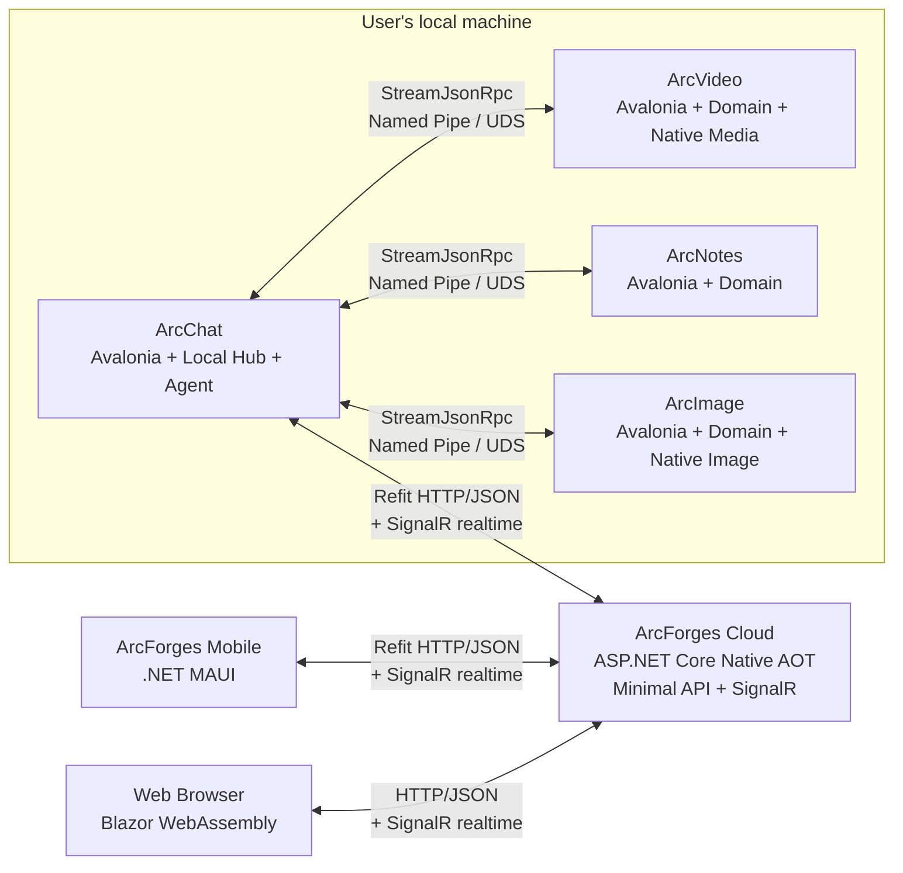
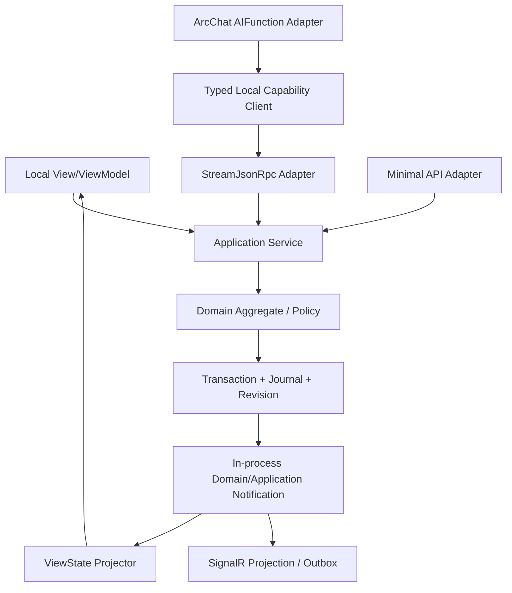
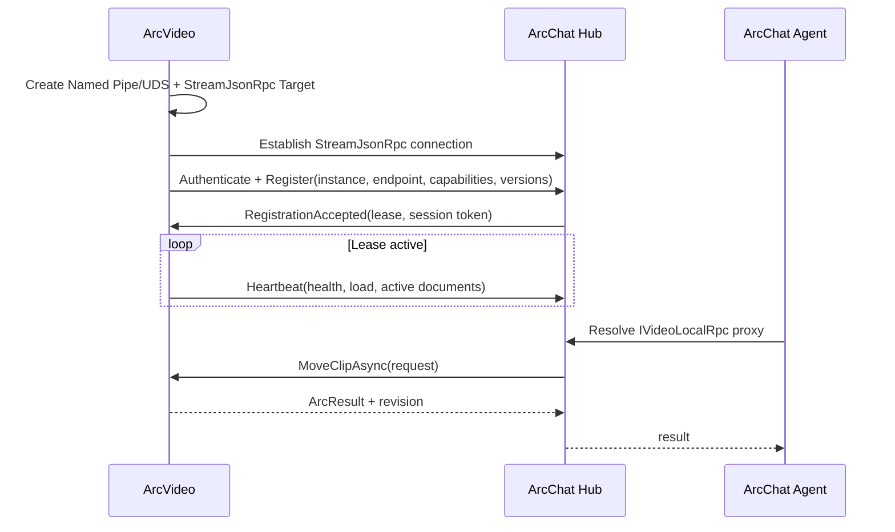
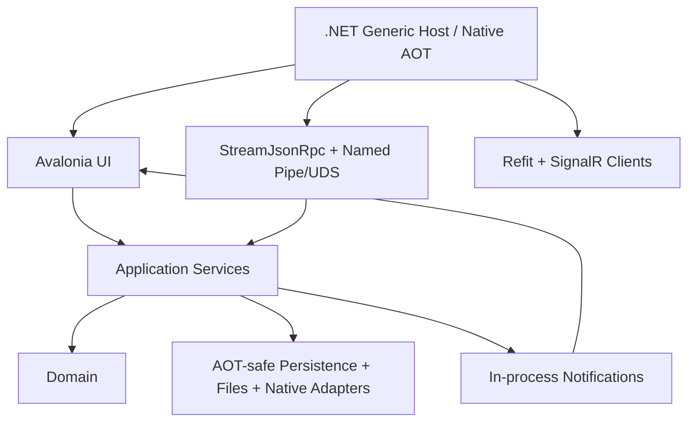

# ArcForges full C# future architecture overview

> Status: Target architecture / rewritten from scratch
> Technical baseline verification date: 2026-07-20
> Scope of application: ArcChat, ArcVideo, ArcNotes, ArcImage, ArcForges Cloud, mobile terminal and web front-end
> Keywords: .NET 10 LTS, C# 14, Native AOT, Avalonia, .NET MAUI, Blazor WebAssembly, ASP.NET Core Minimal API, Refit, StreamJsonRpc, SignalR, System.Text.Json, Nerdbank.MessagePack, P/Invoke, Interface Code First RPC

---

## 0. Document conclusion

The future architecture of ArcForges is unified as **All C# / All .NET**, and communication is clearly split into three main links that are not confusing with each other:

- **Public network request/response API: ASP.NET Core Minimal API + Refit + Standard HTTP/JSON**;
- **Native inter-process RPC: StreamJsonRpc + strongly typed .NET Interface + Named Pipe/Unix Domain Socket**;
- **Public network real-time function: ASP.NET Core SignalR**, only responsible for real-time sessions such as online status, notification, progress, chat increment and remote bridging;
- The cloud server uses ASP.NET Core and C#, with the Native AOT-compatible Minimal API/SignalR subset as the default baseline;
- Windows, macOS, and Linux desktops use Avalonia and C#, targeting Native AOT release;
- Android and iOS mobile terminals use .NET MAUI and C#; iOS uses Native AOT, and Android needs to distinguish between "Mono AOT" and the still experimental "Native AOT" under .NET 10;
- The web front-end uses Blazor WebAssembly and enables WASM AOT when needed; Blazor Server/Interactive Server is not used as the core operating mode under the strict full AOT goal;
- Public network DTO uses `System.Text.Json` Source Generation; the Refit client must take the generated-only path;
- The native StreamJsonRpc contract is true **Interface Code First RPC**: the client proxy and server implementation work around the same interface contract;
- The native StreamJsonRpc uses `NerdbankMessagePackFormatter` + generated TypeShape by default under Native AOT; only use `SystemTextJsonFormatter` + `JsonSerializerContext` when UTF-8 JSON is required, and accept its stricter AOT restrictions;
- Native codec, GPU, media and system capabilities directly enter the corresponding application process through `[LibraryImport]`/P/Invoke;
- No more designing, building, or deploying C++ workers;
- Aeron.NET, MagicOnion, gRPC/Protobuf are no longer used as ArcForges main communication layer;
- There is no longer a central Service process that holds all product business status.

The precise meaning of "single process" in this article is: **Each product instance is a complete, autonomous C# OS process, and the native libraries also run within this process**. It is not meant to merge ArcChat, ArcVideo, ArcNotes, ArcImage and Cloud Server into the same operating system process.

ArcChat hosts a native Hub by default, but the Hub only manages platform-level catalogs, routing, permissions, approvals, coordination, and auditing. Each product still has its own domain state, database, resources, UI, undo stack, and restore log. Cross-application calls are completed through the StreamJsonRpc strong type capability contract, and the Hub does not take over the internal state of the product.

This is not a line-by-line translation of the JVM version into C#, but rather a re-implementation using modern .NET technology that retains its correct product boundaries, state ownership and capabilities model.

### 0.1 The definition of “full AOT” and the current boundary of reality

This article divides "full AOT" into two levels to avoid confusing the terms:

1. **Architectural Goal**: All production main paths must be statically analyzeable, disable runtime code generation, disable dependencies on dynamic proxies/Reflection.Emit, and continuously build with real releases through trimming/AOT analyzers;
2. **Strict Native AOT**: The host finally generates native executable files directly by CoreCLR Native AOT.

As of 2026-07-20, strictly Native AOT still has two boundaries that must be faced:

- .NET MAUI Android's Native AOT is still not a capability that should be unconditionally used as the production main baseline in .NET 10; Android Release can use Mono AOT, but this is not equivalent to CoreCLR Native AOT;
- EF Core's Native AOT support is still not suitable as a strict production baseline, so a strictly full-AOT Cloud/desktop persistence path cannot rely on the EF Core runtime as an irreplaceable dependency.

So the hard rule of this article is: the communication layer itself must be AOT-safe; any infrastructure dependencies that prevent hosting Native AOT must be replaced, isolated as build/migration tools, or explicitly listed as a temporary exception to the platform. **

## 1. Why should we rewrite this way?

### 1.1 Retained product essence

The following facts must be retained from existing ArcForges product designs:

1. **Each product is a complete application, not a centrally served thin shell. **
   ArcVideo can edit and save independently, ArcNotes can edit and retrieve independently, ArcImage can process images independently, and ArcChat can chat and run Agent independently.

2. **Local experience does not rely on Hub online. **
   When ArcChat or Hub is unavailable, other applications can still open, edit, export, and restore local documents; just re-register the ability when the connection is restored.

3. **Status ownership is clear. **
   Who owns the document is responsible for its transactions, versions, undos, logs, snapshots, and resource lifecycle.

4. **Local UI and remote commands follow the same application service path. **
   StreamJsonRpc/Refit are just entry adapters and cannot create another set of business logic, let alone directly operate ViewModel or controls.

5. **Cross-application calls are semantic capabilities, not remote UI operations. **
   The caller requests "move a fragment", "insert a picture" and "export a document" instead of "click a button" or "modify a control property".

6. **Big resources stay on the owner's side. **
   Video frames, GPU textures, model files, and large attachments do not pass through the Hub; only ResourceRefs, task handles, and controlled flows are passed across boundaries.

### 1.2 The old idea of deletion

The following designs no longer belong to the target architecture:

- The central C# Service holds all product status;
- The Avalonia client is just the presentation layer;
- Aeron.NET is responsible for the main RPC;
- MagicOnion/gRPC/Protobuf as ArcForges main RPC;
- The public network client uses non-standard binary RPC instead of ordinary HTTP/JSON;
- Native IPC additionally enables Kestrel/HTTP/2 for "unified protocols";
- Each application starts another C++ Worker;
- Moving frames between C# and C++ Workers via shared memory;
- Use `invoke(string capability, Dictionary<string, object>)` as the actual calling protocol;
- The RPC service calls ViewModel, Dispatcher or control directly;
- The Hub proxies all files, media frames, and large objects;
- Runtime dynamic proxies, Reflection.Emit, contractless serialization or unvalidated reflection fallbacks remain in pursuit of AOT.

### 1.3 Objectives

- Unify language, tool chain, dependency injection, logging, testing and engineering specifications;
- Maintain product autonomy while providing a consistent cross-application collaboration experience;
- The public network uses standard HTTP/JSON to facilitate debugging, proxying, caching, observation, version management and third-party access;
- This machine uses the StreamJsonRpc strongly typed interface proxy to get real Interface Code First RPC instead of handwritten method string;
- Real-time public network capabilities use SignalR uniformly, but SignalR is not used as a database, reliable queue or sole status source;
- All communication DTOs, proxies and serialization are generated through source code or explicit static metadata, eliminating AOT reflection fallback;
- Completely isolate the domain layer from UI, transmission, database, and native libraries;
- Enable failure boundaries, version compatibility, safety boundaries and recovery paths to be tested;
- By default, it starts with a modular monolith to avoid premature microservices;
- Preserve interfaces for future splitting of services or adding isolated processes, but without paying for the complexity up front.

### 1.4 Non-target

- Not all UIs share the same set of XAML;
- Not all platforms produce the same release package;
- Not replacing all HTTP APIs with SignalR;
- It is not that the Refit interface becomes the server domain interface; Refit is the public network client contract layer;
- Rather than exposing StreamJsonRpc to the public network;
- Do not use JSON-RPC method string as the main calling method of business code; the business layer must use a strongly typed proxy;
- Not one database serves all products;
- Rather than exposing the local IPC as a public API;
- It does not allow any third-party native plug-in to enter the main process;
- Instead of coupling all products with one giant `ArcForges.Contracts` assembly;
- It is not claimed that all current MAUI Android production packages are already CoreCLR Native AOT.

## 2. 2026 technology baseline and version strategy

As of 2026-07-20, the target baseline is as follows. The version number is a stable baseline that has been verified when making architectural decisions; the preview version does not enter the stable main link.

| Hierarchy | technology | Verify baseline | decision making |
|---|---|---:|---|
| Language and runtime | C# / .NET | C# 14 / .NET 10 LTS | Unified baseline for all products |
| SDK | .NET SDK | 10.0.x stable feature band | `global.json` Fixed the actual verification version of the warehouse |
| cloud service | ASP.NET Core | .NET 10 | Native AOT is compatible with Minimal API + SignalR subset |
| Public HTTP client | Refit | 13.1.0 stable | `AddRefitGeneratedClient` / `ForGenerated`, standard HTTP/JSON |
| Native Interface RPC | StreamJsonRpc | 2.25.29 stable | Named Pipe/UDS; Source-generated proxy; Part of NativeAOT-safe, use according to the restrictions of this article |
| This machine's default formatter | Nerdbank.MessagePack | 1.2.36 stable | StreamJsonRpc is the safest path to NativeAOT officially recommended; only used as a native wire formatter |
| Public network JSON | System.Text.Json | .NET 10 inbox | `JsonSerializerContext` Source generation; disable reflection |
| Public network real-time | ASP.NET Core SignalR | .NET 10 inbox | Native AOT supports a subset; only JSON Hub protocol is used under AOT |
| Desktop UI | Avalonia | 12.x stability line | Windows/macOS/Linux; Native AOT release target |
| MVVM | CommunityToolkit.Mvvm | 8.4.x Stability line | ViewModel, command and notification infrastructure |
| Mobile UI | .NET MAUI Controls | 10.0.80 stable | Android/iOS; iOS Native AOT, Android looks at AOT mode alone |
| Web UI | Blazor WebAssembly | ASP.NET Core 10 | Strictly give priority to WASM AOT + static hosting under full AOT |
| Cloud database driver | Npgsql | 10.x stability line | Strictly Native AOT path gives priority to direct ADO.NET/compile SQL |
| ORM | EF Core | 10.x | Native AOT is still a high-risk/experimental path and cannot be used as a strict full-AOT production baseline. |
| Agent | Microsoft Agent Framework | Microsoft.Agents.AI 1.13.x | Enabled only on functional aspects verified by AOT analysis/release |
| AI abstract | Microsoft.Extensions.AI | 10.x | Models, Tools, Telemetry Abstractions |
| Telemetry | OpenTelemetry | 1.x stability line | Trace, Metric, Log correlation |
| Update and installation | Velopack | 1.x | Desktop install, incremental update, and rollback candidate; requires platform-by-platform AOT package verification |

Version strategy:

- The SDK is fixed by `global.json`, which prohibits CI and development machine drift;
- NuGet is centrally managed by `Directory.Packages.props`;
- Submit `packages.lock.json`, CI uses locked mode;
- Only one major version of Public Contracts, Local RPC Contracts and SignalR Contracts is allowed in the same release train;
- Patch upgrades for Refit, StreamJsonRpc, and Nerdbank.MessagePack must run AOT publish + trimming + old contract compatibility matrix;
- Do not write scattered package version numbers directly in business projects;
- Preview packages are not allowed to enter the stable branch core link;
- Hosts of `PublishAot=true` treat AOT/trimming warnings such as IL2026/IL3050 as blocking issues and prohibit masking unknown paths through large areas `UnconditionalSuppressMessage`.

### 2.1 The real boundary of AOT

The goal is upgraded from "select AOT by host" to: **Except for explicit platform exceptions, production hosts have Native AOT as the default design constraint**.

| host | target mode | Current constraints and strategies |
|---|---|---|
| ArcForges Cloud API | Native AOT | Minimal API + Refit corresponds to HTTP/JSON + SignalR JSON; does not rely on MVC/Razor runtime compilation; the database uses AOT-safe driver path |
| ArcChat Desktop | Native AOT | Avalonia + StreamJsonRpc; Agent/plugin discovery must remove dynamic code path or static registration |
| ArcVideo Desktop | Native AOT | Avalonia + StreamJsonRpc + `[LibraryImport]`; The native media library itself does not hinder the managed host AOT |
| ArcNotes Desktop | Native AOT | Avalonia + StreamJsonRpc + AOT-safe local persistence |
| ArcImage Desktop | Native AOT | Avalonia + StreamJsonRpc + `[LibraryImport]` |
| MAUI iOS | Native AOT | Official path; all Refit/SignalR DTOs must be generated from source |
| MAUI Android | Mono AOT is the production baseline; Native AOT is a separate experiment | Experimental Android Native AOT cannot be claimed as a stable baseline for all platforms under .NET 10 |
| Blazor WebAssembly | WASM AOT | Production hotspot/strict AOT build enabled; pay attention to package body and build time |

#### 2.1.1 Native AOT positioning of StreamJsonRpc

The current official statement of StreamJsonRpc is **"partially NativeAOT safe"**, not "packaging is 100% AOT-safe". ArcForges must meet the following hard conditions:

- All project link settings `<EnableStreamJsonRpcInterceptors>true</EnableStreamJsonRpcInterceptors>` that call `JsonRpc.Attach`;
- All RPC interfaces use `[JsonRpcContract]`;
- All RPC interfaces use `[GenerateShape(IncludeMethods = MethodShapeFlags.PublicInstance)]` simultaneously;
- The standalone Contracts assembly uses `[assembly: ExportRpcContractProxies]`, allowing agents to be activated directly;
- When multiple interfaces share one connection, declare `JsonRpcProxyInterfaceGroupAttribute` the required combination in advance; it is prohibited to splice unknown interfaces at runtime;
- This machine defaults to `NerdbankMessagePackFormatter`; if UTF-8 JSON is required, `SystemTextJsonFormatter.JsonSerializerOptions.TypeInfoResolver` must be bound to the source to generate `JsonSerializerContext`;
- Adding a server-side target uses `RpcTargetMetadata` to generate paths without using convenience overloads that require runtime reflection enumeration methods;
- Create proxies using concrete generics or `typeof`, not dynamically constructed from an unknown runtime Type collection;
- It is forbidden to rely on RPC marshalable objects under AOT + `SystemTextJsonFormatter`; use the Nerdbank.MessagePack path when this capability is needed;
- Each platform runs real `dotnet publish -p:PublishAot=true`, Debug/JIT testing does not count as AOT verification.

#### 2.1.2 Refit’s Native AOT positioning

The generated path of Refit 13.1.0 is sufficient as a baseline for the AOT public client, but ArcForges only allows:

- `RestService.ForGenerated<T>` or `AddRefitGeneratedClient<T>`;
- `SystemTextJsonContentSerializer` + source generation `JsonSerializerContext`;
- No Refit runtime reflection fallback is allowed; if you upgrade to a version that provides the `Refit.Reflection` opt-in package, it must not be introduced into the production AOT main path;
- CI upgrades the diagnosis in the Refit analyzer that prompts the need to reflect the request builder to an error; if the version used provides RF006, it is also regarded as an error;
- The method shape of the public API interface must fall within the supported range of generated request building;
- The public network server is still ASP.NET Core Minimal API, not "implementing the Refit interface" to disguise native RPC.

#### 2.1.3 SignalR’s Native AOT positioning

SignalR supports client-side and server-side Native AOT scenarios since .NET 9, but the AOT baseline must be narrowed:

- Only use the JSON Hub protocol and provide `System.Text.Json` source generation metadata to all Hub DTOs;
- Native AOT server does not use `Hub<T>` strongly typed hub; uses ordinary `Hub` + centralized method name constant/generated wrapper;
- Does not rely on Hub parameter/return type combinations not supported by AOT;
- SignalR only works on the real-time layer, and the status after disconnection is restored through Refit HTTP query revision/sequence;
- All production clients perform AOT publish smoke tests instead of just validating normal JIT connections.

#### 2.1.4 The impact of strict full AOT on the data layer

EF Core's Native AOT support should not be used as a strict production baseline as of this verification. If ArcForges insists on Cloud/Desktop primary hosting strictly Native AOT:

- Cloud defaults to Npgsql ADO.NET + explicit/generated SQL; Dapper.AOT can be used as an enhancement layer after PoC;
- Native SQLite uses AOT-safe ADO.NET paths with explicit SQL/generative mapping by default;
- Schema migration can be performed by build/deployment phase tools, but the production master host does not introduce a dynamic ORM runtime;
- If EF Core Native AOT reaches a stable production level in the future, it will be re-evaluated through ADR instead of destroying the full AOT goal for "code convenience" now.

## 3. Product topology

### 3.1 Overall topology



There are only three communication rules:

1. **Same machine process boundary**: StreamJsonRpc;
2. **Public network command/query**: Standard HTTP/JSON client generated by Refit;
3. **Public network real-time events**: SignalR.

It is forbidden to allow the local machine to use HTTP for the sake of "unification", and it is also forbidden for the business to write commands that only exist in SignalR messages for the sake of "real-time".

### 3.2 ArcChat

ArcChat is:

- Complete chat product;
- Local Agent entrance;
- Default native Hub host;
- Capability catalog, instance catalog, permissions and approval coordinator;
- Initiator of cross-application sagas and audits;
- Exit for cloud sync and optional remote bridging;
- Native StreamJsonRpc connection manager;
- Public network Refit/SignalR client host.

ArcChat is not:

- Database of all products;
- Proxies for video frame and image content;
- Authoritative source of status for other application areas;
- Hidden UI thread for other applications;
- A single point through which all commands must pass.

ArcChat itself provides the ability to directly call application services within the process without doing "your own RPC". Other application capabilities are called through the strongly typed StreamJsonRpc proxy held by the Hub.

### 3.3 ArcVideo

ArcVideo is a standalone desktop application that has:

- Domain models such as projects, timelines, tracks, clips, effects, markers;
- media indexing, proxy files, and rendering tasks;
- Local database, command log, snapshot and undo stack;
- Avalonia UI and this process ViewModel;
- P/Invoke adaptation layer for FFmpeg or other native media libraries;
- External versioned StreamJsonRpc capability interfaces such as `IVideoLocalRpc`.

Cross-applications can request ArcVideo to import assets, move clips, create markers, or export finished products, but cannot obtain bare GPU handles, arbitrary native pointers, or internal mutable entity references.

### 3.4 ArcNotes

ArcNotes is a stand-alone knowledge and documentation application that has:

- Notebooks, documents, blocks, links, tags and indexes;
- Local search with optional vector indexing;
- Attachment ResourceRef;
- Local database, logs, snapshots and undo stack;
- Avalonia UI；
- `INotesLocalRpc` and other semantic capabilities.

### 3.5 ArcImage

ArcImage is a standalone imaging application that has:

- Canvas, layers, masks, filters, history and export configurations;
- Image caching and GPU/CPU resources;
- P/Invoke adaptation layer for native codecs or GPU libraries;
- Local database, logs, snapshots and undo stack;
- Avalonia UI；
- `IImageLocalRpc` and other semantic capabilities.

### 3.6 ArcForges Cloud

The cloud is responsible for:

- Accounts, organizations, devices and authorizations;
- Standard HTTP/JSON Public API;
- SignalR real-time connections, notifications, presence and remote bridging;
- Cross-device conversations and messaging;
- Synchronization of metadata, conflict resolution and cloud resource indexing;
- AI Provider access, quotas and auditing;
- Mobile and Web API;
- Server tasks and notifications.

The first phase uses modular monoliths. Expose commands/queries into the Minimal API/Application Service; real-time events are delivered to SignalR from the outbox/application notification after submission. Only split modules into services when there is a proven need for independent scaling, isolation, security, or team ownership.

### 3.7 Mobile and Web

- MAUI is a cloud client and does not directly discover or connect to the desktop Hub in the user's LAN;
- MAUI public network request/response through Refit generated-only HTTP/JSON; real-time through SignalR;
- Web browsers only connect to ArcForges Cloud; Blazor WebAssembly uses plain HTTP/JSON and SignalR;
- If remote control of the desktop is to be implemented, the desktop ArcChat must actively establish a public network SignalR outbound connection and undergo user-visible device authorization, approval and revocation;
- Persistent commands/results of remote control still fall into HTTP/API or persistent task state, SignalR is just a real-time delivery and wake-up channel;
- Mobile and web share DTO and application semantics without forcing shared UI implementation.

## 4. State ownership and consistency

### 4.1 Sole owner principle

| Status | authoritative owner | prohibited copies |
|---|---|---|
| Video Projects and Timeline | ArcVideo instance | Writable image in Hub |
| Notes and Knowledge Graph | ArcNotes instance | Business database copy in ArcChat |
| Image Projects and Layers | ArcImage instance | Writable copy in the cloud without synchronization protocol |
| Chat Sessions vs. Local Agent Sessions | ArcChat | Shadow sessions in other desktop apps |
| Online Examples and Competencies Catalog | ArcChat Hub | Each application maintains its own global directory |
| Cloud accounts, organizations, devices | ArcForges Cloud | Native application self-proclaimed authoritative account status |
| Local permission grant and approval records | ArcChat Hub | Provider silently authorizes itself |

Caching is allowed, but the cache must:

- Mark sources and revisions;
- Can be discarded and reacquired;
- Not to be taken as an authoritative writing point;
- Do not extend visibility beyond security permissions.

### 4.2 Unified local and remote write paths



Constraints:

- StreamJsonRpc Adapter only does native identity, input validation, DTO mapping, undelivery and application service calls;
- Minimal API Adapter only handles public network authentication and authorization, HTTP semantics, JSON DTO and application service calls;
- SignalR Hub does not directly change the domain status; it calls the same Application Service when writing is required, and the CommandId/revision semantics must be retained;
- ViewModel only consumes ViewState and calls local Facade;
- App Service does not reference Avalonia, MAUI, Blazor, Refit, StreamJsonRpc, SignalR, or control types;
- The domain layer does not reference database providers, transport libraries, file systems and native handles;
- Local hits, native RPCs, and public HTTP commands must produce the same domain commands, revisions, logs, and notifications;
- UI updates are completed by the projector within the process, and the remote caller cannot directly schedule the other party's UI.

### 4.3 Conformance level

- Commands within a single document: strong consistency in local transactions;
- Multiple documents in the same application: Prioritize per-document transactions and coordinate with application-level Saga;
- Cross-application: eventually consistent, using Saga, idempotent commands, compensation and visible state;
- Public HTTP: A successful response only means that the server has completed/accepted it as defined; long tasks return TaskHandle;
- SignalR: only provides real-time visibility and does not provide the only reliable fact; after disconnection, it must be completed through HTTP revision/sequence;
- Cross-device: Based on the synchronization protocol and revision, it is prohibited to use database files as synchronization units;
- Agent multi-step operation: Each step is a common controlled capability call, and failures can be observed, recovered, and approved.

## 5. Solution and code boundaries

### 5.1 Suggested warehouse layout

```text
ArcForges/
├─ global.json
├─ Directory.Build.props
├─ Directory.Packages.props
├─ NuGet.config
├─ ArcForges.slnx
├─ eng/
│  ├─ build/
│  ├─ packaging/
│  └─ versioning/
├─ src/
│  ├─ BuildingBlocks/
│  │  ├─ ArcForges.Foundation/
│  │  ├─ ArcForges.Application.Abstractions/
│  │  ├─ ArcForges.Persistence/
│  │  ├─ ArcForges.Observability/
│  │  └─ ArcForges.NativeInterop/
│  ├─ Contracts/
│  │  ├─ ArcForges.Contracts.Foundation/
│  │  ├─ ArcForges.Contracts.LocalRpc/
│  │  ├─ ArcForges.Contracts.PublicApi/
│  │  └─ ArcForges.Contracts.Realtime/
│  ├─ ArcChat/
│  │  ├─ ArcChat.Domain/
│  │  ├─ ArcChat.Application/
│  │  ├─ ArcChat.Infrastructure/
│  │  ├─ ArcChat.LocalRpc/
│  │  ├─ ArcChat.CloudClient/
│  │  ├─ ArcChat.Desktop/
│  │  └─ ArcChat.Tests/
│  ├─ ArcVideo/
│  ├─ ArcNotes/
│  ├─ ArcImage/
│  ├─ Cloud/
│  │  ├─ ArcForges.Cloud.Host/
│  │  ├─ ArcForges.Cloud.PublicApi/
│  │  ├─ ArcForges.Cloud.Realtime/
│  │  ├─ ArcForges.Cloud.Modules.Identity/
│  │  ├─ ArcForges.Cloud.Modules.Chat/
│  │  ├─ ArcForges.Cloud.Modules.Sync/
│  │  └─ ArcForges.Cloud.Modules.Agent/
│  ├─ Mobile/
│  │  └─ ArcForges.Mobile/
│  └─ Web/
│     └─ ArcForges.Web.Client/
├─ native/
│  ├─ media-abi/
│  └─ image-abi/
├─ tests/
│  ├─ ArchitectureTests/
│  ├─ ContractCompatibilityTests/
│  ├─ PublicApiContractTests/
│  ├─ LocalRpcAotTests/
│  ├─ RealtimeReconnectTests/
│  ├─ EndToEndTests/
│  └─ NativeAbiTests/
└─ docs/
```

This is a logical layout and does not require moving all existing directories at once. During migration, products are allowed to be gradually placed in vertical slices.

### 5.2 Reference direction

```text
Desktop / LocalRpc / Infrastructure ─┐
                                     ├─> Application ─> Domain
MinimalApi / MAUI / WASM Adapter    ─┘

Contracts.Foundation <- Contracts.LocalRpc
Contracts.Foundation <- Contracts.PublicApi
Contracts.Foundation <- Contracts.Realtime
```

Hard rules:

- Domain cannot reference Application, Infrastructure, UI or Contracts;
- Application can only rely on Domain and a few abstractions;
- Infrastructure implements the port defined by Application;
- Local RPC DTO/Public API DTO do not directly become domain entities;
- The UI Model does not directly become a transport DTO;
- The Refit interface can only exist within the PublicApi Client Contract boundary;
- The StreamJsonRpc interface can only exist at the LocalRpc Contract boundary;
- SignalR Hub DTO cannot be treated as a persistent domain event ontology;
- LocalRpc Contracts are not referenced by the browser or Cloud Host;
- PublicApi Contracts do not expose native IPC, native handles, and desktop implementation details.

### 5.3 Why split Contracts

`ArcForges.Contracts.Foundation` contains only:

- Stable ID: AppId, InstanceId, DocumentId, ResourceId, CommandId, TaskId;
- revision/version basic type;
- `ArcResult<T>`、`ArcError`；
- `ResourceRef`, TaskSnapshot and other cross-domain stable values;
- Pagination, time and base enums.

`ArcForges.Contracts.LocalRpc` contains:

- Hub registration, discovery, leases, approvals, and native routing;
- StreamJsonRpc strongly typed interface for ArcVideo, ArcNotes, ArcImage, and ArcChat;
- `[JsonRpcContract]`, `GenerateShape` required static contract metadata;
- Native connection event and notification contracts.

`ArcForges.Contracts.PublicApi` contains:

- Account, Device, Chat, Sync, Cloud Tasks, Resources and Approval DTOs;
- Refit client interface and HTTP route/version definition;
- `System.Text.Json` source generation context;
- Does not include server-side Application/Domain implementation.

`ArcForges.Contracts.Realtime` contains:

- SignalR method name constant;
- Notifications, presence, task progress, chat delta, and bridging envelope DTOs;
- sequence/revision recovery information;
- `System.Text.Json` Source generation context.

All contract projects have AOT/trimming compatibility as a hard threshold and do not reference UI, ORM, database provider, native library or specific host.

## 6. StreamJsonRpc Interface Code First RPC

### 6.1 Why does this machine choose StreamJsonRpc?

StreamJsonRpc is ArcForges' only primary native RPC layer. It was chosen not because "JSON looks good" but because it directly matches the native multi-process C# architecture:

- RPC API can be directly defined as .NET interface;
- The client obtains a strongly typed proxy through `Attach<T>()`;
- Provider can directly implement the same interface to form a true Interface Code First;
- Both parties on the same full-duplex connection can initiate calls and notifications;
- The transport is decoupled from the protocol and can run directly on `Stream`, Named Pipe, Unix Domain Socket, WebSocket and other bidirectional channels;
- No need to start Kestrel, HTTP/2 or occupy TCP ports for native RPC;
- There is Source Generator/Analyzer, available for Native AOT in constrained mode.

But it must be clear: **StreamJsonRpc officially only calls itself "partially NativeAOT safe"**. The usability of ArcForges comes from strictly adhering to generative paths, rather than assuming that all APIs are naturally AOT-safe.

### 6.2 Contract Style: The interface is the native RPC source

```csharp
using PolyType;
using StreamJsonRpc;

[JsonRpcContract]
[GenerateShape(IncludeMethods = MethodShapeFlags.PublicInstance)]
public partial interface IVideoLocalRpc : IDisposable
{
    Task<ArcResult<MoveClipResponse>> MoveClipAsync(
        MoveClipRequest request,
        CancellationToken cancellationToken);

    Task<TaskHandle> StartRenderAsync(
        StartRenderRequest request,
        CancellationToken cancellationToken);

    event EventHandler<VideoRpcEvent> Changed;
}
```

The server implements the same interface:

```csharp
public sealed class VideoLocalRpcService(
    MoveClipHandler moveClipHandler,
    RenderHandler renderHandler,
    ILocalRpcIdentityAccessor identity)
    : IVideoLocalRpc
{
    public event EventHandler<VideoRpcEvent>? Changed;

    public async Task<ArcResult<MoveClipResponse>> MoveClipAsync(
        MoveClipRequest request,
        CancellationToken cancellationToken)
    {
        var actor = identity.RequireActor();
        return await moveClipHandler.HandleAsync(request, actor, cancellationToken);
    }

    public Task<TaskHandle> StartRenderAsync(
        StartRenderRequest request,
        CancellationToken cancellationToken)
        => renderHandler.StartAsync(request, identity.RequireActor(), cancellationToken);

    public void Dispose() { }
}
```

The client only sees the interface:

```csharp
IVideoLocalRpc video = rpc.Attach<IVideoLocalRpc>();
var result = await video.MoveClipAsync(request, cancellationToken);
```

This is what this article calls **Interface Code First RPC**:

- Interfaces are compile-time contract sources;
- Do not write method strings such as `"video.moveClip"` for business calls;
- Analyzer can check for unsupported interface shapes at compile time;
- Source Generator generates agents for AOT;
- The server is still just an Adapter, which ultimately calls the Application Service.

### 6.3 StreamJsonRpc interface hard rules

Under current strongly typed proxy constraints, the ArcForges native RPC interface must:

- tag `[JsonRpcContract]`;
- tag `[GenerateShape(IncludeMethods = MethodShapeFlags.PublicInstance)]`;
- Declared as `partial interface`;
- Does not contain properties;
- Does not contain generic methods;
- Method returns `Task`, `Task<T>`, `ValueTask`, `ValueTask<T>`, or authenticated `IAsyncEnumerable<T>`;
- `CancellationToken` If present, it must be placed last;
- Events only use `EventHandler`/`EventHandler<T>`;
- It is recommended that the interface inherit `IDisposable` to make the agent life cycle clear;
- Avoid overloading of external methods and avoid difficult-to-audit wire contract changes caused by CLR renaming;
- Each write method uses request DTO, which must contain necessary concurrency fields such as CommandId, DocumentId/ResourceId and ExpectedRevision;
- Do not pass `object`, `dynamic`, `Type`, any Dictionary object graph, DbContext, EF Entity, ViewModel, control, native pointer, or `SafeHandle`.

The interface method name itself belongs to the protocol compatibility surface. If you need long-term stable wire names, you can use the explicit JSON-RPC method naming feature or the V2 interface policy, but you cannot arbitrarily rename public methods after release.

### 6.4 Native AOT: Generative proxy interception must be turned on

All projects that create StreamJsonRpc proxies, including indirectly dependent projects, must enable:

```xml
<PropertyGroup>
  <PublishAot>true</PublishAot>
  <IsAotCompatible>true</IsAotCompatible>
  <EnableStreamJsonRpcInterceptors>true</EnableStreamJsonRpcInterceptors>
</PropertyGroup>
```

`EnableStreamJsonRpcInterceptors=true` means:

- `JsonRpc.Attach<T>()` No longer silently returns arbitrary dynamic proxies;
- Requests to interfaces that do not have a source generating proxy will fail early;
- AOT builds can turn "missed contract generation" into testable bugs.

The standalone Contracts assembly recommends exporting the agent directly:

```csharp
using StreamJsonRpc;

[assembly: ExportRpcContractProxies]
```

Upgrade this to the **default hard rule** in ArcForges. In this way, the AOT host can directly construct the generation agent and avoid finding/activating invisible agents through reflection.

### 6.5 Multiple interfaces share one connection

A native process connection usually requires both:

- `IHubControlRpc`；
- `IVideoLocalRpc` / `INotesLocalRpc` and other product interfaces;
- Possible callback/event interface.

Rules:

- A transport creates only one `JsonRpc` instance;
- It is forbidden to call static `JsonRpc.Attach<T>(stream)` multiple times on the same Stream, because an independent `JsonRpc` will be created each time;
- When multiple agents are needed, first create one `JsonRpc`, and then call the instance `rpc.Attach<T>()`;
- The multi-interface combination required under Native AOT must be pre-generated through `JsonRpcProxyInterfaceGroupAttribute`;
- `AcceptProxyWithExtraInterfaces=true` can be set after evaluation to reduce combinatorial explosion, but must be covered by contract testing;
- Disable runtime scanning of assemblies and "Dynamic Attach after discovering all interfaces".

This is why local Contracts should be small and stable, rather than being made into a giant assembly that grows infinitely.

### 6.6 formatter: AOT default selection Nerdbank.MessagePack

Although the library is called StreamJsonRpc, the JSON-RPC message model does not require wire bytes to be JSON text.

In order to meet the full AOT, ArcForges native default:

```csharp
static IJsonRpcMessageFormatter CreateLocalRpcFormatter()
    => new NerdbankMessagePackFormatter
    {
        TypeShapeProvider = LocalRpcTypeShapeWitness.GeneratedTypeShapeProvider,
    };

[GenerateShapeFor<MoveClipRequest>]
[GenerateShapeFor<MoveClipResponse>]
[GenerateShapeFor<ArcResult<MoveClipResponse>>]
internal partial class LocalRpcTypeShapeWitness;
```

Reason: StreamJsonRpc officially describes `NerdbankMessagePackFormatter` as the "best and safest experience" under NativeAOT, and it can support RPC marshalable objects under NativeAOT.

MessagePack here is just a native wire formatter:

- It is not the ArcForges public API;
- It is not cross-language IDL;
- It does not replace HTTP/JSON;
- It does not require the business domain to be designed around the MessagePack attribute.

### 6.7 If this machine must use UTF-8 JSON

Use only when debugging interop or when clear requirements are required:

```csharp
[JsonSerializable(typeof(MoveClipRequest))]
[JsonSerializable(typeof(MoveClipResponse))]
[JsonSerializable(typeof(ArcResult<MoveClipResponse>))]
internal partial class LocalRpcJsonContext : JsonSerializerContext;

static IJsonRpcMessageFormatter CreateJsonFormatter()
    => new SystemTextJsonFormatter
    {
        JsonSerializerOptions =
        {
            TypeInfoResolver = LocalRpcJsonContext.Default,
        },
    };
```

Must also comply with:

- All RPC DTOs go into `JsonSerializerContext`;
- The default `JsonMessageFormatter` is not used as it is based on Newtonsoft.Json and is not the AOT baseline for this article;
- Does not rely on unsafe RPC marshalable objects under NativeAOT under `SystemTextJsonFormatter`;
- Do not scan for unknown types via the `JsonSerializerOptions` runtime resolver in production;
- There are AOT publish tests for every new DTO.

Therefore, the default of this machine is still Nerdbank.MessagePack; only the public network standard protocol unifies HTTP/JSON.

### 6.8 Server target registration: disabling reflection convenience paths

Native AOT server target uses generative metadata:

```csharp
var metadata = RpcTargetMetadata.FromShape<IVideoLocalRpc>();
rpc.AddLocalRpcTarget(metadata, videoService, options: null);
rpc.StartListening();
```

Rules:

- All targets are registered before `StartListening()`;
- Use `RpcTargetMetadata`/TypeShape to generate paths;
- Do not use overloads that rely on runtime reflection enumeration target methods as the production main path;
- The target life cycle is clear from the native connection/application life cycle;
- RPC Adapter does not hold UI objects.

### 6.9 framing and transport

Native binary default:

```csharp
var handler = new LengthHeaderMessageHandler(
    sendingStream,
    receivingStream,
    CreateLocalRpcFormatter());

var rpc = new JsonRpc(handler);
```

UTF-8 JSON can be used with the appropriate header-delimited handler.

Transport selection:

- Windows: Named Pipe; the asynchronous option must be used when creating the pipe to avoid blocking/hanging in async RPC;
- Linux/macOS: Unix Domain Socket; wrapped as full-duplex Stream;
- Test: `FullDuplexStream` or in-process loopback;
- Fixed TCP ports are not used as the official native discovery scheme.

### 6.10 Bidirectional calls, events and callbacks

StreamJsonRpc is a peer-to-peer full-duplex protocol, and both parties can initiate calls. ArcForges usage principles:

- Command/Query: Strongly typed methods;
- Low-frequency connection-level notification: interface event or explicit callback contract;
- High-frequency state flow: give priority to revision + delta, and use `IAsyncEnumerable<T>` after verification if necessary;
- Large files/video frames: never pushed continuously as normal RPC DTO, use ResourceRef/controlled stream;
- Events are never persistent facts, and recovery from disconnection still relies on revision/journal query.

### 6.11 Concurrency, Sequence and Deadlock

StreamJsonRpc cannot be understood as a "natural serial actor". It supports concurrent RPCs, and synchronization context behavior is not a substitute for domain-level concurrency control.

Hard rules:

- Each DocumentSession/Timeline uses mailbox, AsyncLock or single writer queue to maintain write order;
- Express business order without relying on RPC arrival order;
- Do not wait for peer callback while holding domain lock;
- Bidirectional callbacks must not form a cycle in which A waits for B, and B waits for A simultaneously;
- Channel/queue must have capacity limit and full load policy;
- Writing commands always relies on ExpectedRevision + CommandId, rather than "another call has just been sent on this connection".

### 6.12 Disconnection, cancellation and reconnection

StreamJsonRpc does not implement business retries for you.

- Incomplete calls may fail with `ConnectionLostException` when the connection is broken;
- The remote exception appears as `RemoteInvocationException`. If the business fails, `ArcResult<T>` will still be used first;
- Normal cancellation behaves as `OperationCanceledException`;
- Listen to `Completion`/`Disconnected` to update the connection status;
- Cancellation of locally executing RPCs when the connection is closed can be enabled according to scenarios, but long business tasks cannot decide whether to cancel based on the connection life cycle alone;
- Reconnect using exponential backoff + jitter;
- Queries are safe to retry;
- The write command can only be retried if it carries the CommandId and is idempotent by the Provider;
- After reconnecting, re-authenticate and register capabilities, and complete the status according to revision/sequence.

### 6.13 Error model

Separation of three categories of failure:

1. **Connection/Protocol failed**: `ConnectionLostException`, method not found, invalid params;
2. **Remote execution exception**: `RemoteInvocationException`, does not leak the server stack and sensitive paths to the client;
3. **Business failure**: `ArcResult<T>` / `ArcError`, including stable code, message key, optional details, correlationId.

The caller only does business logic according to stable code and does not parse human error text.

### 6.14 Security

StreamJsonRpc itself is not an authentication and authorization system.

- Named Pipe ACL/UDS file permissions first restrict OS users;
- After the connection is established, the first phase of Hub session handshake is completed;
- The session token is not written into the public endpoint manifest;
- The token binds appId, instanceId, endpoint, buildId, contractSet and expiration time;
- Each write call continues to carry/resolve actors and scopes;
- Provider authorizes again at final execution point;
- Even if the untrusted client can connect to the pipe/socket, it does not automatically have all the capabilities just because it is "native".

### Compatible with version 6.15

After publishing:

- Do not arbitrarily rename public interfaces and methods within the same major version;
- The new fields in DTO must maintain the formatter’s backward and forward compatibility strategy;
- Destructive changes create new interfaces such as `IVideoLocalRpcV2`, allowing V1/V2 to coexist in a migration window;
- Hub registration carries `contractSet`, semanticVersion, buildId, features;
- Conduct capability/version negotiation before calling;
- Contract compatibility testing retains the client assembly, serialization gold sample, and AOT release products of the previous stable version;
- AOT proxy generation failure is a CI block and dynamic proxy is not allowed to be returned online.

### 6.16 StreamJsonRpc AOT final checklist

Each Local RPC must answer before merging:

- [ ] Is the interface `[JsonRpcContract]` + `GenerateShape(PublicInstance)` + `partial`?
- [ ] Does the Contracts assembly export a build agent?
- [ ] Are `EnableStreamJsonRpcInterceptors` enabled for all Attach call chains?
- [ ] Is there no dynamic interface/type discovery?
- [ ] Are multi-interface combinations pre-generated?
- [ ] formatter Nerdbank.MessagePack, or STJ + `JsonSerializerContext`?
- [ ] Is the target registered via the `RpcTargetMetadata` generation path?
- [ ] Have you run a real Native AOT publish and initiated an RPC round-trip?
- [ ] Are you testing for disconnections, reconnections, duplicate CommandIds, revision conflicts, and callback deadlocks?

## 7. Native IPC, Discovery and Routing

### 7.1 Transmission selection

Native StreamJsonRpc runs directly on OS IPC's full-duplex Stream, no longer initiating Kestrel/HTTP/2:

| Platform | Default IPC | Identity control | AOT attention |
|---|---|---|---|
| Windows | Named Pipe | Current user ACL; restrict service SID/AppContainer if necessary | pipe uses asynchronous options; does not rely on reflection to discover services |
| Linux | Unix Domain Socket | Private runtime directory + socket file permissions | socket path length, clean stale socket |
| macOS | Unix Domain Socket | User directory permissions + socket file permissions | Sandbox/Signature scenarios individually verify container paths |
| develop diagnostics | `127.0.0.1` Random port, only explicitly enabled | Still need session token | Cannot be made the production default |

Reasons to choose OS IPC:

- Does not occupy a fixed TCP port;
- Easier to bind current OS user permissions;
- No peer TLS certificate required;
- Without a native Kestrel/gRPC host, the desktop Native AOT path is simpler;
- StreamJsonRpc can directly reuse the same Stream to complete bidirectional Interface RPC.

### 7.2 Endpoint list

When each application starts, a minimal endpoint list is written to the current user's private runtime directory:

```json
{
  "appId": "arcvideo",
  "instanceId": "019f...",
  "processId": 18420,
  "transport": "named-pipe",
  "endpoint": "arcforges.arcvideo.019f...",
  "buildId": "2026.07.20.1",
  "contractSet": "local-rpc-v1",
  "startedAtUtc": "2026-07-20T10:00:00Z"
}
```

The manifest is not an authentication credential. Session tokens are not written into the manifest as clear text; the process also verifies the short-term session credentials issued by the peer user, the intended process, the build/contract, and the Hub.

### 7.3 Registration life cycle



Life cycle rules:

- The application first starts its own endpoint and then connects to the Hub;
- Hub unavailability does not prevent the application from entering the locally available state;
- Hub eliminates disconnected instances based on leases;
- When the application reconnects, it uses the new sessionId and replaces the old registration idempotently;
- If multiple instances of the same product exist at the same time, the route must carry InstanceId or DocumentId;
- Hub's document routing index only stores "which instance is currently opening which document" and does not store the document content;
- The process exits normally and actively unregisters; crashes depend on lease expiration and cleanup;
- After the connection is reestablished, Attach must be re-generated to generate a proxy, and the old proxy will not be reused.

### 7.4 Routing

Route priority:

1. The command explicitly specifies the InstanceId;
2. DocumentId is bound to the online instance;
3. The default Provider currently selected by the user;
4. The only healthy instance of the same type;
5. Otherwise return `ProviderSelectionRequired`, chosen by the user or Agent.

The Hub should not silently route random routes when multiple candidate instances exist.

### 7.5 Health and Backpressure

Provider reports:

- `Ready / Busy / Degraded / Draining`；
- Current number of tasks, queue depth and optional load levels;
- Supported contractSet and feature flags;
- The most recent successful heartbeat and process start time.

The caller must handle `Busy`, `RetryAfter`, and the queue limit. Infinite queues are not a fault-tolerant strategy.

### 7.6 Connection Manager

There is only one infrastructure component per product responsible for the StreamJsonRpc connection lifecycle:

- Create/listen to Named Pipe or UDS;
- Create formatter + message handler;
- Register local target;
- `StartListening()`；
- Create a strongly typed proxy;
- Listen for Completion/Disconnected;
- Index backoff reconnection;
- recertification/registration;
- Update connection health status.

Business code never directly new pipe/socket/JsonRpc, nor directly write method string.

## 8. Ability System and Agent

### 8.1 Capabilities are semantic interfaces

There can be string IDs in the capability catalog, for example:

```text
arcvideo.timeline.move-clip
arcvideo.export.render
arcnotes.document.insert-block
arcimage.canvas.apply-filter
```

Strings are only used for:

- discover;
- Search and display;
- permissions policy;
- Agent tool selection;
- Routing and auditing.

The actual call must fall to the compiled strongly typed interface method. Using a catch-all `InvokeAsync(string, object)` to bypass contracts, permissions, and version control is prohibited.

### 8.2 Capability description

Each competency includes at least:

- capabilityId and display metadata;
- provider app/instance；
- typed service/method identity；
- contract version and feature flags;
- input/output summary;
- Whether to write status;
- required scope;
- risk level;
- Whether user confirmation is required;
- Whether to support dry-run, undo, cancel;
- Resource size, estimated duration, and concurrency limits.

### 8.3 Agent running location

ArcChat runs Microsoft Agent Framework within the same C# process:

- `Microsoft.Agents.AI` is responsible for orchestrating Agents, sessions and tools;
- `Microsoft.Extensions.AI` Abstract Chat Client, Embedding, Tools and Telemetry;
- Capability Registry wraps strongly typed proxies as `AIFunction`;
- The JIT host allows necessary runtime tool discovery, but stable tools still prefer generating explicit bindings;
- Model output always goes through parameter verification and authorization before calling the Provider.

### 8.4 Agent is not a super user

Agents use the same application services and capability interfaces as human UIs. It cannot:

- Bypass Scope;
- Forge user identity;
- Directly write other product databases;
- Directly manipulate ViewModel;
- Use unregistered native functions;
- Perform high-risk exports, deletions, releases, or cloud shares without the user's knowledge.

### 8.5 Approval

Approval status is managed by Hub:

```text
Requested -> Presented -> Approved/Denied/Expired -> Executed/Failed
```

Approval binding:

- actors and devices;
- capabilityId；
- parameter digest or hash;
- provider instance；
- validity period;
- risk level;
- correlationId。

If the parameters change substantially after approval, they must be re-approved.

---

## 9. Avalonia desktop application architecture

### 9.1 Internal structure of each desktop process



Generic Host unified management:

- dependency injection;
- Configuration and Secret reference;
- Logging and OpenTelemetry;
- StreamJsonRpc endpoint/connection life cycle;
- Refit HttpClient and SignalR HubConnection life cycle;
- Database migration check and recovery;
- Native runtime initialization;
- Orderly shutdown.

The Avalonia life cycle and the Generic Host life cycle must be coordinated: when the UI is closed, it first enters draining, stops accepting new remote write commands, waits for key transactions to be placed, and then stops the StreamJsonRpc endpoint, SignalR connection and native runtime.

Native AOT additional constraints:

- Avalonia XAML uses compiled bindings whenever possible;
- It is forbidden to rely on the runtime to load any XAML, dynamic proxy or reflection scanning plug-in as the core path;
- DI registration prioritizes explicit/generative methods, and does not regard "scanning the entire assembly for automatic registration" as an irreplaceable mechanism;
- Third-party Avalonia controls must be trimming/AOT publish verified;
- Each desktop RID actually publishes the Native AOT package and performs startup, document opening, native RPC, cloud HTTP, and SignalR round-trip smoke tests.

### 9.2 MVVM

Use CommunityToolkit.Mvvm, but don't treat the ViewModel as a domain object:

- `ObservableObject` ViewState only;
- `[RelayCommand]` Only calls Facade/Application Service;
- ViewModel does not hold database connection/session;
- ViewModel does not hold a bare native pointer;
- Long tasks display progress through TaskProjection;
- Realm notifications are converted by ViewState Projector and then switched to the Avalonia UI thread;
- Remote modifications produce the same kind of projected updates as local modifications.

### 9.3 Threading model

- The UI thread only does layout, input and lightweight state applications;
- CPU-intensive calculations enter the controlled scheduler and cannot `Task.Run` form unlimited concurrency at will;
- I/O full link async;
- Native callback copies the minimum metadata as quickly as possible and hands it to the managed queue;
- Protect write order with serial mailbox or AsyncLock per document/timeline;
- Do not wait for StreamJsonRpc callback, UI Dispatcher or long native calls while holding domain lock;
- Channel must have capacity and full load policy.

### 9.4 Multiple windows and multiple instances

- A process can have multiple windows, but the status is still separated by DocumentSession;
- Multiple processes opening the same document must have explicit locks, read-only or cooperative protocols;
- OS file association startup should first try to route to an existing suitable instance before deciding to create a new instance;
- InstanceId is unique each time it is started, and AppId is stable.

## 10. Documentation, Revision and Concurrency

### 10.1 Document Identity

- DocumentId is a stable logical identity, not equal to the file path;
- Moving or renaming the file does not change the DocumentId;
- ResourceId is not reused;
- InstanceId only represents the current running instance;
- Revision is a monotonically increasing version of the authoritative owner of a document.

### 10.2 Writing commands

Each write command contains at least:

- CommandId；
- DocumentId；
- ExpectedRevision；
- Actor/Device is provided by the authentication context;
- CausationId、CorrelationId；
- business parameters;
- Optional approval reference.

Processing steps:

1. Verify identity, permissions and capability versions;
2. Check if CommandId has been executed;
3. Check ExpectedRevision;
4. Enforce domain rules;
5. Atomic writing of status changes, command records and journal;
6. Add revision;
7. Publish a process notification after submission;
8. Return NewRevision and minimum delta.

### 10.3 Conflict

Do not do implicit last-write-wins when revision does not match. Return:

- currentRevision；
- Conflict summaries that are safe to disclose;
- Whether automatic replay is possible;
- Recommended actions: refresh, rebase, user merge, or re-execute.

Only natural commutative or idempotent operations are automatically replayed.

---

## 11. Undo / Redo

Undo belongs to the document owner, not the Hub.

### 11.1 Model

- Each successful undoable command produces an UndoRecord;
- UndoRecord saves the domain information needed for the reverse operation instead of a UI snapshot;
- Remote, Agent, and local UI commands go into the same history;
- Audit records are separated from user revocation history;
- Not every command is undoable, and external side effects such as export, send, publish, etc. are compensated or explicitly irrevocable.

### 11.2 Combination commands

Agent or cross-application operations can be aggregated with transaction group/correlation group, but cannot pretend to have ACID transactions across processes. Cross-app undo is back-compensated by Saga, and each step may fail and require user processing.

---

## 12. Journal, Snapshot and Crash Recovery

### 12.1 Local persistence

Each desktop product chooses its own SQLite/file storage combination, but strictly follows the full AOT baseline:

- The production master host does not rely on the EF Core runtime as an irreplaceable dependency;
- SQLite uses Native AOT publish validated ADO.NET/explicit SQL or generative data access paths;
- The connection/transaction life cycle is based on work units and does not create a global singleton;
- WAL mode is only enabled after platform and file system validation;
- Write business short;
- Schema migration has independent versions and rollback/forward recovery strategies;
- Separation of user documents and cache directories;
- Do not share writable database files between multiple products;
- All serializers/mappers must be statically generated or explicitly registered, and runtime scanning of entity types under AOT is prohibited.

### 12.2 Journal

Journal records the minimum information sufficient to recover a confirmed command:

- sequence；
- commandId；
- previous/new revision；
- command type and version;
- payload or persistent reference;
- checksum；
- actor/correlation/causation；
- committedAtUtc。

Ensure placement semantics first, and then report success to the StreamJsonRpc/HTTP caller. SignalR notifications can only be issued after a commit; even if live notifications are lost, they can be restored by the revision/sequence.

### 12.3 Snapshot

- Create snapshots by number of commands, time and volume;
- Snapshots have schema version and checksum;
- Restore replays the journal starting from the most recent valid snapshot;
- Snapshot writes use temporary files, flush/fsync strategies, and atomic replacement;
- Keep at least one previous generation verified snapshot;
- The cache can be rebuilt without entering critical snapshots.

### 12.4 Recovery after native crash

Since the native library is in the same process as the application, an access violation will terminate the entire application. This is an explicitly accepted failure boundary after canceling the Worker. The next startup must:

1. Detect abnormal exit flags;
2. Verify the last transaction and journal;
3. Revert to the last committed revision;
4. Isolate media/plugins/actions that may trigger crashes;
5. Present recovery reports and optional diagnostic packages to users;
6. Re-register the native Hub and rebuild the StreamJsonRpc agent;
7. Re-establish the public network SignalR session and query the missing status through Refit;
8. Do not fake unfinished tasks as success.

## 13. Long task model

Importing, indexing, rendering, transcoding, model downloads, and cloud sync cannot be performed as long-lived native RPC or HTTP requests.

### 13.1 TaskHandle

```csharp
public sealed partial record TaskHandle
{
    public required Guid TaskId { get; init; }
    public required string OwnerAppId { get; init; }
    public required string Kind { get; init; }
    public required DateTimeOffset CreatedAtUtc { get; init; }
}
```

If the same DTO enters:

- StreamJsonRpc/Nerdbank.MessagePack: overridden by TypeShape source generation;
- Refit/System.Text.Json: Enter `JsonSerializerContext`;
- SignalR JSON: Enter corresponding Realtime `JsonSerializerContext`.

Task status:

```text
Queued -> Running -> Succeeded
                 -> Failed
                 -> CancelRequested -> Canceled
                 -> Paused -> Running
```

### 13.2 Rules

- The Task Owner is the application or cloud module that actually performs the work;
- The task state is persistent and can be recovered, failed or clearly marked as interrupted after the process is restarted;
- Progress is a monotonic best estimate, with no commitment to precise times;
- Local progress can be queried through StreamJsonRpc event/; real-time progress on the public network can be queried through SignalR;
- The Refit HTTP query interface is always available for disconnection compensation and final status reading;
- Cancellation is a request, not an assumption of immediate success;
- Task output uses ResourceRef;
- Hub only aggregates task summaries and does not take over execution status.

The in-app `BackgroundService`, Channel consumer, or persistent task scheduler is part of the C# host and is not a deleted C++ Worker.

## 14. ResourceRef and big data path

### 14.1 ResourceRef

```csharp
public sealed partial record ResourceRef
{
    public required Guid ResourceId { get; init; }
    public required string OwnerAppId { get; init; }
    public required string Kind { get; init; }
    public required long Length { get; init; }
    public string? ContentType { get; init; }
    public string? Sha256 { get; init; }
    public long Revision { get; init; }
    public DateTimeOffset? ExpiresAtUtc { get; init; }
}
```

ResourceRef represents only the resource identity and metadata and does not contain any absolute paths. Serialization metadata is provided by the source-generated context/type-shape of each transport layer and is not bound to a certain wire formatter on the DTO.

### 14.2 Native resource access

- Within the same user and the same trust domain, the Owner is given priority to provide controlled open/export capabilities;
- The path will only be returned after explicit authorization by both parties and completion of normalization and root directory checking;
- Temporary resources use short-term capability tokens;
- Large resources are not crammed into ordinary StreamJsonRpc request/response; use controlled streams, file handle strategies or temporary resource channels;
- Resource reading supports range/chunk, checksum, cancellation and rate limiting;
- The Hub does not forward video frames or large file bodies.

### 14.3 Cloud resource access

- Metadata/control plane adopts Refit HTTP/JSON;
- The object body goes through standard HTTP upload/download, not SignalR;
- Object storage uses short-lived signed URLs or controlled download endpoints;
- The database saves metadata, ownership and lifecycle, and does not save large binary bodies;
- The upload uses sharding, verification, and idempotence to complete the submission;
- The client cannot select any bucket/key;
- Download permissions are verified at the time of issuance and consumption;
- Sensitive resources can be encrypted using per-resource keys and envelopes.

### 14.4 Media Frames and GPU

After canceling the Worker, the frame and GPU state remain in ArcVideo/ArcImage's own process:

- CPU buffer is used through `Span<T>`, `Memory<T>`, MemoryPool and controlled pinned memory;
- GPU resources are shared within this process through a platform-specific rendering bridge;
- The UI only accepts presentable surface/bitmap abstractions;
- Does not serialize frame-by-frame images via StreamJsonRpc, Refit or SignalR;
- Do not create a "global shared memory pool".

## 15. P/Invoke and native ABI

### 15.1 General principles

ArcForges' product code, business logic, services, task scheduling, and UI all use C#. Only low-level libraries that cannot be reasonably replaced remain native binaries, such as codecs, GPUs, device drivers, or high-performance image operators.

If the dependency is C++ API only, a thin `extern "C"` ABI shim must be provided under `native/`. This shim is a library adaptation, not a Worker, and does not hold product business status.

### 15.2 Using LibraryImport

Prefer using Source-generated P/Invoke:

```csharp
internal static partial class NativeMedia
{
    private const string LibraryName = "arcforges_media";

    [LibraryImport(LibraryName, EntryPoint = "af_media_get_abi_version")]
    internal static partial uint GetAbiVersion();

    [LibraryImport(
        LibraryName,
        EntryPoint = "af_media_open_utf8",
        StringMarshalling = StringMarshalling.Utf8)]
    internal static partial NativeStatus Open(
        string path,
        out MediaContextHandle handle);
}
```

Prioritize `[LibraryImport]`, use `[DllImport]` only if generative marshalling cannot override and there is verification.

### 15.3 ABI rules

- The C calling convention is clear and stable across compilers;
- Exported functions have fixed prefix and ABI version;
- The structure carries `struct_size`/version, and the fields are only appended to the end;
- Use fixed-width integers and do not directly pass C++ `bool`, STL, exceptions, RTTI or virtual tables across boundaries;
- The string defaults to UTF-8, and it is clear who allocates and releases it;
- The handle is an opaque pointer, and the managed side uses `SafeHandle`;
- Resource ownership is made clear in each function comment and test;
- Native exceptions never traverse C ABI; return status/error object;
- callback has registration, logout, thread, reentry and shutdown protocols;
- The function should be as coarse-grained as possible to avoid P/Invoke per pixel/sampling point;
- All lengths are checked for overflow and cap before entering native.

### 15.4 Loading

Use `NativeLibrary.SetDllImportResolver` to resolve the library name to the RID asset published with the app signature. prohibit:

- Load arbitrarily from the current working directory;
- Load unsigned DLL from user-writable search path;
- Modify global PATH to resolve dependencies;
- Let the system library with the same name be loaded unexpectedly first.

Verify on startup:

- ABI version；
- build/hash；
- CPU/GPU feature；
- Required entry point;
- Minimum driver/system capabilities.

### 15.5 SafeHandle and life cycle

- Each native handle has a dedicated `SafeHandle`;
- Asynchronous packaging implementation `IAsyncDisposable`;
- The finalizer only provides final insurance and does not assume normal release;
- Use safety modes such as `DangerousAddRef` during calls to prevent handles from being released concurrently;
- The life cycle of callback delegate or function pointer is clearly fixed;
- The native runtime stops accepting new tasks after the UI and RPC have stopped.

### 15.6 Failure and safety boundaries

No Worker means native memory errors will kill the owning application. The prerequisite for accepting this is:

- Native ABI is minimal;
- Native input undergoes managed verification first;
- The native library enables test builds such as ASan/UBSan;
- fuzz media and image parsers;
- Native integration tests can be run in the sacrifice process;
- Production retains crash dumps, symbols and build ids;
- journal ensures business recovery;
- Untrusted third-party native plugins are not allowed to directly enter the stable main process.

If there is an empirical need to run untrusted plug-ins, drive instability, or security isolation in the future, a separate "isolated host" ADR can be established. It cannot be called back to C++ Worker by default, nor can it change the current architecture of this article.

---

## 16. ArcForges Cloud server

### 16.1 Modular unit

The first stage is an ASP.NET Core Native AOT Host, which is internally isolated according to business modules:

- Identity & Organization；
- Devices & Sessions；
- Chat & Conversation；
- Agent & Provider；
- Sync & Conflict；
- Resource Metadata；
- Task & Notification；
- Audit & Billing/Quota；
- Public HTTP API；
- SignalR Realtime。

Each module has:

- Application/Domain boundary;
- Own database schema or explicit table ownership;
- Public module API/events;
- independent testing;
- Prevent other modules from writing directly to its tables.

### 16.2 Host Pipeline and Native AOT

Strictly full AOT baseline using `CreateSlimBuilder`/AOT-friendly host capabilities and Minimal API:

1. Forwarded headers and trusted proxy;
2. request limits；
3. correlation/trace；
4. exception normalization；
5. authentication；
6. authorization；
7. rate limiting；
8. Minimal API routes；
9. SignalR hubs；
10. health/management endpoints。

All TLS for cloud communications.

It is prohibited to use the following capabilities as strictly Native AOT main paths:

- MVC/Controller reflection model binding dependency;
- Razor runtime compilation；
- Runtime assembly scan registration endpoints;
- Dynamic JSON type parsing;
- EF Core as an irreplaceable production runtime;
- Any `Reflection.Emit`/dynamic proxy dependencies.

### 16.3 Public network request/response: Refit + standard HTTP/JSON

The server side of the public API is an ordinary REST-ish HTTP/JSON Minimal API; Refit is the C# client generation layer.

Client contract example:

```csharp
public interface IArcForgesCloudApi
{
    [Post("/api/v1/video/move-clip")]
    Task<ArcResult<MoveClipResponse>> MoveClipAsync(
        [Body] MoveClipRequest request,
        CancellationToken cancellationToken = default);

    [Get("/api/v1/tasks/{taskId}")]
    Task<TaskSnapshot> GetTaskAsync(
        Guid taskId,
        CancellationToken cancellationToken = default);
}
```

AOT registration must use generated-only:

```csharp
services
    .AddRefitGeneratedClient<IArcForgesCloudApi>(new RefitSettings
    {
        ContentSerializer = new SystemTextJsonContentSerializer(
            new JsonSerializerOptions
            {
                TypeInfoResolver = PublicApiJsonContext.Default,
            })
    })
    .ConfigureHttpClient(client => client.BaseAddress = cloudBaseUri);
```

Or directly:

```csharp
var api = RestService.ForGenerated<IArcForgesCloudApi>(httpClient, settings);
```

Rules:

- Do not use `AddRefitClient<T>`/`RestService.For<T>` as the strict AOT primary registration method;
- No Refit runtime reflection fallback is allowed; if you upgrade to a version that provides the `Refit.Reflection` opt-in package, it must not be introduced into the production AOT main path;
- Refit generated request building must cover all public interface methods;
- All analyzer diagnostics that prompt reflection request builder are treated as errors in CI; if the version used provides RF006, RF006 is also an error;
- JSON DTO all enter `PublicApiJsonContext`;
- route/path/query types hold static shapes explicitly supported by generators;
- File upload and download use standard HTTP content/stream and do not convert large objects into JSON base64;
- Timeouts, cancellations, and retries are managed by explicit policies such as HttpClient/Polly; write request retries must have CommandId idempotent guarantees.

### 16.4 The relationship between server-side Minimal API and Refit

The server does not "implement the Refit interface" to simulate native RPC. The correct structure is:

```text
Refit Interface (client only)
        ↓ HTTP/JSON
Minimal API Adapter
        ↓
Application Service
        ↓
Domain
```

This gets:

- Standard HTTP status code, Header, Cache-Control, ETag/If-Match and other web semantics;
- curl/browser/proxy/gateway can all understand it;
- In the future, non-C# clients will not need to understand Refit;
- Refit is just a strongly typed client experience on the C# side.

API drift is controlled in the following ways:

- Shared PublicApi DTO/route constants;
- OpenAPI acts as an observable/third-party description rather than the C# master contract source;
- server-client contract integration tests；
- Compatibility matrix of the last stable client to the current server.

### 16.5 Public network real-time: SignalR

SignalR is only responsible for real-time experiences that require active push from the server:

- presence/online status;
- New message/chat increment;
- Task progress；
- approval resolved；
- device/session status;
- Intent notification for remote desktop bridging;
- Need lightweight notifications with low latency.

SignalR **is not responsible** for:

- The only persistent command log;
- database transactions;
- Large file upload and download;
- video frame;
- The only state recovery after disconnection;
- Replaces all Refit HTTP APIs.

All important real-time events must be accompanied by at least:

- event kind；
- sequence/revision；
- correlationId；
- occurredAtUtc；
- resource/document/task id if necessary.

After the client disconnects and reconnects, query the current snapshot/revision/sequence through Refit, and then continue to receive SignalR increments.

### 16.6 SignalR Native AOT rules

Strictly under Native AOT:

- Only use JSON Hub protocol;
- All Hub payloads go into `RealtimeJsonContext`;
- Do not use `Hub<T>` strongly typed hub as server-side AOT baseline;
- Use plain `Hub` and place method names in centralized constants or source-generated wrappers to avoid scattering magic strings;
- Avoid streaming parameter/return combinations that are currently not supported by Native AOT;
- Only use async return types that are validated for AOT publishing;
- Both Server and .NET client execute real AOT publish integration test;
- SignalR transport negotiation/fallback is allowed when WebSocket fails, but the application layer cannot change the consistency semantics as a result.

### 16.7 Database

Strict Native AOT Default PostgreSQL + Npgsql ADO.NET:

- Use short life cycle connection/transaction for each request/unit of work;
- Migration is a controlled deployment step and is not executed by each instance competing for execution;
- Optimistic concurrency token/revision;
- outbox is submitted together with the business matter;
- inbox/idempotent table protects message duplication;
- Hot queries have explicit index and query plan monitoring;
- Large resources enter object storage;
- Vector retrieval is just a replaceable module and does not penetrate the core document model.

Dapper.AOT can be used as a mapping/SQL generation enhancement layer after benchmarking and functional validation. EF Core is only re-evaluated after its Native AOT maturity reaches production standards.

### 16.8 The relationship between reliable events and SignalR

- Business transaction submission -> outbox;
- outbox dispatcher -> internal reliable processing/notification projection;
- SignalR broadcaster -> visible to online clients in real time;
- Client ack does not equal business transaction submission;
- SignalR does not lose business facts;
- When expanding to multiple instances, add backplane/message infrastructure based on empirical needs.

### 16.9 Background tasks

The server can run `BackgroundService` in the same Native AOT C# deployment unit, but mission-critical tasks must persist leases, retries, and idempotent keys. When scale or isolation requires, the same C# AOT Worker Host can be spun out as a deployment role; this is still a cloud-hosted role, not a desktop C++ worker.

## 17. .NET MAUI mobile terminal

### 17.1 Scope

Primary capabilities of the mobile terminal:

- Login and device management;
- Chat with Agent;
- Cloud tasks, notifications and approvals;
- Document/resource preview and light editing;
- Optional desktop bridge control plane.

The mobile terminal does not directly load the desktop native media stack, nor does it directly connect to the native ArcChat Hub.

### 17.2 Stratification

```text
MAUI Views / Handlers
        ↓
Presentation ViewModels
        ↓
Mobile Application Services
        ↓
Refit Generated HTTP Client + SignalR Client
        ↓
Secure Storage / Local Cache / Offline Outbox
```

Share: Foundation/PublicApi/Realtime DTO, validators, pure application semantics, basic ViewModel pattern.  
Not shared: Avalonia XAML, desktop Window/Dispatcher, StreamJsonRpc LocalRpc Contracts, desktop IPC, and desktop native handles.

### 17.3 Network

- Public network command/query unified Refit generated-only;
- SignalR is only responsible for real-time updates;
- HttpClient/Refit client is managed by a single factory;
- access token is injected through DelegatingHandler;
- token refresh serialization;
- Switch between front and back to rebuild/restore SignalR sessions according to platform policies;
- Network changes use exponential backoff with jitter;
- Local outbox saves commands that can be retried offline;
- All write retries obey the idempotent semantics of CommandId;
- After SignalR reconnects, query sequence/revision through Refit to complete it;
- Do not write sensitive tokens to logs or normal Preferences.

### 17.4 AOT and trimming

- iOS uses the official Native AOT path;
- Refit only uses `AddRefitGeneratedClient`/`ForGenerated`;
- Public API JSON uses `JsonSerializerContext`;
- SignalR only uses JSON protocol + source to generate DTO metadata;
- Reflection, dynamic assemblies, and runtime code generation must not enter the iOS main path;
- The production baseline of Android .NET 10 should clearly distinguish between Mono AOT and experimental Native AOT; they cannot be confused as the same "Native AOT" in the documentation;
- If the product has a mandatory requirement that "Android must also have CoreCLR Native AOT", the real machine PoC, third-party SDK/JNI/Java interop, SignalR, Refit, startup time, package body and store link verification must be completed before announcing production support;
- CI must actually build the Release/AOT product and run the device smoke test. Successful Debug does not count as passing.

## 18. Blazor Web Frontend

### 18.1 Strictly all-AOT Web selection

Under the strict full AOT goal, the web front end uses by default:

- Blazor WebAssembly；
- Enable WASM AOT by scene when publishing;
- Static resources are provided by CDN/static site or Native AOT ASP.NET Core Host;
- Public network requests/responses use standard HTTP/JSON; C# clients can use Refit generated-only;
- Use the SignalR client in real time.

Blazor Server/Interactive Server is not considered a core baseline as it would tie the UI circuit to the server runtime and conflict with the goal of "strictly Native AOT for all hosts".

### 18.2 Web communication boundaries

```text
Blazor WASM
   ├─ Refit / HttpClient -> HTTPS JSON Minimal API
   └─ SignalR Client    -> Realtime Hub
```

Rules:

- Commands and queries via HTTP/JSON;
- Real-time notifications via SignalR;
- After the SignalR message arrives, if the authoritative complete status is required, call the Refit API to refresh;
- Do not use gRPC-Web/MagicOnion as the browser main link;
- Large files use standard HTTP upload/download;
- WASM-side JSON metadata must be source-generated;
- Whether WASM AOT is enabled or not is determined by performance/package measurements, but strict release matrix retains at least one AOT build verification.

### 18.3 The role of Refit in Blazor WASM

Refit supports modern .NET/Blazor, but ArcForges still follows the same AOT rules:

- generated-only client；
- No Refit runtime reflection fallback is allowed; if you upgrade to a version that provides the `Refit.Reflection` opt-in package, it must not be introduced into the production AOT main path;
- `SystemTextJsonContentSerializer` + `PublicApiJsonContext`；
- Browsers do not expose long-term access tokens to persistent storage that can be read by arbitrary JS;
- The authentication model prioritizes short-term token/BFF style security boundaries, and the specific deployment is determined by security ADR.

### 18.4 Web Security

- HTTPS only；
- CSP, SameSite, secure cookie/BFF policies are configured by deployment mode;
- Uploads have content type, size, virus/format checking and quarantine;
- Do not compile Secret into WASM;
- Public sharing links are short-term, revocable, and have minimal permissions;
- The access token logs of SignalR WebSocket/SSE/Long Polling must be desensitized;
- Explicitly whitelist all cross-domain policies and do not use wide production CORS.

## 19. Cloud and desktop bridging

This is not the first phase core link, but the architecture reserves the following security model:

1. ArcChat Desktop proactively establishes a TLS SignalR outbound connection to the Cloud;
2. The user confirms device binding on the desktop;
3. Cloud only delivers restricted "intent/wake" messages to bonded devices via SignalR;
4. After receiving the intent, ArcChat routes to the Provider through StreamJsonRpc according to the native capabilities, permissions and approvals;
5. Provider's persistent business results are written into its own state;
6. ArcChat/Provider submits results that require cloud persistence through the Refit HTTP API, or SignalR returns lightweight real-time status;
7. All steps have correlationId, CommandId and audit;
8. Users can disconnect and revoke device and capability scope at any time.

Principles:

- Cloud cannot scan LAN;
- Mobile/Web cannot directly play local Named Pipe/UDS;
- The public network cannot expose the local IPC endpoint;
- SignalR is not the only source of truth for remote writing;
- Remote write commands must still go through the local Application Service + revision/idempotency;
- Unconfirmed commands after SignalR is disconnected must be re-determined through HTTP/task status and cannot be blindly repeated.

## 20. Identity, Security and Permissions

### 20.1 Identity stratification

- Cloud User: Cloud account identity;
- Organization/Workspace: Tenant and resource boundaries;
- Device: registered device;
- Local OS User: native IPC security principal;
- App Instance: a certain process instance;
- Agent Actor: Execute on behalf of a user/session, but not an independent super identity.

### 20.2 Cloud authentication and authorization

- Uses standard OIDC/OAuth 2.1 semantics and ASP.NET Core Authentication/Authorization;
- The access token is short-term, and the refresh token is rotating and revocable;
- Audience, issuer, tenant, device, scope are all verified;
- Minimal API endpoint uses policy-based authorization;
- SignalR connection and hub method use the same identity system and explicit authorization;
- Resource-level authorization is verified again in the Application Service and cannot rely solely on the route/hub attribute;
- Management capabilities are completely separated from ordinary user capabilities;
- Refit/SignalR client logs must not record Authorization header or query token.

### 20.3 Native authentication

Native OS IPC must also be certified:

- Named Pipe ACL/UDS file permissions restrict current user;
- Hub and Provider complete the short-term session token handshake after establishing connection through StreamJsonRpc;
- The token is bound to instanceId, endpoint, buildId, contractSet, and expiration time;
- The endpoint manifest only performs discovery and does not store Secrets;
- Each call passes actor, scope and correlation context;
- Provider verifies again before final execution instead of blindly trusting Hub;
- The debug loopback port cannot skip authentication because it "only listens on 127.0.0.1".

### 20.4 Secret

- Secure storage on Windows Credential Manager/DPAPI, Apple Keychain, Android Keystore and other platforms;
- Cloud uses hosted Secret/KMS;
- The configuration file only saves references and does not save long-term plaintext Secrets;
- Logs, crash dumps and diagnostic packages are desensitized by default;
- API keys are isolated by provider, user, and environment.

### 20.5 Least Privilege and Dangerous Operations

Capabilities are authorized by scope, for example:

```text
video.read
video.edit
video.export
notes.read
notes.write
image.edit
cloud.share
device.remote-control
```

Operations such as deletion, overwriting, publishing, external sending, cloud sharing, remote control, execution of untrusted tools, etc. require a higher risk level and explicit approval.

## 21. Observability

### 21.1 OpenTelemetry

Unified for all hosts:

- `ActivitySource` Create trace/span;
- `Meter` Create counter, histogram, gauge;
- Structured logs automatically include traceId/spanId;
- ASP.NET Core, HttpClient/Refit, SignalR, database and tasks are connected to the same context;
- StreamJsonRpc explicitly creates RPC spans at the Adapter/ConnectionManager layer and records interfaces/methods instead of arbitrary raw payloads;
- By default, rolling logs and limited diagnostics are retained locally and uploaded only after the user agrees.

### 21.2 Required dimensions

- appId / instanceId / buildId；
- The security identifier of the actorId;
- transport：local-rpc/http/signalr；
- service/interface/method/capabilityId；
- Desensitization or hashing of documentId;
- commandId / taskId；
- correlationId / causationId；
- expectedRevision / resultRevision；
- duration、queue time、result code；
- native library ABI/build；
- reconnect count、connection generation、sequence gap。

It is forbidden to put chat text, note text, file path, token and original model prompt into telemetry by default.

### 21.3 Indicators

- StreamJsonRpc latency、error、connection lost、reconnect、pending calls；
- Named Pipe/UDS connection establishment takes time and authentication fails;
- Refit/HTTP latency、status、timeout、retry、payload size；
- SignalR online connection number, disconnection, reconnection, transport, sequence gap;
- Provider lease, routing failure and version mismatch;
- command conflict, idempotent hit;
- task queue depth, running time, cancellation and failure;
- journal replay, snapshot time, recovery failure;
- Native call time, status and crash signature;
- UI stuttering, frame rate, memory and GC pause;
- Cloud DB pool、query、outbox backlog。

## 22. Performance, memory and backpressure

### 22.1 Measurement principles

- Define user scenario SLO first, and then optimize;
- BenchmarkDotNet for isolable hotspots;
- dotnet-trace, dotnet-counters, PerfView/platform profiler are used in the runnable environment; Native AOT products use the corresponding platform profiler/trace capabilities;
- Do not turn the code into an unmaintainable global object pool for the sake of "zero allocation";
- WASM AOT, GC mode, and SIMD are all determined using measurements;
- Refit/SignalR/StreamJsonRpc are benchmarked respectively, and one transport number cannot be used to represent all communications.

### 22.2 Allocation and buffering

- Small DTOs are allocated normally to avoid excessive pooling;
- Large buffers use `ArrayPool<T>`/`MemoryPool<T>` and are strictly returned;
- The native buffer is only pinned when necessary and limited to a fixed time;
- Do not put large `byte[]` into the state tree or repeat serialization;
- Image/frame buffer with budget, elimination and pressure feedback;
- All channels, queues, and concurrent semaphore have upper limits;
- SignalR does not send large blobs;
- Set a reasonable message upper limit for ordinary calls to StreamJsonRpc, and use ResourceRef/stream for large resources.

### 22.3 GC and native memory

Native AOT does not mean "no GC".

- Desktop/Cloud based on actual AOT runtime GC configuration and load measurements;
- Large object heap and pinned object heap have indicators;
- Do not frequently proactively `GC.Collect()` in business code;
- Native memory also goes into budgeting and telemetry, you can’t just look at managed heap;
- SignalR connection, HTTP response buffer, and RPC formatter pool are all included in the capacity test.

### 22.4 Target SLO starting point

The following are first-round measurement targets and are not marketing metrics without benchmark commitments:

- Native lightweight StreamJsonRpc request/response P95 < 10–20 ms (same machine, excluding actual long business);
- Local UI input to visible state P95 < 50 ms;
- The single work time of the UI main thread should be < 8 ms as much as possible;
- Provider goes offline and is marked as unroutable within 3 heartbeat cycles;
- Submitted commands can be recovered after a process crash;
- Public network HTTP and SignalR define SLO respectively;
- After SignalR reconnects, it must be able to fill the sequence gap through HTTP within a controllable time.

## 23. Release pattern matrix

### 23.1 Desktop

Desktop goals:

- self-contained；
- Published by RID Directory;
- `PublishAot=true`；
- `IsAotCompatible=true`；
- trimming is performed by the Native AOT publishing link;
- The native library is distributed with the package as an explicitly signed asset;
- StreamJsonRpc proxy/TypeShape is generated at compile time;
- Refit generated-only；
- SignalR JSON DTO source-generated。

Single-file publishing is not a default requirement. Native AOT has changed the release model, but native asset location, signatures, updaters, and crash symbol behavior still need to be verified on a platform-by-platform basis.

### 23.2 Cloud

- Linux Native AOT container/controlled host;
- ASP.NET Core Minimal API + SignalR；
- Do not use MVC/Razor Server home paths that are not AOT compatible;
- startup/readiness/liveness separation;
- Gracefully drain HTTP, SignalR and tasks;
- Database migration is decoupled from application rolling release;
- Npgsql/data access path performs AOT publish + integration test.

### 23.3 Mobile vs. Web

- iOS：Native AOT；
- Android: Production default Mono AOT; CoreCLR Native AOT still needs to be treated as an experimental PoC in .NET 10;
- Blazor WebAssembly: WASM AOT as a strict AOT release target;
- Do not use Blazor Server as strictly full AOT Web master mode;
- Each release mode performs trimming/AOT analyzer and real device/browser testing.

### 23.4 AOT Failure Principle

If a dependency causes Native AOT to fail:

1. First check whether there is a source generator/static registration path;
2. Then replace dependencies or reduce the functional area;
3. Move non-AOT tools to the build/migration phase when necessary;
4. Register a "Platform Exception" only if the platform itself does not support it yet;
5. It is not allowed to silently return the entire desktop/Cloud to JIT and still claim to be "full AOT".

## 24. Construction and Engineering Governance

### 24.1 Global build configuration

It is recommended to enable:

- nullable；
- implicit usings；
- deterministic builds；
- warnings as errors (full position will be opened after the debt is cleared in stages);
- analyzers and `.editorconfig`;
- SourceLink；
- reproducible package metadata；
- Central Package Management；
- locked restore。

AOT related rules:

- Reusable library tag `<IsAotCompatible>true</IsAotCompatible>`;
- Production host tag `<PublishAot>true</PublishAot>`;
- StreamJsonRpc uses `<EnableStreamJsonRpcInterceptors>true</EnableStreamJsonRpcInterceptors>`;
- Refit only allows generated-only API;
- Public/Realtime JSON context must be explicitly source-generated;
- IL2026/IL3050, Refit reflection fallback diagnosis, and StreamJsonRpc proxy generation failure are all caused by CI blocker;
- It is forbidden to globally turn off the trimming analyzer for the purpose of "over-compiling".

### Version 24.2

Distinguishing:

- Product version: the version seen by the user;
- BuildId: Accurate build;
- LocalRpc ContractSet version；
- PublicApi version；
- Realtime event schema version；
- Database schema version；
- Native ABI version；
- Resource format version。

These versions cannot be replaced by just one AssemblyVersion.

### 24.3 Native build

`native/` CMake/Ninja can be used to generate extremely thin ABI shim, and the product is fixed according to RID/architecture:

```text
runtimes/win-x64/native/arcforges_media.dll
runtimes/linux-x64/native/libarcforges_media.so
runtimes/osx-arm64/native/libarcforges_media.dylib
```

Original product:

- Reproducible builds;
- Preserve symbol server mapping;
- SBOM and license scanning;
- Signature/notarization;
- ABI test；
- Do not temporarily copy unknown versions from the development machine into the release package.

## 25. Testing strategy

### 25.1 Test Pyramid

1. Domain unit testing: pure C#, fast, no I/O;
2. Application test: Use fake/test double for the port;
3. Persistence test: real SQLite/PostgreSQL;
4. Local RPC formatter/type-shape compatibility test;
5. StreamJsonRpc integration test: real Named Pipe/UDS + strongly typed proxy;
6. Refit contract test: generated-only client + true Minimal API;
7. SignalR integration test: connection, disconnection, reconnection, sequence gap recovery;
8. Native ABI testing: every RID and error path;
9. UI component/automated testing;
10. Multi-process end-to-end testing;
11. Native AOT release packages, updates, rollbacks and crash recovery testing.

### 25.2 Architecture testing

Automatic verification:

- Domain does not reference UI/Infrastructure/Refit/StreamJsonRpc/SignalR;
- LocalRpc Adapter does not reference ViewModel;
- PublicApi Adapter does not reference UI;
- Contracts does not reference platform types;
- Products do not directly reference each other's Infrastructure;
- Native pointer has not crossed Native adapter;
- The Cloud module does not have unauthorized access to the persistent ownership of other modules;
- There is no universal string/object RPC;
- No C++ Worker executable projects enter the release graph;
- There is no Refit runtime reflection fallback dependency; if the version provides `Refit.Reflection`, it does not enter the production dependency graph;
- StreamJsonRpc Contracts all have generative proxy tags.

### 25.3 Contract Compatibility Testing

Native StreamJsonRpc:

- The previous stable client proxy calls the current Provider;
- The current client calls the previous stable Provider within the support window;
- There are no unexpected changes in interface/method names;
- DTO new fields are compatible according to formatter strategy;
- Source-generated proxy is available in the Native AOT release.

Public network HTTP:

- Refit generated client calls the current Minimal API;
- The semantics of route, verb, status, JSON shape, ETag/revision are stable;
- Compatible with the previous stable client;
- Reflection request builder is zero; if the version provides RF006, RF006 is zero.

SignalR：

- method/event names are compatible with payload schema;
- sequence/revision can be restored after disconnection;
- AOT JSON context covers all payloads.

### 25.4 Fault injection

Must cover:

- Hub starts later than Provider;
- Hub restart;
- Named Pipe/UDS is disconnected;
- Provider crashes before/after command submission;
- heartbeat lost;
- Repeated commands and out-of-order responses;
- revision conflict;
- StreamJsonRpc bidirectional callback potential deadlock;
- HTTP timeout/5xx/429；
- SignalR disconnection, transport fallback, event gap after reconnection;
- The disk is full, the database is busy, and the snapshot is damaged;
- The native function returns an error, times out, or the test process crashes;
- Token expiration competes with refresh;
- The client version is incompatible;
- Update interruption and rollback.

### 25.5 Performance testing

- Native StreamJsonRpc Named Pipe/UDS request-response benchmark;
- formatter: Nerdbank.MessagePack compared to optional STJ path;
- Refit generated HTTP client throughput/distribution;
- SignalR concurrent connection, broadcast, reconnection;
- Large project loading and journal replay;
- ArcVideo timeline manipulation, preview and export;
- ArcImage large canvas and filters;
- ArcNotes database search and indexing;
- Agent parallel tools and approvals;
- Cloud concurrent HTTP/SignalR and database;
- MAUI cold start, memory, weak network;
- Blazor WASM download size and AOT performance.

## 26. CI/CD Quality Gate

Each change passes at least:

- restore locked mode；
- format/analyzer；
- build Debug + Release；
- Unit/integration/architecture testing;
- StreamJsonRpc proxy/type-shape generation；
- Refit generated-only contract tests；
- SignalR JSON context/compatibility tests；
- Dependency vulnerability, license and secret scanning;
- SBOM；
- Windows/Linux/macOS desktop Native AOT publish;
- At least one native StreamJsonRpc round-trip smoke test per platform;
- Cloud Native AOT publish + Minimal API/SignalR smoke test；
- MAUI Android Release AOT baseline path;
- MAUI iOS Native AOT build (macOS runner);
- Blazor WASM publish + AOT build;
- native ABI matrix；
- Install, upgrade, downgrade protection and rollback smoke tests.

AOT special prohibited items:

- IL2026/IL3050 not reviewed warning;
- Refit runtime reflection fallback appears; if the version provides `Refit.Reflection`, it appears in the production dependency tree;
- The Refit method requires runtime request builder;
- StreamJsonRpc Attach request does not generate proxy;
- STJ DTO not entered JsonSerializerContext;
- Production code relies on reflection scanning of unknown assemblies;
- Cloud Host returns JIT due to a dependency but CI still passes.

Release train additional execution:

- Upgrade the previous stable version to the candidate version;
- LocalRpc/PublicApi/Realtime compatibility window;
- Database migration rehearsal;
- crash recovery；
- SignalR reconnection + HTTP compensation recovery;
- Signing, notarization, and installation source verification;
- Complete end-to-end product collaboration scenario.

## 27. Installation, updates and rollbacks

### 27.1 Desktop Products

Each product is installed and updated independently, but the combination is guaranteed to be compatible using the ArcForges release manifest:

- ArcChat, ArcVideo, ArcNotes, and ArcImage can independently release patches;
- The manifest declares the minimum/maximum ContractSet;
- Check running tasks and unsaved documents before updating;
- Download, signature verification, stage, atomic switching;
- Keep the last bootable version;
- When upgrading the data format, first ensure that the old version will not be opened accidentally, or provide reversible migration;
- The native library is updated with managed callers as a version set.

Velopack is the default candidate, but it needs to be officially dropped into ADR after the PoC of the three desktop platforms; if the signature/store requirements of a certain platform are different, it will be adapted by the platform installer without changing the application architecture.

### 27.2 Data Compatibility

- Write recovery point before updating the application;
- Schema migration uses expand/contract;
- Do not tie automatic migration and application startup into an unrecoverable step;
- When a failure occurs, the application enters a safe read-only/recovery mode instead of continuing to write semi-upgraded data;
- Document formats include reader/writer version and migration test.

### 27.3 Signature

- Windows code signing;
- macOS Developer ID, Hardened Runtime and notarization;
- Mobile platform signature;
- Linux package checksum/repository signing;
- NuGet/internal feed and native asset sources are traceable.

---

## 28. Phased implementation plan

### Phase 0: Decision Freezing and Minimal Skeleton

Delivery:

- Adopt this article;
- Fixed .NET 10 SDK and central package versions;
- Establish Foundation/Application/Contracts boundary;
- Set up architectural testing and CI;
- Write out key ADRs: Public HTTP/Refit, Local StreamJsonRpc, SignalR, AOT, P/Invoke, persistence, release mode.

Exit conditions: The empty solution passes the build in all target runners, and has at least Cloud/Desktop Native AOT hello-world to publish the product.

### Phase 1: Native StreamJsonRpc Vertical Slice

Prove full paths with ArcChat + a minimal ArcNotes capability:

- Two independent Avalonia Native AOT processes;
- ArcChat Local Hub；
- Windows Named Pipe / Linux/macOS UDS；
- `[JsonRpcContract]` + `GenerateShape`；
- `EnableStreamJsonRpcInterceptors=true`；
- generated proxy + exported contract proxies；
- Nerdbank.MessagePack formatter + TypeShape；
- Registration, lease, heartbeat, discovery;
- Strongly typed `INotesLocalRpc` commands;
- The local UI and remote RPC share the Application Service;
- revision, CommandId, notifications and crash recovery.

Exit conditions: Hub can be restarted, ArcNotes can still be edited offline, Agent can call controlled capabilities after reconnection, and the real RPC between the two AOT publishing processes passes.

### Phase 2: ArcNotes complete

- Document model, AOT-safe SQLite, journal/snapshot;
- Search and Attachments ResourceRef;
- Undo/Redo；
- Multi-window/multi-instance strategy;
- LocalRpc contract compatibility testing.

Exit conditions: Real document volume, crash recovery and upgrade tests passed.

### Phase 3: ArcImage and P/Invoke Baseline

- LibraryImport、SafeHandle、ABI version；
- Native image library adaptation;
- Large buffer and GPU/CPU display paths;
- fuzz、sanitizer、crash dump；
- No worker recovery verification;
- Native AOT release verification.

Exit conditions: Native library exceptions will not cause damage to submitted documents and can be recovered by restarting.

### Phase 4：ArcVideo

- Media index, timeline, preview, tasks and export;
- Native codec P/Invoke;
- Backpressure, memory budget, and long tasks;
- Agent/ArcChat StreamJsonRpc semantic capabilities.

Exit conditions: Large project performance and long-term stability reach the measured SLO.

### Phase 5：ArcForges Cloud

- Native AOT ASP.NET Core modular monolith;
- Identity、Chat、Device、Sync、Resource、Task；
- Minimal API standard HTTP/JSON;
- Refit generated-only clients；
- SignalR JSON realtime；
- Npgsql AOT-safe persistence + outbox;
- OpenTelemetry and production security baselines.

Exit conditions: The desktop completes cloud connection, network disconnection recovery and multi-device security testing through Refit/SignalR, and the Cloud [[CODE_164]]] product passes the production equivalent smoke test.

### Phase 6：MAUI

- Android/iOS login, chat, tasks, approval;
- Refit generated-only；
- SignalR realtime；
- iOS Native AOT；
- Android Mono AOT production baseline separate from Native AOT experimental PoC;
- offline outbox, push and secure storage.

Exit conditions: Real machine weak network, background recovery, AOT and store package verification passed.

### Phase 7：Blazor WebAssembly

- Blazor WASM；
- Refit/HttpClient HTTP/JSON；
- SignalR realtime；
- WASM AOT；
- Static/Native AOT Host deployment;
- Security and browser compatibility testing.

Exit conditions: WASM AOT release, first load, cache, real-time reconnection and API compatibility tests passed.

### Phase 8: Optional desktop bridging

- ArcChat active SignalR outbound connection;
- device binding;
- Remote scope and approval;
- Cloud SignalR intent -> native StreamJsonRpc capability;
- Refit persistent results/task queries;
- Disconnect, revocation and audit.

Exit conditions: The external security review and user-visible control have been completely passed.

## 29. Main risks and disciplines

### 29.1 StreamJsonRpc is only partially NativeAOT-safe

Processing: Turn official AOT restrictions into warehouse hard rules: interceptors, `JsonRpcContract`, GenerateShape, export proxy, pre-generated interface group, AOT-safe formatter, `RpcTargetMetadata`, real Native AOT publish test. Disable online dynamic proxy fallback.

### 29.2 StreamJsonRpc bidirectional call causes concurrency/deadlock misjudgment

Processing: do not use transport as an Actor; domain writes are serialized according to documents; do not hold locks and wait for callbacks; write commands by revision/CommandId; fault injection covers bidirectional callbacks and disconnections.

### 29.3 Refit may still return reflection request builder due to interface shape

Processing: Only use the generated-only API, disable runtime reflection fallback, and upgrade the relevant analyzer diagnosis to an error; if the version provides RF006/`Refit.Reflection`, respectively require RF006 to be zero and the production dependency does not contain `Refit.Reflection`. And run Native AOT publish contract test for each Public API method.

### 29.4 SignalR is misused as a reliable business bus

Processing: SignalR only does the real-time layer; business facts are implemented in the database/journal/outbox; the client restores through Refit HTTP according to sequence/revision; large files and key commands do not rely on one real-time message delivery.

### 29.5 SignalR Native AOT has limited functionality

Solution: Only use JSON protocol, ordinary `Hub`, and source-generated JSON under AOT to avoid `Hub<T>` and unsupported streaming shape; after upgrading .NET, run the AOT compatibility suite first and then relax.

### 29.6 Android’s strict Native AOT is not yet a stable full-platform reality

Treatment: Documentation clarifies the difference between Android Mono AOT and CoreCLR Native AOT. If "full AOT" is defined as strictly Native AOT, then Android is a platform exception in .NET 10 and cannot be covered up by wording; continue PoC and migrate after the official stability.

### 29.7 EF Core blocks strict Native AOT

Solution: The production main host adopts the AOT-safe access path of Npgsql/SQLite; EF Core is not used as a hard dependency. The migration tool can be independent, but it cannot bring the JIT ORM back to the main process.

### 29.8 The native library crashes in the same process

Handling: Narrow C ABI, SafeHandle, input validation, fuzz/sanitizer, sacrificial process testing, crash dump, journal recovery. If the security isolation requirement is met in the future, then add an isolation host using ADR.

### 29.9 C# Excessive Sharing Leads to Giant Monolith

Dealing with: Shared language does not equal shared model; Foundation/LocalRpc/PublicApi/Realtime Contracts split, module ownership, architecture testing and prohibition of cross-product Infrastructure references.

### 29.10 Destructive renaming of Interface Code First

Processing: LocalRpc contract version specification, V1/V2 coexistence, old proxy matrix and API diff; Refit Public API is governed by HTTP route/version compatibility rules.

### 29.11 Hub becomes a central business service

Handling: The Hub data model only allows platform state; product domain tables, documents, and undo stacks are not allowed into the Hub; periodic architecture audits.

### 29.12 Agent bypasses permissions

Processing: Agent can only call common typed capabilities; Provider final authorization; high-risk approval binding parameter hash; full-link audit.

### 29.13 Premature Microservices and Messaging Infrastructure

Processing: The cloud is started as a modular unit; it will only be dismantled if there are real independent expansion/isolation requirements; the distributed messaging system will not be introduced natively.

## 30. Architecture Review Checklist

Answer before each new feature is merged:

### Products and status

- [ ] Who is the sole authoritative owner of this state?
- [ ] Is Hub holding product domain status incorrectly?
- [ ] Are core product features still available when the Hub is offline?
- [ ] Are eventually consistent and compensable designs used across applications?

### layered

- [ ] Do the local UI, local RPC, and public network HTTP call the same Application Service?
- [ ] Does StreamJsonRpc/Minimal API/SignalR Adapter not reference ViewModel/control at all?
- [ ] Does Domain have no UI, database, communication library and native dependencies?
- [ ] Are DTO, Domain Model, and ViewState not mixed?

### Native StreamJsonRpc

- Is [ ] a `[JsonRpcContract]` strongly typed interface instead of a universal call to string/object?
- [ ] Do you want to use `GenerateShape(PublicInstance)` and exported generated proxies?
- [ ] Do you want to enable `EnableStreamJsonRpcInterceptors`?
- [ ] Are multiple interface combinations pre-generated rather than dynamically assembled at runtime?
- [ ] Is formatter an AOT-safe path?
- [ ] target Use the production expression `RpcTargetMetadata`?
- [ ] Is there a CancellationToken, CommandId and revision?
- [ ] Verify old proxy/client is compatible?

### Public network Refit HTTP/JSON

- [ ] Do you want to use `AddRefitGeneratedClient`/`ForGenerated`?
- [ ] Is there no Refit runtime reflection fallback at all? If the current version provides `Refit.Reflection`, does the production dependency not include it?
- [ ] Is there no reflection request builder diagnostic?
- Does the [ ] JSON DTO go into `JsonSerializerContext`?
- [ ] Is the HTTP verb/status/cache/version semantics correct?
- [ ] Do large objects use standard HTTP stream/ResourceRef?

### SignalR

- [ ] Is it only used for real-time needs and not the only persistent fact?
- [ ] Is only JSON protocol used under AOT?
- [ ] Do you want to avoid `Hub<T>` Native AOT limitations?
- [ ] Is the payload source-generated?
- [ ] Can it be restored through Refit + sequence/revision after disconnection?

### IPC and security

- [ ] Are Windows Named Pipe / Unix Domain Socket permissions minimized?
- [ ] Verify app instance, session, and actor?
- [ ] Does the Provider do the final authorization?
- [ ] Do you want to avoid fixed public network ports and arbitrary path loading?

### Native interop

- [ ] Do you really need native libraries?
- [ ] by stabilizing C ABI and `[LibraryImport]`?
- [ ] Use SafeHandle and clear ownership?
- [ ] Are native exceptions blocked within the ABI?
- [ ] Are there fuzz, sanitizer, ABI and crash recovery tests?
- [ ] Is there no new C++ Worker?

### UI and tasks

- [ ] Does the UI thread only do light work?
- [ ] Is the queue bounded and has backpressure?
- [ ] Does a long task return TaskHandle?
- [ ] Is the task queryable, resumable, cancelable or explicitly non-cancelable?

### AOT and publishing

- [ ] Does the host actually execute `PublishAot=true` (applicable platform)?
- [ ] Is there no uncensored IL2026/IL3050?
- [ ] Does Android clearly differentiate between Mono AOT and experimental Native AOT?
- [ ] Are native and managed as the same version set?
- [ ] Are updates, rollbacks, schema and document formats compatible?
- [ ] Are there signature, SBOM, dependency and secret scans?

## 31. Summary of final decision

ArcForges should be understood in the future as a set of products that use the same language and platform but maintain domain autonomy:

- **Language Unification**: Product codes are all C#;
- **Runtime Unification**: .NET 10 LTS;
- **AOT target**: Cloud/Desktop/iOS uses Native AOT as the default hard constraint, and Web uses WASM AOT; Android clearly makes exceptions for the current platform;
- **Desktop Unification**: Avalonia;
- **Mobile Unification**: .NET MAUI;
- **Web Unification**: Blazor WebAssembly;
- **Cloud Unification**: ASP.NET Core Native AOT Minimal API;
- **Public network request/response**: Refit generated-only + standard HTTP/JSON;
- **Public network real-time**: SignalR JSON;
- **Native RPC**: StreamJsonRpc + Interface Code First + Named Pipe/UDS;
- **Native AOT formatter**: Default Nerdbank.MessagePack + TypeShape, UTF-8 JSON Use STJ source generation only when explicitly needed;
- **Native interop**: same-process P/Invoke + narrow C ABI;
- **Failure recovery**: journal + snapshot + revision + idempotency;
- **Agent**: runs within ArcChat, but does not have additional permissions;
- **Architecture form**: Each product has a complete single process, the Hub only cares about the platform status, and the Cloud starts as a modular unit;
- **Persistence**: Strictly Native AOT main host does not use EF Core as an irreplaceable runtime.

Three communications responsibilities must remain clear over time:

```text
Local process-to-process  -> StreamJsonRpc
Public request/response   -> Refit + HTTP/JSON
Public realtime           -> SignalR
```

The most important constraint is not "all code looks like it is in the C# warehouse", but: ** state has a unique owner, calls have a strongly typed contract, the public network adheres to standard HTTP semantics, the real-time layer is lost but recoverable, all production main paths can be statically analyzed by AOT, failure is recoverable, permissions are verified at the final execution point, and native capabilities do not leak out of the adaptation boundary. **

## 32. Official information and real-time verification sources

The following information is used for this technical decision-making, and the verification time is **2026-07-20**. The version number gives priority to the stable version; the preview version is only used to judge future directions and is not used as a stable baseline for this article.

### .NET, ASP.NET Core Native AOT and data layer

- [.NET Native AOT deployment](https://learn.microsoft.com/en-us/dotnet/core/deploying/native-aot/)
- [ASP.NET Core Native AOT support](https://learn.microsoft.com/en-us/aspnet/core/fundamentals/native-aot/)
- [What's new in ASP.NET Core in .NET 9 — SignalR Native AOT](https://learn.microsoft.com/en-us/aspnet/core/release-notes/aspnetcore-9.0)
- [ASP.NET Core SignalR overview](https://learn.microsoft.com/en-us/aspnet/core/signalr/introduction)
- [System.Text.Json source generation](https://learn.microsoft.com/en-us/dotnet/standard/serialization/system-text-json/source-generation)
- [EF Core NativeAOT support](https://learn.microsoft.com/en-us/ef/core/performance/nativeaot-and-precompiled-queries)
- [Npgsql](https://www.npgsql.org/)
- [Dapper.AOT](https://github.com/DapperLib/DapperAOT)

### Refit: Public network HTTP/JSON

- [Refit official documentation](https://reactiveui.github.io/refit/)
- [Refit 13.1.0 NuGet](https://www.nuget.org/packages/Refit/13.1.0)
- [Refit.HttpClientFactory 13.1.0 NuGet](https://www.nuget.org/packages/Refit.HttpClientFactory/13.1.0)

Key conclusions from this adoption:

- Refit 13.x comes with source generator;
- Native AOT/trimmed applications use `RestService.ForGenerated<T>` or `AddRefitGeneratedClient<T>`;
- The generated-only API does not allow silent fallback when a generated implementation is missing;
- generated request building covers most modern interface shapes, but uncovered shapes may trigger the runtime request builder, so CI must intercept related analyzer diagnostics;
- JSON uses `SystemTextJsonContentSerializer` + source-generated `JsonSerializerContext`;
- Strict AOT prohibits runtime reflection fallback; if future/used versions provide the `Refit.Reflection` opt-in package, it will not be introduced into the production AOT main path.

### StreamJsonRpc: Native Interface Code First RPC

- [StreamJsonRpc NativeAOT / Trimming](https://microsoft.github.io/vs-streamjsonrpc/docs/nativeAOT.html)
- [StreamJsonRpc Strongly typed proxies](https://microsoft.github.io/vs-streamjsonrpc/docs/proxies.html)
- [StreamJsonRpc Sending strongly typed requests](https://microsoft.github.io/vs-streamjsonrpc/docs/sending_strongly_typed_requests.html)
- [StreamJsonRpc Connecting](https://microsoft.github.io/vs-streamjsonrpc/docs/connecting.html)
- [StreamJsonRpc Resiliency](https://microsoft.github.io/vs-streamjsonrpc/docs/resiliency.html)
- [StreamJsonRpc Disconnecting](https://microsoft.github.io/vs-streamjsonrpc/docs/disconnecting.html)
- [StreamJsonRpc Exceptions](https://microsoft.github.io/vs-streamjsonrpc/docs/exceptions.html)
- [StreamJsonRpc 2.25.29 NuGet](https://www.nuget.org/packages/StreamJsonRpc/2.25.29)
- [Nerdbank.MessagePack 1.2.36 NuGet](https://www.nuget.org/packages/Nerdbank.MessagePack/1.2.36)

Key conclusions from this adoption:

- StreamJsonRpc is officially **partially NativeAOT safe**;
- `EnableStreamJsonRpcInterceptors=true` is the key switch of the Native AOT agent path;
- `[JsonRpcContract]` + `GenerateShape(PublicInstance)` triggers/supports generative agents;
- Standalone Contracts can directly expose the generation agent using `[assembly: ExportRpcContractProxies]`;
- Multi-interface proxy combinations are predefined with `JsonRpcProxyInterfaceGroupAttribute`;
- Native AOT takes precedence `NerdbankMessagePackFormatter`; UTF-8 JSON uses `SystemTextJsonFormatter` + `JsonSerializerContext`;
- AOT target registration uses `RpcTargetMetadata` to generate the path;
- The strongly typed proxy interface does not allow property/generic methods, but supports Task/ValueTask/IAsyncEnumerable and tail CancellationToken;
- The same Stream cannot be created and shared by multiple independent JsonRpc instances;
- The async scenario of Windows Named Pipe must use the asynchronous pipe option as officially recommended.

### SignalR: real-time on public network

- [ASP.NET Core SignalR introduction](https://learn.microsoft.com/en-us/aspnet/core/signalr/introduction)
- [ASP.NET Core SignalR .NET client](https://learn.microsoft.com/en-us/aspnet/core/signalr/dotnet-client)
- [ASP.NET Core .NET 9 release notes — Native AOT SignalR](https://learn.microsoft.com/en-us/aspnet/core/release-notes/aspnetcore-9.0)

Key conclusions from this adoption:

- SignalR client/server already has Native AOT support;
- Under AOT, JSON Hub protocol + System.Text.Json source generation is used as the baseline;
- `Hub<T>` strongly typed hub is not the Native AOT server baseline of this article;
- SignalR only does real-time sessions and does not replace the HTTP API, outbox, or persistent state;
- After reconnection, HTTP query revision/sequence is used for state recovery.

### Avalonia, MAUI and Blazor

- [Avalonia Native AOT](https://docs.avaloniaui.net/docs/deployment/native-aot)
- [Avalonia Supported Platforms](https://docs.avaloniaui.net/docs/supported-platforms)
- [.NET MAUI Controls NuGet](https://www.nuget.org/packages/Microsoft.Maui.Controls/10.0.80)
- [.NET MAUI Native AOT](https://learn.microsoft.com/en-us/dotnet/maui/deployment/nativeaot)
- [.NET MAUI Android build process / AOT](https://learn.microsoft.com/en-us/dotnet/android/deployment/)
- [Blazor WebAssembly AOT compilation](https://learn.microsoft.com/en-us/aspnet/core/blazor/webassembly-build-tools-and-aot)

### P/Invoke, Agent, Telemetry and Publishing

- [Source generation for platform invokes](https://learn.microsoft.com/en-us/dotnet/standard/native-interop/pinvoke-source-generation)
- [Native interoperability best practices](https://learn.microsoft.com/en-us/dotnet/standard/native-interop/best-practices)
- [Native interoperability ABI support](https://learn.microsoft.com/en-us/dotnet/standard/native-interop/abi-support)
- [Native library loading](https://learn.microsoft.com/en-us/dotnet/standard/native-interop/native-library-loading)
- [Microsoft.Agents.AI NuGet](https://www.nuget.org/packages/Microsoft.Agents.AI/)
- [Microsoft.Extensions.AI NuGet](https://www.nuget.org/packages/Microsoft.Extensions.AI/)
- [OpenTelemetry.Extensions.Hosting NuGet](https://www.nuget.org/packages/OpenTelemetry.Extensions.Hosting/)
- [Velopack](https://github.com/velopack/velopack)

When the stable version or constraints of these materials change, the ADR, AOT compatibility matrix and real release PoC should be updated first, and then the technical baseline of this general outline should be modified; the architecture cannot be changed without verification just because a new version is released.
