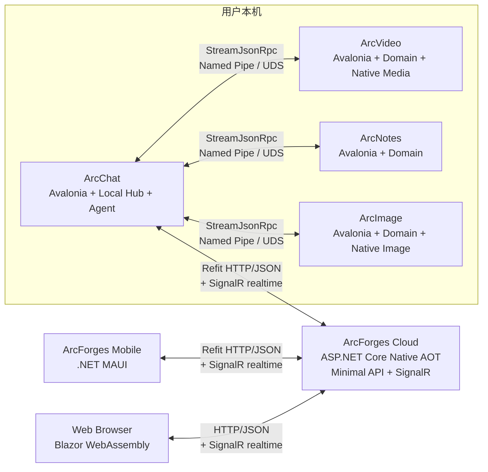
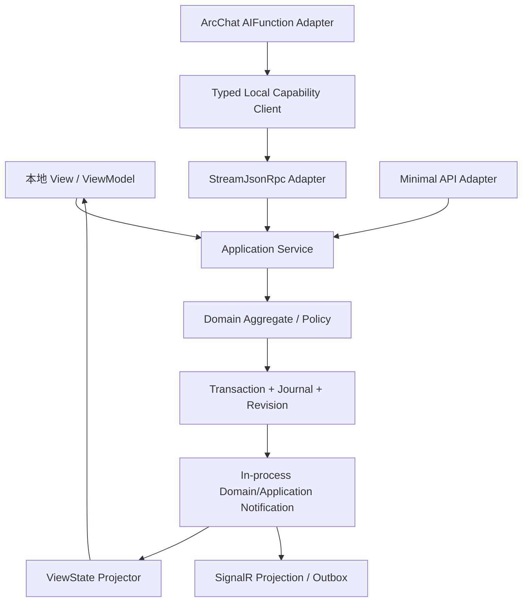
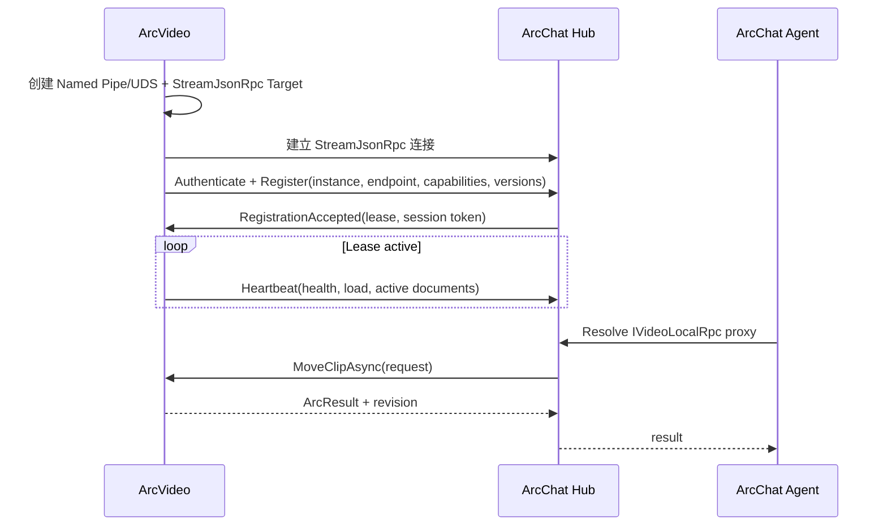
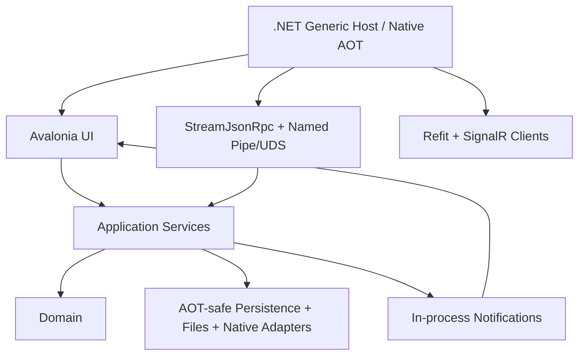

# ArcForges 全 C# 未来架构总纲

> 状态：目标架构 / 从零重写版  
> 技术基线核验日期：2026-07-20  
> 适用范围：ArcChat、ArcVideo、ArcNotes、ArcImage、ArcForges Cloud、移动端与 Web 前端  
> 关键词：.NET 10 LTS、C# 14、Native AOT、Avalonia、.NET MAUI、Blazor WebAssembly、ASP.NET Core Minimal API、Refit、StreamJsonRpc、SignalR、System.Text.Json、Nerdbank.MessagePack、P/Invoke、Interface Code First RPC

---

## 0. 文档结论

ArcForges 的未来架构统一为 **All C# / All .NET**，并把通信明确拆成三条互不混淆的主链路：

- **公网请求/响应 API：ASP.NET Core Minimal API + Refit + 标准 HTTP/JSON**；
- **本机进程间 RPC：StreamJsonRpc + 强类型 .NET Interface + Named Pipe/Unix Domain Socket**；
- **公网实时功能：ASP.NET Core SignalR**，只承担在线状态、通知、进度、聊天增量和远程桥接等实时会话；
- 云服务器使用 ASP.NET Core 与 C#，以 Native AOT 兼容的 Minimal API/SignalR 子集为默认基线；
- Windows、macOS、Linux 桌面端使用 Avalonia 与 C#，以 Native AOT 发布为目标；
- Android、iOS 移动端使用 .NET MAUI 与 C#；iOS 使用 Native AOT，Android 在 .NET 10 下需要区分“Mono AOT”与仍属实验性的“Native AOT”；
- Web 前端使用 Blazor WebAssembly，并在需要时启用 WASM AOT；严格全 AOT 目标下不把 Blazor Server/Interactive Server 作为核心运行模式；
- 公网 DTO 使用 `System.Text.Json` Source Generation；Refit 客户端必须走 generated-only 路径；
- 本机 StreamJsonRpc 契约是真正的 **Interface Code First RPC**：客户端代理与服务端实现围绕同一接口契约工作；
- 本机 StreamJsonRpc 在 Native AOT 下默认使用 `NerdbankMessagePackFormatter` + 生成式 TypeShape；需要 UTF-8 JSON 时才使用 `SystemTextJsonFormatter` + `JsonSerializerContext`，并接受其更严格的 AOT 限制；
- 原生编解码、GPU、媒体和系统能力通过 `[LibraryImport]`/P/Invoke 直接进入所属应用进程；
- 不再设计、构建或部署 C++ Worker；
- 不再使用 Aeron.NET、MagicOnion、gRPC/Protobuf 作为 ArcForges 主通信层；
- 不再设置一个持有全部产品业务状态的中央 Service 进程。

“单进程”在本文中的准确含义是：**每个产品实例是一个完整、自治的 C# OS 进程，原生库也在该进程内运行**。它不意味着把 ArcChat、ArcVideo、ArcNotes、ArcImage 和云服务器合并成同一个操作系统进程。

ArcChat 默认承载本机 Hub，但 Hub 只管理平台级目录、路由、权限、审批、协调和审计。每个产品仍拥有自己的领域状态、数据库、资源、UI、撤销栈和恢复日志。跨应用调用通过 StreamJsonRpc 强类型能力契约完成，Hub 不接管产品内部状态。

这不是把 JVM 版本逐行翻译成 C#，而是保留其正确的产品边界、状态所有权和能力模型，再用现代 .NET 技术重新实现。

### 0.1 “全 AOT”的定义与当前现实边界

本文把“全 AOT”分成两个层次，避免把术语混为一谈：

1. **架构目标**：所有生产主路径都必须可静态分析、禁止运行时代码生成、禁止依赖动态代理/Reflection.Emit，并持续通过 trimming/AOT analyzer 与真实发布构建；
2. **严格 Native AOT**：宿主最终由 CoreCLR Native AOT 直接生成原生可执行文件。

截至 2026-07-20，严格 Native AOT 仍有两个必须正视的边界：

- .NET MAUI Android 的 Native AOT 在 .NET 10 仍不是应无条件作为生产主基线的能力；Android Release 可使用 Mono AOT，但这不等同于 CoreCLR Native AOT；
- EF Core 的 Native AOT 支持仍不适合作为严格生产基线，因此严格全 AOT 的 Cloud/桌面持久化路径不能把 EF Core 运行时作为不可替代依赖。

因此本文的硬性原则是：**通信层本身必须 AOT-safe；任何阻止宿主 Native AOT 的基础设施依赖都要被替换、隔离为构建/迁移工具，或明确列为平台暂时例外。**

## 1. 为什么要这样重写

### 1.1 保留的产品本质

从现有 ArcForges 产品设计中必须保留以下事实：

1. **每个产品都是完整应用，而不是中央服务的薄壳。**  
   ArcVideo 能独立剪辑和保存，ArcNotes 能独立编辑和检索，ArcImage 能独立处理图像，ArcChat 能独立聊天和运行 Agent。

2. **本地体验不依赖 Hub 在线。**  
   ArcChat 或 Hub 不可用时，其他应用仍可打开、编辑、导出和恢复本地文档；恢复连接后重新注册能力即可。

3. **状态归属明确。**  
   谁拥有文档，谁负责它的事务、版本、撤销、日志、快照和资源生命周期。

4. **本地 UI 与远程命令走同一条应用服务路径。**  
   StreamJsonRpc/Refit 都只是入口适配器，不能另建一套业务逻辑，更不能直接操作 ViewModel 或控件。

5. **跨应用调用是语义能力，不是远程 UI 操作。**  
   调用方请求“移动片段”“插入图片”“导出文档”，而不是请求“点击某按钮”或“修改某控件属性”。

6. **大资源留在所有者一侧。**  
   视频帧、GPU 纹理、模型文件和大型附件不穿过 Hub；跨边界只传 ResourceRef、任务句柄和受控流。

### 1.2 删除的旧思路

以下设计不再属于目标架构：

- 中央 C# Service 持有全部产品状态；
- Avalonia 客户端只是展示层；
- Aeron.NET 负责主 RPC；
- MagicOnion/gRPC/Protobuf 作为 ArcForges 主 RPC；
- 公网客户端使用非标准二进制 RPC 取代普通 HTTP/JSON；
- 本机 IPC 为了“统一协议”而额外启动 Kestrel/HTTP/2；
- 每个应用再启动一个 C++ Worker；
- 通过共享内存在 C# 与 C++ Worker 之间搬运帧；
- 用 `invoke(string capability, Dictionary<string, object>)` 作为实际调用协议；
- RPC 服务直接调用 ViewModel、Dispatcher 或控件；
- Hub 代理所有文件、媒体帧和大对象；
- 为追求 AOT 仍保留运行时动态代理、Reflection.Emit、contractless 序列化或未验证的反射回退。

### 1.3 目标

- 统一语言、工具链、依赖注入、日志、测试和工程规范；
- 保持产品自治，同时提供一致的跨应用协作体验；
- 公网使用标准 HTTP/JSON，便于调试、代理、缓存、观测、版本治理和第三方接入；
- 本机使用 StreamJsonRpc 强类型接口代理，得到真正的 Interface Code First RPC，而不是手写 method string；
- 实时公网能力统一使用 SignalR，但不把 SignalR 当数据库、可靠队列或唯一状态源；
- 所有通信 DTO、代理和序列化都走源码生成或显式静态元数据，消除 AOT 反射回退；
- 将领域层与 UI、传输、数据库、原生库彻底隔离；
- 让故障边界、版本兼容、安全边界和恢复路径可以被测试；
- 默认以模块化单体起步，避免过早微服务化；
- 保留将来拆分服务或增加隔离进程的接口，但不预先支付复杂度。

### 1.4 非目标

- 不是所有 UI 共享同一套 XAML；
- 不是所有平台产出同一种发布包；
- 不是用 SignalR 替代所有 HTTP API；
- 不是让 Refit 接口成为服务端领域接口；Refit 是公网客户端契约层；
- 不是让 StreamJsonRpc 暴露到公网；
- 不是把 JSON-RPC method string 当业务代码的主要调用方式；业务层必须使用强类型代理；
- 不是一个数据库服务所有产品；
- 不是把本机 IPC 暴露为公网 API；
- 不是允许任意第三方原生插件进入主进程；
- 不是用一个巨型 `ArcForges.Contracts` 程序集耦合全部产品；
- 不是声称当前所有 MAUI Android 生产包都已经是 CoreCLR Native AOT。

## 2. 2026 技术基线与版本策略

截至 2026-07-20，目标基线如下。版本号是架构决策时已核验的稳定基线；预览版不进入稳定主链路。

| 层级 | 技术 | 核验基线 | 决策 |
|---|---|---:|---|
| 语言与运行时 | C# / .NET | C# 14 / .NET 10 LTS | 全产品统一基线 |
| SDK | .NET SDK | 10.0.x 稳定 feature band | `global.json` 固定仓库实际验证版本 |
| 云服务 | ASP.NET Core | .NET 10 | Native AOT 兼容 Minimal API + SignalR 子集 |
| 公网 HTTP 客户端 | Refit | 13.1.0 stable | `AddRefitGeneratedClient` / `ForGenerated`，标准 HTTP/JSON |
| 本机 Interface RPC | StreamJsonRpc | 2.25.29 stable | Named Pipe/UDS；Source-generated proxy；部分 NativeAOT-safe，按本文限制使用 |
| 本机默认 formatter | Nerdbank.MessagePack | 1.2.36 stable | StreamJsonRpc 官方推荐的 NativeAOT 最安全路径；只作为本机 wire formatter |
| 公网 JSON | System.Text.Json | .NET 10 inbox | `JsonSerializerContext` 源生成；禁止反射兜底 |
| 公网实时 | ASP.NET Core SignalR | .NET 10 inbox | Native AOT 支持子集；AOT 下只用 JSON Hub protocol |
| 桌面 UI | Avalonia | 12.x 稳定线 | Windows/macOS/Linux；Native AOT 发布目标 |
| MVVM | CommunityToolkit.Mvvm | 8.4.x 稳定线 | ViewModel、命令和通知基础设施 |
| 移动 UI | .NET MAUI Controls | 10.0.80 stable | Android/iOS；iOS Native AOT，Android 单独看 AOT 模式 |
| Web UI | Blazor WebAssembly | ASP.NET Core 10 | 严格全 AOT 下优先 WASM AOT + 静态托管 |
| 云端数据库驱动 | Npgsql | 10.x 稳定线 | 严格 Native AOT 路径优先直接 ADO.NET/编译 SQL |
| ORM | EF Core | 10.x | Native AOT 仍属高风险/实验路径，不作为严格全 AOT 生产基线 |
| Agent | Microsoft Agent Framework | Microsoft.Agents.AI 1.13.x | 仅在通过 AOT 分析/发布验证的功能面启用 |
| AI 抽象 | Microsoft.Extensions.AI | 10.x | 模型、工具、遥测抽象 |
| 遥测 | OpenTelemetry | 1.x 稳定线 | Trace、Metric、Log 关联 |
| 更新与安装 | Velopack | 1.x | 桌面安装、增量更新与回滚候选；需逐平台 AOT 包验证 |

版本策略：

- SDK 由 `global.json` 固定，禁止 CI 与开发机漂移；
- NuGet 由 `Directory.Packages.props` 集中管理；
- 提交 `packages.lock.json`，CI 使用 locked mode；
- 同一发布列车只允许一套 Public Contracts、Local RPC Contracts 和 SignalR Contracts 主版本；
- Refit、StreamJsonRpc、Nerdbank.MessagePack 的补丁升级必须跑 AOT publish + trimming + 旧契约兼容矩阵；
- 不在业务项目中直接写散落的包版本号；
- 预览包不得进入稳定分支核心链路；
- `PublishAot=true` 的宿主把 IL2026/IL3050 等 AOT/trimming 警告视为阻断问题，禁止通过大面积 `UnconditionalSuppressMessage` 掩盖未知路径。

### 2.1 AOT 的真实边界

目标从“按宿主选择 AOT”升级为：**除明确平台例外外，生产宿主以 Native AOT 为默认设计约束**。

| 宿主 | 目标模式 | 当前约束与策略 |
|---|---|---|
| ArcForges Cloud API | Native AOT | Minimal API + Refit 对应 HTTP/JSON + SignalR JSON；不依赖 MVC/Razor runtime compilation；数据库使用 AOT-safe 驱动路径 |
| ArcChat Desktop | Native AOT | Avalonia + StreamJsonRpc；Agent/插件发现必须移除动态代码路径或静态注册 |
| ArcVideo Desktop | Native AOT | Avalonia + StreamJsonRpc + `[LibraryImport]`；原生媒体库本身不妨碍托管宿主 AOT |
| ArcNotes Desktop | Native AOT | Avalonia + StreamJsonRpc + AOT-safe 本地持久化 |
| ArcImage Desktop | Native AOT | Avalonia + StreamJsonRpc + `[LibraryImport]` |
| MAUI iOS | Native AOT | 正式路径；所有 Refit/SignalR DTO 必须源生成 |
| MAUI Android | Mono AOT 为生产基线；Native AOT 单独实验 | .NET 10 下不能把实验性 Android Native AOT 宣称为全平台稳定基线 |
| Blazor WebAssembly | WASM AOT | 生产热点/严格 AOT 构建启用；注意包体与构建时间 |

#### 2.1.1 StreamJsonRpc 的 Native AOT 定位

StreamJsonRpc 官方当前表述是 **“partially NativeAOT safe”**，不是“装包即 100% AOT-safe”。ArcForges 必须满足以下硬条件：

- 所有调用 `JsonRpc.Attach` 的项目链路设置 `<EnableStreamJsonRpcInterceptors>true</EnableStreamJsonRpcInterceptors>`；
- 所有 RPC 接口使用 `[JsonRpcContract]`；
- 所有 RPC 接口同时使用 `[GenerateShape(IncludeMethods = MethodShapeFlags.PublicInstance)]`；
- 独立 Contracts 程序集使用 `[assembly: ExportRpcContractProxies]`，让代理可直接激活；
- 多接口共用一个连接时，提前声明 `JsonRpcProxyInterfaceGroupAttribute` 所需组合；禁止运行时任意拼接未知接口；
- 本机默认 `NerdbankMessagePackFormatter`；若必须 UTF-8 JSON，则 `SystemTextJsonFormatter.JsonSerializerOptions.TypeInfoResolver` 必须绑定源生成 `JsonSerializerContext`；
- 添加服务端 target 使用 `RpcTargetMetadata` 生成路径，不使用需要运行时反射枚举方法的便利重载；
- 创建代理使用具体泛型或 `typeof`，不从未知运行时 Type 集合动态构造；
- AOT + `SystemTextJsonFormatter` 下禁止依赖 RPC marshalable objects；需要该能力时使用 Nerdbank.MessagePack 路径；
- 每个平台都跑真正的 `dotnet publish -p:PublishAot=true`，Debug/JIT 测试不算 AOT 验证。

#### 2.1.2 Refit 的 Native AOT 定位

Refit 13.1.0 的生成式路径足以作为 AOT 公网客户端基线，但 ArcForges 只允许：

- `RestService.ForGenerated<T>` 或 `AddRefitGeneratedClient<T>`；
- `SystemTextJsonContentSerializer` + 源生成 `JsonSerializerContext`；
- 不允许任何 Refit 运行时反射回退；若升级到提供 `Refit.Reflection` opt-in 包的版本，也不得把它引入生产 AOT 主路径；
- CI 将 Refit analyzer 中提示需要反射 request builder 的诊断升级为错误；若所用版本提供 RF006，则同样视为错误；
- 公开 API 接口的方法形状必须落在 generated request building 支持范围；
- 公网服务端仍是 ASP.NET Core Minimal API，**不是**“实现 Refit 接口”来伪装本机 RPC。

#### 2.1.3 SignalR 的 Native AOT 定位

SignalR 自 .NET 9 起支持客户端和服务端 Native AOT 场景，但 AOT 基线必须收窄：

- 只使用 JSON Hub protocol，并给所有 Hub DTO 提供 `System.Text.Json` 源生成元数据；
- Native AOT 服务端不使用 `Hub<T>` strongly typed hub；使用普通 `Hub` + 集中式方法名常量/生成包装器；
- 不依赖 AOT 不支持的 Hub 参数/返回类型组合；
- SignalR 只做实时层，断线后状态通过 Refit HTTP 查询 revision/sequence 恢复；
- 所有生产客户端都执行 AOT publish smoke test，而不是仅验证普通 JIT 连接。

#### 2.1.4 严格全 AOT 对数据层的影响

EF Core 的 Native AOT 支持截至本次核验仍不应作为严格生产基线。若 ArcForges 坚持 Cloud/Desktop 主宿主严格 Native AOT：

- Cloud 默认 Npgsql ADO.NET + 显式/生成式 SQL；Dapper.AOT 可作为经过 PoC 后的增强层；
- 本地 SQLite 默认使用 AOT-safe ADO.NET 路径与显式 SQL/生成式映射；
- schema migration 可由构建/部署阶段工具执行，但生产主宿主不因此引入动态 ORM 运行时；
- 若未来 EF Core Native AOT 达到稳定生产级，再通过 ADR 重新评估，而不是现在为“代码方便”破坏全 AOT 目标。

## 3. 产品拓扑

### 3.1 总体拓扑



通信规则只有三条：

1. **同机进程边界**：StreamJsonRpc；
2. **公网命令/查询**：Refit 生成的标准 HTTP/JSON 客户端；
3. **公网实时事件**：SignalR。

禁止为了“统一”让本机走 HTTP，也禁止为了“实时”让业务写命令只存在于 SignalR 消息里。

### 3.2 ArcChat

ArcChat 是：

- 完整聊天产品；
- 本机 Agent 入口；
- 默认本机 Hub 宿主；
- 能力目录、实例目录、权限和审批协调者；
- 跨应用 Saga 与审计的发起者；
- 云端同步和可选远程桥接的出口；
- 本机 StreamJsonRpc 连接管理器；
- 公网 Refit/SignalR 客户端宿主。

ArcChat 不是：

- 全部产品的数据库；
- 视频帧和图片内容的代理；
- 其他应用领域状态的权威来源；
- 其他应用的隐藏 UI 线程；
- 所有命令都必须经过的单点。

ArcChat 自己提供的能力在进程内直接调用应用服务，不做“自己 RPC 自己”。其他应用能力通过 Hub 保存的强类型 StreamJsonRpc 代理调用。

### 3.3 ArcVideo

ArcVideo 是独立桌面应用，拥有：

- 项目、时间线、轨道、片段、效果、标记等领域模型；
- 媒体索引、代理文件和渲染任务；
- 本地数据库、命令日志、快照和撤销栈；
- Avalonia UI 与本进程 ViewModel；
- FFmpeg 或其他原生媒体库的 P/Invoke 适配层；
- 对外的 `IVideoLocalRpc` 等版本化 StreamJsonRpc 能力接口。

跨应用可以请求 ArcVideo 导入资源、移动片段、创建标记或导出成品，但不能获得裸 GPU 句柄、任意原生指针或内部可变实体引用。

### 3.4 ArcNotes

ArcNotes 是独立知识与文档应用，拥有：

- 笔记本、文档、块、链接、标签和索引；
- 本地搜索与可选向量索引；
- 附件 ResourceRef；
- 本地数据库、日志、快照和撤销栈；
- Avalonia UI；
- `INotesLocalRpc` 等语义能力。

### 3.5 ArcImage

ArcImage 是独立图像应用，拥有：

- 画布、图层、蒙版、滤镜、历史和导出配置；
- 图像缓存与 GPU/CPU 资源；
- 原生编解码或 GPU 库的 P/Invoke 适配层；
- 本地数据库、日志、快照和撤销栈；
- Avalonia UI；
- `IImageLocalRpc` 等语义能力。

### 3.6 ArcForges Cloud

云端承担：

- 账户、组织、设备和授权；
- 标准 HTTP/JSON Public API；
- SignalR 实时连接、通知、在线状态和远程桥接；
- 跨设备会话与消息；
- 同步元数据、冲突协调和云端资源索引；
- AI Provider 接入、配额和审计；
- 移动端与 Web API；
- 服务端任务与通知。

第一阶段使用模块化单体。公开命令/查询进入 Minimal API/Application Service；实时事件从提交后的 outbox/应用通知投递到 SignalR。只有当独立扩容、隔离、安全或团队所有权有实证需求时，才把模块拆成服务。

### 3.7 移动端与 Web

- MAUI 是云端客户端，不直接发现或连接用户局域网中的桌面 Hub；
- MAUI 公网请求/响应通过 Refit generated-only HTTP/JSON；实时通过 SignalR；
- Web 浏览器只连接 ArcForges Cloud；Blazor WebAssembly 使用普通 HTTP/JSON 与 SignalR；
- 远程控制桌面如要实现，必须由桌面 ArcChat 主动建立公网 SignalR 出站连接，并经过用户可见的设备授权、审批和撤销；
- 远程控制的持久命令/结果仍落入 HTTP/API 或持久任务状态，SignalR 只是实时投递和唤醒通道；
- 移动和 Web 共享 DTO 与应用语义，不强行共享 UI 实现。

## 4. 状态所有权与一致性

### 4.1 唯一所有者原则

| 状态 | 权威所有者 | 禁止的副本 |
|---|---|---|
| 视频项目与时间线 | ArcVideo 实例 | Hub 中的可写镜像 |
| 笔记与知识图谱 | ArcNotes 实例 | ArcChat 中的业务数据库副本 |
| 图像工程与图层 | ArcImage 实例 | 云端未经同步协议的可写副本 |
| 聊天会话与本地 Agent 会话 | ArcChat | 其他桌面应用中的影子会话 |
| 在线实例与能力目录 | ArcChat Hub | 每个应用各自维护全局目录 |
| 云账户、组织、设备 | ArcForges Cloud | 本机应用自封的权威账户状态 |
| 本地权限授予与审批记录 | ArcChat Hub | Provider 自行静默授权 |

允许缓存，但缓存必须：

- 标注来源与 revision；
- 可丢弃并重新获取；
- 不能被当作权威写入点；
- 不跨越安全权限扩大可见范围。

### 4.2 本地与远程统一写路径



约束：

- StreamJsonRpc Adapter 只做本机身份、输入验证、DTO 映射、取消传递和应用服务调用；
- Minimal API Adapter 只做公网认证授权、HTTP 语义、JSON DTO 与应用服务调用；
- SignalR Hub 不直接改领域状态；需要写入时调用同一 Application Service，且必须保留 CommandId/revision 语义；
- ViewModel 只消费 ViewState 和调用本地 Facade；
- 应用服务不引用 Avalonia、MAUI、Blazor、Refit、StreamJsonRpc、SignalR 或控件类型；
- 领域层不引用数据库 Provider、传输库、文件系统和原生句柄；
- 本地点击、本机 RPC 和公网 HTTP 命令必须产生相同领域命令、revision、日志和通知；
- UI 更新由所属进程内投影器完成，远程调用方不能直接调度对方 UI。

### 4.3 一致性级别

- 单文档内命令：本地事务强一致；
- 同一应用多文档：优先每文档事务，以应用级 Saga 协调；
- 跨应用：最终一致，使用 Saga、幂等命令、补偿与可见状态；
- 公网 HTTP：成功响应只代表服务端已按定义完成/接受；长任务返回 TaskHandle；
- SignalR：只提供实时可见性，不提供唯一可靠事实；断线后必须通过 HTTP revision/sequence 补齐；
- 跨设备：基于同步协议和 revision，禁止把数据库文件当同步单元；
- Agent 多步操作：每一步均为普通受控能力调用，失败可观察、可恢复、可审批。

## 5. 解决方案与代码边界

### 5.1 建议仓库布局

```text
ArcForges/
├─ global.json
├─ Directory.Build.props
├─ Directory.Packages.props
├─ NuGet.config
├─ ArcForges.slnx
├─ eng/
│  ├─ build/
│  ├─ packaging/
│  └─ versioning/
├─ src/
│  ├─ BuildingBlocks/
│  │  ├─ ArcForges.Foundation/
│  │  ├─ ArcForges.Application.Abstractions/
│  │  ├─ ArcForges.Persistence/
│  │  ├─ ArcForges.Observability/
│  │  └─ ArcForges.NativeInterop/
│  ├─ Contracts/
│  │  ├─ ArcForges.Contracts.Foundation/
│  │  ├─ ArcForges.Contracts.LocalRpc/
│  │  ├─ ArcForges.Contracts.PublicApi/
│  │  └─ ArcForges.Contracts.Realtime/
│  ├─ ArcChat/
│  │  ├─ ArcChat.Domain/
│  │  ├─ ArcChat.Application/
│  │  ├─ ArcChat.Infrastructure/
│  │  ├─ ArcChat.LocalRpc/
│  │  ├─ ArcChat.CloudClient/
│  │  ├─ ArcChat.Desktop/
│  │  └─ ArcChat.Tests/
│  ├─ ArcVideo/
│  ├─ ArcNotes/
│  ├─ ArcImage/
│  ├─ Cloud/
│  │  ├─ ArcForges.Cloud.Host/
│  │  ├─ ArcForges.Cloud.PublicApi/
│  │  ├─ ArcForges.Cloud.Realtime/
│  │  ├─ ArcForges.Cloud.Modules.Identity/
│  │  ├─ ArcForges.Cloud.Modules.Chat/
│  │  ├─ ArcForges.Cloud.Modules.Sync/
│  │  └─ ArcForges.Cloud.Modules.Agent/
│  ├─ Mobile/
│  │  └─ ArcForges.Mobile/
│  └─ Web/
│     └─ ArcForges.Web.Client/
├─ native/
│  ├─ media-abi/
│  └─ image-abi/
├─ tests/
│  ├─ ArchitectureTests/
│  ├─ ContractCompatibilityTests/
│  ├─ PublicApiContractTests/
│  ├─ LocalRpcAotTests/
│  ├─ RealtimeReconnectTests/
│  ├─ EndToEndTests/
│  └─ NativeAbiTests/
└─ docs/
```

这是逻辑布局，不要求一次性移动所有现有目录。迁移期间允许产品按垂直切片逐步落位。

### 5.2 引用方向

```text
Desktop / LocalRpc / Infrastructure ─┐
                                     ├─> Application ─> Domain
MinimalApi / MAUI / WASM Adapter    ─┘

Contracts.Foundation <- Contracts.LocalRpc
Contracts.Foundation <- Contracts.PublicApi
Contracts.Foundation <- Contracts.Realtime
```

硬性规则：

- Domain 不能引用 Application、Infrastructure、UI 或 Contracts；
- Application 只能依赖 Domain 和少量抽象；
- Infrastructure 实现 Application 定义的端口；
- Local RPC DTO/Public API DTO 不直接成为领域实体；
- UI Model 不直接成为传输 DTO；
- Refit 接口只能存在于 PublicApi Client Contract 边界；
- StreamJsonRpc 接口只能存在于 LocalRpc Contract 边界；
- SignalR Hub DTO 不能被当作持久领域事件本体；
- LocalRpc Contracts 不被浏览器或 Cloud Host 引用；
- PublicApi Contracts 不暴露本机 IPC、原生句柄和桌面实现细节。

### 5.3 为什么拆分 Contracts

`ArcForges.Contracts.Foundation` 只包含：

- 稳定 ID：AppId、InstanceId、DocumentId、ResourceId、CommandId、TaskId；
- revision/version 基础类型；
- `ArcResult<T>`、`ArcError`；
- `ResourceRef`、TaskSnapshot 等跨域稳定值；
- 分页、时间和基础枚举。

`ArcForges.Contracts.LocalRpc` 包含：

- Hub 注册、发现、租约、审批和本机路由；
- ArcVideo、ArcNotes、ArcImage、ArcChat 的 StreamJsonRpc 强类型接口；
- `[JsonRpcContract]`、`GenerateShape` 所需静态契约元数据；
- 本机连接事件和通知契约。

`ArcForges.Contracts.PublicApi` 包含：

- 账户、设备、聊天、同步、云任务、资源和审批 DTO；
- Refit 客户端接口及 HTTP route/version 定义；
- `System.Text.Json` 源生成上下文；
- 不包含服务端 Application/Domain 实现。

`ArcForges.Contracts.Realtime` 包含：

- SignalR 方法名常量；
- 通知、在线状态、任务进度、聊天增量和桥接 envelope DTO；
- sequence/revision 恢复信息；
- `System.Text.Json` 源生成上下文。

所有契约项目以 AOT/trimming 兼容为硬门槛，并且不引用 UI、ORM、数据库 Provider、原生库或具体宿主。

## 6. StreamJsonRpc Interface Code First RPC

### 6.1 为什么本机选 StreamJsonRpc

StreamJsonRpc 是 ArcForges **唯一主本机 RPC 层**。选择它不是因为“JSON 好看”，而是因为它直接匹配本机多进程 C# 架构：

- RPC API 可以直接定义为 .NET interface；
- 客户端通过 `Attach<T>()` 得到强类型代理；
- Provider 可以直接实现同一接口，形成真正的 Interface Code First；
- 同一全双工连接双方都可以发起调用和通知；
- transport 与协议解耦，可直接跑在 `Stream`、Named Pipe、Unix Domain Socket、WebSocket 等双向通道上；
- 不需要为了本机 RPC 启动 Kestrel、HTTP/2 或占用 TCP 端口；
- 有 Source Generator/Analyzer，可在受约束方式下用于 Native AOT。

但必须明确：**StreamJsonRpc 官方当前只称自己“partially NativeAOT safe”**。ArcForges 的可用性来自严格遵守生成式路径，而不是假设所有 API 都天然 AOT-safe。

### 6.2 契约样式：接口就是本机 RPC 源

```csharp
using PolyType;
using StreamJsonRpc;

[JsonRpcContract]
[GenerateShape(IncludeMethods = MethodShapeFlags.PublicInstance)]
public partial interface IVideoLocalRpc : IDisposable
{
    Task<ArcResult<MoveClipResponse>> MoveClipAsync(
        MoveClipRequest request,
        CancellationToken cancellationToken);

    Task<TaskHandle> StartRenderAsync(
        StartRenderRequest request,
        CancellationToken cancellationToken);

    event EventHandler<VideoRpcEvent> Changed;
}
```

服务端实现同一接口：

```csharp
public sealed class VideoLocalRpcService(
    MoveClipHandler moveClipHandler,
    RenderHandler renderHandler,
    ILocalRpcIdentityAccessor identity)
    : IVideoLocalRpc
{
    public event EventHandler<VideoRpcEvent>? Changed;

    public async Task<ArcResult<MoveClipResponse>> MoveClipAsync(
        MoveClipRequest request,
        CancellationToken cancellationToken)
    {
        var actor = identity.RequireActor();
        return await moveClipHandler.HandleAsync(request, actor, cancellationToken);
    }

    public Task<TaskHandle> StartRenderAsync(
        StartRenderRequest request,
        CancellationToken cancellationToken)
        => renderHandler.StartAsync(request, identity.RequireActor(), cancellationToken);

    public void Dispose() { }
}
```

客户端只看到接口：

```csharp
IVideoLocalRpc video = rpc.Attach<IVideoLocalRpc>();
var result = await video.MoveClipAsync(request, cancellationToken);
```

这就是本文所说的 **Interface Code First RPC**：

- 接口是编译期契约源；
- 业务调用不写 `"video.moveClip"` 之类 method string；
- Analyzer 可以在编译期检查不支持的接口形状；
- Source Generator 为 AOT 生成代理；
- 服务端仍只是 Adapter，最终调用 Application Service。

### 6.3 StreamJsonRpc 接口硬规则

按照当前强类型代理约束，ArcForges 本机 RPC 接口必须：

- 标记 `[JsonRpcContract]`；
- 标记 `[GenerateShape(IncludeMethods = MethodShapeFlags.PublicInstance)]`；
- 声明为 `partial interface`；
- 不包含 properties；
- 不包含 generic methods；
- 方法返回 `Task`、`Task<T>`、`ValueTask`、`ValueTask<T>` 或经过验证的 `IAsyncEnumerable<T>`；
- `CancellationToken` 若存在必须放在最后；
- 事件只使用 `EventHandler`/`EventHandler<T>`；
- 建议接口继承 `IDisposable`，让代理生命周期明确；
- 对外方法避免重载，避免 CLR 重命名造成难以审计的 wire contract 变化；
- 每个写方法使用 request DTO，必须包含 CommandId、DocumentId/ResourceId 和 ExpectedRevision 等必要并发字段；
- 不传 `object`、`dynamic`、`Type`、任意 Dictionary object graph、DbContext、EF Entity、ViewModel、控件、原生指针或 `SafeHandle`。

接口方法名本身属于协议兼容面。若需要长期稳定 wire name，可使用显式 JSON-RPC 方法命名特性或 V2 接口策略，但不能在发布后随意重命名公共方法。

### 6.4 Native AOT：必须开启生成式代理拦截

所有会创建 StreamJsonRpc 代理的项目，包括间接依赖项目，必须启用：

```xml
<PropertyGroup>
  <PublishAot>true</PublishAot>
  <IsAotCompatible>true</IsAotCompatible>
  <EnableStreamJsonRpcInterceptors>true</EnableStreamJsonRpcInterceptors>
</PropertyGroup>
```

`EnableStreamJsonRpcInterceptors=true` 的意义是：

- `JsonRpc.Attach<T>()` 不再静默退回任意动态代理；
- 对没有源生成代理的接口请求会尽早失败；
- AOT 构建可以把“漏掉契约生成”变成可测试错误。

独立 Contracts 程序集建议直接导出代理：

```csharp
using StreamJsonRpc;

[assembly: ExportRpcContractProxies]
```

在 ArcForges 中把它升级为**默认硬规则**。这样 AOT 宿主可以直接构造生成代理，避免通过反射寻找/激活不可见代理。

### 6.5 多接口共用一个连接

一个本机进程连接通常会同时需要：

- `IHubControlRpc`；
- `IVideoLocalRpc` / `INotesLocalRpc` 等产品接口；
- 可能的回调/事件接口。

规则：

- 一个 transport 只创建一个 `JsonRpc` 实例；
- 禁止对同一个 Stream 多次调用静态 `JsonRpc.Attach<T>(stream)`，因为每次都会创建独立 `JsonRpc`；
- 需要多个代理时先创建一个 `JsonRpc`，再调用实例 `rpc.Attach<T>()`；
- Native AOT 下需要的多接口组合必须通过 `JsonRpcProxyInterfaceGroupAttribute` 预生成；
- 可在评估后设置 `AcceptProxyWithExtraInterfaces=true` 降低组合爆炸，但必须有契约测试覆盖；
- 禁止运行时扫描程序集并“发现所有接口后动态 Attach”。

这也是为什么本地 Contracts 要小而稳定，而不是做成一个无限增长的巨型程序集。

### 6.6 formatter：AOT 默认选择 Nerdbank.MessagePack

虽然库名叫 StreamJsonRpc，但 JSON-RPC 消息模型并不要求 wire bytes 一定是 JSON 文本。

为满足全 AOT，ArcForges 本机默认：

```csharp
static IJsonRpcMessageFormatter CreateLocalRpcFormatter()
    => new NerdbankMessagePackFormatter
    {
        TypeShapeProvider = LocalRpcTypeShapeWitness.GeneratedTypeShapeProvider,
    };

[GenerateShapeFor<MoveClipRequest>]
[GenerateShapeFor<MoveClipResponse>]
[GenerateShapeFor<ArcResult<MoveClipResponse>>]
internal partial class LocalRpcTypeShapeWitness;
```

理由：StreamJsonRpc 官方明确把 `NerdbankMessagePackFormatter` 描述为 NativeAOT 下“best and safest experience”，并且它能在 NativeAOT 下支持 RPC marshalable objects。

这里的 MessagePack **只是一种本机 wire formatter**：

- 它不是 ArcForges 公网 API；
- 它不是跨语言 IDL；
- 它不取代 HTTP/JSON；
- 它不要求业务领域以 MessagePack attribute 为中心设计。

### 6.7 若本机必须使用 UTF-8 JSON

只有调试互操作或明确需求时使用：

```csharp
[JsonSerializable(typeof(MoveClipRequest))]
[JsonSerializable(typeof(MoveClipResponse))]
[JsonSerializable(typeof(ArcResult<MoveClipResponse>))]
internal partial class LocalRpcJsonContext : JsonSerializerContext;

static IJsonRpcMessageFormatter CreateJsonFormatter()
    => new SystemTextJsonFormatter
    {
        JsonSerializerOptions =
        {
            TypeInfoResolver = LocalRpcJsonContext.Default,
        },
    };
```

必须同时遵守：

- 所有 RPC DTO 都进入 `JsonSerializerContext`；
- 不使用默认 `JsonMessageFormatter`，因为它基于 Newtonsoft.Json 且不是本文 AOT 基线；
- 不依赖 `SystemTextJsonFormatter` 下 NativeAOT 不安全的 RPC marshalable objects；
- 不在生产里通过 `JsonSerializerOptions` 运行时 resolver 扫描未知类型；
- 对每一个新 DTO 都有 AOT publish 测试。

因此本机默认仍是 Nerdbank.MessagePack；公网标准协议才统一 HTTP/JSON。

### 6.8 服务端 target 注册：禁止反射便利路径

Native AOT 服务端 target 使用生成式 metadata：

```csharp
var metadata = RpcTargetMetadata.FromShape<IVideoLocalRpc>();
rpc.AddLocalRpcTarget(metadata, videoService, options: null);
rpc.StartListening();
```

规则：

- 所有 target 在 `StartListening()` 前注册完成；
- 使用 `RpcTargetMetadata`/TypeShape 生成路径；
- 不使用依赖运行时反射枚举目标方法的重载作为生产主路径；
- target 生命周期与本机连接/应用生命周期明确；
- RPC Adapter 不持有 UI 对象。

### 6.9 framing 与 transport

本机二进制默认：

```csharp
var handler = new LengthHeaderMessageHandler(
    sendingStream,
    receivingStream,
    CreateLocalRpcFormatter());

var rpc = new JsonRpc(handler);
```

UTF-8 JSON 可使用合适的 header-delimited handler。

Transport 选择：

- Windows：Named Pipe；创建 pipe 时必须使用异步选项，避免 async RPC 出现阻塞/挂起；
- Linux/macOS：Unix Domain Socket；包装为全双工 Stream；
- 测试：`FullDuplexStream` 或进程内 loopback；
- 不使用固定 TCP 端口作为正式本机发现方案。

### 6.10 双向调用、事件与回调

StreamJsonRpc 是对等全双工协议，双方都可以发起调用。ArcForges 使用原则：

- 命令/查询：强类型方法；
- 低频连接级通知：接口 event 或显式 callback contract；
- 高频状态流：优先 revision + delta，必要时经过验证后使用 `IAsyncEnumerable<T>`；
- 大文件/视频帧：绝不作为普通 RPC DTO 连续推送，使用 ResourceRef/受控 stream；
- 事件永远不是持久事实，掉线恢复仍靠 revision/journal 查询。

### 6.11 并发、顺序与死锁

不能把 StreamJsonRpc 理解成“天然串行 Actor”。它支持并发 RPC，并且同步上下文行为不能替代领域级并发控制。

硬规则：

- 每个 DocumentSession/Timeline 使用 mailbox、AsyncLock 或单写者队列维护写顺序；
- 不依赖 RPC 到达顺序表达业务顺序；
- 不在持有领域锁时等待对端 callback；
- 双向回调不得形成 A 等 B、B 又同步等 A 的循环；
- Channel/queue 必须有容量上限和满载策略；
- 写命令永远依赖 ExpectedRevision + CommandId，而不是“这个连接上刚刚先发了另一个调用”。

### 6.12 断线、取消与重连

StreamJsonRpc 不替你实现业务重试。

- 连接断开时未完成调用可能以 `ConnectionLostException` 失败；
- 远端异常表现为 `RemoteInvocationException`，业务失败仍优先使用 `ArcResult<T>`；
- 正常取消表现为 `OperationCanceledException`；
- 监听 `Completion`/`Disconnected` 更新连接状态；
- 可按场景启用连接关闭时取消本地正在执行的 RPC，但长业务任务不能仅靠连接生命周期决定是否取消；
- 重连使用指数退避 + jitter；
- 查询可安全重试；
- 写命令只有携带 CommandId 并由 Provider 实现幂等后才能重试；
- 重连后重新认证、注册能力，并按 revision/sequence 补齐状态。

### 6.13 错误模型

分离三类失败：

1. **连接/协议失败**：`ConnectionLostException`、method not found、invalid params；
2. **远端执行异常**：`RemoteInvocationException`，不向客户端泄漏服务端堆栈和敏感路径；
3. **业务失败**：`ArcResult<T>` / `ArcError`，包含稳定 code、message key、可选 details、correlationId。

调用方只按稳定 code 做业务逻辑，不解析人类错误文本。

### 6.14 安全

StreamJsonRpc 本身不是认证授权系统。

- Named Pipe ACL/UDS 文件权限先限制 OS 用户；
- 建连后第一阶段完成 Hub session handshake；
- session token 不写进公开 endpoint manifest；
- token 绑定 appId、instanceId、endpoint、buildId、contractSet 和过期时间；
- 每个写调用继续携带/解析 actor 与 scope；
- Provider 在最终执行点再次授权；
- 不可信客户端即使能连上 pipe/socket，也不能因为“本机”就自动拥有全部能力。

### 6.15 版本兼容

发布后：

- 同一主版本内不随意重命名公开接口和方法；
- DTO 新增字段必须保持 formatter 的前后兼容策略；
- 破坏性变化创建 `IVideoLocalRpcV2` 等新接口，让 V1/V2 共存一个迁移窗口；
- Hub 注册携带 `contractSet`、semanticVersion、buildId、features；
- 调用前做 capability/version 协商；
- 合同兼容测试保留上一稳定版本的客户端程序集、序列化金样本和 AOT 发布产物；
- AOT proxy generation 失败属于 CI 阻断，不允许线上退回动态代理。

### 6.16 StreamJsonRpc AOT 最终检查表

每个 Local RPC 合并前必须回答：

- [ ] 接口是否 `[JsonRpcContract]` + `GenerateShape(PublicInstance)` + `partial`？
- [ ] Contracts 程序集是否导出生成代理？
- [ ] 所有 Attach 调用链是否启用 `EnableStreamJsonRpcInterceptors`？
- [ ] 是否没有动态 interface/type discovery？
- [ ] 多接口组合是否预生成？
- [ ] formatter 是否为 Nerdbank.MessagePack，或 STJ + `JsonSerializerContext`？
- [ ] target 是否通过 `RpcTargetMetadata` 生成路径注册？
- [ ] 是否跑过真实 Native AOT publish 并启动一次 RPC round-trip？
- [ ] 是否测试断线、重连、重复 CommandId、revision 冲突和回调死锁？

## 7. 本机 IPC、发现和路由

### 7.1 传输选择

本机 StreamJsonRpc 直接运行在 OS IPC 的全双工 Stream 上，不再启动 Kestrel/HTTP/2：

| 平台 | 默认 IPC | 身份控制 | AOT 注意 |
|---|---|---|---|
| Windows | Named Pipe | 当前用户 ACL；必要时限制服务 SID/AppContainer | pipe 使用异步选项；不靠反射发现服务 |
| Linux | Unix Domain Socket | 私有 runtime 目录 + socket 文件权限 | socket 路径长度、清理 stale socket |
| macOS | Unix Domain Socket | 用户目录权限 + socket 文件权限 | 沙盒/签名场景单独验证容器路径 |
| 开发诊断 | `127.0.0.1` 随机端口，仅显式启用 | 仍需 session token | 不能成为生产默认 |

选择 OS IPC 的原因：

- 不占用固定 TCP 端口；
- 更容易绑定当前 OS 用户权限；
- 不需要同机 TLS 证书；
- 没有本机 Kestrel/gRPC 宿主，桌面 Native AOT 路径更简单；
- StreamJsonRpc 可以直接复用同一 Stream 完成双向 Interface RPC。

### 7.2 端点清单

每个应用启动时在当前用户私有 runtime 目录写入最小端点清单：

```json
{
  "appId": "arcvideo",
  "instanceId": "019f...",
  "processId": 18420,
  "transport": "named-pipe",
  "endpoint": "arcforges.arcvideo.019f...",
  "buildId": "2026.07.20.1",
  "contractSet": "local-rpc-v1",
  "startedAtUtc": "2026-07-20T10:00:00Z"
}
```

清单不是认证凭据。会话 token 不以明文写入清单；进程还要验证对端用户、预期进程、build/contract 和 Hub 发放的短期会话凭据。

### 7.3 注册生命周期



生命周期规则：

- 应用先启动自身 endpoint，再连接 Hub；
- Hub 不可用不阻止应用进入本地可用状态；
- Hub 按租约淘汰失联实例；
- 应用重连时使用新的 sessionId，幂等地替换旧注册；
- 同产品多实例同时存在，路由必须带 InstanceId 或 DocumentId；
- Hub 的 document routing index 只存“哪个实例当前打开哪个文档”，不存文档内容；
- 进程正常退出主动 unregister；崩溃依赖租约过期清理；
- 连接重建后必须重新 Attach 生成代理，旧 proxy 不复用。

### 7.4 路由

路由优先级：

1. 命令明确指定 InstanceId；
2. DocumentId 已绑定到在线实例；
3. 用户当前选定的默认 Provider；
4. 同类型唯一健康实例；
5. 否则返回 `ProviderSelectionRequired`，由用户或 Agent 选择。

Hub 不应在存在多个候选实例时静默随机路由。

### 7.5 健康与背压

Provider 上报：

- `Ready / Busy / Degraded / Draining`；
- 当前任务数、队列深度和可选负载等级；
- 支持的 contractSet 和 feature flags；
- 最近成功心跳和进程启动时间。

调用方必须处理 `Busy`、`RetryAfter` 和队列上限。无限队列不是容错策略。

### 7.6 连接管理器

每个产品只有一个基础设施组件负责 StreamJsonRpc connection lifecycle：

- 创建/监听 Named Pipe 或 UDS；
- 创建 formatter + message handler；
- 注册本地 target；
- `StartListening()`；
- 创建强类型 proxy；
- 监听 Completion/Disconnected；
- 指数退避重连；
- 重新认证/注册；
- 更新连接健康状态。

业务代码永远不直接 new pipe/socket/JsonRpc，也不直接写 method string。

## 8. 能力系统与 Agent

### 8.1 能力是语义接口

能力目录中可以有字符串 ID，例如：

```text
arcvideo.timeline.move-clip
arcvideo.export.render
arcnotes.document.insert-block
arcimage.canvas.apply-filter
```

字符串只用于：

- 发现；
- 搜索与展示；
- 权限策略；
- Agent 工具选择；
- 路由和审计。

实际调用必须落到已编译的强类型接口方法。禁止用一个万能 `InvokeAsync(string, object)` 绕过契约、权限和版本控制。

### 8.2 能力描述

每项能力至少包含：

- capabilityId 与 display metadata；
- provider app/instance；
- typed service/method identity；
- contract version 和 feature flags；
- 输入/输出摘要；
- 是否写入状态；
- 所需 scope；
- 风险级别；
- 是否必须用户确认；
- 是否支持 dry-run、undo、cancel；
- 资源大小、预计时长和并发限制。

### 8.3 Agent 运行位置

ArcChat 在同一 C# 进程内运行 Microsoft Agent Framework：

- `Microsoft.Agents.AI` 负责编排 Agent、会话和工具；
- `Microsoft.Extensions.AI` 抽象 Chat Client、Embedding、工具和遥测；
- Capability Registry 将强类型代理包装为 `AIFunction`；
- JIT 宿主允许必要的运行时工具发现，但稳定工具仍优先生成显式绑定；
- 模型输出永远先经过参数验证和授权，再调用 Provider。

### 8.4 Agent 不是超级用户

Agent 与人类 UI 使用相同应用服务和能力接口。它不能：

- 绕过 Scope；
- 伪造用户身份；
- 直接写其他产品数据库；
- 直接操作 ViewModel；
- 使用未注册原生函数；
- 在用户不知情时执行高风险导出、删除、发布或云共享。

### 8.5 审批

审批状态由 Hub 管理：

```text
Requested -> Presented -> Approved/Denied/Expired -> Executed/Failed
```

审批绑定：

- actor 与 device；
- capabilityId；
- 参数摘要或哈希；
- provider instance；
- 有效期；
- 风险级别；
- correlationId。

参数在审批后发生实质变化，必须重新审批。

---

## 9. Avalonia 桌面应用架构

### 9.1 每个桌面进程的内部结构



Generic Host 统一管理：

- 依赖注入；
- 配置与 Secret 引用；
- 日志和 OpenTelemetry；
- StreamJsonRpc endpoint/connection 生命周期；
- Refit HttpClient 与 SignalR HubConnection 生命周期；
- 数据库迁移检查和恢复；
- Native runtime 初始化；
- 有序关机。

Avalonia 生命周期与 Generic Host 生命周期必须协调：UI 关闭先进入 draining，停止接受新远程写命令，等待关键事务落盘，再停止 StreamJsonRpc endpoint、SignalR 连接和 native runtime。

Native AOT 额外约束：

- Avalonia XAML 尽量使用 compiled bindings；
- 禁止依赖运行时加载任意 XAML、动态代理或反射扫描插件作为核心路径；
- DI 注册优先显式/生成式，不把“扫描整个程序集自动注册”作为不可替代机制；
- 第三方 Avalonia 控件必须经过 trimming/AOT publish 验证；
- 每个桌面 RID 都真实发布 Native AOT 包并执行启动、打开文档、本机 RPC、云端 HTTP、SignalR round-trip smoke test。

### 9.2 MVVM

使用 CommunityToolkit.Mvvm，但不把 ViewModel 当领域对象：

- `ObservableObject` 只用于 ViewState；
- `[RelayCommand]` 只调用 Facade/Application Service；
- ViewModel 不持有数据库 connection/session；
- ViewModel 不持有裸 native pointer；
- 长任务通过 TaskProjection 展示进度；
- 领域通知经 ViewState Projector 转换后再切到 Avalonia UI 线程；
- 远程修改与本地修改产生同一种投影更新。

### 9.3 线程模型

- UI 线程只做布局、输入和轻量状态应用；
- CPU 密集计算进入受控调度器，不能随意 `Task.Run` 形成无限并发；
- I/O 全链路 async；
- Native callback 尽快复制最小元数据并交给托管队列；
- 每个文档/时间线用串行 mailbox 或 AsyncLock 保护写顺序；
- 不在持有领域锁时等待 StreamJsonRpc callback、UI Dispatcher 或长时间 native 调用；
- Channel 必须有容量和满载策略。

### 9.4 多窗口与多实例

- 一个进程可有多个窗口，但状态仍按 DocumentSession 分隔；
- 多进程打开同一文档必须有明确锁、只读或协同协议；
- OS 文件关联启动应先尝试路由到已有合适实例，再决定新建实例；
- InstanceId 每次启动唯一，AppId 稳定。

## 10. 文档、Revision 与并发

### 10.1 文档身份

- DocumentId 是稳定逻辑身份，不等于文件路径；
- 文件移动或重命名不改变 DocumentId；
- ResourceId 不复用；
- InstanceId 只表示当前运行实例；
- Revision 是某个文档权威所有者的单调递增版本。

### 10.2 写命令

每个写命令至少包含：

- CommandId；
- DocumentId；
- ExpectedRevision；
- Actor/Device 由认证上下文提供；
- CausationId、CorrelationId；
- 业务参数；
- 可选审批引用。

处理步骤：

1. 验证身份、权限和能力版本；
2. 检查 CommandId 是否已执行；
3. 检查 ExpectedRevision；
4. 执行领域规则；
5. 原子写入状态变化、命令记录和 journal；
6. 增加 revision；
7. 提交后发布本进程通知；
8. 返回 NewRevision 和最小 delta。

### 10.3 冲突

revision 不匹配时不做隐式 last-write-wins。返回：

- currentRevision；
- 可安全公开的冲突摘要；
- 是否可自动重放；
- 建议动作：刷新、rebase、用户合并或重新执行。

只有天然交换或幂等的操作才自动重放。

---

## 11. Undo / Redo

撤销属于文档所有者，不属于 Hub。

### 11.1 模型

- 每个成功可撤销命令产生 UndoRecord；
- UndoRecord 保存逆操作所需的领域信息，而不是 UI 快照；
- 远程、Agent 和本地 UI 命令进入同一历史；
- 审计记录与用户撤销历史分开；
- 不是每个命令都可撤销，导出、发送、发布等外部副作用使用补偿或明确不可撤销。

### 11.2 组合命令

Agent 或跨应用操作可用 transaction group/correlation group 聚合展示，但不能假装跨进程有 ACID 事务。跨应用撤销按 Saga 反向补偿，且每一步都可能失败并需要用户处理。

---

## 12. Journal、Snapshot 与崩溃恢复

### 12.1 本地持久化

每个桌面产品自行选择 SQLite/文件存储组合，但严格全 AOT 基线遵循：

- 生产主宿主不把 EF Core 运行时作为不可替代依赖；
- SQLite 使用经过 Native AOT publish 验证的 ADO.NET/显式 SQL 或生成式数据访问路径；
- connection/transaction 生命周期按工作单元，不做全局单例；
- WAL 模式只在经过平台和文件系统验证后启用；
- 写事务短小；
- schema migration 有独立版本与可回滚/前向恢复策略；
- 用户文档与缓存目录分离；
- 不在多个产品间共享可写数据库文件；
- 所有 serializer/mapper 必须可静态生成或显式注册，禁止 AOT 下运行时扫描实体类型。

### 12.2 Journal

Journal 记录足以恢复已确认命令的最小信息：

- sequence；
- commandId；
- previous/new revision；
- command type 与版本；
- payload 或持久化引用；
- checksum；
- actor/correlation/causation；
- committedAtUtc。

先保证落盘语义，再向 StreamJsonRpc/HTTP 调用方报告成功。SignalR 通知只能在提交后发出；即使实时通知丢失，也可由 revision/sequence 恢复。

### 12.3 Snapshot

- 按命令数、时间和体积创建快照；
- 快照有 schema version 和 checksum；
- 恢复从最近有效快照开始重放 journal；
- 快照写入使用临时文件、flush/fsync 策略和原子替换；
- 保留至少一个上一代已验证快照；
- 缓存可重建，不进入关键快照。

### 12.4 原生崩溃后的恢复

由于原生库与应用同进程，access violation 会终止整个应用。这是取消 Worker 后明确接受的故障边界。下次启动必须：

1. 检测非正常退出标记；
2. 校验最后事务和 journal；
3. 恢复到最后已提交 revision；
4. 隔离可能触发崩溃的媒体/插件/操作；
5. 向用户展示恢复报告与可选诊断包；
6. 重新注册本机 Hub，并重建 StreamJsonRpc 代理；
7. 重新建立公网 SignalR 会话并通过 Refit 查询缺失状态；
8. 不伪造未完成任务为成功。

## 13. 长任务模型

导入、索引、渲染、转码、模型下载和云同步不能作为长时间占用的本机 RPC 或 HTTP 请求。

### 13.1 TaskHandle

```csharp
public sealed partial record TaskHandle
{
    public required Guid TaskId { get; init; }
    public required string OwnerAppId { get; init; }
    public required string Kind { get; init; }
    public required DateTimeOffset CreatedAtUtc { get; init; }
}
```

同一个 DTO 若进入：

- StreamJsonRpc/Nerdbank.MessagePack：由 TypeShape source generation 覆盖；
- Refit/System.Text.Json：进入 `JsonSerializerContext`；
- SignalR JSON：进入对应 Realtime `JsonSerializerContext`。

任务状态：

```text
Queued -> Running -> Succeeded
                 -> Failed
                 -> CancelRequested -> Canceled
                 -> Paused -> Running
```

### 13.2 规则

- Task Owner 是实际执行工作的应用或云模块；
- 任务状态持久化，进程重启后能恢复、失败或明确标记中断；
- 进度是单调的最佳估计，不承诺精确时间；
- 本机进度可通过 StreamJsonRpc event/查询；公网实时进度通过 SignalR；
- Refit HTTP 查询接口始终可用于断线补偿和最终状态读取；
- 取消是请求，不是假定立即成功；
- 任务输出使用 ResourceRef；
- Hub 只聚合任务摘要，不接管执行状态。

应用内 `BackgroundService`、Channel 消费者或持久任务调度器是 C# 宿主的一部分，不是被删除的 C++ Worker。

## 14. ResourceRef 与大数据路径

### 14.1 ResourceRef

```csharp
public sealed partial record ResourceRef
{
    public required Guid ResourceId { get; init; }
    public required string OwnerAppId { get; init; }
    public required string Kind { get; init; }
    public required long Length { get; init; }
    public string? ContentType { get; init; }
    public string? Sha256 { get; init; }
    public long Revision { get; init; }
    public DateTimeOffset? ExpiresAtUtc { get; init; }
}
```

ResourceRef 只表示资源身份和元数据，不包含任意绝对路径。序列化元数据由各传输层的 source-generated context/type-shape 提供，不在 DTO 上绑定某一种 wire formatter。

### 14.2 本机资源访问

- 同一用户、同一信任域内优先由 Owner 提供受控打开/导出能力；
- 路径只在双方明确授权且完成规范化、根目录检查后返回；
- 临时资源使用短期 capability token；
- 大资源不塞进普通 StreamJsonRpc request/response；使用受控 stream、文件句柄策略或临时资源通道；
- 资源读取支持 range/chunk、校验和、取消和限速；
- Hub 不转发视频帧或大型文件正文。

### 14.3 云资源访问

- 元数据/控制面走 Refit HTTP/JSON；
- 对象正文走标准 HTTP upload/download，不通过 SignalR；
- 对象存储使用短期签名 URL 或受控下载端点；
- 数据库保存元数据、所有权和生命周期，不保存大型二进制正文；
- 上传使用分片、校验、幂等完成提交；
- 客户端不能选择任意 bucket/key；
- 下载权限在签发和消费时都校验；
- 敏感资源可使用每资源密钥与信封加密。

### 14.4 媒体帧与 GPU

取消 Worker 后，帧与 GPU 状态留在 ArcVideo/ArcImage 自己的进程：

- CPU buffer 通过 `Span<T>`、`Memory<T>`、MemoryPool 和受控 pinned memory 使用；
- GPU 资源通过平台专用渲染桥在本进程内共享；
- UI 只接收可展示 surface/bitmap 抽象；
- 不通过 StreamJsonRpc、Refit 或 SignalR 序列化逐帧图像；
- 不建立“全局共享内存池”。

## 15. P/Invoke 与原生 ABI

### 15.1 总原则

ArcForges 的产品代码、业务逻辑、服务、任务调度和 UI 全部使用 C#。只有无法合理替代的底层库保留原生二进制，例如编解码、GPU、设备驱动或高性能图像算子。

如果依赖只有 C++ API，必须在 `native/` 下提供很薄的 `extern "C"` ABI shim。这个 shim 是库适配，不是 Worker，也不持有产品业务状态。

### 15.2 使用 LibraryImport

优先使用 Source-generated P/Invoke：

```csharp
internal static partial class NativeMedia
{
    private const string LibraryName = "arcforges_media";

    [LibraryImport(LibraryName, EntryPoint = "af_media_get_abi_version")]
    internal static partial uint GetAbiVersion();

    [LibraryImport(
        LibraryName,
        EntryPoint = "af_media_open_utf8",
        StringMarshalling = StringMarshalling.Utf8)]
    internal static partial NativeStatus Open(
        string path,
        out MediaContextHandle handle);
}
```

优先 `[LibraryImport]`，只有生成式 marshalling 无法覆盖且有验证时才使用 `[DllImport]`。

### 15.3 ABI 规则

- C calling convention 明确且跨编译器稳定；
- 导出函数有固定前缀和 ABI version；
- 结构体携带 `struct_size`/version，字段只向尾部追加；
- 使用固定宽度整数，不直接跨边界传 C++ `bool`、STL、异常、RTTI 或虚表；
- 字符串默认 UTF-8，并明确由谁分配、谁释放；
- 句柄是不透明指针，托管侧用 `SafeHandle`；
- 资源所有权在每个函数注释和测试中明确；
- native 异常永不穿越 C ABI；返回 status/error object；
- callback 有注册、注销、线程、重入和关闭协议；
- 函数尽量粗粒度，避免每像素/每采样点 P/Invoke；
- 所有长度在进入 native 前检查溢出和上限。

### 15.4 加载

使用 `NativeLibrary.SetDllImportResolver` 将逻辑库名解析到随应用签名发布的 RID 资产。禁止：

- 从当前工作目录任意加载；
- 从用户可写搜索路径加载未签名 DLL；
- 修改全局 PATH 解决依赖；
- 让同名系统库意外抢先加载。

启动时验证：

- ABI version；
- build/hash；
- CPU/GPU feature；
- 必需入口点；
- 最小驱动/系统能力。

### 15.5 SafeHandle 与生命周期

- 每种 native handle 有专用 `SafeHandle`；
- 异步包装实现 `IAsyncDisposable`；
- finalizer 只做最后保险，不承担正常释放；
- 调用期间使用 `DangerousAddRef` 等安全模式防止句柄被并发释放；
- callback delegate 或 function pointer 生命周期明确固定；
- native runtime 在 UI 和 RPC 停止接收新任务后再关闭。

### 15.6 故障与安全边界

无 Worker 意味着原生内存错误会杀死所属应用。接受这一点的前提是：

- 原生 ABI 极小；
- 原生输入先做托管验证；
- 原生库启用 ASan/UBSan 等测试构建；
- 对媒体和图像 parser 做 fuzz；
- 原生集成测试可在牺牲进程中运行；
- 生产保留 crash dump、符号和 build id；
- journal 保证业务恢复；
- 不允许不可信第三方 native plugin 直接进入稳定主进程。

如果未来出现必须运行不可信插件、驱动不稳定或安全隔离的实证需求，可以另立“隔离宿主”ADR。它不能被默认叫回 C++ Worker，也不能改变本文当前架构。

---

## 16. ArcForges Cloud 服务端

### 16.1 模块化单体

第一阶段一个 ASP.NET Core Native AOT Host，内部按业务模块隔离：

- Identity & Organization；
- Devices & Sessions；
- Chat & Conversation；
- Agent & Provider；
- Sync & Conflict；
- Resource Metadata；
- Task & Notification；
- Audit & Billing/Quota；
- Public HTTP API；
- SignalR Realtime。

每个模块拥有：

- Application/Domain 边界；
- 自己的数据库 schema 或明确表所有权；
- 公共模块 API/事件；
- 独立测试；
- 禁止其他模块直接写它的表。

### 16.2 Host 管线与 Native AOT

严格全 AOT 基线使用 `CreateSlimBuilder`/AOT-friendly host 能力和 Minimal API：

1. Forwarded headers 与 trusted proxy；
2. request limits；
3. correlation/trace；
4. exception normalization；
5. authentication；
6. authorization；
7. rate limiting；
8. Minimal API routes；
9. SignalR hubs；
10. health/management endpoints。

云端通信全部 TLS。

禁止把以下能力作为严格 Native AOT 主路径：

- MVC/Controller 反射模型绑定依赖；
- Razor runtime compilation；
- 运行时程序集扫描注册 endpoints；
- 动态 JSON 类型解析；
- EF Core 作为不可替代的生产运行时；
- 任何 `Reflection.Emit`/动态代理依赖。

### 16.3 公网请求/响应：Refit + 标准 HTTP/JSON

公网 API 的服务端是普通 REST-ish HTTP/JSON Minimal API；Refit 是 C# 客户端生成层。

客户端契约示例：

```csharp
public interface IArcForgesCloudApi
{
    [Post("/api/v1/video/move-clip")]
    Task<ArcResult<MoveClipResponse>> MoveClipAsync(
        [Body] MoveClipRequest request,
        CancellationToken cancellationToken = default);

    [Get("/api/v1/tasks/{taskId}")]
    Task<TaskSnapshot> GetTaskAsync(
        Guid taskId,
        CancellationToken cancellationToken = default);
}
```

AOT 注册必须使用 generated-only：

```csharp
services
    .AddRefitGeneratedClient<IArcForgesCloudApi>(new RefitSettings
    {
        ContentSerializer = new SystemTextJsonContentSerializer(
            new JsonSerializerOptions
            {
                TypeInfoResolver = PublicApiJsonContext.Default,
            })
    })
    .ConfigureHttpClient(client => client.BaseAddress = cloudBaseUri);
```

或者直接：

```csharp
var api = RestService.ForGenerated<IArcForgesCloudApi>(httpClient, settings);
```

规则：

- 不使用 `AddRefitClient<T>`/`RestService.For<T>` 作为严格 AOT 主注册方式；
- 不允许任何 Refit 运行时反射回退；若升级到提供 `Refit.Reflection` opt-in 包的版本，也不得把它引入生产 AOT 主路径；
- Refit generated request building 必须覆盖所有公开接口方法；
- 所有提示反射 request builder 的 analyzer 诊断在 CI 中视为错误；若所用版本提供 RF006，则 RF006 同样为错误；
- JSON DTO 全部进入 `PublicApiJsonContext`；
- route/path/query 类型保持生成器明确支持的静态形状；
- 文件上传下载使用标准 HTTP content/stream，不把大型对象 JSON base64 化；
- 超时、取消、重试由 HttpClient/Polly 等显式策略管理；写请求重试必须有 CommandId 幂等保证。

### 16.4 服务端 Minimal API 与 Refit 的关系

服务端不要“实现 Refit interface”来模拟本机 RPC。正确结构是：

```text
Refit Interface (client only)
        ↓ HTTP/JSON
Minimal API Adapter
        ↓
Application Service
        ↓
Domain
```

这样得到：

- 标准 HTTP 状态码、Header、Cache-Control、ETag/If-Match 等 Web 语义；
- curl/浏览器/代理/网关都能理解；
- 将来非 C# 客户端不需要理解 Refit；
- Refit 只是 C# 端的强类型客户端体验。

API 漂移通过以下方式控制：

- 共享 PublicApi DTO/route 常量；
- OpenAPI 作为可观测/第三方描述，而不是 C# 主契约源；
- server-client contract integration tests；
- 上一稳定客户端对当前服务端的兼容矩阵。

### 16.5 公网实时：SignalR

SignalR 只负责需要服务器主动推送的实时体验：

- presence/在线状态；
- 新消息/聊天增量；
- Task progress；
- approval resolved；
- device/session 状态；
- 远程桌面桥接的意图通知；
- 需要低延迟的轻量通知。

SignalR **不负责**：

- 唯一持久命令日志；
- 数据库事务；
- 大文件上传下载；
- 视频帧；
- 断线后唯一状态恢复；
- 替代全部 Refit HTTP API。

所有重要实时事件必须至少带：

- event kind；
- sequence/revision；
- correlationId；
- occurredAtUtc；
- 必要时 resource/document/task id。

客户端断线重连后，通过 Refit 查询当前 snapshot/revision/sequence，再继续接收 SignalR 增量。

### 16.6 SignalR Native AOT 规则

严格 Native AOT 下：

- 只使用 JSON Hub protocol；
- 所有 Hub payload 进入 `RealtimeJsonContext`；
- 不使用 `Hub<T>` strongly typed hub 作为服务端 AOT 基线；
- 使用普通 `Hub`，方法名放在集中式常量或 source-generated wrapper 中，避免散落 magic string；
- 避免当前 Native AOT 不支持的 streaming parameter/return 组合；
- 只使用经过 AOT 发布验证的 async 返回类型；
- Server 和 .NET client 都执行真实 AOT publish integration test；
- WebSocket 失败时允许 SignalR transport negotiation/fallback，但应用层不能因此改变一致性语义。

### 16.7 数据库

严格 Native AOT 默认 PostgreSQL + Npgsql ADO.NET：

- 每个请求/工作单元使用短生命周期 connection/transaction；
- migration 作为受控部署步骤，不由每个实例争抢执行；
- 乐观并发 token/revision；
- outbox 与业务事务一起提交；
- inbox/幂等表保护消息重复；
- 热查询有显式索引和 query plan 监控；
- 大资源进入对象存储；
- 向量检索只是可替换模块，不渗入核心文档模型。

Dapper.AOT 可在基准和功能验证后作为映射/SQL 生成增强层。EF Core 只在其 Native AOT 成熟度达到生产标准后重新评估。

### 16.8 可靠事件与 SignalR 的关系

- 业务事务提交 -> outbox；
- outbox dispatcher -> 内部可靠处理/通知投影；
- SignalR broadcaster -> 在线客户端实时可见；
- 客户端 ack 不等于业务事务提交；
- SignalR 丢失不丢业务事实；
- 多实例扩展时，再按实证需求增加 backplane/消息基础设施。

### 16.9 后台任务

服务端可在同一 Native AOT C# 部署单元中运行 `BackgroundService`，但关键任务必须持久化租约、重试次数和幂等键。规模或隔离需要时，可将同一 C# AOT Worker Host 作为部署角色拆出；这仍是云端托管角色，不是桌面 C++ Worker。

## 17. .NET MAUI 移动端

### 17.1 范围

移动端首要能力：

- 登录与设备管理；
- 聊天与 Agent；
- 云端任务、通知和审批；
- 文档/资源预览与轻量编辑；
- 可选桌面桥接控制面。

移动端不直接装载桌面原生媒体栈，也不直接连接本机 ArcChat Hub。

### 17.2 分层

```text
MAUI Views / Handlers
        ↓
Presentation ViewModels
        ↓
Mobile Application Services
        ↓
Refit Generated HTTP Client + SignalR Client
        ↓
Secure Storage / Local Cache / Offline Outbox
```

共享：Foundation/PublicApi/Realtime DTO、验证器、纯应用语义、基础 ViewModel 模式。  
不共享：Avalonia XAML、桌面 Window/Dispatcher、StreamJsonRpc LocalRpc Contracts、桌面 IPC 和桌面原生 handle。

### 17.3 网络

- 公网命令/查询统一 Refit generated-only；
- SignalR 只负责实时更新；
- HttpClient/Refit client 由单一工厂管理；
- access token 通过 DelegatingHandler 注入；
- token refresh 串行化；
- 前后台切换按平台策略重建/恢复 SignalR 会话；
- 网络变化使用带抖动指数退避；
- 本地 outbox 保存离线可重试命令；
- 所有写重试遵守 CommandId 幂等语义；
- SignalR 重连后通过 Refit 查询 sequence/revision 补齐；
- 不把敏感 token 写日志或普通 Preferences。

### 17.4 AOT 与 trimming

- iOS 使用正式 Native AOT 路径；
- Refit 只用 `AddRefitGeneratedClient`/`ForGenerated`；
- Public API JSON 使用 `JsonSerializerContext`；
- SignalR 只使用 JSON protocol + 源生成 DTO 元数据；
- 反射、动态程序集、运行时代码生成不得进入 iOS 主路径；
- Android .NET 10 的生产基线应明确区分 Mono AOT 与实验性 Native AOT；不能在文档里把二者混称为同一个“Native AOT”；
- 若产品硬性要求“Android 也必须 CoreCLR Native AOT”，必须先完成真机 PoC、第三方 SDK/JNI/Java interop、SignalR、Refit、启动时间、包体和商店链路验证，再宣布生产支持；
- CI 必须真正构建 Release/AOT 产物并运行设备 smoke test，Debug 成功不算通过。

## 18. Blazor Web 前端

### 18.1 严格全 AOT 的 Web 选择

严格全 AOT 目标下，Web 前端默认使用：

- Blazor WebAssembly；
- 发布时按场景启用 WASM AOT；
- 静态资源由 CDN/静态站点或 Native AOT ASP.NET Core Host 提供；
- 公网请求/响应使用标准 HTTP/JSON；C# 客户端可使用 Refit generated-only；
- 实时使用 SignalR client。

不把 Blazor Server/Interactive Server 作为核心基线，因为它会把 UI circuit 绑定到服务端运行时，并与“所有主宿主严格 Native AOT”的目标冲突。

### 18.2 Web 通信边界

```text
Blazor WASM
   ├─ Refit / HttpClient -> HTTPS JSON Minimal API
   └─ SignalR Client    -> Realtime Hub
```

规则：

- 命令和查询通过 HTTP/JSON；
- 实时通知通过 SignalR；
- SignalR 消息到达后，如果需要权威完整状态，调用 Refit API 刷新；
- 不使用 gRPC-Web/MagicOnion 作为浏览器主链路；
- 大文件使用标准 HTTP upload/download；
- WASM 端 JSON 元数据必须 source-generated；
- WASM AOT 是否启用按性能/包体测量决定，但严格发布矩阵至少保留一个 AOT 构建验证。

### 18.3 Refit 在 Blazor WASM 中的角色

Refit 支持现代 .NET/Blazor，但 ArcForges 仍遵循同一 AOT 规则：

- generated-only client；
- 不允许任何 Refit 运行时反射回退；若升级到提供 `Refit.Reflection` opt-in 包的版本，也不得把它引入生产 AOT 主路径；
- `SystemTextJsonContentSerializer` + `PublicApiJsonContext`；
- 浏览器不把长期 access token 暴露给可被任意 JS 读取的持久存储；
- 鉴权模型优先短期 token/BFF 风格安全边界，具体部署由安全 ADR 决定。

### 18.4 Web 安全

- HTTPS only；
- CSP、SameSite、secure cookie/BFF 策略按部署模式配置；
- 上传有内容类型、大小、病毒/格式检查和隔离区；
- 不把 Secret 编译进 WASM；
- 公开分享链接短期、可撤销、最小权限；
- SignalR WebSocket/SSE/Long Polling 的 access token 日志必须脱敏；
- 所有跨域策略显式白名单，不使用宽泛生产 CORS。

## 19. 云端与桌面桥接

这不是第一阶段核心链路，但架构预留如下安全模型：

1. ArcChat Desktop 主动向 Cloud 建立 TLS SignalR 出站连接；
2. 用户在桌面确认设备绑定；
3. Cloud 只通过 SignalR 向已绑定设备投递受限“意图/唤醒”消息；
4. ArcChat 收到意图后按本机能力、权限和审批，通过 StreamJsonRpc 路由到 Provider；
5. Provider 的持久业务结果写入自身状态；
6. ArcChat/Provider 通过 Refit HTTP API 提交需要云端持久化的结果，或由 SignalR 回传轻量实时状态；
7. 所有步骤有 correlationId、CommandId 和审计；
8. 用户可随时断开、撤销设备和能力 scope。

原则：

- Cloud 不能扫描局域网；
- Mobile/Web 不能直接打本机 Named Pipe/UDS；
- 公网不能暴露本机 IPC endpoint；
- SignalR 不是远程写入的唯一事实源；
- 远程写命令最终仍必须经过本地 Application Service + revision/idempotency；
- SignalR 断线后未确认命令必须通过 HTTP/任务状态重新判定，不能盲目重复执行。

## 20. 身份、安全与权限

### 20.1 身份分层

- Cloud User：云账户身份；
- Organization/Workspace：租户与资源边界；
- Device：已注册设备；
- Local OS User：本机 IPC 安全主体；
- App Instance：某次进程实例；
- Agent Actor：代表某用户/会话执行，但不是独立超级身份。

### 20.2 云端认证授权

- 使用标准 OIDC/OAuth 2.1 语义和 ASP.NET Core Authentication/Authorization；
- access token 短期，refresh token 轮换并可撤销；
- audience、issuer、tenant、device、scope 全部校验；
- Minimal API endpoint 使用 policy-based authorization；
- SignalR connection 与 hub method 使用同一身份体系和明确授权；
- 资源级授权在 Application Service 再次校验，不能只靠 route/hub attribute；
- 管理能力和普通用户能力完全分离；
- Refit/SignalR 客户端日志不得记录 Authorization header 或 query token。

### 20.3 本机认证

本机 OS IPC 也必须认证：

- Named Pipe ACL / UDS 文件权限限制当前用户；
- Hub 与 Provider 在 StreamJsonRpc 建连后完成短期 session token 握手；
- token 绑定 instanceId、endpoint、buildId、contractSet、过期时间；
- endpoint manifest 只做发现，不存 Secret；
- 每个调用传递 actor、scope 和 correlation context；
- Provider 最终执行前再次校验，而不是盲信 Hub；
- debug loopback 端口不能因“只监听 127.0.0.1”而跳过认证。

### 20.4 Secret

- Windows Credential Manager/DPAPI、Apple Keychain、Android Keystore 等平台安全存储；
- 云端使用托管 Secret/KMS；
- 配置文件只保存引用，不保存长期明文 Secret；
- 日志、crash dump 和诊断包默认脱敏；
- API key 按 provider、用户和环境隔离。

### 20.5 最小权限与危险操作

能力按 scope 授权，例如：

```text
video.read
video.edit
video.export
notes.read
notes.write
image.edit
cloud.share
device.remote-control
```

删除、覆盖、发布、外部发送、云共享、远程控制、执行不可信工具等操作需要更高风险级别和显式审批。

## 21. 可观测性

### 21.1 OpenTelemetry

所有宿主统一：

- `ActivitySource` 创建 trace/span；
- `Meter` 创建 counter、histogram、gauge；
- 结构化日志自动带 traceId/spanId；
- ASP.NET Core、HttpClient/Refit、SignalR、数据库和任务接入同一上下文；
- StreamJsonRpc 在 Adapter/ConnectionManager 层显式创建 RPC span，并记录接口/方法而不是任意原始 payload；
- 本地默认保留滚动日志和有限诊断，用户同意后才上传。

### 21.2 必备维度

- appId / instanceId / buildId；
- actorId 的安全化标识；
- transport：local-rpc/http/signalr；
- service/interface/method/capabilityId；
- documentId 的脱敏或哈希；
- commandId / taskId；
- correlationId / causationId；
- expectedRevision / resultRevision；
- duration、queue time、result code；
- native library ABI/build；
- reconnect count、connection generation、sequence gap。

禁止把聊天正文、笔记正文、文件路径、token 和原始模型 prompt 默认放进遥测。

### 21.3 指标

- StreamJsonRpc latency、error、connection lost、reconnect、pending calls；
- Named Pipe/UDS 建连耗时与认证失败；
- Refit/HTTP latency、status、timeout、retry、payload size；
- SignalR 在线连接数、断线、重连、transport、sequence gap；
- Provider lease、路由失败和版本不匹配；
- command conflict、幂等命中；
- task queue depth、运行时长、取消和失败；
- journal replay、snapshot 时间、恢复失败；
- native 调用耗时、status 和 crash signature；
- UI 卡顿、帧率、内存和 GC pause；
- Cloud DB pool、query、outbox backlog。

## 22. 性能、内存与背压

### 22.1 测量原则

- 先定义用户场景 SLO，再优化；
- BenchmarkDotNet 用于可隔离热点；
- dotnet-trace、dotnet-counters、PerfView/平台 profiler 用于可运行环境；Native AOT 产物使用对应平台 profiler/trace 能力；
- 不为了“零分配”把代码变成不可维护的全局对象池；
- WASM AOT、GC 模式和 SIMD 都用测量决定；
- Refit/SignalR/StreamJsonRpc 分别基准，不能用一种 transport 的数字代表全部通信。

### 22.2 分配与缓冲

- 小 DTO 正常分配，避免过度池化；
- 大 buffer 使用 `ArrayPool<T>`/`MemoryPool<T>`，严格归还；
- native buffer 只在必要时 pinned，并限制固定时间；
- 不把大 `byte[]` 放进状态树或重复序列化；
- 图片/帧缓存有预算、淘汰和压力反馈；
- 所有 Channel、队列和并发 semaphore 有上限；
- SignalR 不发送大 blob；
- StreamJsonRpc 普通调用设置合理消息上限，大资源走 ResourceRef/stream。

### 22.3 GC 与原生内存

Native AOT 不代表“没有 GC”。

- 桌面/Cloud 按实际 AOT runtime GC 配置和负载测量；
- 大对象堆和 pinned object heap 有指标；
- 不在业务代码中频繁主动 `GC.Collect()`；
- 原生内存也进入预算和遥测，不能只看 managed heap；
- SignalR 连接、HTTP response buffer、RPC formatter pool 都计入容量测试。

### 22.4 目标 SLO 起点

以下是首轮测量目标，不是未经基准承诺的营销指标：

- 本机轻量 StreamJsonRpc request/response P95 < 10–20 ms（同机，不含实际长业务）；
- 本地 UI 输入到可见状态 P95 < 50 ms；
- UI 主线程单次工作尽量 < 8 ms；
- Provider 掉线在 3 个 heartbeat 周期内被标记不可路由；
- 已提交命令在进程崩溃后可恢复；
- 公网 HTTP 与 SignalR 分别定义 SLO；
- SignalR 重连后必须能在可控时间内通过 HTTP 补齐 sequence gap。

## 23. 发布模式矩阵

### 23.1 桌面

桌面目标：

- self-contained；
- 按 RID 目录发布；
- `PublishAot=true`；
- `IsAotCompatible=true`；
- trimming 由 Native AOT 发布链路执行；
- native 库作为明确签名资产随包发布；
- StreamJsonRpc 代理/TypeShape 在编译期生成；
- Refit generated-only；
- SignalR JSON DTO source-generated。

单文件发布不是默认要求。Native AOT 已改变发布模型，但 native 资产定位、签名、更新器和 crash symbol 行为仍需逐平台验证。

### 23.2 云端

- Linux Native AOT 容器/受控主机；
- ASP.NET Core Minimal API + SignalR；
- 不使用不兼容 AOT 的 MVC/Razor Server 主路径；
- startup/readiness/liveness 分离；
- 优雅 drain HTTP、SignalR 和任务；
- 数据库 migration 与应用滚动发布解耦；
- Npgsql/数据访问路径执行 AOT publish + integration test。

### 23.3 移动与 Web

- iOS：Native AOT；
- Android：生产默认 Mono AOT；CoreCLR Native AOT 在 .NET 10 仍需作为实验 PoC 看待；
- Blazor WebAssembly：WASM AOT 作为严格 AOT 发布目标；
- 不把 Blazor Server 作为严格全 AOT Web 主模式；
- 每种发布模式都执行 trimming/AOT analyzer 和真实设备/浏览器测试。

### 23.4 AOT 失败原则

如果某依赖导致 Native AOT 失败：

1. 先查是否有 source generator/静态注册路径；
2. 再替换依赖或缩小功能面；
3. 必要时把非 AOT 工具移到构建/迁移阶段；
4. 只有平台本身尚不支持时才登记“平台例外”；
5. 不允许把整个桌面/Cloud 静默退回 JIT 后仍声称“全 AOT”。

## 24. 构建与工程治理

### 24.1 全局构建配置

建议启用：

- nullable；
- implicit usings；
- deterministic builds；
- warnings as errors（分阶段清债后全仓开启）；
- analyzers 与 `.editorconfig`；
- SourceLink；
- reproducible package metadata；
- Central Package Management；
- locked restore。

AOT 相关规则：

- 可复用 library 标记 `<IsAotCompatible>true</IsAotCompatible>`；
- 生产宿主标记 `<PublishAot>true</PublishAot>`；
- StreamJsonRpc 使用 `<EnableStreamJsonRpcInterceptors>true</EnableStreamJsonRpcInterceptors>`；
- Refit 只允许 generated-only API；
- Public/Realtime JSON context 必须显式 source-generated；
- IL2026/IL3050、Refit 反射回退诊断、StreamJsonRpc proxy generation 失败均为 CI blocker；
- 禁止为了“过编译”全局关闭 trimming analyzer。

### 24.2 版本

区分：

- Product version：用户看到的版本；
- BuildId：精确构建；
- LocalRpc ContractSet version；
- PublicApi version；
- Realtime event schema version；
- Database schema version；
- Native ABI version；
- Resource format version。

这些版本不能只用一个 AssemblyVersion 替代。

### 24.3 原生构建

`native/` 可用 CMake/Ninja 生成极薄 ABI shim，产物按 RID/architecture 固定：

```text
runtimes/win-x64/native/arcforges_media.dll
runtimes/linux-x64/native/libarcforges_media.so
runtimes/osx-arm64/native/libarcforges_media.dylib
```

原生产物：

- 可重现构建；
- 保留符号服务器映射；
- SBOM 和 license 扫描；
- 签名/公证；
- ABI test；
- 不从开发机临时复制未知版本进入发布包。

## 25. 测试策略

### 25.1 测试金字塔

1. Domain 单元测试：纯 C#、快速、无 I/O；
2. Application 测试：端口使用 fake/test double；
3. Persistence 测试：真实 SQLite/PostgreSQL；
4. Local RPC formatter/type-shape 兼容测试；
5. StreamJsonRpc 集成测试：真实 Named Pipe/UDS + 强类型 proxy；
6. Refit contract 测试：generated-only client + 真 Minimal API；
7. SignalR 集成测试：连接、断线、重连、sequence gap 恢复；
8. Native ABI 测试：每个 RID 和错误路径；
9. UI 组件/自动化测试；
10. 多进程端到端测试；
11. Native AOT 发布包、更新、回滚和崩溃恢复测试。

### 25.2 架构测试

自动验证：

- Domain 未引用 UI/Infrastructure/Refit/StreamJsonRpc/SignalR；
- LocalRpc Adapter 未引用 ViewModel；
- PublicApi Adapter 未引用 UI；
- Contracts 未引用平台类型；
- 产品之间未直接引用彼此 Infrastructure；
- Native pointer 未越过 Native adapter；
- Cloud 模块未越权访问其他模块持久化所有权；
- 没有万能 string/object RPC；
- 没有 C++ Worker 可执行项目进入发布图；
- 不存在 Refit 运行时反射回退依赖；若版本提供 `Refit.Reflection`，它不进入生产依赖图；
- StreamJsonRpc Contracts 全部具备生成式代理标记。

### 25.3 契约兼容测试

本机 StreamJsonRpc：

- 上一稳定客户端 proxy 调用当前 Provider；
- 当前客户端在支持窗口内调用上一稳定 Provider；
- 接口/方法名无意外变化；
- DTO 新字段按 formatter 策略兼容；
- Source-generated proxy 在 Native AOT 发布产物中可用。

公网 HTTP：

- Refit generated client 调用当前 Minimal API；
- route、verb、status、JSON shape、ETag/revision 语义稳定；
- 上一稳定客户端兼容；
- 反射 request builder 为零；若版本提供 RF006，则 RF006 为零。

SignalR：

- method/event names 和 payload schema 兼容；
- sequence/revision 可断线恢复；
- AOT JSON context 覆盖所有 payload。

### 25.4 故障注入

必须覆盖：

- Hub 启动晚于 Provider；
- Hub 重启；
- Named Pipe/UDS 被断开；
- Provider 在命令提交前/后崩溃；
- heartbeat 丢失；
- 重复命令与乱序响应；
- revision 冲突；
- StreamJsonRpc 双向 callback 潜在死锁；
- HTTP timeout/5xx/429；
- SignalR 断线、transport fallback、重连后事件缺口；
- 磁盘满、数据库忙、快照损坏；
- native 函数返回错误、超时或测试进程崩溃；
- token 过期与 refresh 竞争；
- 客户端版本不兼容；
- 更新中断与回滚。

### 25.5 性能测试

- 本机 StreamJsonRpc Named Pipe/UDS request-response 基准；
- formatter：Nerdbank.MessagePack 与可选 STJ 路径比较；
- Refit generated HTTP client 吞吐/分配；
- SignalR 并发连接、广播、重连；
- 大项目加载和 journal replay；
- ArcVideo 时间线操作、预览和导出；
- ArcImage 大画布和滤镜；
- ArcNotes 大库搜索和索引；
- Agent 并行工具和审批；
- Cloud 并发 HTTP/SignalR 和数据库；
- MAUI 冷启动、内存、弱网；
- Blazor WASM 下载体积和 AOT 性能。

## 26. CI/CD 质量门

每个变更至少通过：

- restore locked mode；
- format/analyzer；
- build Debug + Release；
- 单元/集成/架构测试；
- StreamJsonRpc proxy/type-shape generation；
- Refit generated-only contract tests；
- SignalR JSON context/compatibility tests；
- 依赖漏洞、license 和 secret 扫描；
- SBOM；
- Windows/Linux/macOS 桌面 Native AOT publish；
- 每个平台至少一次本机 StreamJsonRpc round-trip smoke test；
- Cloud Native AOT publish + Minimal API/SignalR smoke test；
- MAUI Android Release AOT 基线路径；
- MAUI iOS Native AOT 构建（macOS runner）；
- Blazor WASM publish + AOT 构建；
- native ABI matrix；
- 安装、升级、降级保护和回滚 smoke test。

AOT 专项禁止项：

- IL2026/IL3050 未审查 warning；
- 出现 Refit runtime reflection fallback；若版本提供 `Refit.Reflection`，其出现在生产依赖树；
- Refit 方法需要 runtime request builder；
- StreamJsonRpc Attach 请求未生成 proxy；
- STJ DTO 未进入 JsonSerializerContext；
- 生产代码依赖未知程序集反射扫描；
- Cloud Host 因某依赖退回 JIT 而 CI 仍通过。

发布列车额外执行：

- 上一稳定版升级到候选版；
- LocalRpc/PublicApi/Realtime 兼容窗口；
- 数据库 migration rehearsal；
- crash recovery；
- SignalR 重连 + HTTP 补偿恢复；
- 签名、公证和安装来源验证；
- 完整端到端产品协作场景。

## 27. 安装、更新与回滚

### 27.1 桌面产品

每个产品独立安装和更新，但使用 ArcForges release manifest 保证组合兼容：

- ArcChat、ArcVideo、ArcNotes、ArcImage 可独立发布补丁；
- manifest 声明最小/最大 ContractSet；
- 更新前检查运行任务和未保存文档；
- 下载、验签、stage、原子切换；
- 保留上一可启动版本；
- 数据格式升级先保证旧版本不会误打开，或提供可逆迁移；
- native library 与托管调用方作为一个版本集更新。

Velopack 是默认候选，但需在三桌面平台 PoC 后正式落 ADR；若某平台签名/商店要求不同，由该平台安装器适配，不改变应用架构。

### 27.2 数据兼容

- 更新应用前写 recovery point；
- schema migration 使用 expand/contract；
- 不把自动迁移和应用启动绑定成不可恢复的一步；
- 发生失败时应用进入安全只读/恢复模式，而不是继续写半升级数据；
- 文档格式有 reader/writer version 和迁移测试。

### 27.3 签名

- Windows 代码签名；
- macOS Developer ID、Hardened Runtime 与 notarization；
- 移动端平台签名；
- Linux 包校验和/仓库签名；
- NuGet/internal feed 与 native asset 来源可追溯。

---

## 28. 分阶段落地计划

### Phase 0：决策冻结与最小骨架

交付：

- 采用本文；
- 固定 .NET 10 SDK 与中央包版本；
- 建立 Foundation/Application/Contracts 边界；
- 建立架构测试和 CI；
- 写出关键 ADR：Public HTTP/Refit、Local StreamJsonRpc、SignalR、AOT、P/Invoke、持久化、发布模式。

退出条件：空解决方案在全部目标 runner 构建通过，并至少有 Cloud/Desktop Native AOT hello-world 发布产物。

### Phase 1：本机 StreamJsonRpc Vertical Slice

用 ArcChat + 一个最小 ArcNotes 能力证明完整路径：

- 两个独立 Avalonia Native AOT 进程；
- ArcChat Local Hub；
- Windows Named Pipe / Linux/macOS UDS；
- `[JsonRpcContract]` + `GenerateShape`；
- `EnableStreamJsonRpcInterceptors=true`；
- generated proxy + exported contract proxies；
- Nerdbank.MessagePack formatter + TypeShape；
- 注册、租约、心跳、发现；
- 强类型 `INotesLocalRpc` 命令；
- 本地 UI 与远程 RPC 共用 Application Service；
- revision、CommandId、通知和崩溃恢复。

退出条件：Hub 可重启，ArcNotes 离线仍可编辑，重连后 Agent 能调用受控能力，且两个 AOT 发布进程间真实 RPC 通过。

### Phase 2：ArcNotes 完整化

- 文档模型、AOT-safe SQLite、journal/snapshot；
- 搜索与附件 ResourceRef；
- Undo/Redo；
- 多窗口/多实例策略；
- LocalRpc 契约兼容测试。

退出条件：真实文档量、崩溃恢复和升级测试通过。

### Phase 3：ArcImage 与 P/Invoke 基线

- LibraryImport、SafeHandle、ABI version；
- 原生图像库适配；
- 大 buffer 和 GPU/CPU 显示路径；
- fuzz、sanitizer、crash dump；
- 无 Worker 的恢复验证；
- Native AOT 发布验证。

退出条件：原生库异常不会造成已提交文档损坏，重启可恢复。

### Phase 4：ArcVideo

- 媒体索引、时间线、预览、任务和导出；
- 原生编解码 P/Invoke；
- 背压、内存预算和长任务；
- Agent/ArcChat StreamJsonRpc 语义能力。

退出条件：大项目性能和长时间稳定性达到实测 SLO。

### Phase 5：ArcForges Cloud

- Native AOT ASP.NET Core 模块化单体；
- Identity、Chat、Device、Sync、Resource、Task；
- Minimal API 标准 HTTP/JSON；
- Refit generated-only clients；
- SignalR JSON realtime；
- Npgsql AOT-safe 持久化 + outbox；
- OpenTelemetry 与生产安全基线。

退出条件：桌面通过 Refit/SignalR 完成云连接、断网恢复和多设备安全测试，Cloud `PublishAot=true` 产物通过生产等价 smoke test。

### Phase 6：MAUI

- Android/iOS 登录、聊天、任务、审批；
- Refit generated-only；
- SignalR realtime；
- iOS Native AOT；
- Android Mono AOT 生产基线与 Native AOT 实验 PoC 分开；
- offline outbox、push 和安全存储。

退出条件：真机弱网、后台恢复、AOT 和商店包验证通过。

### Phase 7：Blazor WebAssembly

- Blazor WASM；
- Refit/HttpClient HTTP/JSON；
- SignalR realtime；
- WASM AOT；
- 静态/Native AOT Host 部署；
- 安全与浏览器兼容测试。

退出条件：WASM AOT 发布、首次加载、缓存、实时重连和 API 兼容测试通过。

### Phase 8：可选桌面桥接

- ArcChat 主动 SignalR 出站连接；
- 设备绑定；
- 远程 scope 与审批；
- Cloud SignalR 意图 -> 本地 StreamJsonRpc 能力；
- Refit 持久结果/任务查询；
- 断连、撤销和审计。

退出条件：外部安全评审与用户可见控制完整通过。

## 29. 主要风险与纪律

### 29.1 StreamJsonRpc 只是部分 NativeAOT-safe

处理：把官方 AOT 限制变成仓库硬规则：interceptors、`JsonRpcContract`、GenerateShape、导出 proxy、预生成 interface group、AOT-safe formatter、`RpcTargetMetadata`、真实 Native AOT publish 测试。禁止线上动态代理 fallback。

### 29.2 StreamJsonRpc 双向调用造成并发/死锁误判

处理：不把 transport 当 Actor；领域写入按文档串行化；不持锁等待 callback；写命令靠 revision/CommandId；故障注入覆盖双向回调和断线。

### 29.3 Refit 仍可能因接口形状退回反射 request builder

处理：只用 generated-only API，禁止 runtime reflection fallback，把相关 analyzer 诊断升级为错误；若版本提供 RF006/`Refit.Reflection`，分别要求 RF006 为零且生产依赖不包含 `Refit.Reflection`。并对每个 Public API 方法跑 Native AOT publish contract test。

### 29.4 SignalR 被误用成可靠业务总线

处理：SignalR 只做实时层；业务事实落数据库/journal/outbox；客户端按 sequence/revision 通过 Refit HTTP 恢复；大文件和关键命令不依赖一次实时消息送达。

### 29.5 SignalR Native AOT 功能面有限

处理：AOT 下只用 JSON protocol、普通 `Hub`、source-generated JSON，避免 `Hub<T>` 和不支持的 streaming shape；升级 .NET 后先跑 AOT compatibility suite 再放宽。

### 29.6 Android 严格 Native AOT 尚不是稳定全平台现实

处理：文档明确 Android Mono AOT 与 CoreCLR Native AOT 的区别。若“全 AOT”定义为严格 Native AOT，则 Android 在 .NET 10 是平台例外，不能靠措辞掩盖；持续 PoC，官方稳定后再迁移。

### 29.7 EF Core 阻碍严格 Native AOT

处理：生产主宿主采用 Npgsql/SQLite 的 AOT-safe 访问路径；EF Core 不作为硬依赖。迁移工具可独立，但不能把 JIT ORM 带回主进程。

### 29.8 原生库同进程崩溃

处理：窄 C ABI、SafeHandle、输入验证、fuzz/sanitizer、牺牲进程测试、crash dump、journal 恢复。若未来安全隔离需求成立，再以 ADR 新增隔离宿主。

### 29.9 C# 共享过度导致巨型单体

处理：共享语言不等于共享模型；Foundation/LocalRpc/PublicApi/Realtime Contracts 拆分、模块所有权、架构测试和禁止跨产品 Infrastructure 引用。

### 29.10 Interface Code First 的破坏性重命名

处理：LocalRpc 契约版本规范、V1/V2 共存、旧代理矩阵和 API diff；Refit Public API 则按 HTTP route/version 兼容规则治理。

### 29.11 Hub 变成中央业务服务

处理：Hub 数据模型只允许平台状态；产品领域表、文档和撤销栈不得进入 Hub；定期架构审计。

### 29.12 Agent 绕过权限

处理：Agent 只能调用普通 typed capability；Provider 最终授权；高风险审批绑定参数哈希；全链路审计。

### 29.13 过早微服务和消息基础设施

处理：云端模块化单体起步；只有真实独立扩容/隔离需求才拆；本机不引入分布式消息系统。

## 30. 架构审查清单

每个新功能合并前回答：

### 产品与状态

- [ ] 这个状态的唯一权威所有者是谁？
- [ ] Hub 是否错误持有了产品领域状态？
- [ ] Hub 离线时产品核心功能是否仍可用？
- [ ] 跨应用是否使用最终一致和可补偿设计？

### 分层

- [ ] 本地 UI、本机 RPC、公网 HTTP 是否调用同一个 Application Service？
- [ ] StreamJsonRpc/Minimal API/SignalR Adapter 是否完全不引用 ViewModel/控件？
- [ ] Domain 是否无 UI、数据库、通信库和 native 依赖？
- [ ] DTO、Domain Model、ViewState 是否没有混用？

### 本机 StreamJsonRpc

- [ ] 是否为 `[JsonRpcContract]` 强类型接口，而不是 string/object 万能调用？
- [ ] 是否使用 `GenerateShape(PublicInstance)` 和导出的 generated proxies？
- [ ] 是否启用 `EnableStreamJsonRpcInterceptors`？
- [ ] 多接口组合是否预生成，而不是运行时动态拼装？
- [ ] formatter 是否为 AOT-safe 路径？
- [ ] target 是否用生成式 `RpcTargetMetadata`？
- [ ] 是否有 CancellationToken、CommandId 和 revision？
- [ ] 是否验证旧 proxy/client 兼容？

### 公网 Refit HTTP/JSON

- [ ] 是否使用 `AddRefitGeneratedClient`/`ForGenerated`？
- [ ] 是否完全没有 Refit runtime reflection fallback；若当前版本提供 `Refit.Reflection`，生产依赖是否不包含它？
- [ ] 是否没有反射 request builder 诊断？
- [ ] JSON DTO 是否进入 `JsonSerializerContext`？
- [ ] HTTP verb/status/cache/version 语义是否正确？
- [ ] 大对象是否走标准 HTTP stream/ResourceRef？

### SignalR

- [ ] 是否只用于实时需求，而非唯一持久事实？
- [ ] AOT 下是否只用 JSON protocol？
- [ ] 是否避免 `Hub<T>` Native AOT 限制？
- [ ] payload 是否 source-generated？
- [ ] 断线后是否能通过 Refit + sequence/revision 恢复？

### IPC 与安全

- [ ] Windows Named Pipe / Unix Domain Socket 权限是否最小化？
- [ ] 是否验证 app instance、session 和 actor？
- [ ] Provider 是否做最终授权？
- [ ] 是否避免固定公网端口和任意路径加载？

### 原生互操作

- [ ] 是否确实需要原生库？
- [ ] 是否通过稳定 C ABI 和 `[LibraryImport]`？
- [ ] 是否使用 SafeHandle 和明确所有权？
- [ ] 原生异常是否被挡在 ABI 内？
- [ ] 是否有 fuzz、sanitizer、ABI 和崩溃恢复测试？
- [ ] 是否没有新增 C++ Worker？

### UI 与任务

- [ ] UI 线程是否只做轻量工作？
- [ ] 队列是否有界并有背压？
- [ ] 长任务是否返回 TaskHandle？
- [ ] 任务是否可查询、可恢复、可取消或明确不可取消？

### AOT 与发布

- [ ] 宿主是否真实执行 `PublishAot=true`（适用平台）？
- [ ] 是否没有未审查 IL2026/IL3050？
- [ ] Android 是否明确区分 Mono AOT 与实验性 Native AOT？
- [ ] native 和 managed 是否作为同一版本集？
- [ ] 更新、回滚、schema 和文档格式是否兼容？
- [ ] 是否有签名、SBOM、依赖和 Secret 扫描？

## 31. 最终决策摘要

ArcForges 未来应被理解为一组使用同一种语言和平台、但保持领域自治的产品：

- **语言统一**：产品代码全部 C#；
- **运行时统一**：.NET 10 LTS；
- **AOT 目标**：Cloud/Desktop/iOS 以 Native AOT 为默认硬约束，Web 使用 WASM AOT；Android 明确当前平台例外；
- **桌面统一**：Avalonia；
- **移动统一**：.NET MAUI；
- **Web 统一**：Blazor WebAssembly；
- **云端统一**：ASP.NET Core Native AOT Minimal API；
- **公网请求/响应**：Refit generated-only + 标准 HTTP/JSON；
- **公网实时**：SignalR JSON；
- **本机 RPC**：StreamJsonRpc + Interface Code First + Named Pipe/UDS；
- **本机 AOT formatter**：默认 Nerdbank.MessagePack + TypeShape，UTF-8 JSON 仅在明确需要时使用 STJ source generation；
- **原生互操作**：同进程 P/Invoke + 窄 C ABI；
- **故障恢复**：journal + snapshot + revision + idempotency；
- **Agent**：ArcChat 内运行，但不拥有额外权限；
- **架构形态**：每产品完整单进程、Hub 只管平台状态、Cloud 模块化单体起步；
- **持久化**：严格 Native AOT 主宿主不以 EF Core 为不可替代运行时。

三种通信职责必须长期保持清晰：

```text
Local process-to-process  -> StreamJsonRpc
Public request/response   -> Refit + HTTP/JSON
Public realtime           -> SignalR
```

最重要的约束不是“所有代码看起来都在 C# 仓库里”，而是：**状态有唯一所有者，调用有强类型契约，公网遵守标准 HTTP 语义，实时层可丢但可恢复，所有生产主路径可被 AOT 静态分析，失败可恢复，权限在最终执行点验证，原生能力不泄漏出适配边界。**

## 32. 官方资料与实时核验来源

以下资料用于本次技术决策，核验时间为 **2026-07-20**。版本号优先选择稳定版本；预览版只用于判断未来方向，不作为本文稳定基线。

### .NET、ASP.NET Core Native AOT 与数据层

- [.NET Native AOT deployment](https://learn.microsoft.com/en-us/dotnet/core/deploying/native-aot/)
- [ASP.NET Core Native AOT support](https://learn.microsoft.com/en-us/aspnet/core/fundamentals/native-aot/)
- [What's new in ASP.NET Core in .NET 9 — SignalR Native AOT](https://learn.microsoft.com/en-us/aspnet/core/release-notes/aspnetcore-9.0)
- [ASP.NET Core SignalR overview](https://learn.microsoft.com/en-us/aspnet/core/signalr/introduction)
- [System.Text.Json source generation](https://learn.microsoft.com/en-us/dotnet/standard/serialization/system-text-json/source-generation)
- [EF Core NativeAOT support](https://learn.microsoft.com/en-us/ef/core/performance/nativeaot-and-precompiled-queries)
- [Npgsql](https://www.npgsql.org/)
- [Dapper.AOT](https://github.com/DapperLib/DapperAOT)

### Refit：公网 HTTP/JSON

- [Refit official documentation](https://reactiveui.github.io/refit/)
- [Refit 13.1.0 NuGet](https://www.nuget.org/packages/Refit/13.1.0)
- [Refit.HttpClientFactory 13.1.0 NuGet](https://www.nuget.org/packages/Refit.HttpClientFactory/13.1.0)

本次采用的关键结论：

- Refit 13.x 自带 source generator；
- Native AOT/trimmed 应用使用 `RestService.ForGenerated<T>` 或 `AddRefitGeneratedClient<T>`；
- generated-only API 不允许缺失生成实现时静默回退；
- generated request building 覆盖大多数现代接口形状，但未覆盖形状可能触发 runtime request builder，因此 CI 必须拦截相关 analyzer 诊断；
- JSON 使用 `SystemTextJsonContentSerializer` + source-generated `JsonSerializerContext`；
- 严格 AOT 禁止 runtime reflection fallback；若未来/所用版本提供 `Refit.Reflection` opt-in 包，不将其引入生产 AOT 主路径。

### StreamJsonRpc：本机 Interface Code First RPC

- [StreamJsonRpc NativeAOT / Trimming](https://microsoft.github.io/vs-streamjsonrpc/docs/nativeAOT.html)
- [StreamJsonRpc Strongly typed proxies](https://microsoft.github.io/vs-streamjsonrpc/docs/proxies.html)
- [StreamJsonRpc Sending strongly typed requests](https://microsoft.github.io/vs-streamjsonrpc/docs/sending_strongly_typed_requests.html)
- [StreamJsonRpc Connecting](https://microsoft.github.io/vs-streamjsonrpc/docs/connecting.html)
- [StreamJsonRpc Resiliency](https://microsoft.github.io/vs-streamjsonrpc/docs/resiliency.html)
- [StreamJsonRpc Disconnecting](https://microsoft.github.io/vs-streamjsonrpc/docs/disconnecting.html)
- [StreamJsonRpc Exceptions](https://microsoft.github.io/vs-streamjsonrpc/docs/exceptions.html)
- [StreamJsonRpc 2.25.29 NuGet](https://www.nuget.org/packages/StreamJsonRpc/2.25.29)
- [Nerdbank.MessagePack 1.2.36 NuGet](https://www.nuget.org/packages/Nerdbank.MessagePack/1.2.36)

本次采用的关键结论：

- StreamJsonRpc 官方明确是 **partially NativeAOT safe**；
- `EnableStreamJsonRpcInterceptors=true` 是 Native AOT 代理路径的关键开关；
- `[JsonRpcContract]` + `GenerateShape(PublicInstance)` 触发/支撑生成式代理；
- 独立 Contracts 可用 `[assembly: ExportRpcContractProxies]` 直接暴露生成代理；
- 多接口代理组合用 `JsonRpcProxyInterfaceGroupAttribute` 预定义；
- Native AOT 优先 `NerdbankMessagePackFormatter`；UTF-8 JSON 使用 `SystemTextJsonFormatter` + `JsonSerializerContext`；
- AOT target 注册使用 `RpcTargetMetadata` 生成路径；
- 强类型代理接口不允许 property/generic method，支持 Task/ValueTask/IAsyncEnumerable 与尾部 CancellationToken；
- 同一个 Stream 不可创建多个独立 JsonRpc 实例共享；
- Windows Named Pipe 的 async 场景必须按官方建议使用异步 pipe 选项。

### SignalR：公网实时

- [ASP.NET Core SignalR introduction](https://learn.microsoft.com/en-us/aspnet/core/signalr/introduction)
- [ASP.NET Core SignalR .NET client](https://learn.microsoft.com/en-us/aspnet/core/signalr/dotnet-client)
- [ASP.NET Core .NET 9 release notes — Native AOT SignalR](https://learn.microsoft.com/en-us/aspnet/core/release-notes/aspnetcore-9.0)

本次采用的关键结论：

- SignalR 客户端/服务端已有 Native AOT 支持面；
- AOT 下以 JSON Hub protocol + System.Text.Json source generation 为基线；
- `Hub<T>` strongly typed hub 不是本文 Native AOT 服务端基线；
- SignalR 只做实时会话，不替代 HTTP API、outbox 或持久状态；
- 重连后由 HTTP 查询 revision/sequence 做状态恢复。

### Avalonia、MAUI 与 Blazor

- [Avalonia Native AOT](https://docs.avaloniaui.net/docs/deployment/native-aot)
- [Avalonia Supported Platforms](https://docs.avaloniaui.net/docs/supported-platforms)
- [.NET MAUI Controls NuGet](https://www.nuget.org/packages/Microsoft.Maui.Controls/10.0.80)
- [.NET MAUI Native AOT](https://learn.microsoft.com/en-us/dotnet/maui/deployment/nativeaot)
- [.NET MAUI Android build process / AOT](https://learn.microsoft.com/en-us/dotnet/android/deployment/)
- [Blazor WebAssembly AOT compilation](https://learn.microsoft.com/en-us/aspnet/core/blazor/webassembly-build-tools-and-aot)

### P/Invoke、Agent、遥测与发布

- [Source generation for platform invokes](https://learn.microsoft.com/en-us/dotnet/standard/native-interop/pinvoke-source-generation)
- [Native interoperability best practices](https://learn.microsoft.com/en-us/dotnet/standard/native-interop/best-practices)
- [Native interoperability ABI support](https://learn.microsoft.com/en-us/dotnet/standard/native-interop/abi-support)
- [Native library loading](https://learn.microsoft.com/en-us/dotnet/standard/native-interop/native-library-loading)
- [Microsoft.Agents.AI NuGet](https://www.nuget.org/packages/Microsoft.Agents.AI/)
- [Microsoft.Extensions.AI NuGet](https://www.nuget.org/packages/Microsoft.Extensions.AI/)
- [OpenTelemetry.Extensions.Hosting NuGet](https://www.nuget.org/packages/OpenTelemetry.Extensions.Hosting/)
- [Velopack](https://github.com/velopack/velopack)

当这些资料的稳定版本或约束变化时，应先更新 ADR、AOT 兼容矩阵和真实发布 PoC，再修改本总纲的技术基线；不能只因新版本发布就无验证地改变架构。
